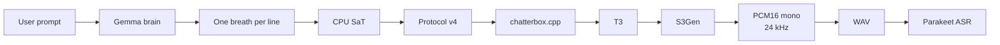
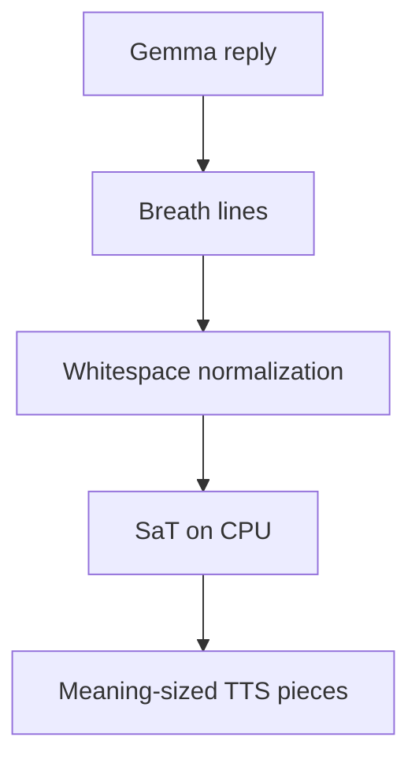
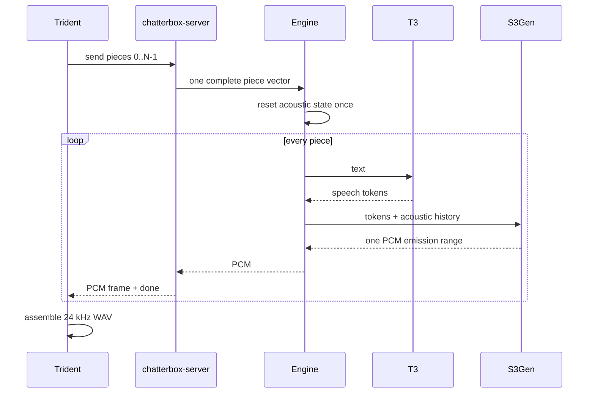
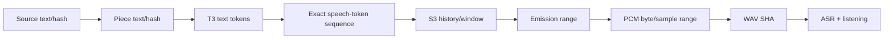
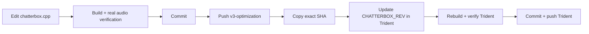

# Trident

**A local Windows voice pipeline that turns a prompt into a speech-ready reply, preserves natural breath boundaries, synthesizes it with Chatterbox Nano/Turbo/V3, and can transcribe the result again for verification.**

> **North Star:** natural local speech with simple ownership contracts, deterministic provenance, traceable audio boundaries, and complete warm Nano synthesis below **0.7 RTF**.



## What this repository is

Trident is both a complete local voice loop and a set of reusable pieces:

| Component | Purpose |
|---|---|
| `brain.py` | local Gemma through llama.cpp; writes specifically for spoken delivery |
| `chunk.py` | CPU-only SaT segmentation while preserving explicit breath lines |
| `tts_nano.py` | lowest-latency Chatterbox profile |
| `tts_turbo.py` | larger English-only Chatterbox profile |
| `tts_v3.py` | multilingual Chatterbox profile |
| `main.py` | install/runtime lifecycle, protocol-v4 client, WAV assembly and orchestration |
| `parakeet.py` | local ASR for independent semantic verification |
| sibling `chatterbox.cpp` | native T3/S3Gen GGML/Vulkan engine |

You can use the entire loop or integrate any component independently.

---

## Speech is shaped before synthesis

The Brain is not asked to produce screen-oriented Markdown.

Its system contract asks for natural speech, short sentences and **one breath per line**. Long runs of numbers, names or steps are broken across lines. Numbers and abbreviations may be expanded for speech. Markdown, URLs, code, stage directions and reasoning are excluded from the spoken reply.

`chunk.py` then runs `sat-3l-sm` on the **CPU**. It preserves those newline boundaries and lets SaT make smaller meaning-aware cuts inside a breath.



This is not fixed-length chunking and not “split every sentence.”

---

## TTS ownership model

The current native design deliberately has one acoustic owner.

**One Python connection = one complete synthesis request.**  
**One native Engine call = one complete acoustic session.**  
**Each piece executes synchronous T3 → S3.**  
**The Engine decides which piece is final.**



Transport batching does not own S3 state.

### Protocol v4

Request header: seven little-endian `uint32` values, **28 bytes**:

```text
magic | version | kind | response | piece | total | payload_bytes
```

Responses use the same shape; field six is the PCM chunk index.

This small protocol makes it possible to integrate the native server from another application without importing the rest of Trident.

---

## Models

| Profile | Context | CFM | Typical role |
|---|---:|---:|---|
| Nano | 2048 | 1 | default low-latency local speech |
| Turbo | 8196 | 2 | larger English-only synthesis |
| V3 | 2048 | 5 | multilingual synthesis |

Every profile uses two GGUFs:

**T3 GGUF → speech-token sequence**  
**S3Gen GGUF → waveform**

The current Trident revision pins the sibling native fork exactly:

```text
chatterbox.cpp: a20e18d09a4066de97c502b2ffaf9026eb5a66c2
GGML:          58c3805840b516b2a88ff867ccf7bb41dba79951
```

Current official Chatterbox Turbo/Nano execution uses two CFM steps; Nano's local one-step setting remains an explicit quality/speed experiment until real Windows A/B evidence closes it.

---

## Requirements

Current bare-metal target:

- Windows 11
- Python 3.11
- Visual Studio 2022 Build Tools x64
- CMake
- Vulkan SDK
- Vulkan-capable GPU

The development host uses a GTX 1060 6 GB. Compiler/SDK feature detection is not treated as proof that a device supports the same hardware path.

The configured reference voice is `data/ref-trump.wav`. Replace it with reference audio you are authorized to use when integrating or distributing the system.

---

## Quick start

Run from the Trident repository in **PowerShell**.

### Install / validate everything

```powershell
python .\main.py
```

No arguments install/validate and load the Brain, Nano, Turbo, V3 and Parakeet components. Completed installation phases are reused.

### Full prompt → speech → transcription pipeline

```powershell
python .\main.py "Explain why acoustic state should have one owner."
```

Default flow:

**Gemma → CPU SaT → Nano → WAV → Parakeet**

Main outputs:

```text
brain_out.txt
tts_out.wav
out_*_tts.wav
out_*_v3.wav
.runtime-logs\main.log
.runtime-logs\tts.log
```

### Stop model servers

```powershell
python .\main.py --unload
```

---

## Direct use

### Brain

```powershell
python .\brain.py --install
python .\brain.py --request "Explain vector databases in natural spoken language."
```

### Nano

```powershell
python .\tts_nano.py --install
python .\tts_nano.py --text "This is Nano."
python .\tts_nano.py --provenance
```

### Turbo

```powershell
python .\tts_turbo.py --install
python .\tts_turbo.py --text "This is Turbo."
```

### Multilingual V3

```powershell
python .\tts_v3.py --install
python .\tts_v3.py --language en --text "This is multilingual V3."
python .\tts_v3.py --language fr --text "Bonjour, ceci est la version multilingue."
```

### Parakeet ASR

```powershell
python .\parakeet.py .\tts_out.wav
```

### Advanced TTS controls

Nano/Turbo/V3 expose the native generation/runtime knobs through CLI flags, including GPU layers, seed, generation limit, top-k/p, min-p, temperature, context, threads, repeat penalty, CFM steps, CFG and exaggeration. V3 also exposes `--language`.

Use those controls for measured experiments. Do not use parameter tuning to hide a state or PCM bug.

---

## Observability

The logs are designed to answer:

> **Where is the first boundary where correct information becomes incorrect?**



Native logs identify each event with connection, response and piece. `t3.end` includes the exact speech-token sequence and stop reason. `s3.begin/end` includes history/window hashes, CFM, caches, pending PCM, emission bounds, samples and stage timing. Python `[synth]` logs exact PCM ranges and hashes.

Do not confuse:
1. text overlap;
2. T3/S3 compute concurrency;
3. S3 acoustic history;
4. PCM hold/crossfade.

They are separate mechanisms.

---

## Performance

For warm synthesis:

```text
audio_seconds = samples / 24000
RTF = request_to_complete_WAV_seconds / audio_seconds
```

Cold startup is reported separately.

**Nano acceptance target: complete warm RTF < 0.7.**

Correctness comes first.

---

## Native dependency workflow

Trident and `chatterbox.cpp` are separate repositories by design.



Never pin an unpushed native commit and never replace the exact SHA contract with “latest.”

Current pushed state:

- Trident: `3ee379918342a38265145e0233055d0b23723f72`
- chatterbox.cpp: `a20e18d09a4066de97c502b2ffaf9026eb5a66c2`

---

## Current validation state

Static repository review is clean:

- [x] both HEADs equal `origin/v3-optimization`
- [x] Git object databases pass integrity check
- [x] Trident pins exact chatterbox HEAD
- [x] compile-fix commit is included
- [x] all Trident Python modules compile
- [x] protocol-v4 client/server layouts match
- [x] native server/public headers pass static syntax review
- [x] request-owned acoustic lifetime is encoded in the API

Real runtime closure is still required:

- [ ] rerun Windows/MSVC/Vulkan installation from this exact pin
- [ ] record binary/GGUF/reference provenance
- [ ] verify Nano/Turbo/V3 canonical synthesis
- [ ] isolate any remaining within-piece repetition at T3 vs S3/PCM
- [ ] compare Nano CFM=1 vs current-upstream CFM=2
- [ ] verify PCM + ASR + human listening
- [ ] confirm fresh Nano warm RTF <0.7
- [ ] exercise resumable install after interruption
- [ ] pin Turbo Hugging Face assets to an immutable revision/checksums
- [ ] optionally bind an already-running TTS server to the expected runtime identity instead of trusting an occupied port

The implementation-level continuation document is `TTS_FORENSIC_KB_2026-09-07.md`.

---

## Reusing only part of Trident

**Speech writer:** use `brain.py` to turn prompts into speech-oriented prose.  
**Segmentation:** use `chunk.py` for CPU semantic cuts with explicit newline boundaries.  
**TTS client/runtime:** use a single `tts_*.py` profile or speak protocol v4 directly.  
**Native engine:** embed the sibling `chatterbox.cpp` Engine API.  
**Verification:** use `parakeet.py` independently for local ASR.

The interfaces are intentionally narrow so each layer can be replaced without rewriting the whole pipeline.

---

## Hear this README

To hear a useful spoken version, do **not** ask the Brain to read Markdown and code literally.

Prefix the pasted README with:

> Turn the README below into a natural spoken technical tour. Preserve the purpose, pipeline, components, installation flow, model choices, current validation state, and the chatterbox-first push-and-pin rule. Do not read Markdown syntax, hashes, tables, filenames character by character, or every CLI flag. Explain commands by what they do. Use short natural sentences and one breath per line. README follows:

Then send that combined text through the normal Brain → SaT → TTS path.

---

## Engineering principles

- explicit ownership beats recovery logic;
- deterministic pins beat “latest” dependencies;
- real application evidence beats assumptions;
- exact identities beat log-order guesses;
- fail hard on real errors;
- prefer deletion to wrappers;
- never hide synthesis defects with post-processing deduplication;
- change one causal variable at a time;
- keep the system understandable enough that another engineer or AI agent can trace it end to end.

For implementation work, read the knowledge base first, then the current source and the complete fresh runtime logs.
