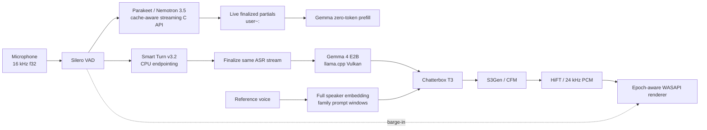

# Trident

Local, interruptible, real-time voice conversation on consumer hardware.

> [!IMPORTANT]
> The North Star is not merely good TTS. It is a conversation natural enough that the user forgets the machine: true streaming recognition, barge-in, generation/TTS overlap, continuous playback, cloned voice and no assistant self-ASR.

## Pipeline



There is no whole-WAV HTTP ASR fallback. Partial and final text come from one direct cache-aware Parakeet stream.

`python main.py install` writes portable products into `--models-dir` (default `models/`): converted Chatterbox GGUFs, Gemma/Parakeet/Smart Turn weights, Vulkan engines (`tts/`, `parakeet/`, `gemma/`), and reference voices. Each product gets a `built-from/*.txt` stamp of the `config.py` pins that produced it. Copy that folder into another clone (or point several clones at one directory with `--models-dir`) and install skips anything whose stamp still matches. Changing a pin rebuilds only the products that list it. `.venv` and `tools/` stay local; `tools/` is the build factory (cmake trees, converter torch, downloads), not the cache. Source trees under `third_party/` are cloned only when a native build or GGUF conversion actually runs.

## Commands

```text
python main.py install
python main.py install --models-dir D:\trident-products
python main.py asr --language pl --asr-device Vulkan0
python main.py talk --family nano --language en --cfm-steps 1 --asr-device Vulkan0
python main.py talk --family v3 --language pl --voice C:\path\ref.wav --cfm-steps 5 --cfg-weight 0.5 --exaggeration 0.5
python main.py tts --family v3 --language pl --voice C:\path\ref.wav --text "Test."
python main.py generation --thinking on --thinking-budget 256 --text "Analyze this carefully."
```

Streaming ASR displays growing finalized text as `user~:` while the user is still speaking. Smart Turn decides whether a silence ends the turn; an incomplete pause keeps the same Parakeet stream alive.

## Reference voice

The native startup path prioritizes identity fidelity:

- full normalized reference contributes to the speaker embedding;
- Nano/Turbo T3 conditioning: 15 s;
- V3 T3 conditioning: 6 s;
- S3Gen conditioning: 10 s;
- conditioning completes before S3Gen preload;
- `--voice`, `--cfg-weight`, and `--exaggeration` are explicit controls.

## Hardware targets

- Intel Iris Xe: Nano, Vulkan, aggressive `cfm_steps=1` default.
- Pascal GTX 1060 6 GB: multilingual V3, Q4_0 T3/S3Gen, Vulkan, `GGML_VK_DISABLE_F16=1`, `cfm_steps=5`.

Hardware acceptance still requires fresh RTF/journal evidence and listening.

## Evidence

Every product run writes immutable schema-v2 evidence under `data/runs/`. Acceptance must prove actual TTS PCM before Gemma completion, correct epoch cancellation, continuous live playback, exactly one terminal result per synthesis piece, no self-ASR, true streaming ASR partials, and target RTF below one.

See the bundle-level `HANDOVER.md` for the full runbook, known upstream Parakeet streaming-memory risk and regression gates.
