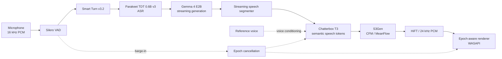

# Trident

**A fully local, real-time voice conversation stack built to make the machine disappear.**

> [!IMPORTANT]
> **In active development.** Trident is being pushed toward one North Star: natural, interruptible conversation with cloned speech, streamed end-to-end on consumer hardware.

The current stack is running on **Intel Iris Xe through Vulkan**, without requiring a discrete GPU. It combines specialized speech, turn-taking, language, and synthesis models into one resident conversational pipeline.

## Architecture

## What is already inside

- [x] Fully local runtime after installation
- [x] **Silero VAD** for immediate speech onset detection
- [x] **Smart Turn v3.2** for learned end-of-turn detection
- [x] **Parakeet TDT 0.6B v3** for speech recognition
- [x] **Gemma 4 E2B** for streamed conversational generation
- [x] **Chatterbox Nano / Turbo / Multilingual V3**
- [x] Reference-audio **voice cloning**
- [x] Streaming **T3 → S3Gen → HiFT** speech generation
- [x] Barge-in with cooperative epoch cancellation
- [x] Persistent model runtimes and streamed PCM playback
- [x] Windows **WASAPI + Vulkan**
- [x] Dedicated **Intel Iris Xe** inference path
- [ ] Final North-Star validation and release polish

<strong>Why this is unusual</strong>

A single spoken turn crosses several learned systems before the answer reaches the speakers:

`Silero VAD → Smart Turn → Parakeet → Gemma → Chatterbox T3 → S3Gen / HiFT`

They remain coordinated as one conversation: recognition, generation and synthesis overlap; speech can begin before the language model has finished; and a new human utterance can invalidate work already moving through the acoustic pipeline.

The goal is not a voice-command demo. It is continuous conversation that happens to run locally.

## North Star

> **Speak naturally. Interrupt naturally. Hear the answer immediately. Forget there is a pipeline underneath.**

Trident is not released yet.

It is getting close.
