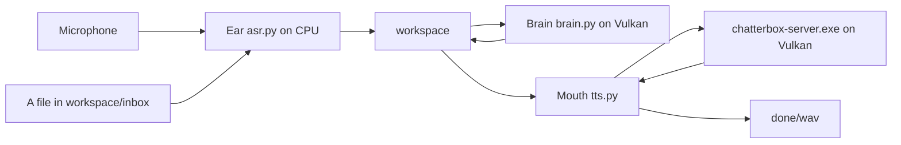
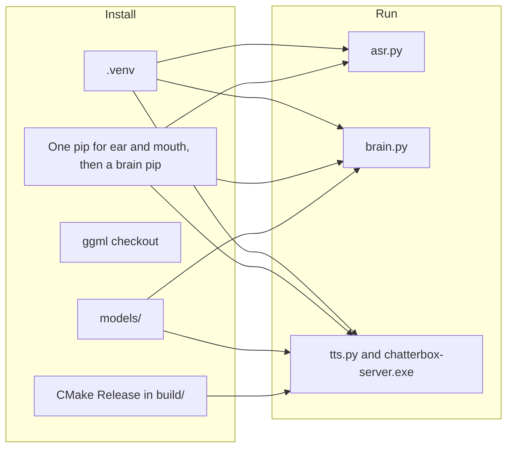
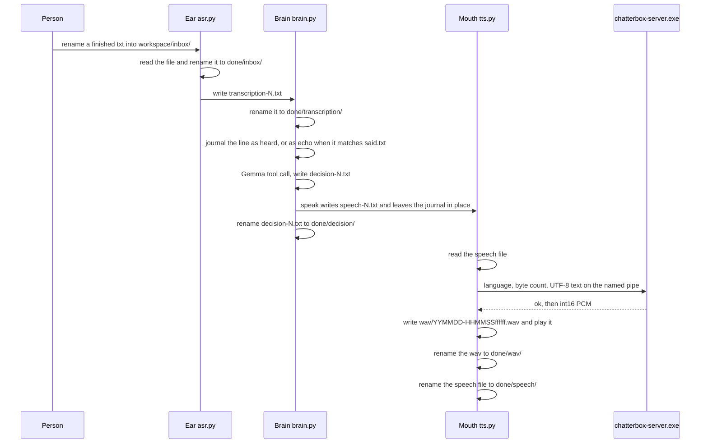
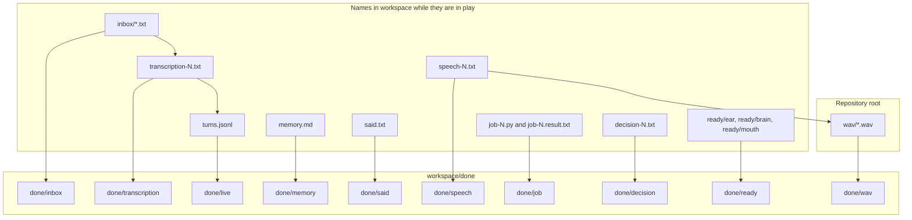
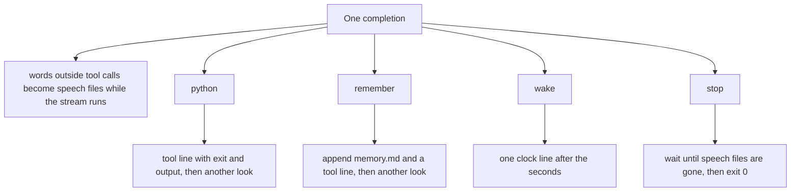

# Trident

Trident is three Windows processes and one folder. The ear writes what it heard, the brain answers only by tool calls, and the mouth is the only thing that plays audio.

## Contents

- [Processes](#processes)
- [Install](#install)
- [Run](#run)
- [One inbox utterance](#one-inbox-utterance)
- [The folder](#the-folder)
- [Tools](#tools)
- [Language](#language)
- [Ear](#ear)
- [Mouth](#mouth)
- [Brain](#brain)
- [Vulkan](#vulkan)
- [Layout](#layout)
- [License](#license)

## Processes

[trident.py](trident.py) starts [asr.py](asr.py), [brain.py](brain.py), and [tts.py](tts.py). It loads no model. The three processes do not call each other. They meet in [workspace/](settings.py).



The ear also reads `workspace/inbox/*.txt` while the microphone is open. A mic utterance and an inbox file become the same kind of file, `transcription-N.txt`. From there the path is one path. The variant you pass to [trident.py](trident.py) chooses the mouth. The brain is the same Gemma model for nano, turbo, and v3.

## Install

Commands are from the repository root on Windows. `python` is the interpreter you start. [install.py](install.py) creates `.venv` when `\.venv\Scripts\python.exe` is missing, then starts itself again with that interpreter. [asr.py](asr.py), [brain.py](brain.py), [tts.py](tts.py), and [trident.py](trident.py) do not create the venv. They call `reexec()` in [runtime.py](runtime.py) and switch to `.venv\Scripts\python.exe` when that file exists and is not already the running interpreter. If the venv is missing, those four raise `missing` and the path.

Install expects Git, a Visual Studio 2022 generator (`Visual Studio 17 2022`, `x64`), and a Vulkan SDK under `C:\VulkanSDK`. The build picks the newest `C:\VulkanSDK\*\Bin\glslc.exe` by the numeric pieces of the SDK directory name. The C++ library links `icu`.

```powershell
python install.py
```

`python install.py` with no arguments installs the ear, the brain, and mouth nano. `python install.py nano` is the same call.

```powershell
python install.py turbo
```

`python install.py turbo` installs the ear, the brain, and mouth turbo.

```powershell
python install.py v3
```

`python install.py v3` installs the ear, the brain, and mouth v3.

```powershell
python install.py all
```

`python install.py all` installs the ear, the brain, mouth turbo, and mouth v3. It does not install mouth nano.

```powershell
python install.py asr
```

`python install.py asr` installs the ear packages and the Nemotron weights. It does not install the brain, a mouth, or the `torch==2.6.0` pin.

```powershell
python install.py brain
```

`python install.py brain` installs the Vulkan build of `llama-cpp-python` and the Gemma GGUF. It does not install the ear or a mouth.

```powershell
python install.py tts nano
```

`python install.py tts turbo` and `python install.py tts v3` are the same shape. `tts` installs the mouth packages, `torch==2.6.0` from the CPU index, and that one mouth. It does not install the ear weights or the brain.

A bad invocation prints `usage: python install.py [asr | brain | tts <variant> | <variant> | all]`.



### What each command places on disk

| Command | Ear weights | Brain GGUF | Mouth | torch from the CPU index | llama-cpp-python |
| --- | --- | --- | --- | --- | --- |
| `python install.py` | yes | yes | nano | yes | yes |
| `python install.py turbo` | yes | yes | turbo | yes | yes |
| `python install.py v3` | yes | yes | v3 | yes | yes |
| `python install.py all` | yes | yes | turbo and v3, not nano | yes | yes |
| `python install.py asr` | yes | no | no | no | no |
| `python install.py brain` | no | yes | no | no | yes |
| `python install.py tts <variant>` | no | no | that variant | yes | no |

The code supports three mouths. nano and turbo are the gpt2 architecture. v3 is the llama architecture. Names and URLs are `VARIANTS` in [settings.py](settings.py).

| Mouth | Hugging Face tree | Speech checkpoint | Architecture | Diffusion steps |
| --- | --- | --- | --- | --- |
| nano | `ResembleAI/chatterbox-nano` at `71ccd1d0081b430592cea481f4307e764e07bc64` | `t3_nano_v1.safetensors` | gpt2 | 2 |
| turbo | `ResembleAI/chatterbox-turbo` at `749d1c1a46eb10492095d68fbcf55691ccf137cd` | `t3_turbo_v1.safetensors` | gpt2 | 2 |
| v3 | `ResembleAI/chatterbox` at `5bb1f6ee58e50c3b8d408bc82a6d3740c2db6e18` | `t3_mtl23ls_v3.safetensors` | llama | 10 |

nano and turbo also download `s3gen_meanflow.safetensors`, `conds.pt`, `ve.safetensors`, `vocab.json`, `merges.txt`, and `added_tokens.json` into `.ckpt`. Both gpt2 mouths share that directory. v3 downloads `s3gen.safetensors`, `conds.pt`, `ve.safetensors`, `grapheme_mtl_merged_expanded_v1.json`, and `Cangjie5_TC.json` into `.ckpt-v3`, plus `official_mtl_tokenizer.py`, `official_mtl_tts.py`, and `dicta-1.0.int8.onnx` from the URLs in `Variant.external_assets`.

Weights are not in git. After install, the server loads `models/voices/<variant>/t3.gguf` and `models/voices/<variant>/s3.gguf`. On the tree this file was written from, `models/voices/` contains `nano` and `turbo`. `models/voices/v3` and `.ckpt-v3` are not there. `.ckpt` holds the nano download. The commands above are what install v3. Speech produced on this machine has used the turbo mouth.

The ear weights land in `models/ear/nemotron-3.5-asr-streaming-0.6b/`: `config.json`, `generation_config.json`, `processor_config.json`, `tokenizer_config.json`, `tokenizer.json`, and `model.safetensors`, from `nvidia/nemotron-3.5-asr-streaming-0.6b` at `ea30d66debe3740a08b573244286791d423d6b3e`.

The brain file is `models/brain-gemma-4-e2b-it-q4_k_m.gguf`, from `unsloth/gemma-4-E2B-it-GGUF` file `gemma-4-E2B-it-Q4_K_M.gguf` at `0314792d7f1f7e229411f620751375812bb9faf2`.

### Packages

[requirements.txt](requirements.txt) is the pin list. [install.py](install.py) selects rows from it and makes one `pip install` for the ear and mouth packages when a command asks for both. That invocation is numpy, transformers, sounddevice, gguf, safetensors, librosa, tokenizers, pykakasi, spacy-pkuseg, dicta-onnx, `add-stress-to-epub`, and then `torch==2.6.0` with `--index-url https://download.pytorch.org/whl/cpu` and `--extra-index-url https://pypi.org/simple`. `torch==2.6.0` is `PYTHON_ENV_BOOTSTRAP` in [settings.py](settings.py), not a line in the requirements file. The stamp for that combined install is `models/packages.stamp`.

| Pin | Used by |
| --- | --- |
| `numpy==1.26.4` | ear and mouth package sets |
| `transformers==5.17.0` | ear |
| `sounddevice==0.5.6` | mouth package set; the microphone and playback import it |
| `librosa==0.11.0` | mouth package set; `python asr.py <wav>` asks for the librosa audio backend |
| `gguf==0.19.0`, `safetensors==0.8.0`, `tokenizers==0.23.2` | mouth conversion and load |
| `pykakasi==2.3.0`, `spacy-pkuseg==1.0.1`, `dicta-onnx==1.0.9`, `git+https://github.com/Vuizur/add-stress-to-epub.git@v0.1.22` | mouth package set, used by the v3 tokenizer |
| `git+https://github.com/abetlen/llama-cpp-python.git@d73664636c2e3b25ce5949a9b85bba690684cdf3` | brain, a separate pip |

`python install.py asr` pins only numpy and transformers (`models/asr-packages.stamp`). `python install.py tts <variant>` pins the mouth list without transformers (`models/tts-packages.stamp`) and adds the CPU torch pin. Torch is an extra of this transformers pin, not a hard dependency, and [asr.py](asr.py) imports torch at startup, including `--inbox`. The ear-only command does not name torch. The full install and the mouth install do.

The brain pip is separate. It installs the llama-cpp-python git pin with `--no-binary llama-cpp-python`, `CMAKE_ARGS=-DGGML_VULKAN=ON`, and `FORCE_CMAKE=1`. The stamp is `models/brain-packages.stamp`.

### The mouth build

[CMakeLists.txt](CMakeLists.txt) builds a static library `trident` and two programs, `chatterbox-server` and `chatterbox-bake`. Output is `build/bin/chatterbox-server.exe` and `build/bin/chatterbox-bake.exe`. The ggml options forced in that file are `GGML_VULKAN=ON`, `GGML_CPU=OFF`, `GGML_CUDA=OFF`, and `GGML_OPENMP=OFF`. The mouth has no CPU backend. Configuration is Release, shared ggml libraries, C++17, and the compile definition `GGML_USE_VULKAN`.

[install.py](install.py) clones `https://github.com/ggml-org/ggml.git` into `ggml/` when `ggml/.git` is missing, and checks out `7840aaba1989c6deeefede1d77d5aaf8f52b947e` detached when `HEAD` is not that commit. The CMake tree is `build/`. Install does not delete it. A voice bake that has to run again deletes `models/voices/<variant>` and a temporary `models/voices/<variant>.baking` directory, then writes the new voice files. That is the voice directory, not the conversation record.

Conversion writes a base GGUF under `models/` whose name includes the kind, the family (`nano`, `turbo`, `meanflow`, or `v3`), the default weight type `q4_0`, and an eight-character digest of the quant rules. The server does not open those base files. Bake copies them into `models/voices/<variant>/` and bakes [reference.wav](reference.wav) in. Rules that stay `f32` are [scripts/quant_t3.json](scripts/quant_t3.json) and [scripts/quant_s3.json](scripts/quant_s3.json).

`chatterbox-bake.exe` takes the voice T3 GGUF, the S3 GGUF, and `reference.wav`. It initializes Vulkan device 0. For gpt2 the condition clip is 15 seconds. For llama it is 6 seconds. Speaker audio is trimmed to 30 seconds, prompt audio to 10 seconds. The baked tensors are `chatterbox/builtin/speaker_emb`, `chatterbox/builtin/cond_prompt_speech_tokens`, `s3gen/builtin/prompt_token`, `s3gen/builtin/prompt_feat`, and `s3gen/builtin/embedding`. The running server does not open `reference.wav`.

### Stamps

Install writes JSON and text stamps under `models/`. A stamp that still matches, with the output files present, prints `skip` and does not repeat that step. A matching `models/build-contract.json` plus both executables prints `skip ggml` and `skip engine` and does not reconfigure CMake. Running install while a mouth server is up taskkills the pid in `models/server.pid` before a rebuild or a voice bake.

## Run

> [!NOTE]
> `python trident.py <variant>` opens the microphone and still drains `workspace/inbox/`. `python trident.py <variant> inbox` leaves the microphone closed. Closed-mic mode loads no ASR model. Open-mic mode loads Nemotron on the CPU.

Every `python trident.py`, `python brain.py`, `python tts.py`, and `python asr.py` below re-executes into `.venv\Scripts\python.exe` when it is not already that interpreter.

The variant is `nano`, `turbo`, or `v3`. It is passed only to the mouth. A turbo or v3 run needs that mouth installed. This tree has nano voice files.

```powershell
python trident.py nano
```

Starts the brain, mouth nano, and the ear with the microphone open. The brain loads Gemma. The mouth starts or reuses `chatterbox-server.exe` for nano. The ear loads Nemotron unless you chose inbox mode.

```powershell
python trident.py nano inbox
```

Same three processes. The ear is `python asr.py --inbox`: no ASR model, no microphone, inbox files only.

```powershell
python trident.py turbo
```

```powershell
python trident.py turbo inbox
```

```powershell
python trident.py v3
```

```powershell
python trident.py v3 inbox
```

Those four are the turbo and v3 mouths. The brain load is unchanged.

[trident.py](trident.py) moves any existing `workspace/ready/ear`, `workspace/ready/brain`, and `workspace/ready/mouth` into `workspace/done/ready/`, then starts the three processes. Each child prints `ready` and writes its empty ready file after it can serve. When all three files exist, the supervisor prints `jarvis ready`. A brain exit with code 0 is a normal end: the supervisor stops the ear, the mouth, and the server and returns. Any other child exit prints the child name and the code, then stops the others and exits with that code. Ctrl+C stops the three. A second argument other than `inbox` prints `usage: python trident.py <variant> [inbox]`.

To hear speech, the mouth has to be running when the speech file is still in `workspace/`. The brain writes that file while it is still generating. The mouth reads it, writes a wav, plays it, and renames both the wav and the speech file into `done/`. See [The folder](#the-folder).

> [!IMPORTANT]
> A wav is renamed from `wav/` into `workspace/done/wav/` and stays there. The ear, the brain, the mouth, and the supervisor do not remove bus files or wavs.

```powershell
python brain.py
```

Runs the brain alone, in the same serve loop [trident.py](trident.py) uses. It loads Gemma, writes `ready/brain`, and sleeps until a transcription arrives, an armed `wake` fires, or `IDLE` seconds (1800) pass with nothing heard and no wake armed. It does not look at startup. It does not start the ear or the mouth. `memory.md` stays.

```powershell
python brain.py hello
```

`python brain.py <text-or-file>` is one shot. The single argument must not be `nano`, `turbo`, or `v3`. If it is a path to a file, the file is read as UTF-8 with a BOM accepted. Otherwise the argument is the text. The text is appended to `turns.jsonl` as a user line. Gemma loads and looks until the completion does not ask for another look. The process then exits. It does not write `ready/brain` and does not wait for more transcriptions.

```powershell
python brain.py nano --say "the kettle is on."
```

`python brain.py <variant> --say <text-or-file>` checks that the variant is nano, turbo, or v3, then ignores which of the three it was. It writes one or more `speech-N.txt` files whose first line is `en`. It does not load Gemma, does not start the server, and does not play audio. A running mouth speaks those files. `python brain.py turbo --say` and `python brain.py v3 --say` write the same `en` speech files.

A bad brain invocation prints `usage: python brain.py [text|file] | python brain.py <variant> --say <text|file>`.

```powershell
python tts.py nano
```

Starts or reuses the nano server, writes `ready/mouth`, and watches `speech-N.txt`. This is the mouth loop [trident.py](trident.py) starts. `python tts.py turbo` and `python tts.py v3` are the same loop for those mouths.

```powershell
python tts.py nano "words" en
```

Speaks that string through the nano server and does not watch the bus. The language argument defaults to `en` when you omit it: `python tts.py nano "words"` is language `en`. `python tts.py turbo "words" en` and `python tts.py v3 "words" en` are the one-shot form for the other mouths. v3 will reject a language its GGUF does not list. This one-shot does not taskkill the server when it returns. The server is a separate console process. The next `tts.py` start reuses it when `models/server.pid` matches the command and the pipe answers within 3 seconds. Otherwise that pid is taskkilled and a new server starts.

A bad mouth invocation prints `usage: python tts.py <variant> [text] [language]`.

```powershell
python asr.py
```

Loads Nemotron, writes `ready/ear`, opens the default input device, and drains `workspace/inbox/` on the same loop.

```powershell
python asr.py --inbox
```

Does not construct the ASR model. Writes `ready/ear` and drains the inbox forever.

```powershell
python asr.py path\to\file.wav
```

Loads Nemotron, transcribes that file, writes one `transcription-N.txt`, and exits. It does not write `ready/ear` and it does not keep listening. An empty transcript raises `ear heard nothing`. A bad invocation prints `usage: python asr.py [wav | --inbox]`.

There is no separate reasoning switch on any of these commands. The brain has one way to act. That is [Tools](#tools).

## One inbox utterance

This is the path from a finished inbox file to a wav, when the brain's completion calls `speak` and does not call `stop`, and the mouth is still running.



The microphone joins at the same transcription file. The ear cuts after the level stays under the threshold, transcribes, and writes `transcription-N.txt`. The inbox drain still runs on that loop.

`python brain.py nano --say ...` stops at the speech file. `python tts.py nano "words" en` starts at the pipe and still writes and plays a wav. Neither of those two, by itself, is the whole picture above.

## The folder

[settings.py](settings.py) calls the folder the bus. `bus()` creates `workspace/`, `workspace/done/`, and `workspace/inbox/`, and creates empty `workspace/memory.md` when it is missing. `workspace/turns.jsonl` is the history the model sees. Publishing a bus file uses a temporary name in the same directory and then `replace`, except the job script, the job result, a `remember` rewrite of `memory.md`, and an appended turn, which write directly.

A consumer renames a file into `workspace/done/<kind>/`. The name and the bytes stay. If that destination name is already there, the new name gets `-1`, `-2`, and so on before the suffix. Numbered live files start at 1 and skip a name that is already in `workspace/` or in `done/<kind>/`.

The mouth renames a played wav from `wav/*.wav` at the repository root into `workspace/done/wav/`. The file stays in the record.

`wav/` is not under `workspace/`. `workspace/done/wav/` is the record. `workspace/done/speech/` is the text that was spoken.



### Who writes, who reads, when it is renamed

| Path | Who writes it | Who reads it | When it is renamed |
| --- | --- | --- | --- |
| `workspace/inbox/*.txt` | anyone | the ear | the ear renames it into `done/inbox/` as soon as it sees the name, then writes a transcription if the text is not empty |
| `workspace/transcription-N.txt` | the ear | the brain | the brain renames it into `done/transcription/` before it decides |
| `workspace/turns.jsonl` | the brain, one JSON object per line | the brain, on the next look | append only, except a trim that moves the oldest lines into `done/turns/turns-N.jsonl` when the rendered prompt exceeds 6144 tokens |
| `workspace/memory.md` | the brain | the brain, as the first user line at startup when the file is not empty | `remember` appends one line in place; the head is renamed into `done/memory/` when the Python string is longer than 8000 characters |
| `workspace/stop` | the brain, when `stop` runs | the record | left in place; the brain exits after speech files have been gone for 2 seconds, or after 60 seconds |
| `workspace/speech-N.txt` | the brain, or `python brain.py <variant> --say` | the mouth | the mouth renames it into `done/speech/` after a successful play; an empty body is renamed with no play |
| `workspace/job-N.py` | the brain | the venv Python, working directory `workspace/` | renamed into `done/job/` after the result is appended as a tool line |
| `workspace/job-N.result.txt` | the brain, from the script's stdout, stderr, and status | the brain, because the same text is the tool line | renamed into `done/job/` with the script |
| `workspace/decision-N.txt` | the brain, the raw completion, when the stream ends | the record | renamed into `done/decision/` before the tools run |
| `workspace/ready/ear` | the ear, after it prints `ready` | [trident.py](trident.py) | the supervisor renames a stale file into `done/ready/` at the next start |
| `workspace/ready/brain` | the brain serve loop, after Gemma is loaded | [trident.py](trident.py) | same |
| `workspace/ready/mouth` | the mouth watch loop, after the server pipe answers | [trident.py](trident.py) | same |
| `wav/*.wav` | the mouth, before and during playback | the mouth | renamed into `done/wav/` after that stretch is played, or before the exception if play raises; the watch loop renames leftovers once when it becomes ready; a one-shot mouth renames leftovers before its synthesis |
| `workspace/done/<kind>/` | the rename | anyone reading the record | not a queue |

Inbox order is filename sort. `transcription-N.txt`, `speech-N.txt`, `job-N`, and `decision-N.txt` are taken in numeric order. The ear does not wait for a writer to finish. It reads every `workspace/inbox/*.txt` on the pass that first sees the name. Write the file somewhere else and rename it into `inbox/` when the bytes are complete. That is the same publish pattern `put()` uses inside the program.

The echo check runs after the transcription has already been renamed into `done/transcription/`. The brain keeps letters and whitespace, casefolds, and collapses spaces. If the heard string is a substring of the last three spoken sentences, it is not appended and it does not cause a look. A line is taken up when it has a question mark, or, with the language tag removed, it starts with jarvis, please, hello, hi, what, when, where, who, why, or how, or it contains could you, can you, would you, will you, tell me, or jarvis. A question word in the middle of a fragment is not a request. The name is not required. Anything else prints `quiet` and does not look. A microphone transcription has a second line of word times. That line is the room, including other audio, so the brain prints `quiet` and does not look. An inbox transcription has no times line. The words on its first line are the text path, and they are taken up when they are a request. The times are not shown to the model.

### Caps

`CHUNK` is 40. The first speech file is the first word, skipping a copied clock or language tag, because the first utterance builds the speech graph at about 39 ms per token. Later files are a sentence of at least 8 words, or 40 words. The first line is the two-letter language of the last ear tag (`en-US` becomes `en`). `python brain.py <variant> --say` still splits on the same 40-word cap. The mouth plays one stretch and synthesizes the next speech file while that stretch is still coming out of the speakers.

`IDLE` is 1800 seconds. `MAX_MEMORY` is 8000. The memory check is `len` of the Python string from `read_text`. When `memory.md` is over the cap, the head is renamed into `done/memory/` and the tail stays. The model does not see `live.txt`.

Tracked source files are stored as LF (`.gitattributes` is `* text=auto eol=lf`). The bus is untracked. The bus follows Python's Windows newlines.

### What a run leaves behind

These names are records from runs on this machine. They are examples of the naming, not files you have to put back.

| Example | What it is |
| --- | --- |
| `workspace/done/inbox/kettle.txt` | an inbox file after the ear read it |
| `workspace/done/transcription/transcription-1.txt` | the line the brain took |
| `workspace/done/decision/decision-1.txt` | the tool-call text after apply |
| `workspace/done/speech/speech-1.txt` | one stretch, first line `en` |
| `workspace/done/wav/260923-111752850952.wav` | a played wav; the name is local `YYMMDD-HHMMSSffffff` |
| `workspace/done/wav/260923-111811112576.wav` | another played wav |
| `workspace/done/said/said.txt` | a previous `said.txt` replaced by a later `speak` |
| `workspace/done/live/live.txt` | a previous `live.txt` replaced by a clear |
| `workspace/done/memory/memory.md` | a previous `memory.md` renamed by a slot; a numbered `memory-N.txt` is a head cut by the 8000-character cap |
| `workspace/done/job/job-1.py` and `workspace/done/job/job-1.result.txt` | one script and the streams recorded from it |
| `workspace/done/ready/ear` | a ready file from an earlier start |

A speech file looks like this:

```text
en
the kettle is on.
```

## Tools

The model's own words are the speech. There is no `speak` tool and no grammar. Text outside `<|tool_call>...<tool_call|>` is written to speech files as it streams. Tool calls run after the stream ends, in order. A `python`, `remember`, or error result asks for another look. A script whose body matches the previous run appends `already ran, see above` and still looks. A bad call appends `error: ...` and the process stays up. The brain exits only through `stop`.



### What the model is told

The system text in `SPEAK` is under 120 words:

```text
You are Jarvis, present in this room. Never begin a reply with a clock time or a language tag. Those marks on a user line are not speech. Your first word is a spoken word in the language of the last speaker. Everything you write is spoken aloud as you write it. When a question needs a number, write a python tool call that prints it, then speak only the printed digits. For 3 plus 3 the call prints 3 + 3 and the spoken result is 6. You remember a fact when it should survive a restart. When the line was not said to you, write nothing and do not repeat it.
```

The prompt is rendered from the GGUF key `tokenizer.chat_template` with jinja2. Messages are the system text, then `turns.jsonl`. Tools are `python`, `remember`, `wake`, and `stop`. Each description is one sentence. There is no grammar.

### What the code does

| Tool | turns.jsonl | memory.md | speech | jobs | next look |
| --- | --- | --- | --- | --- | --- |
| words | the assistant line keeps them | unchanged | one file per sentence, first line the two-letter language | none | no |
| `python` | a tool line `exit N` plus the output, or `already ran, see above` | unchanged | none | `job-N.py` and `job-N.result.txt`, then both renamed to `done/job/` | yes |
| `remember` | a tool line `remembered` plus the fact | appends the fact | none | none | yes |
| `wake` | unchanged until the clock fires | unchanged | none | none | one user line `HH:MM:SS silence for N s` when the seconds elapse |
| `stop` | the assistant line keeps the call | unchanged | speech already written during the stream | none | the brain writes `workspace/stop`, waits until no `speech-N.txt` has been present for 2 seconds or 60 seconds pass, then exits 0 |

`wake` clamps seconds to 5 through 86400. With no `wake` armed and nothing heard for `IDLE` seconds (1800), the brain appends one silence line and looks once. A completion that is not a closed tool call becomes a tool line `error: ...`. The brain does not exit on model output except through `stop`.

### Looks

`think` prints the rendered prompt once, the prompt token count, and the completion. `serve` prints `read` and the transcription file name. Hearing is checked before the clock. After a completion the brain sleeps until a transcription arrives or an armed wake fires.

## Language

The first line of a speech file is the language. The rest is the words. The brain writes the two-letter code of the last ear tag.

| Mouth | Where a language is accepted |
| --- | --- |
| nano, turbo | [tts.py](tts.py) speaks `en` and prints `mouth: language <tag> spoken as en` when the tag is not `en`. The pipe then receives `en`. [src/gpt2/engine.cpp](src/gpt2/engine.cpp) still accepts only `en` |
| v3 | [src/llama/engine.cpp](src/llama/engine.cpp) rejects a language that is not listed in the GGUF string `chatterbox.tokenizer.language_tokens` |

`python brain.py <variant> --say` always writes `en`.

## Ear

The ear is [asr.py](asr.py). Constants are `EAR` in [settings.py](settings.py).

| Constant | Value | Role |
| --- | --- | --- |
| sample rate | 16000 | model input and the mic stream |
| threads | 4 | `torch.set_num_threads`. The ear owns the CPU |
| language | `auto` | passed to the processor |
| lookahead | 13 | `set_num_lookahead_tokens`, and the same value passed to streaming `generate` |
| pause | 1.2 seconds | quiet time that ends an utterance |
| level | 0.03 | mean absolute sample of a frame |

The model is `nvidia/nemotron-3.5-asr-streaming-0.6b`, class `AutoModelForRNNT`. At start the ear prints `streaming_latency_ms` (1120 with lookahead 13). An utterance is read in frames of `num_samples_first_audio_chunk` then `num_samples_per_audio_chunk` and fed as a generator of mel chunks to `model.generate(..., num_lookahead_tokens=13)`. Mel frames are sliced to the exact count that lookahead requires, because the extractor returns one extra frame. The amplitude gate only decides when the utterance starts and ends. On an 18.5 s wav fed through that path, the transcription was written 0.338 s after the last hot frame. The first line starts with the `<en-US>` token the streaming sequence contains (token id 2947). `decode` is given the batch, shape `(1, steps)`, because a single row is zipped into scalars and then fails with `iteration over a 0-d tensor`. The second line is word start times in seconds. If streaming raises, that utterance falls back to one batch decode and the log line starts with `stream failed`.

The mic stream is the default input, one channel, float32, block size 50 ms. Empty text is not written. Inbox text is copied as written; the inbox path does not run the model.

## Mouth

The mouth is [tts.py](tts.py) plus [src/server.cpp](src/server.cpp). The Python process watches the bus, writes the wav, and plays it. The executable synthesizes. `--gpu` is the device index `vulkan()` prints. Each utterance prints milliseconds per T3 token to stderr. Before graph reuse a short utterance measured 17.7 ms/token. After one retained graph and allocator, the same kind of utterance measured 15.8 ms/token. The allocator is reserved again only when the node count grows.

Watch mode polls every 0.05 seconds. It reads the first `speech-N.txt` as UTF-8 with a BOM accepted, splits on the first newline, and strips the language and the text. No text: the speech file is renamed into `done/speech/` and nothing is played. While a stretch plays, the next speech file is synthesized.

On `stop`, the brain stays up until the mouth has renamed the speech files. [trident.py](trident.py) stops the mouth after the brain has exited.

## Brain

The brain is [brain.py](brain.py). The model path, context, and sampling dict are `BRAIN` in [settings.py](settings.py).

On this machine Gemma 4 E2B Q4_K_M generated 16.2 tok/s without a GBNF grammar and 5.5 tok/s with it. The grammar walks the whole 262144-word vocabulary on one CPU thread, which is why the GPU sat near 40 percent. The brain therefore renders the chat template itself and calls `create_completion` with no grammar. A 2315-token prompt cost 7.05 s to re-evaluate when the clock stood in front of the journal and 0.38 s when only the suffix changed, because llama.cpp reuses the longest common token prefix. History is appended, so the prefix stays. `swa_full` is true because prefix reuse under the sliding-window cache needs the full SWA cache. `flash_attn` is left at the library default. It did not change the measured speed (17.6 versus 16.2 tok/s).

### Load

| Argument | Value |
| --- | --- |
| `n_ctx` | 8192 |
| `n_batch` | 1024 |
| `n_ubatch` | 1024 |
| `n_threads` | 4 |
| `n_gpu_layers` | -1 |
| `main_gpu` | the index `vulkan()` returns |
| `swa_full` | true |
| `verbose` | true, so a prefix-match hit is printed |

Sampling is temperature 1.0, top_p 0.95, top_k 64, min_p 0.0, max_tokens 1024, stop on the turn closer. Before each look, while the rendered prompt exceeds 6144 tokens, the oldest turn that is not the memory line is moved to `done/turns/` together with its tool lines.

When `memory.md` is not empty at startup and `turns.jsonl` is empty, the first user line is `memory:` plus the file. Later `remember` calls are tool lines, so the front of the prompt does not change.

## Vulkan

The brain and the mouth are two processes. Each opens its own Vulkan device. `vulkan()` does not set `GGML_VK_DISABLE_COOPMAT` and does not pin `GGML_VK_VISIBLE_DEVICES`. It lists devices from `ggml_backend_vk_get_device_memory`, prints the one with the most device-local memory, and passes that index as `main_gpu` and as `--gpu`. `VULKAN_DEVICE` in [settings.py](settings.py) is `None`. An integer there pins `GGML_VK_VISIBLE_DEVICES` to that index and passes `--gpu 0`. This program does not change `TdrDelay`, does not add CUDA, and does not add a CPU backend to the mouth.

On the machine this was written for, the only device is Intel Iris Xe Graphics, 17012209664 bytes. Cooperative matrices are unused there. Leaving the coopmat path enabled is the fast path on NVIDIA and a no-op here.

The mouth device is `ggml_backend_vk_init` in [src/common/vulkan_backend.cpp](src/common/vulkan_backend.cpp). The ear stays on CPU torch.

## Layout

[.gitignore](.gitignore) is an allowlist. The first line is `*`. A path is tracked only when a later `!` line names it. `.gitattributes` forces LF for the text that is tracked.

### Tracked tree

```text
.gitignore
.gitattributes
CMakeLists.txt
LICENSE
README.md
asr.py
brain.py
install.py
requirements.txt
runtime.py
settings.py
trident.py
tts.py
reference.wav
scripts/convert_s3.py
scripts/convert_t3.py
scripts/mtl_tokenize_runtime.py
scripts/quant.py
scripts/quant_s3.json
scripts/quant_t3.json
src/bake.cpp
src/engine.h
src/server.cpp
src/common/audio.cpp
src/common/audio.h
src/common/campplus.cpp
src/common/campplus.h
src/common/gguf_file.cpp
src/common/gguf_file.h
src/common/pipe.h
src/common/repeat_penalty.h
src/common/s3.cpp
src/common/s3.h
src/common/s3_dsp.cpp
src/common/s3_dsp.h
src/common/s3_tokenizer.cpp
src/common/s3_tokenizer.h
src/common/voice_encoder.cpp
src/common/voice_encoder.h
src/common/vulkan_backend.cpp
src/common/vulkan_backend.h
src/gpt2/bpe.cpp
src/gpt2/bpe.h
src/gpt2/engine.cpp
src/gpt2/engine.h
src/gpt2/t3.cpp
src/gpt2/t3.h
src/gpt2/text_en.cpp
src/gpt2/text_en.h
src/llama/engine.cpp
src/llama/engine.h
src/llama/mtl_numbers.cpp
src/llama/mtl_numbers.h
src/llama/mtl_tokenizer.cpp
src/llama/mtl_tokenizer.h
src/llama/t3.cpp
src/llama/t3.h
```

### Untracked

These stay untracked: `ggml/`, `models/`, `build/`, `.venv/`, `workspace/`, `wav/`, and `install-log.md`. The program does not write `install-log.md`. Also untracked, because the allowlist does not name them: `.ckpt/`, `.ckpt-v3/`, and `__pycache__/`.

`ggml/` is the checkout install makes. `models/` holds stamps, GGUFs, ear weights, voice bakes, and `server.pid`. `build/` is the CMake tree. `.venv/` is the interpreter the programs re-exec into. `workspace/` is the bus and the record. `wav/` is the mouth's scratch folder before a file moves to `workspace/done/wav/`.

## License

[LICENSE](LICENSE) is the MIT license, copyright 2026 Gianfranco Cordella. The same file names the ggml checkout and the Chatterbox sources this tree builds against.
