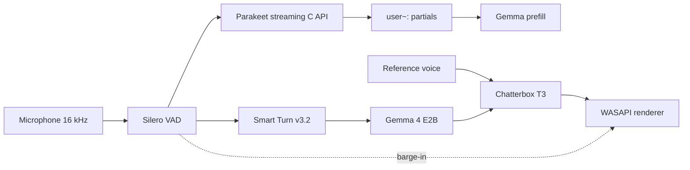

# Trident

Windows-only local voice conversation: microphone → Silero VAD → streaming Parakeet C API → Smart Turn → Gemma 4 E2B → Chatterbox → WASAPI. One epoch, one native TTS worker, no cloud, no HTTP/WAV ASR.



`python main.py install` writes portable products into `--models-dir` (default `models/`): Chatterbox GGUFs, Gemma/Parakeet/Smart Turn weights, Vulkan engines, and reference voices. Each product gets a `built-from/*.txt` stamp of the `config.py` pins that produced it. Copy that folder, or point several clones at one directory. A pin change rebuilds only the products that list it. `.venv` and `tools/` stay local; `third_party/` is cloned only for a native build or GGUF conversion.

```text
python main.py install
python main.py asr --language pl --asr-device Vulkan0
python main.py talk --family nano --language en --cfm-steps 1 --asr-device Vulkan0
python main.py talk --family v3 --language pl --voice C:\path\ref.wav --cfm-steps 5
python main.py tts --family v3 --language pl --text "Test."
python main.py generation --text "Analyze this carefully."
```

Unsupported ASR languages fail hard. Partial and final text come from one Parakeet stream; an incomplete pause keeps that stream alive.

Voice: full loudness-normalized reference for the speaker embedding; Nano/Turbo T3 15 s; V3 T3 6 s; S3Gen 10 s. Controls: `--voice`, `--cfg-weight`, `--exaggeration`.

- Intel Iris Xe: Nano English, `cfm_steps=1`
- Pascal GTX 1060 6 GB: multilingual V3, Q4_0, `GGML_VK_DISABLE_F16=1`, `cfm_steps=5`

Runs write schema-v2 evidence under `data/runs/`. Native Chatterbox is the sibling `chatterbox.cpp` pin in `config.py` (48-token first S3Gen window, 250-token later window, TTR2 v2). mudler/parakeet.cpp v0.5.0 issue #63 reports a streaming-feed leak on CUDA Jetson; this tree does not restore HTTP ASR if that reproduces.
