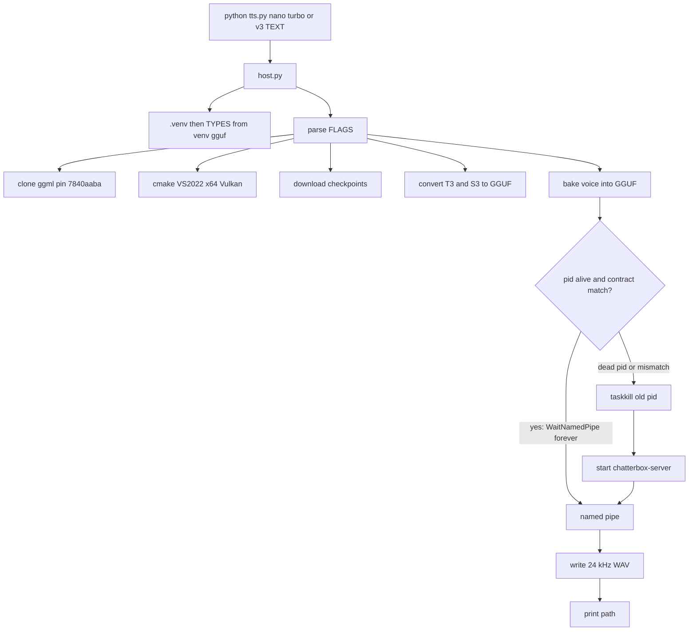

# Trident

Local Vulkan text-to-speech for Windows. One command writes one 24 kHz WAV.

```powershell
python tts.py nano|turbo|v3 [flags] TEXT [language]
```

The path of that WAV is printed. Nothing else to configure. A person runs that command and hears speech. An agent runs the same command and plays the file to a human.

This is a Windows Vulkan port of Resemble AI [Chatterbox](https://github.com/resemble-ai/chatterbox) on [ggml](https://github.com/ggml-org/ggml). Inference is GPU-only. There is no CPU path.

Until `main` is fast-forwarded, clone the `reduction` branch:

```powershell
git clone -b reduction https://github.com/wgabrys88/Trident.git
cd Trident
```

## Requirements

| Need | Why |
| --- | --- |
| Windows x64 | Named pipes, MSVC, proven host. Not Linux, not macOS, not ARM Windows. |
| [Python](https://www.python.org/downloads/) | System Python starts `tts.py`. The host creates `.venv` before parse. Do not `pip install` by hand. |
| [Visual Studio 2022](https://visualstudio.microsoft.com/vs/) with C++ | `CMAKE_GENERATOR` is `Visual Studio 17 2022`. |
| [Vulkan SDK](https://vulkan.lunarg.com/) | CMake picks the newest `C:\VulkanSDK\*\Bin\glslc.exe`. |
| A GPU with a working Vulkan driver | `GGML_VULKAN ON`, `GGML_CPU OFF`. `--gpu 0` is the first Vulkan device. |

First run needs network: ggml clone, pip, Hugging Face checkpoints, v3 tokenizer extras.

## First run

```powershell
python tts.py nano "Hello from Trident."
```

That clones ggml at pin `7840aaba1989c6deeefede1d77d5aaf8f52b947e`, creates `.venv`, downloads weights, converts GGUF, bakes `reference.wav` into the voice, starts one `chatterbox-server.exe`, writes a 24 kHz mono 16-bit WAV in the repo root, and prints that path. Play the printed file.

Wait for one command to finish before the next. Identical command and voice reuse the live server (the host waits on the named pipe; it does not kill a busy matching process). A different variant, voice, quant, or sampling flag replaces the server.

```powershell
python tts.py nano -h
python tts.py v3 -h
```

## Copy-paste usage

PowerShell. Single-quoted here-strings so apostrophes and commas stay literal. Run them one at a time. Each prints a WAV path.

### Short

```powershell
python tts.py nano 'Hello from Trident.'
python tts.py turbo 'Hello from Trident.'
python tts.py v3 'Hello from Trident.' en
```

### English: phone, address, email (nano tags)

nano and turbo are English. Optional inline tags: `[laugh]` `[chuckle]` `[sigh]` `[gasp]` `[cough]` `[groan]` `[sniff]` `[shush]` `[clear throat]` `[whispering]` `[angry]` `[happy]` `[crying]` `[fear]` `[surprised]` `[sarcastic]` `[dramatic]` `[narration]` `[advertisement]`. One utterance. Prefer under about 300 characters. `n-predict` is 1000.

```powershell
python tts.py nano @'
[narration] This is Trident. Call plus one four one five five five five zero one two three. Ship to three fifty Mission Street, San Francisco, California, nine four one zero five. Email ops at example dot com. Monday, September twenty first, half past two.
'@

python tts.py nano @'
[happy] Package delivered. [chuckle] Leave it with the front desk at apartment twelve B, four hundred Market Street. The tracking number is T R I one nine two eight.
'@

python tts.py nano @'
[whispering] The door code is four seven one one. [clear throat] Then say the name on the intercom: Jordan Hale.
'@

python tts.py turbo @'
Office hours are nine to five Pacific. The billing address is one hundred First Street, suite eight hundred, San Jose, California, nine five one one three. Phone plus one four zero eight five five five nine nine zero zero.
'@

python tts.py turbo @'
Meeting on Zoom. Dial plus one six four six five five five zero one eight eight, then enter the PIN six two four one hash. If that fails, use the room at two hundred Park Avenue, New York.
'@
```

### English: long paragraph (may hit n-predict)

```powershell
python tts.py nano @'
[dramatic] You asked for a machine that can talk. Trident runs on this GPU, offline. It does not call a vendor. The voice is baked from the tracked reference wav in this repository. Sequential commands reuse the same chatterbox-server process. Change the model or a sampling flag and that process is replaced. That is the whole product: give machines a voice.
'@

python tts.py turbo @'
Read this back: confirmation number A B C dash nine four one zero five. Pickup window Thursday fourteen hundred to sixteen hundred. Driver will wait ten minutes at the loading dock behind two twenty Townsend Street. If late, text the dispatcher at plus one four one five five five five one two one two. Do not leave the crate unattended.
'@
```

### v3 languages

Last token is the language code. It must appear in GGUF `chatterbox.tokenizer.language_tokens`. No paralinguistic tags on v3. Write the text in that language.

Inventory includes: `ar` `bg` `cs` `da` `de` `el` `en` `es` `fi` `fr` `he` `hi` `hu` `it` `ja` `ko` `ms` `nl` `no` `pl` `pt` `ro` `ru` `sk` `sv` `sw` `ta` `tr` `vi` `zh` and the other codes stored in that file (`cry` `ea` `ipa` `sip`).

```powershell
python tts.py v3 'Hello from Trident. The number is plus one four one five five five five zero zero one.' en

python tts.py v3 @'
To jest Trident. Proszę zadzwonić pod plus czterdzieści osiem sześć zero jeden dwa trzy cztery pięć. Adres: ulica Marszałkowska dwadzieścia cztery, Warszawa.
'@ pl

python tts.py v3 @'
こんにちは。こちらはトライデントです。電話はゼロ三、一二三四の五六七八。住所は東京都千代田区丸の内一丁目です。
'@ ja

python tts.py v3 @'
你好。这里是 Trident。电话加八六一零的六五五五零一二三。地址北京市东城区东长安街一号。
'@ zh

python tts.py v3 @'
שלום. כאן טריידנט. הטלפון הוא אפס שלוש, חמש חמש חמש, אפס אחד שתיים שלוש. הכתובת רחוב הרצל עשרים, תל אביב.
'@ he

python tts.py v3 @'
Это Тридент. Звоните плюс семь девять два шесть пять пять пять ноль один. Адрес: Тверская улица, дом семь, Москва.
'@ ru

python tts.py v3 @'
Hier spricht Trident. Telefon plus vier neun dreißig fünf fünf fünf fünf null eins. Adresse Unter den Linden eins, Berlin.
'@ de

python tts.py v3 @'
Ici Trident. Appelez le plus trente trois un quarante cinq cinquante cinq cinquante cinq. Adresse dix rue de Rivoli, Paris.
'@ fr

python tts.py v3 @'
Aquí Trident. Llame al más treinta cuatro novecientos quince cincuenta y cinco. Dirección calle Mayor número ocho, Madrid.
'@ es

python tts.py v3 @'
هذا ترايدنت. الهاتف زائد تسعة ستة ستة خمسة خمسة خمسة صفر واحد اثنان. العنوان شارع الملك، الرياض.
'@ ar
```

Unknown v3 language fails the request and leaves the server up:

```powershell
python tts.py v3 'Hello.' xx
```

Expect `Unsupported language: xx; GGUF offers ...`.

### Full flags (defaults)

Changing a conversion flag rebuilds GGUF, rebakes, restarts. Changing a server flag restarts the exclusive server and reuses matching GGUF.

```powershell
python tts.py nano --reference reference.wav --t3-weight-type q4_0 --s3-weight-type q4_0 --t3-quant-policy scripts/quant_t3.json --s3-quant-policy scripts/quant_s3.json --seed 42 --temperature 0.8 --top-k 1000 --top-p 0.95 --repeat-penalty 1.2 --n-predict 1000 --cfm-steps 2 --trim-fade-samples 480 --gpu 0 'Hello from Trident Nano.'

python tts.py turbo --reference reference.wav --t3-weight-type q4_0 --s3-weight-type q4_0 --t3-quant-policy scripts/quant_t3.json --s3-quant-policy scripts/quant_s3.json --seed 42 --temperature 0.8 --top-k 1000 --top-p 0.95 --repeat-penalty 1.2 --n-predict 1000 --cfm-steps 2 --trim-fade-samples 480 --gpu 0 'Hello from Trident Turbo.'

python tts.py v3 --reference reference.wav --t3-weight-type q4_0 --s3-weight-type q4_0 --t3-quant-policy scripts/quant_t3.json --s3-quant-policy scripts/quant_s3.json --seed 42 --temperature 0.8 --top-p 1.0 --repeat-penalty 1.2 --n-predict 1000 --cfm-steps 5 --trim-fade-samples 480 --min-p 0.05 --cfg-weight 0.5 --exaggeration 0.5 --cfm-cfg 0.7 --gpu 0 'Hello from Trident v3.' en
```

## Models

| CLI | Stack | Default GGUF name | Languages |
| --- | --- | --- | --- |
| `nano` | GPT-2 T3, meanflow S3 | `chatterbox-t3-nano-q4_0-<sha8>.gguf` | English. Optional tags above. |
| `turbo` | GPT-2 T3, meanflow S3 | `chatterbox-t3-turbo-q4_0-<sha8>.gguf` | English. Same tags. |
| `v3` | Llama T3, CFG S3 | `chatterbox-t3-v3-q4_0-<sha8>.gguf` | Codes in GGUF `chatterbox.tokenizer.language_tokens`. |

S3 files are `chatterbox-s3gen-meanflow-q4_0-<sha8>.gguf` (nano/turbo, shared) and `chatterbox-s3gen-v3-q4_0-<sha8>.gguf` (v3). `<sha8>` is the first 8 hex chars of the canonical rules JSON. Shipped rules: `t3` sha8 `297be1e6`, `s3` sha8 `94058b8f`.

Output is always 24000 Hz, 1 channel, 16-bit PCM, repo root. Voice input default is tracked `reference.wav`. Override with `--reference`.

## Agent text

Map producer tags to this CLI. Not a second program. One utterance per command. Wait for the printed path before the next call.

- `[nano] TEXT` -> `python tts.py nano TEXT`
- `[turbo] TEXT` -> `python tts.py turbo TEXT`
- `[v3:LANG] TEXT` -> `python tts.py v3 TEXT LANG`

## How it works



System Python starts `tts.py`. `.venv` is created before argument parse. Convert and the v3 tokenizer child use `.venv\Scripts\python.exe`. There is no `os.execv`. There is no Python job queue. `src/common/pipe.h` allows one pipe instance. Per-request errors return `error ...` text and the server stays up.

User knobs live only in `settings.FLAGS`. Model facts live only in GGUF. Quant rules live in `scripts/quant_t3.json` and `scripts/quant_s3.json`. GPT-2 and Llama T3 graphs are not merged.

## After a run, on disk

Tracked source is this git tree (including this README). Generated and gitignored:

| Path | Role | Delete? |
| --- | --- | --- |
| `.venv` | Python env. Needed every run. | Next run re-pips. |
| `.ckpt` / `.ckpt-v3` | Hugging Face downloads. v3 still reads tokenizer files at serve. | Next run re-downloads. |
| `ggml/` | Compile pin. Unused if `build/bin` and `models/build-contract.json` match. | Needed only for a C++ rebuild. |
| `build/bin/` | `chatterbox-server.exe`, `chatterbox-bake.exe`, ggml DLLs. Host already deleted the rest of `build/`. | Full cmake next time. |
| `models/` | GGUFs, convert/bake stamps, voices, `server.pid`. | Reconvert / rebake / restart as needed. |

## What this is not

- Not a cloud TTS API and not a streaming speaker. It writes a WAV.
- Not Linux/macOS. Proven on Windows x64 with Vulkan.
- Not two servers in VRAM.
- Not a Python queue, HTTP server, or second client binary.
- Not a GitHub Release exe zip and not a Hugging Face GGUF dump. Those were discussed; they are not this tree. The product is still this CLI.
- Not a test suite or CI.

Failures raise. They are not swallowed. A missing server after you killed `chatterbox-server.exe` by hand is not a crash.

## License

[MIT](LICENSE). Copyright (c) 2026 Gianfranco Cordella.

Third-party: [ggml](https://github.com/ggml-org/ggml) (MIT), Resemble AI [Chatterbox](https://github.com/resemble-ai/chatterbox) (MIT). This repository is a C++/ggml Vulkan host of that model family, not the original PyTorch runtime.
