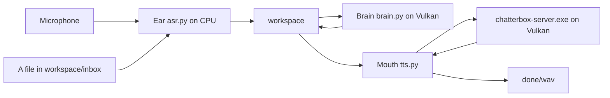
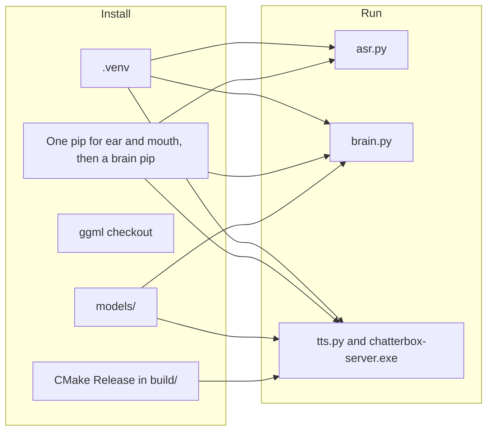
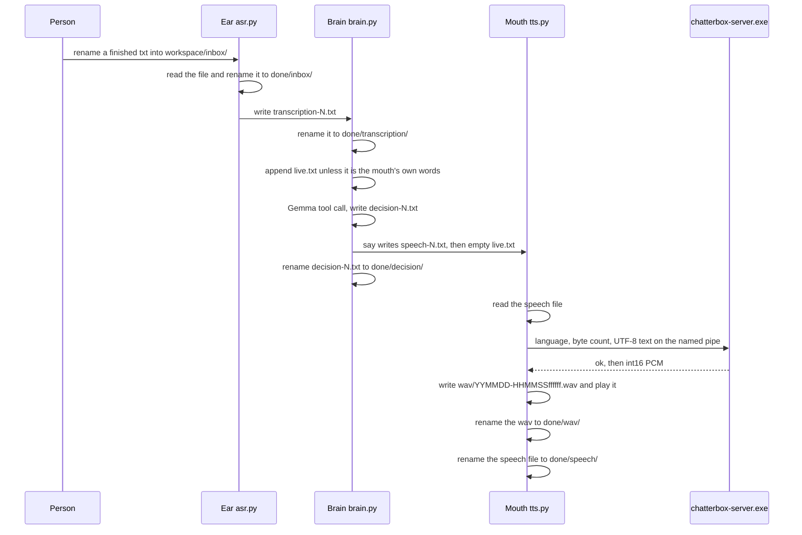
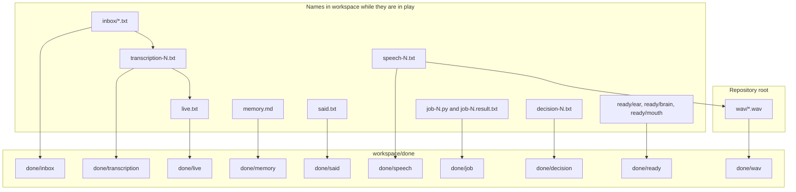
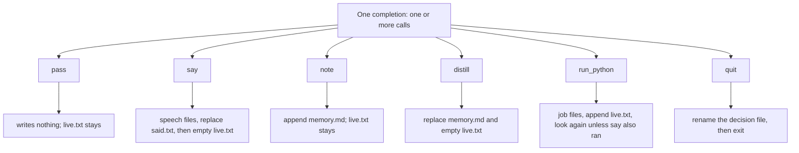
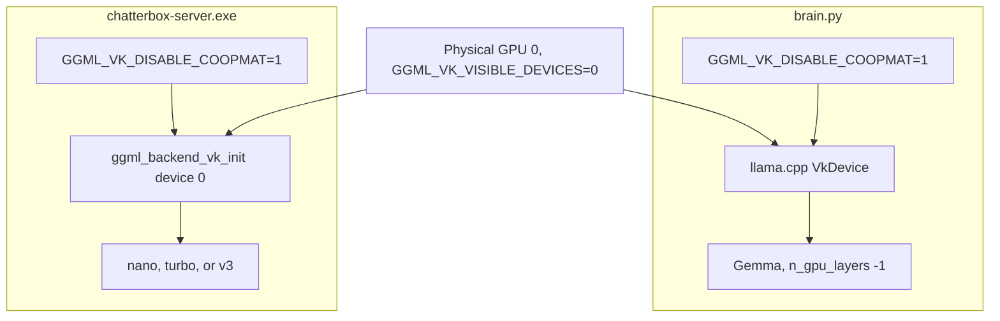

# Trident

Trident is three Windows processes and one folder. The ear writes what it heard, the brain answers only by tool calls, and the mouth is the only thing that plays audio.

## Contents

- [Processes](#processes)
- [Install](#install)
- [Run](#run)
- [One inbox utterance](#one-inbox-utterance)
- [The folder](#the-folder)
- [Tools](#tools)
- [Language](#language)
- [Ear](#ear)
- [Mouth](#mouth)
- [Brain](#brain)
- [Vulkan](#vulkan)
- [Layout](#layout)
- [License](#license)

## Processes

[trident.py](trident.py) starts [asr.py](asr.py), [brain.py](brain.py), and [tts.py](tts.py). It loads no model. The three processes do not call each other. They meet in [workspace/](settings.py).



The ear also reads `workspace/inbox/*.txt` while the microphone is open. A mic utterance and an inbox file become the same kind of file, `transcription-N.txt`. From there the path is one path. The variant you pass to [trident.py](trident.py) chooses the mouth. The brain is the same Gemma model for nano, turbo, and v3.

## Install

Commands are from the repository root on Windows. `python` is the interpreter you start. [install.py](install.py) creates `.venv` when `\.venv\Scripts\python.exe` is missing, then starts itself again with that interpreter. [asr.py](asr.py), [brain.py](brain.py), [tts.py](tts.py), and [trident.py](trident.py) do not create the venv. They call `reexec()` in [runtime.py](runtime.py) and switch to `.venv\Scripts\python.exe` when that file exists and is not already the running interpreter. If the venv is missing, those four raise `missing` and the path.

Install expects Git, a Visual Studio 2022 generator (`Visual Studio 17 2022`, `x64`), and a Vulkan SDK under `C:\VulkanSDK`. The build picks the newest `C:\VulkanSDK\*\Bin\glslc.exe` by the numeric pieces of the SDK directory name. The C++ library links `icu`.

```powershell
python install.py
```

`python install.py` with no arguments installs the ear, the brain, and mouth nano. `python install.py nano` is the same call.

```powershell
python install.py turbo
```

`python install.py turbo` installs the ear, the brain, and mouth turbo.

```powershell
python install.py v3
```

`python install.py v3` installs the ear, the brain, and mouth v3.

```powershell
python install.py all
```

`python install.py all` installs the ear, the brain, mouth turbo, and mouth v3. It does not install mouth nano.

```powershell
python install.py asr
```

`python install.py asr` installs the ear packages and the Nemotron weights. It does not install the brain, a mouth, or the `torch==2.6.0` pin.

```powershell
python install.py brain
```

`python install.py brain` installs the Vulkan build of `llama-cpp-python` and the Gemma GGUF. It does not install the ear or a mouth.

```powershell
python install.py tts nano
```

`python install.py tts turbo` and `python install.py tts v3` are the same shape. `tts` installs the mouth packages, `torch==2.6.0` from the CPU index, and that one mouth. It does not install the ear weights or the brain.

A bad invocation prints `usage: python install.py [asr | brain | tts <variant> | <variant> | all]`.



### What each command places on disk

| Command | Ear weights | Brain GGUF | Mouth | torch from the CPU index | llama-cpp-python |
| --- | --- | --- | --- | --- | --- |
| `python install.py` | yes | yes | nano | yes | yes |
| `python install.py turbo` | yes | yes | turbo | yes | yes |
| `python install.py v3` | yes | yes | v3 | yes | yes |
| `python install.py all` | yes | yes | turbo and v3, not nano | yes | yes |
| `python install.py asr` | yes | no | no | no | no |
| `python install.py brain` | no | yes | no | no | yes |
| `python install.py tts <variant>` | no | no | that variant | yes | no |

The code supports three mouths. nano and turbo are the gpt2 architecture. v3 is the llama architecture. Names and URLs are `VARIANTS` in [settings.py](settings.py).

| Mouth | Hugging Face tree | Speech checkpoint | Architecture | Diffusion steps |
| --- | --- | --- | --- | --- |
| nano | `ResembleAI/chatterbox-nano` at `71ccd1d0081b430592cea481f4307e764e07bc64` | `t3_nano_v1.safetensors` | gpt2 | 2 |
| turbo | `ResembleAI/chatterbox-turbo` at `749d1c1a46eb10492095d68fbcf55691ccf137cd` | `t3_turbo_v1.safetensors` | gpt2 | 2 |
| v3 | `ResembleAI/chatterbox` at `5bb1f6ee58e50c3b8d408bc82a6d3740c2db6e18` | `t3_mtl23ls_v3.safetensors` | llama | 10 |

nano and turbo also download `s3gen_meanflow.safetensors`, `conds.pt`, `ve.safetensors`, `vocab.json`, `merges.txt`, and `added_tokens.json` into `.ckpt`. Both gpt2 mouths share that directory. v3 downloads `s3gen.safetensors`, `conds.pt`, `ve.safetensors`, `grapheme_mtl_merged_expanded_v1.json`, and `Cangjie5_TC.json` into `.ckpt-v3`, plus `official_mtl_tokenizer.py`, `official_mtl_tts.py`, and `dicta-1.0.int8.onnx` from the URLs in `Variant.external_assets`.

Weights are not in git. After install, the server loads `models/voices/<variant>/t3.gguf` and `models/voices/<variant>/s3.gguf`. On the tree this file was written from, `models/voices/` contains `nano` only. `models/voices/turbo`, `models/voices/v3`, and `.ckpt-v3` are not there. `.ckpt` holds the nano download. The commands above are what install turbo and v3. Speech produced on this machine used the nano mouth.

The ear weights land in `models/ear/nemotron-3.5-asr-streaming-0.6b/`: `config.json`, `generation_config.json`, `processor_config.json`, `tokenizer_config.json`, `tokenizer.json`, and `model.safetensors`, from `nvidia/nemotron-3.5-asr-streaming-0.6b` at `ea30d66debe3740a08b573244286791d423d6b3e`.

The brain file is `models/brain-gemma-4-e2b-it-q4_k_m.gguf`, from `unsloth/gemma-4-E2B-it-GGUF` file `gemma-4-E2B-it-Q4_K_M.gguf` at `0314792d7f1f7e229411f620751375812bb9faf2`.

### Packages

[requirements.txt](requirements.txt) is the pin list. [install.py](install.py) selects rows from it and makes one `pip install` for the ear and mouth packages when a command asks for both. That invocation is numpy, transformers, sounddevice, gguf, safetensors, librosa, tokenizers, pykakasi, spacy-pkuseg, dicta-onnx, `add-stress-to-epub`, and then `torch==2.6.0` with `--index-url https://download.pytorch.org/whl/cpu` and `--extra-index-url https://pypi.org/simple`. `torch==2.6.0` is `PYTHON_ENV_BOOTSTRAP` in [settings.py](settings.py), not a line in the requirements file. The stamp for that combined install is `models/packages.stamp`.

| Pin | Used by |
| --- | --- |
| `numpy==1.26.4` | ear and mouth package sets |
| `transformers==5.17.0` | ear |
| `sounddevice==0.5.6` | mouth package set; the microphone and playback import it |
| `librosa==0.11.0` | mouth package set; `python asr.py <wav>` asks for the librosa audio backend |
| `gguf==0.19.0`, `safetensors==0.8.0`, `tokenizers==0.23.2` | mouth conversion and load |
| `pykakasi==2.3.0`, `spacy-pkuseg==1.0.1`, `dicta-onnx==1.0.9`, `git+https://github.com/Vuizur/add-stress-to-epub.git@v0.1.22` | mouth package set, used by the v3 tokenizer |
| `git+https://github.com/abetlen/llama-cpp-python.git@d73664636c2e3b25ce5949a9b85bba690684cdf3` | brain, a separate pip |

`python install.py asr` pins only numpy and transformers (`models/asr-packages.stamp`). `python install.py tts <variant>` pins the mouth list without transformers (`models/tts-packages.stamp`) and adds the CPU torch pin. Torch is an extra of this transformers pin, not a hard dependency, and [asr.py](asr.py) imports torch at startup, including `--inbox`. The ear-only command does not name torch. The full install and the mouth install do.

The brain pip is separate. It installs the llama-cpp-python git pin with `--no-binary llama-cpp-python`, `CMAKE_ARGS=-DGGML_VULKAN=ON`, and `FORCE_CMAKE=1`. The stamp is `models/brain-packages.stamp`.

### The mouth build

[CMakeLists.txt](CMakeLists.txt) builds a static library `trident` and two programs, `chatterbox-server` and `chatterbox-bake`. Output is `build/bin/chatterbox-server.exe` and `build/bin/chatterbox-bake.exe`. The ggml options forced in that file are `GGML_VULKAN=ON`, `GGML_CPU=OFF`, `GGML_CUDA=OFF`, and `GGML_OPENMP=OFF`. The mouth has no CPU backend. Configuration is Release, shared ggml libraries, C++17, and the compile definition `GGML_USE_VULKAN`.

[install.py](install.py) clones `https://github.com/ggml-org/ggml.git` into `ggml/` when `ggml/.git` is missing, and checks out `7840aaba1989c6deeefede1d77d5aaf8f52b947e` detached when `HEAD` is not that commit. The CMake tree is `build/`. Install does not delete it. A voice bake that has to run again deletes `models/voices/<variant>` and a temporary `models/voices/<variant>.baking` directory, then writes the new voice files. That is the voice directory, not the conversation record.

Conversion writes a base GGUF under `models/` whose name includes the kind, the family (`nano`, `turbo`, `meanflow`, or `v3`), the default weight type `q4_0`, and an eight-character digest of the quant rules. The server does not open those base files. Bake copies them into `models/voices/<variant>/` and bakes [reference.wav](reference.wav) in. Rules that stay `f32` are [scripts/quant_t3.json](scripts/quant_t3.json) and [scripts/quant_s3.json](scripts/quant_s3.json).

`chatterbox-bake.exe` takes the voice T3 GGUF, the S3 GGUF, and `reference.wav`. It initializes Vulkan device 0. For gpt2 the condition clip is 15 seconds. For llama it is 6 seconds. Speaker audio is trimmed to 30 seconds, prompt audio to 10 seconds. The baked tensors are `chatterbox/builtin/speaker_emb`, `chatterbox/builtin/cond_prompt_speech_tokens`, `s3gen/builtin/prompt_token`, `s3gen/builtin/prompt_feat`, and `s3gen/builtin/embedding`. The running server does not open `reference.wav`.

### Stamps

Install writes JSON and text stamps under `models/`. A stamp that still matches, with the output files present, prints `skip` and does not repeat that step. A matching `models/build-contract.json` plus both executables prints `skip ggml` and `skip engine` and does not reconfigure CMake. Running install while a mouth server is up taskkills the pid in `models/server.pid` before a rebuild or a voice bake.

## Run

> [!NOTE]
> `python trident.py <variant>` opens the microphone and still drains `workspace/inbox/`. `python trident.py <variant> inbox` leaves the microphone closed. Closed-mic mode loads no ASR model. Open-mic mode loads Nemotron on the CPU.

Every `python trident.py`, `python brain.py`, `python tts.py`, and `python asr.py` below re-executes into `.venv\Scripts\python.exe` when it is not already that interpreter.

The variant is `nano`, `turbo`, or `v3`. It is passed only to the mouth. A turbo or v3 run needs that mouth installed. This tree has nano voice files.

```powershell
python trident.py nano
```

Starts the brain, mouth nano, and the ear with the microphone open. The brain loads Gemma. The mouth starts or reuses `chatterbox-server.exe` for nano. The ear loads Nemotron unless you chose inbox mode.

```powershell
python trident.py nano inbox
```

Same three processes. The ear is `python asr.py --inbox`: no ASR model, no microphone, inbox files only.

```powershell
python trident.py turbo
```

```powershell
python trident.py turbo inbox
```

```powershell
python trident.py v3
```

```powershell
python trident.py v3 inbox
```

Those four are the turbo and v3 mouths. The brain load is unchanged.

[trident.py](trident.py) moves any existing `workspace/ready/ear`, `workspace/ready/brain`, and `workspace/ready/mouth` into `workspace/done/ready/`, then starts the three processes. Each child prints `ready` and writes its empty ready file after it can serve. When all three files exist, the supervisor prints `jarvis ready`. If a child exits before or after that, the supervisor terminates the three and taskkills `models/server.pid`, then exits with that child's code. Ctrl+C does the same stop. A second argument other than `inbox` prints `usage: python trident.py <variant> [inbox]`.

To hear speech, the mouth has to be running when the speech file is still in `workspace/`. `say` writes that file. The mouth reads it, writes a wav, plays it, and renames both the wav and the speech file into `done/`. See [The folder](#the-folder).

> [!IMPORTANT]
> A wav is renamed from `wav/` into `workspace/done/wav/` and stays there. The ear, the brain, the mouth, and the supervisor do not remove bus files or wavs.

```powershell
python brain.py
```

Runs the brain alone, in the same serve loop [trident.py](trident.py) uses. It clears `workspace/live.txt` first (the previous body is renamed into `done/live/` when the file is non-empty), loads Gemma, writes `ready/brain`, and waits for `transcription-N.txt`. Before it appends a transcription that is not the mouth's own words, an `exit 0` line already in `live.txt` renames that file into `done/live/` and writes an empty `live.txt`. The new sentence is then the only live text. The previous request is not copied into `memory.md`. It does not start the ear or the mouth. `memory.md` and `said.txt` stay.

```powershell
python brain.py hello
```

`python brain.py <text-or-file>` is one shot. The single argument must not be `nano`, `turbo`, or `v3`. If it is a path to a file, the file is read as UTF-8 with a BOM accepted. Otherwise the argument is the text. The text is appended to `live.txt`. Gemma loads, the brain takes up to three looks, and the process exits. It does not write `ready/brain`, does not clear `live.txt` first, and does not wait for more transcriptions.

```powershell
python brain.py nano --say "the kettle is on."
```

`python brain.py <variant> --say <text-or-file>` checks that the variant is nano, turbo, or v3, then ignores which of the three it was. It writes one or more `speech-N.txt` files whose first line is `en`. It does not load Gemma, does not start the server, and does not play audio. A running mouth speaks those files. `python brain.py turbo --say` and `python brain.py v3 --say` write the same `en` speech files.

A bad brain invocation prints `usage: python brain.py [text|file] | python brain.py <variant> --say <text|file>`.

```powershell
python tts.py nano
```

Starts or reuses the nano server, writes `ready/mouth`, and watches `speech-N.txt`. This is the mouth loop [trident.py](trident.py) starts. `python tts.py turbo` and `python tts.py v3` are the same loop for those mouths.

```powershell
python tts.py nano "words" en
```

Speaks that string through the nano server and does not watch the bus. The language argument defaults to `en` when you omit it: `python tts.py nano "words"` is language `en`. `python tts.py turbo "words" en` and `python tts.py v3 "words" en` are the one-shot form for the other mouths. v3 will reject a language its GGUF does not list. This one-shot does not taskkill the server when it returns. The server is a separate console process. The next `tts.py` start reuses it when `models/server.pid` matches the command and the pipe answers within 3 seconds. Otherwise that pid is taskkilled and a new server starts.

A bad mouth invocation prints `usage: python tts.py <variant> [text] [language]`.

```powershell
python asr.py
```

Loads Nemotron, writes `ready/ear`, opens the default input device, and drains `workspace/inbox/` on the same loop.

```powershell
python asr.py --inbox
```

Does not construct the ASR model. Writes `ready/ear` and drains the inbox forever.

```powershell
python asr.py path\to\file.wav
```

Loads Nemotron, transcribes that file, writes one `transcription-N.txt`, and exits. It does not write `ready/ear` and it does not keep listening. An empty transcript raises `ear heard nothing`. A bad invocation prints `usage: python asr.py [wav | --inbox]`.

There is no separate reasoning switch on any of these commands. The brain has one way to act. That is [Tools](#tools).

## One inbox utterance

This is the path from a finished inbox file to a wav, when the brain's completion calls `say` and does not call `quit`, and the mouth is still running.



The microphone joins at the same transcription file. The ear cuts after the level stays under the threshold, transcribes, and writes `transcription-N.txt`. The inbox drain still runs on that loop.

`python brain.py nano --say ...` stops at the speech file. `python tts.py nano "words" en` starts at the pipe and still writes and plays a wav. Neither of those two, by itself, is the whole picture above.

## The folder

[settings.py](settings.py) calls the folder the bus. `bus()` creates `workspace/`, `workspace/done/`, and `workspace/inbox/`, and creates empty `workspace/live.txt` and `workspace/memory.md` when they are missing. Publishing a bus file uses a temporary name in the same directory and then `replace`, except the job script, the job result, and a `note` rewrite of `memory.md`, which use `write_text` directly.

A consumer renames a file into `workspace/done/<kind>/`. The name and the bytes stay. If that destination name is already there, the new name gets `-1`, `-2`, and so on before the suffix. Numbered live files start at 1 and skip a name that is already in `workspace/` or in `done/<kind>/`.

The mouth renames a played wav from `wav/*.wav` at the repository root into `workspace/done/wav/`. The file stays in the record.

`wav/` is not under `workspace/`. `workspace/done/wav/` is the record. `workspace/done/speech/` is the text that was spoken.



### Who writes, who reads, when it is renamed

| Path | Who writes it | Who reads it | When it is renamed |
| --- | --- | --- | --- |
| `workspace/inbox/*.txt` | anyone | the ear | the ear renames it into `done/inbox/` as soon as it sees the name, then writes a transcription if the text is not empty |
| `workspace/transcription-N.txt` | the ear | the brain | the brain renames it into `done/transcription/` before it decides |
| `workspace/live.txt` | the brain | the brain, on the next look | the head is renamed into `done/live/` when the Python string is longer than 12000 characters; `say` and `distill` rename the whole file into `done/live/` and write an empty `live.txt`; starting `python brain.py` with no arguments does that clear as well; before appending a transcription that is not the mouth's own words, `exit 0` already in the file does that same clear |
| `workspace/memory.md` | the brain | the brain, as the prefix of the user text | `distill` renames a non-empty file into `done/memory/` and writes the new memory; `note` rewrites the file in place and does not archive it; a restart leaves it |
| `workspace/said.txt` | the brain, the full text of the last `say` | the brain, as the echo filter | the next `say` renames a non-empty file into `done/said/` |
| `workspace/speech-N.txt` | the brain, or `python brain.py <variant> --say` | the mouth | the mouth renames it into `done/speech/` after a successful play; an empty body is renamed with no play |
| `workspace/job-N.py` | the brain | the venv Python, working directory `workspace/` | renamed into `done/job/` after the result is appended to `live.txt` |
| `workspace/job-N.result.txt` | the brain, from the script's stdout, stderr, and status | the brain, because the same text was appended to `live.txt` | renamed into `done/job/` with the script |
| `workspace/decision-N.txt` | the brain, the raw tool-call text, before apply | the brain | renamed into `done/decision/` after apply returns, and also when `quit` raises; a failed parse leaves the file in `workspace/` |
| `workspace/ready/ear` | the ear, after it prints `ready` | [trident.py](trident.py) | the supervisor renames a stale file into `done/ready/` at the next start |
| `workspace/ready/brain` | the brain serve loop, after Gemma is loaded | [trident.py](trident.py) | same |
| `workspace/ready/mouth` | the mouth watch loop, after the server pipe answers | [trident.py](trident.py) | same |
| `wav/*.wav` | the mouth, before and during playback | the mouth | renamed into `done/wav/` after play, or before the exception if play raises, or at the start of the next synthesis if a previous file was left behind |
| `workspace/done/<kind>/` | the rename | anyone reading the record | not a queue |

Inbox order is filename sort. `transcription-N.txt`, `speech-N.txt`, `job-N`, and `decision-N.txt` are taken in numeric order. The ear does not wait for a writer to finish. It reads every `workspace/inbox/*.txt` on the pass that first sees the name. Write the file somewhere else and rename it into `inbox/` when the bytes are complete. That is the same publish pattern `put()` uses inside the program.

The echo filter runs after the transcription has already been renamed into `done/transcription/`. The brain keeps letters and whitespace, casefolds, and collapses spaces. If both strings are non-empty and the heard string is a substring of `said.txt`, the line is not appended and `think` is not called. That is how the microphone hears the speaker and the brain drops it. A dropped line does not clear `live.txt`. When the line is kept and a live line starts with `exit` and its second field is `0`, the brain renames the whole live file into `done/live/` and writes an empty `live.txt` before the append. The new sentence is the only live text. The previous request is not written into `memory.md`. Looks that follow a script inside the same transcription still see the result, because that clear runs in `serve` and not between looks.

### Caps

`CHUNK` is 60. `say` splits the tool text on whitespace into stretches of 60 words. A stretch at or under 60 words is one speech file. Past that, the cut walks backward for a word whose last character is `.`, `?`, or `!`. If none is in the window, the cut is at 60 words. Each speech file is the language, a newline, and the stretch. `said.txt` keeps the unsplit text.

`MAX_LIVE` is 12000. The check is `len` of the Python string from `read_text`, which turns Windows newlines into `\n` before the count. On Windows, `write_text` writes `\n` as CRLF, so the file can be longer on disk than 12000 and still be under the cap. The cap is not a byte cap. When the string is over the cap, the head is written to a new `live-N.txt` and renamed into `done/live/`. The tail, the last 12000 characters, stays in `live.txt`. This runs at the start of a look, inside `user_text`, not on every append.

Tracked source files are stored as LF (`.gitattributes` is `* text=auto eol=lf`). The bus is untracked. The bus follows Python's Windows newlines.

### What a run leaves behind

These names are records from runs on this machine. They are examples of the naming, not files you have to put back.

| Example | What it is |
| --- | --- |
| `workspace/done/inbox/kettle.txt` | an inbox file after the ear read it |
| `workspace/done/transcription/transcription-1.txt` | the line the brain took |
| `workspace/done/decision/decision-1.txt` | the tool-call text after apply |
| `workspace/done/speech/speech-1.txt` | one stretch, first line `en` |
| `workspace/done/wav/260923-111752850952.wav` | a played wav; the name is local `YYMMDD-HHMMSSffffff` |
| `workspace/done/wav/260923-111811112576.wav` | another played wav |
| `workspace/done/said/said.txt` | a previous `said.txt` replaced by a later `say` |
| `workspace/done/live/live.txt` | a previous `live.txt` replaced by a clear |
| `workspace/done/memory/memory.md` | a previous memory replaced by `distill` |
| `workspace/done/job/job-1.py` and `workspace/done/job/job-1.result.txt` | one script and the streams recorded from it |
| `workspace/done/ready/ear` | a ready file from an earlier start |

A speech file looks like this:

```text
en
the kettle is on.
```

## Tools

The brain acts only by tool calls under one grammar. There is no second mode and no reasoning flag. One completion may contain more than one call. The calls run in order. A look is one completion. `run_python` can ask for another look. The loop stops after three looks, or sooner when the completion does not ask for another.



Empty user text, after strip, never calls the model. The completion is a `pass`.

### What the model is told

The system text in `SPEAK` is:

```text
You are Jarvis. The user text is memory, then unread live text. Act only by calling tools. The last live line is the only request. Earlier live lines are already handled. pass writes nothing: the live text is unfinished or needs no action. say speaks. note appends one fact and does not speak. distill replaces memory, clears the live text, and does not speak. run_python runs one script. Its result is the next lines, and those lines start with exit. When a line starts with exit, the allowed calls are say, pass, note, distill, and quit. If the person asked to hear the result, say. quit ends you.
```

The user message is `memory.md`, then a blank line, then `live.txt`, when both are non-empty. Otherwise it is whichever one is non-empty.

The tool descriptions also tell the model: `say` language is `en` or `pl`; sixty words is one stretch; `note` is one fact; `distill` keeps names and decisions; `run_python` runs one script in the workspace folder. The last live line is the only request. Earlier live lines are already handled. When a live line starts with `exit`, the allowed calls are `say`, `pass`, `note`, `distill`, and `quit`. The runner records the streams.

The same system text tells the model that a line starting with `exit` leaves `say`, `pass`, `note`, `distill`, and `quit`. The code blocks a narrower case, below.

### What the code does

| Tool | live.txt | memory.md | speech and said | jobs | next look |
| --- | --- | --- | --- | --- | --- |
| `pass` | unchanged | unchanged | none | none | no |
| `say` | emptied after the whole completion | unchanged | replaces `said.txt`; writes `speech-N.txt` | none | no, even if `run_python` ran in the same completion |
| `note` | unchanged | appends one trimmed line; no archive of the old file | none | none | no |
| `distill` | emptied | non-empty old file renamed to `done/memory/`; new text written | none | none | no |
| `run_python` | the result is appended | unchanged | none | `job-N.py` and `job-N.result.txt`, then both renamed to `done/job/` | yes, unless `say` is in the same completion or this was the third look |
| `quit` | not emptied by the quit path | unchanged | a `say` earlier in the same completion has already written speech files | a `run_python` earlier in the same completion has already run | the process exits |

`say` requires `text` that is not blank and a language of `en` or `pl`. A missing language is treated as `en`. The grammar already requires both fields.

`note` and `distill` require non-empty `text`.

`run_python` requires non-empty code. The script runs with `.venv\Scripts\python.exe`, current directory `workspace/`, captured stdout and stderr, and a 60 second timeout. The result text is `exit <returncode>`, a newline, then stdout and stderr. A timeout is `exit timeout`, a newline, then whatever output the timeout object carries. Both files are renamed into `done/job/` before the function returns. The appended live text is what the next look sees.

`clean_exit` is computed once, from `live.txt`, before any tool in that completion runs. A line that starts with the characters `exit` and whose second field is `0` blocks `run_python`. `exit 0` blocks. `exit 1` does not. `exit timeout` does not. Other tools in that completion still run. A `run_python` that is blocked is skipped. Two `run_python` calls in one completion both see the same earlier `live.txt`, so a `exit 0` written by the first script does not block the second script in that same completion. The next look does see it.

`quit` raises `SystemExit` inside the tool loop. [brain.py](brain.py) renames the decision file into `done/decision/` and then lets the process exit. Tools listed after `quit` in that completion do not run. [trident.py](trident.py) sees the exit, including exit code 0, and stops the ear, the mouth, and the server.

`say` and `quit` in one completion: if `say` is first, the speech files are written and `said.txt` is replaced. `clear_live` is after the loop, so it does not run. The decision file is retired. The brain exits. The supervisor stops the mouth. The speech file can still be `workspace/speech-N.txt` when the mouth is gone. The mouth speaks a live speech file when it is running. It does not come back later for a file it never reached. To get a wav, run a mouth and call `say` without `quit` in that completion, or speak with `python tts.py nano "words" en` while you do not need the brain.

If `say` and `run_python` are in one completion, the script runs, its result is appended, then `say` empties `live.txt`. There is no follow-up look. The result file is already in `done/job/`.

On the third look, a `run_python` still runs and appends, and then the loop returns because three looks have been used. The result stays in `live.txt` until another transcription is taken. A transcription that is not the mouth's own words, and that arrives while `live.txt` already contains `exit 0`, renames that live file into `done/live/`, writes an empty `live.txt`, and appends only the new sentence. The old request is not copied into `memory.md`. The finished script does not get a fourth completion.

A completion that is not a closed run of tool calls raises. The decision file stays in `workspace/`. The brain process exits, and the supervisor stops the others.

### Looks

`think` prints the user text and the completion. `serve` prints `read` and the transcription file name. `hops` starts at 0 and increments after each completion. The loop continues only when apply asked for another look and `hops` is still under 3. That is three completions, not three tools.

## Language

The first line of a speech file is the language. The rest is the words.

| Mouth | Where a language is accepted |
| --- | --- |
| nano, turbo | [tts.py](tts.py) rejects anything other than `en` before the pipe, with `Unsupported language:`. [src/gpt2/engine.cpp](src/gpt2/engine.cpp) `gpt2::Engine::synthesize` rejects anything other than `en` the same way |
| v3 | [tts.py](tts.py) does not check the language tag, except that a newline in the tag fails in the pipe writer. [src/llama/engine.cpp](src/llama/engine.cpp) rejects a language that is not listed in the GGUF string `chatterbox.tokenizer.language_tokens`. The error is `Unsupported language: <tag>; GGUF offers <that string>`. This tree has no v3 GGUF, so this file does not list those tags |

The brain's grammar and `speak()` allow `en` and `pl` only. nano and turbo will refuse `pl` when the mouth runs. v3 accepts `pl` only when that GGUF lists it.

`python brain.py <variant> --say` always writes `en`. It cannot write `pl`.

A one-shot `python tts.py nano "words"` omits the language argument and uses `en`.

## Ear

The ear is [asr.py](asr.py). Constants are `EAR` in [settings.py](settings.py).

| Constant | Value | Role |
| --- | --- | --- |
| sample rate | 16000 | model input, mic stream, and wav-file load |
| threads | 4 | `torch.set_num_threads` |
| language | `auto` | passed to the processor |
| lookahead | 3 | `set_num_lookahead_tokens` |
| pause | 3.0 seconds | quiet time that ends an utterance |
| level | 0.03 | mean absolute sample of a frame |

The mic stream is the default input, one channel, float32, block size `16000 * 0.05` (50 ms). A frame at or above `0.03` makes the utterance hot and resets the quiet count. After it is hot, 60 quiet frames (3.0 seconds) end it. Audio shorter than half a second (`16000 // 2` samples) is dropped. The transcript is stripped. Empty mic text is not written. Inbox text that strips to empty is still renamed into `done/inbox/` and does not become a transcription.

Each mic loop drains the inbox before it reads the next frame. Inbox-only mode drains and sleeps 0.05 seconds. The model class is `AutoModelForRNNT` from the local `models/ear/nemotron-3.5-asr-streaming-0.6b` directory. A missing weight raises `missing` and that path. The ear does not use Vulkan.

`python asr.py <wav>` loads the file with the transformers audio loader at 16000 Hz and backend `librosa`. That import is not in the ear-only pip list. It is in the mouth package list.

## Mouth

The mouth is [tts.py](tts.py) plus [src/server.cpp](src/server.cpp). The Python process watches the bus, writes the wav, and plays it. The executable synthesizes. The mouth is Vulkan only, because the CMake file turns the CPU backend off.

Watch mode polls every 0.05 seconds. It reads the first `speech-N.txt` as UTF-8 with a BOM accepted, splits on the first newline, and strips the language and the text. No text: the speech file is renamed into `done/speech/` and nothing is played.

### Pipe and server

The pipe name is `\\.\pipe\chatterbox-<variant>`. The server creates it with one instance and `PIPE_REJECT_REMOTE_CLIENTS`. The working directory of the server process is `build\bin`, so the ggml DLLs beside the exe load. The process is created with a new console.

The command is `chatterbox-server.exe`, the voice `t3.gguf`, the voice `s3.gguf`, the pipe, then flag pairs. Flags come from `FLAGS` in [settings.py](settings.py). There is no Python switch to override them. [src/common/pipe.h](src/common/pipe.h) requires every flag to be consumed. A duplicate or an unknown flag throws. Architecture is the GGUF field `general.architecture`: `chatterbox-gpt2` or `chatterbox-llama`.

| Flag | nano and turbo | v3 |
| --- | --- | --- |
| `--gpu` | `0` | `0` |
| `--seed` | `42` | `42` |
| `--temperature` | `0.8` | `0.8` |
| `--top-p` | `0.95` | `1.0` |
| `--repeat-penalty` | `1.2` | `1.2` |
| `--n-predict` | `1000` | `1000` |
| `--cfm-steps` | `2` | `10` |
| `--trim-fade-samples` | `480` | `480` |
| `--top-k` | `1000` | not passed |
| `--min-p` | not passed | `0.05` |
| `--cfg-weight` | not passed | `0.5` |
| `--exaggeration` | not passed | `0.5` |
| `--cfm-cfg` | not passed | `0.7` |

Repeat penalty `1.2` is applied in [src/common/repeat_penalty.h](src/common/repeat_penalty.h): for each distinct token already generated, a positive score is divided by `1.2` and any other finite score is multiplied by `1.2`.

v3 also receives `--tokenizer-python`, `--tokenizer-script` ([scripts/mtl_tokenize_runtime.py](scripts/mtl_tokenize_runtime.py)), `--tokenizer-source`, `--tokenizer-tts-source`, `--tokenizer-json`, `--cangjie-json`, and `--dicta-model`. Those paths are the venv interpreter and the files under `.ckpt-v3`. A missing file raises `missing` before the server starts.

The Python side waits up to 60 seconds for the pipe. The request is the language, a newline, the UTF-8 byte length, a newline, and the UTF-8 text. The reply is `ok <sample count>`, a newline, then that many little-endian int16 samples. The server clamps each float to [-1, 1] and multiplies by 32767. The Python reader treats the count as samples and reads twice that many bytes.

Startup waits up to 30 seconds for the pipe. `models/server.pid` stores the pid and the command contract, including the baked voice JSON. Any other `models/*.pid` except `models/trident.pid` is taskkilled first. This code writes `server.pid`. It does not write `trident.pid`.

Before each synthesis, every `wav/*.wav` already sitting in the repository `wav/` folder is renamed into `done/wav/` and is not played.

### Playback

The wav header is mono, 16-bit, 24000 Hz. The file name is local time from `datetime.now()` as `YYMMDD-HHMMSSffffff.wav`. The mouth prints the text, plays, then prints the `done/wav/` path.

Playback initializes COM with `CoInitializeEx(None, 0)` and calls sounddevice on the default output. Each int16 sample is repeated once and the stream rate is 48000 Hz, which holds every 24000 Hz sample for two output samples. The wait is `len(pcm) / 2 / 24000` seconds plus 120. At that call `pcm` is the int16 array, so `len` is the sample count: the budget is half the 24000 Hz duration plus 120 seconds. If the callback does not finish in time, the stream is stopped and the mouth raises `play timeout`.

If play raises, the wav is still renamed into `done/wav/` when the file exists, and the exception continues. The speech file stays in `workspace/` because it is renamed only after `say` returns. If play returns, the wav is renamed and then the speech file is renamed.

### nano and turbo

[src/gpt2/engine.cpp](src/gpt2/engine.cpp) refuses a language other than `en`, then runs the English normalizer in [src/gpt2/text_en.cpp](src/gpt2/text_en.cpp). That pass rewrites month-day-year dates, dollar amounts, clock times, phone numbers when the text before them matches the phone context, day-of-month ordinals, seat labels, decimals, and integers. Tokens that contain `://`, `@`, or `_`, and mixed letter-digit tokens outside the seat and ordinal cases, are left alone. The BPE then tokenizes the punctuated text. S3 synthesizes the T3 tokens. The fade is the last `trim-fade-samples` (480) of the PCM. The diffusion step count is `--cfm-steps` 2.

### v3

[src/llama/engine.cpp](src/llama/engine.cpp) checks the language against the GGUF list, spells numbers with ICU `UNUM_SPELLOUT` for that language tag, normalizes punctuation with `punc_norm` taken from the official `mtl_tts.py`, and tokenizes in the side Python worker. The worker loads the official MTL tokenizer and the Dicta ONNX model. T3 generation is wrapped with the model's start and stop text tokens. After S3, the engine drops the last 960 samples, then applies the same 480-sample fade. The diffusion step count is `--cfm-steps` 10, with `--cfm-cfg` 0.7.

## Brain

The brain is [brain.py](brain.py). The model path, context, and sampling dict are `BRAIN` in [settings.py](settings.py). Tool schemas and the system text are `TOOLS` and `SPEAK` in the same file.

### Load

`load()` checks that `models/brain-gemma-4-e2b-it-q4_k_m.gguf` exists, calls `vulkan()` in [runtime.py](runtime.py), then constructs `llama_cpp.Llama` with:

| Argument | Value |
| --- | --- |
| `n_ctx` | 4096 |
| `n_batch` | 512 |
| `n_threads` | 4 |
| `n_gpu_layers` | -1. A measured load printed `offloaded 36/36 layers to GPU` |
| `chat_format` | `chat_template.default` |
| `verbose` | `False` |
| `logits_all` | `False` |

`flash_attn` is not passed. The library default is `False`, and that selects flash attention disabled. `offload_kqv` is not passed. The library default is `True`.

The completion uses `temperature` 1.0, `top_p` 0.95, `top_k` 64, `min_p` 0.0, and `max_tokens` 1024. The call passes `stop=["<turn|>"]`. The chat formatter also stops on the model EOS token. `tools` is the six-tool list. `grammar` is the GBNF below.

Serve mode prints `ready` and writes `workspace/ready/brain` only after that load returns.

### Template and thinking

`chat_format="chat_template.default"` renders the GGUF key `tokenizer.chat_template`. This program does not pass `enable_thinking` or `preserve_thinking`. In the template stored in `models/brain-gemma-4-e2b-it-q4_k_m.gguf`, both default to false:

```text
enable_thinking = enable_thinking | default(false)
preserve_thinking = preserve_thinking | default(false)
```

The template contains a thought channel. `<|think|>` is written only when `enable_thinking` is true. `<|channel>thought` is opened on the generation prompt only when the previous turn was a tool response and `enable_thinking` is true, and a message's `reasoning` or `reasoning_content` is rendered into that channel only under the template's own gate. This code never sets those inputs. Thinking stays off. The template is still used.

Because `tools` is passed and the first message is `system`, the template opens `<|turn>system`, writes the system text, writes each tool as `<|tool>` plus a declaration plus `<tool|>`, closes the turn, writes the user text, and ends the prompt with `<|turn>model` and a newline. That is the generation prompt this program actually builds.

There is still only one way to think: the grammar, then up to three looks.

### Grammar

The grammar root is `call+`. A completion is one or more calls and nothing in front of them. String bodies are `[^<]*`, wrapped in `<|"|>`. A tool string cannot contain `<`.

```text
root ::= call+

call ::= say | idle | noted | distilled | py
say ::= "<|tool_call>call:say{" saybody "}" "<tool_call|>"
idle ::= "<|tool_call>call:" ("pass" | "quit") "{}" "<tool_call|>"
noted ::= "<|tool_call>call:note{text:" piece "}" "<tool_call|>"
distilled ::= "<|tool_call>call:distill{text:" piece "}" "<tool_call|>"
py ::= "<|tool_call>call:run_python{code:" piece "}" "<tool_call|>"
saybody ::= "text:" piece ",language:" lang | "language:" lang ",text:" piece
piece ::= mark chars mark
lang ::= mark ("en" | "pl") mark
mark ::= "<|\"|>"
chars ::= [^<]*
```

`pass` and `quit` have empty `{}`. `say` may put `text` or `language` first. The parser in [brain.py](brain.py) reads `name` and the marked fields. Prose outside the calls raises `tool call`. An unclosed call raises `open tool call`.

## Vulkan

> [!IMPORTANT]
> The brain and the mouth are two processes. Each opens its own Vulkan device. Both are pinned to physical device 0. A display on that GPU does not put the brain on the CPU. `n_gpu_layers` stays -1. This program does not change `TdrDelay`.

`vulkan()` in [runtime.py](runtime.py) runs in the brain before `Llama()`, and in the mouth before it starts `chatterbox-server.exe`. The server inherits the environment. The function does three things:

| Environment variable | What the code does |
| --- | --- |
| `GGML_VK_DISABLE_COOPMAT` | sets it to `1` |
| `GGML_VK_VISIBLE_DEVICES` | sets it to `0` |
| `GGML_VK_PREFER_HOST_MEMORY` | removes it if it is set |

The code does not set `GGML_VK_PREFER_HOST_MEMORY`. On a machine whose GPU reports `uma` 1, an integrated GPU that needs that variable has to have it set outside this program. As written, `vulkan()` will remove it again when the brain loads and when the mouth starts the server.

The mouth device is `ggml_backend_vk_init` in [src/common/vulkan_backend.cpp](src/common/vulkan_backend.cpp), with the `--gpu` value, which is 0. Bake uses device 0 as well, and bake does not call `vulkan()`. The brain device is the one llama.cpp opens inside the brain process under the same visible-device variable. Two processes, two `VkDevice` objects, one physical GPU.

The ear stays on CPU torch. The CPU torch wheel is the ear and the conversion scripts. It is not the mouth synthesizer.



## Layout

[.gitignore](.gitignore) is an allowlist. The first line is `*`. A path is tracked only when a later `!` line names it. `.gitattributes` forces LF for the text that is tracked.

### Tracked tree

```text
.gitignore
.gitattributes
CMakeLists.txt
LICENSE
README.md
asr.py
brain.py
install.py
requirements.txt
runtime.py
settings.py
trident.py
tts.py
reference.wav
scripts/convert_s3.py
scripts/convert_t3.py
scripts/mtl_tokenize_runtime.py
scripts/quant.py
scripts/quant_s3.json
scripts/quant_t3.json
src/bake.cpp
src/engine.h
src/server.cpp
src/common/audio.cpp
src/common/audio.h
src/common/campplus.cpp
src/common/campplus.h
src/common/gguf_file.cpp
src/common/gguf_file.h
src/common/pipe.h
src/common/repeat_penalty.h
src/common/s3.cpp
src/common/s3.h
src/common/s3_dsp.cpp
src/common/s3_dsp.h
src/common/s3_tokenizer.cpp
src/common/s3_tokenizer.h
src/common/voice_encoder.cpp
src/common/voice_encoder.h
src/common/vulkan_backend.cpp
src/common/vulkan_backend.h
src/gpt2/bpe.cpp
src/gpt2/bpe.h
src/gpt2/engine.cpp
src/gpt2/engine.h
src/gpt2/t3.cpp
src/gpt2/t3.h
src/gpt2/text_en.cpp
src/gpt2/text_en.h
src/llama/engine.cpp
src/llama/engine.h
src/llama/mtl_numbers.cpp
src/llama/mtl_numbers.h
src/llama/mtl_tokenizer.cpp
src/llama/mtl_tokenizer.h
src/llama/t3.cpp
src/llama/t3.h
```

### Untracked

These stay untracked: `ggml/`, `models/`, `build/`, `.venv/`, `workspace/`, `wav/`, and `install-log.md`. The program does not write `install-log.md`. Also untracked, because the allowlist does not name them: `.ckpt/`, `.ckpt-v3/`, and `__pycache__/`.

`ggml/` is the checkout install makes. `models/` holds stamps, GGUFs, ear weights, voice bakes, and `server.pid`. `build/` is the CMake tree. `.venv/` is the interpreter the programs re-exec into. `workspace/` is the bus and the record. `wav/` is the mouth's scratch folder before a file moves to `workspace/done/wav/`.

## License

[LICENSE](LICENSE) is the MIT license, copyright 2026 Gianfranco Cordella. The same file names the ggml checkout and the Chatterbox sources this tree builds against.
