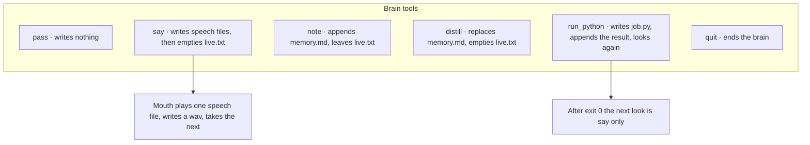
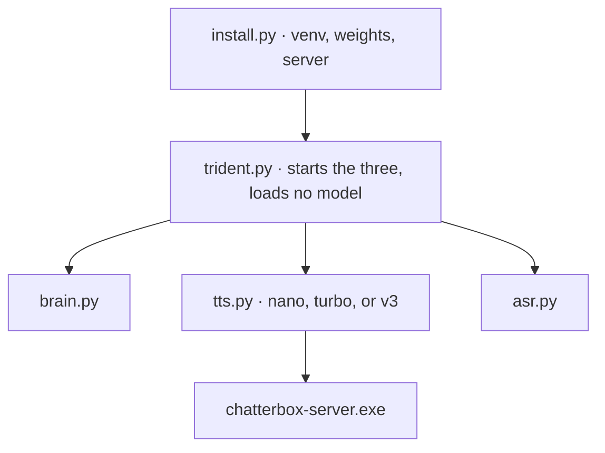

# Trident

Three processes and one folder. The folder is the conversation. There is no separate API. Whoever can create a file in `workspace/` is speaking to the machine, and the part that watches that name answers.


The ear also opens the microphone. A microphone utterance and an inbox file become the same kind of transcription file. After that, the path is one path.

## Files

| File | Who writes it | Who reads it |
| --- | --- | --- |
| `inbox/*.txt` | anyone, renamed into place | the ear |
| `transcription-N.txt` | the ear | the brain |
| `live.txt` | the brain | the brain, this process only |
| `memory.md` | the brain, and it survives a restart | the brain |
| `speech-N.txt` | the brain | the mouth |
| `said.txt` | the brain, last spoken answer | the brain, as an echo filter |
| `job.py` | the brain, last script | the script runner |
| `done/` | the consumer, after the file is taken | anyone reading the record |
| `wav/` | the mouth | anyone listening to the record |

A consumed inbox file, transcription file, or speech file leaves the live folder and sits in `done/`.



`say` longer than 60 words is split at sentence ends. The first line of a speech file is the language, `en` or `pl`. The rest is the words.

## Run

From the repository root, with the venv Python:

```text
python install.py
python trident.py nano
```

`python install.py` installs the ear, the brain, and mouth nano. `python install.py turbo` and `python install.py v3` install those mouths. `python install.py all` installs the ear, the brain, mouth turbo, and mouth v3.

`python trident.py <variant>` opens the microphone and still reads `inbox/` files. `python trident.py <variant> inbox` leaves the microphone closed. The variant is `nano`, `turbo`, or `v3`.

Wait until the ear, the brain, and the mouth have each printed ready. Then an inbox file is renamed into place, or a person speaks and stays quiet long enough for the ear to cut. The proof of a run is the supervisor log and the files left in `workspace/` and `wav/`.

The brain is CPU only (`n_gpu_layers` is 0). Both mouths use repeat penalty 1.2. The llama mouth, v3, uses 10 diffusion steps and `gpu` 0.

## Layout



`install.py` is what a fresh clone runs before the three processes. The tracked tree is the program. The venv, the weights, and `chatterbox-server.exe` are produced by that install.
