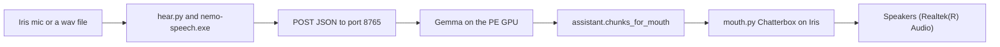

# Trident

Trident is a voice assistant on two home Windows PCs. Iris hears and speaks. NVIDIA thinks and returns text. Iris turns that text into speech.

Checked-in code outranks this file. If `ear.txt`, `vad.txt`, `chatterbox.txt`, or an older sentence here disagrees with `hear.py`, `mouth.py`, `assistant.py`, `grok_local_bot.py`, `nvidia_client.py`, `nvidia_worker.py`, or `gemma.py`, follow the code and the run files.

Flags, card keys, and environment variables are in [Flags and knobs](#flags-and-knobs). The text cards stay in the tree because install and the programs read them. Read this file for what a key means. Open a card when you are changing the value the program loads.

The branch of record is `runner-h`. Clone `https://github.com/wgabrys88/Trident.git` and check out `runner-h`. `main` is an ancestor of this branch. Do not start work from `main`. Do not fast-forward `main` without Wojciech.

License: MIT. Copyright (c) 2026 Gianfranco Cordella. See `LICENSE`. The build also uses ggml and a C++/ggml port of Resemble AI Chatterbox, named in that file.

## Seats

| Seat | Worker | Machine | Account | Checkout |
| --- | --- | --- | --- | --- |
| Iris, voice | `trident-iris` | EB-W | `eb-wjt` | `C:\Users\eb-wjt\Downloads\Jarvis\Trident` |
| NVIDIA, brain | `trident-nvidia` | PE-DMLW | `px-wjt` | `C:\Users\px-wjt\Downloads\Jarvis\Trident` |

Iris owns the microphone, `hear.py`, the voice door, `mouth.py`, and playback. Chatterbox runs on Iris through Vulkan. On the Scenario C day the Vulkan device 0 in `mouth.run.err` was Intel Iris Xe Graphics. That is the Iris GPU. The GTX 1060 is on PE.

NVIDIA owns Gemma and `nvidia_worker.py`. The measured card is an NVIDIA GeForce GTX 1060 6 GB. The production brain is CUDA 12.6, architecture `61-real` (`install.txt`). This seat has no microphone job and does not own the mouth.

The worker that has been serving turns is `http://192.168.16.31:8765/`. On PE it is bound to `0.0.0.0:8765`. Iris does not bind that port. A healthy door record says `local_8765: none`.

`assistant.py` is the live hear / brain / mouth loop, including the proven microphone session. `grok_local_bot.py` is one local brain turn and the unattended wav door. Both stay in the tree.

Grok Bots do not edit this repo. Coding is Cursor agents on `trident-iris` or `trident-nvidia` only.

## How a reply is made

Sound moves one way. The worker never returns audio.


```mermaid
flowchart LR
  mic[Iris mic or a wav file]
  asr[hear.py and nemo-speech.exe]
  post[POST JSON to port 8765]
  gemma[Gemma on the PE GPU]
  chunk[assistant.chunks_for_mouth]
  mouth[mouth.py Chatterbox on Iris]
  speakers["Speakers (Realtek(R) Audio)"]
  mic --> asr --> post --> gemma --> chunk --> mouth --> speakers
```

1. Iris keeps Silero resident in `vad.exe --resident` and transcribes each finished wav with `hear.py`. The live hear command is `nemo-speech.exe transcribe` on `ear.gguf` with `--device cpu --format json --language auto --verbatim`. It does not read `ear.txt` and it does not run `ear.exe`. `src/ear.cpp` is the separate `ear.exe` one-shot. That program writes `*_ear_out_NNN.txt`.
2. A `--nvidia` turn is one JSON POST. `nvidia_client.py` sends `id`, `text`, `image`, and, when a local image was passed, `image_b64`. The worker runs `gemma.py`, which keeps one resident `gemma-brain.exe`. Without `stream`, the response is `{"text": out}`. With `stream: true`, the response is chunked `text/plain` of speakable sentences and then a blank line. A sentence is sent when the next word starts. Text before `<channel|>` stays out of that body. `iter_stream` yields the pieces and does not yield that blank line. JSON, or a body that ends without the blank line, fails the turn. The door still posts without `stream` and reads one `{"text": ...}`. It is text, not audio. Errors before any piece are `text/plain`. There is no `do_GET`. If the port is already accepting connections, a new worker process leaves it alone.
3. Iris keeps the text after `<channel|>` (`assistant.speakable`, with the same split on `</think>`). The thought stays in the response file. The mouth does not speak it.
4. Iris splits that speakable text. Atoms flush on `.!?` and a blank line. Each atom is then cut into language spans (`lid.176.ftz` on CPU). English spans use nano, or turbo when `--model turbo` is set. Any other span uses v3 for that tag only. Once that span is known, v3 synthesizes it while the fast model is still resident, then that v3 process exits. English budget 65, any other tag 55. A finished reply packs short spans of the same language up to that budget. The stream speaks each closed atom as it closes. An atom over the budget is cut into word windows. No wav is posted.
5. `mouth.py` keeps `chatterbox.exe --resident` when the settings fingerprint matches. It writes `chatterbox.play off` into the settings it generates. `chatterbox.txt` still says `chatterbox.play on`. That template flag is not the speaker switch. Playback is `PlaySoundW` on the Windows default wave device, unless `--no-play`, `--vb-cable`, or `--out` is set. The default path prints `mouth out: default` and does not look up a friendly name.

The mouth target for NVIDIA replies is that Iris default device. The same-day measurement (`scenario-c-preflight-iris.txt`, sounddevice default output) named it **Speakers (Realtek(R) Audio)**. The NVIDIA seat's own Windows default render, recorded in the PE Scenario C notes, is **Speakers (Creative SB X-Fi)**. **LG TV (NVIDIA High Definition Audio)** is present on PE and is not that default. There is no endpoint named NVIDIA Speakers. X-Fi and the LG TV are not the live mouth.

The fast model stays resident. A later non-English span is synthesized on v3 beside it, and that v3 process exits instead of replacing the fast model. `chatterbox.cfm-steps` is 10 for v3 and 2 for nano and turbo. The hear tag is not prefixed onto the spoken text. Scenario C omitted `--lang` with model `nano`, so that evening's resident was `nano en`.

The listen loop posts the last 4 pairs from `assistant.history.txt` inside the turn text, each side clipped to 200 words. The worker schema is still one POST. It does not store a session.

### `--nvidia` is one turn

`do_POST` reads `id`, `text`, `image`, `image_b64`, and optional `stream`. It does not keep a session. `gemma.py` on the machine that runs the brain replays `gemma.memory.txt` into the next text prompt: `remember` facts, then the newest user and model turns. Each side is clipped to 200 words. Oldest turns drop when that prompt passes 80_000 characters. A fact drops only after those turns are gone and the prompt still does not fit. A `next` work line stays in that file and is not replayed on a spoken turn. `gemma.py --idle` reads the oldest one. The HTTP worker runs that notice after 60 seconds with no POST. Image prompts do not replay the file. `assistant.py --nvidia` posts the listen text (the last 4 history pairs, then the new line) and does not attach `grok_bot_history.txt`. The 2026-09-28 reply "We have not had a conversation yet" (Iris chatterbox wav `19-16-15-588`; PE `19-16-31-164_gemma_out_000.txt`) is the code from before this file.

`nvidia_client.py` always writes `nvidia_turn.request.txt` on the caller, then the response file after HTTP. Those same names are the `--drop` inbox inside `nvidia_worker.py`. `--drop` writes plain `id` / `ok` or `err` text. HTTP success is JSON. While `0.0.0.0:8765` is already listening, production is POST. The door never starts the worker. `grok_local_bot.py` uses `gemma.place`: that listener when it accepts, the local Gemma resident when this computer has a CUDA device and the port is closed, and `qwen.py` when it does not. A named peer whose port does not accept exits `peer missing`. It does not call an online bridge. `--drop` stays the worker's local file inbox. It is not the local-bot path.

`grok_local_bot.py` does not keep a coordinator or a reasoner file. The turn is `gemma.memory.txt` and the Gemma tools on the machine that runs the brain. The live `--nvidia` loop does not attach `grok_bot_history.txt`.

### Clocks

| Clock | Default | Who |
| --- | --- | --- |
| HTTP client | 30 s alone, 180 s from `assistant.py` | `nvidia_client.py` defaults to 30 s. `assistant.py` defaults `--timeout` to 180 and sends that on a POST. |
| Proven live and closed-mic replay | 180 s | The passing commands below. |
| Door and local-bot brain | 600 s | `grok_local_bot.py --timeout`. Separate from the door's hear cap (180 s) and mouth cap (300 s). |
| Worker wait | 600 s | `nvidia_worker.py --timeout`, around that `gemma.py` call, not the Iris HTTP clock. It does not kill the resident `gemma-brain.exe`. |
| Listen | resident VAD | `vad.exe --resident`. Silence writes no POST. `vad.hold` drops the mic during playback. `vad.max-ms` is 30000. |
| Quiet work | 60 s | No POST and no waiting connection, then one `gemma.py --idle`. Not during a request. `--drop` does not. |

`hear.py` defaults: device `cpu`, rate 16000, model `ear.gguf`, endpointing on, `--stop-history-eou-ms` 1200. The listen loop passes `--format json --language auto --verbatim`. `vad.txt` still points one-shot `vad.exe vad.txt` at `CABLE Output (VB-Audio Virtual Cable)`. The listen card is `vad_run.txt`, written for the default non-cable WASAPI mic. Capture resample in `vad.exe` is the polyphase FIR in `Audio::resample`.

`assistant.py` exits its own loop when the transcript is only `quit`, `exit`, or `stop`. That does not stop port 8765. `assistant.py --stop` kills the assistant tree on this PC (vad, and a mouth or Qwen this process started). It does not open a connection to the brain. Gemma has no quit tool. Leave a healthy `:8765` alone.

### Tools on the worker

Ordinary text turns in `gemma.py` declare `remember`, `place`, `cursor`, `next`, and `stop`, and replay `gemma.memory.txt`. Waiting work is in that system text. Past model turns are the speakable text only. The current text turn starts at `<|turn>model` with thinking left off. The model chooses the tool. Python does not match keywords in the question. Image prompts do not add the tool header, do not replay memory, and still close an empty thought channel. After an image turn the speakable reply is still appended. A spoken turn does not recite stored work lines unless the owner asked.

`remember` appends one fact, at most 200 characters, to `gemma.memory.txt` on the machine that ran `gemma.py`, then asks the brain once more. A duplicate fact is kept, not written twice. `next` appends one work line to that same file, same length, and does not run it. A duplicate work line is kept once. `stop` tells Iris the voice should go quiet when `line` is empty, or drops one matching waiting line. It does not unload `gemma-brain.exe` and it does not close port 8765. `gemma.py --idle` prints `idle` and does not generate when no work line is stored. One work line is one prompt. A tool runs only when that generation contains the call. The line is dropped after a speakable answer. A failed tool leaves the line. An empty generation is an error and leaves the line. `--idle` does not poll and does not listen. The HTTP accept loop runs that notice once when 60 seconds have passed with no POST and no connection is waiting. It does not run during a request. `--drop` does not run it. A speakable result is written to the worker stdout. The word `idle` is not. That speakable line replaces `iris_outbox.txt` so Iris can speak it. `iris_status.txt` appends `say`, `work`, and `stop` lines. `place` reports the CUDA device, the Vulkan device, whether they are the same adapter, whether `127.0.0.1:8765` is accepting, and whether a mouth on this computer would share that GPU. The computer name is not an input. `cursor` runs only when the generation contains that call. It starts one local `agent` with `--model composer-2.5` in a worktree based on `runner-h`, writes `grok_bot_spawn.txt`, and does not wait. The argv has no fast model. A missing `agent` writes `BLOCKED` and does not start a follow-up. It does not run the Cursor IDE shim. An empty task is `fail empty task`. An unknown tool name is the spoken line `unknown tool` plus that name. Python does not call a tool the model did not emit.

On the Scenario C math turn the NVIDIA seat recorded `call:hello` with body `106 - 12 = 94` and a follow-up that the result is 94. The Iris mouth wav for that reply is `19-19-06-010`. That `hello` write is gone. `remember` is the write.

### Where the turn runs

`assistant.py` decides once, from the CUDA device, the Vulkan device, and one TCP connect. The computer name is not an input.

`--nvidia` names one peer: `--url`, or `TRIDENT_NVIDIA_URL` when `--url` is omitted. An empty peer exits `peer missing`. A peer whose port accepts is one POST to that URL. A peer whose port does not accept exits `peer missing`. That failure leaves `qwen.py` and the local Gemma resident unstarted. There is no built-in host address.

With no peer named, an accepting `127.0.0.1:8765` is a POST to that listener. With no listener and a CUDA device, the turn is the local Gemma resident (`gemma.py`). With no listener and no CUDA device, the turn is `--brain` (default `qwen`: `qwen.py` and `sense.exe`, Qwen3 0.6B, CPU, `sense.gpu-layers 0`, context 4096, `n-predict` 128). Vision on that CPU row is refused (`qwen/sense vision is N/A`). The door does not call it.

When that POST is on another address, the listen loop sets `stream` and speaks each closed sentence while later tokens are still arriving. Gemma is stopped first when this turn's brain is on this computer and CUDA device 0 and Vulkan device 0 are the same adapter. That same-GPU path waits for the whole reply and does not set `stream`. A peer on another address leaves the resident loaded. The mouth still follows the reply's language spans.

## What has been shown (2026-09-28)

Times below are Europe/Warsaw unless marked UTC.

### Live microphone, Scenario C — proven win

Command, from the Iris checkout, venv python:

```powershell
.\.venv\Scripts\python.exe .\assistant.py --nvidia --url http://192.168.16.31:8765/ --seconds 30 --timeout 180
```

No `--once`. No `--lang`. The Iris scout log started 2026-09-28T16:58:47Z and ended 17:25:22Z. The process then ended `status: failed`, exit `4294967295` (the tree was killed). There is no `STATUS PASS` file for this session. The win is the session itself.

Evidence still on the Iris disk, outside git (`.gitignore` ignores these names):

- 32 `HH-MM-SS-mmm_chatterbox_out_000.wav` files from `18-59-40-473` through `19-23-38-269`. Counts per reply: 1, 10, 1, 11, 1, 1, 1, 1, 1, 1, 1, 2.
- `mouth.pid`: resident `4664`, model `nano`, lang `en`.
- `mouth.run.err`: Vulkan device 0 Intel Iris Xe, then `resident speak` lines.
- Preflight: Iris had no listener on 8765. TCP to `192.168.16.31:8765` succeeded. Default output name: `Speakers (Realtek(R) Audio)`.
- The Iris seat dig of that shell log records `hear mic: Microphone Array (Intel® Smart` and `mouth out: default` on the replies. Each turn is one fixed window. Empty windows print `assistant: hear returned no transcript` and the loop continues.

YouTube chaos, about 19:22–19:23, was a deliberate win check: score refuse, hallucinate, or clarify, and score whether the mouth spoke junk or stayed quiet. The last request file on Iris is id `1790616189906674900`. The heard text begins `Starba sa dvana elenai stīnis` and continues as a drinking-and-driving narration. After `<channel|>` Gemma asked what to do with that description (summarize, continue, analyze, or a question). The mouth wrote two wavs, `19-23-35-707` and `19-23-38-269`. The worker clarified. The mouth spoke. It did not refuse. It did not stay quiet. That is the proven win.

PE's fresh `*_gemma_out_*.txt` files from `18-59-56-328` through `19-23-43-495`, recorded in the NVIDIA seat dig, are the whole-reply dumps for this window. They prove Gemma answered. They do not record playback. Playback evidence on Iris is the 32 wavs and the seat dig's `mouth out: default` lines. A git tag named live-mic is only a label.

An earlier one-shot is a different result. Around 14:57, `assistant.py --once --seconds 30 --nvidia --url http://192.168.16.31:8765/` with no `--timeout` posted, hit the 30 s client default, exited 2, and did not run the mouth (`live-mic-oneshot.txt`). Do not cite that attempt as Scenario C.

### Closed-mic playback the same afternoon

At 15:05, mic closed, the saved 14:57 transcript was replayed:

```powershell
.\.venv\Scripts\python.exe .\assistant.py --text "<transcript>" --nvidia --url http://192.168.16.31:8765/ --timeout 180
```

`live-mic-oneshot-continue-meta.txt`: exit 0, elapsed 39.3 s, mic not opened. Stderr: `assistant: mouth 1 chunk(s)`, `mouth out: default`, chatterbox pid 4664. Wav `15-05-30-405_chatterbox_out_000.wav` (13.0 s, 24 kHz mono). The log names the default wave device. It does not name EB-W Speakers, X-Fi, or the LG TV.

### Unattended wav door — `STATUS PASS`

The door writes `iris-door.txt` on the Iris disk. That file is a run record, so it is not in git. The 2026-09-28 run was `grok_local_bot.py --wav` on `reference.wav`. Worker up before and after at `192.168.16.31:8765`. `local_8765: none`. Hear, coordinator, reasoner, and mouth exits 0. Reasoner 8236 ms. Mouth wav `C:\Users\eb-wjt\Downloads\Jarvis\Trident\10-40-35-223_chatterbox_out_000.wav` via `mouth.py --model nano --no-play`. Speakers stayed closed.

Transcript of record, copied from that file:

> Now let's make my mum's favourite. So three miles bars into the pan then we add the tuna and just stir for a bit. Just let the chocolate and fish infuse. A sprinkle of olive oil and some tomato ketchup now smell that oh boy this is going to...

Reply of record:

> That sounds like a delicious way to prepare it! With the chocolate and fish infused in that way, it is going to be incredible.

### File team and inbox — on the listener seat

`--proof` writes `grok_bot.txt` on the listener seat. That file is a run record, so it is not in git. The 2026-09-28 proof was `STATUS PASS`. Listener `0.0.0.0:8765` pid 12672 before and after. Reasoner 10138 ms via POST. Cursor spawn exit 0 (the spawn log listed extensions). GPU base 1559 MiB, peak 4678 MiB, peak util 88. `--proof` requires the pid to stay and clears history first.

`grok_bot_history.txt` has two `inbox ok` turns, each one Gemma call via POST. Text turn, image none, peak 5604 MiB. Image turn, `C:\Users\px-wjt\Downloads\Jarvis\Trident\recon-hf-vision\coco_sample.png`, the reply names a cat in the first sentence, peak 5672 MiB of the 6144 MiB nameplate. `gemma.txt` documents that image fit at context 65536, `gpu-layers` 999, f16 KV, flash-attn off.

### VB-Cable harness — tracked, not the speakers

`loopback.py` and `assistant.py --vb-cable` write `loopback-proof/`. Those files are run records, so the directory is not in git. The harness was `STATUS PASS`. Mouth played `Trident cable loopback` into `CABLE Input (VB-Audio Virtual Cable)`. Hear transcribed `CABLE Output` as `Trydam cable loop back` (ratio 0.821). The worker reply began `I have written "Trydam cable loop back" to a file named tool_hello.txt.` The live microphone was not used. `assistant.py --vb-cable` returns before the mic loop. `--mouth` on that path writes reply wavs and is rejected unless `--vb-cable` is also set. The `--timeout 180` on that cable command had `mouth_exit: skipped`. It is the cable run. It is separate from the 15:05 speaker replay and from Scenario C.

`hear.py` skips a device whose name contains `cable` unless `--vb-cable` or an explicit mic choice allows it. `mouth.py` plays the default wave device unless `--vb-cable` or `--out` is set.

### Overlap experiment — not an isolated Gemma fit

An overlap run put two Gemma jobs on the 1060 at once, then a sequential baseline. Concurrent peak `5976` MiB. That number is the overlap run. It is separate from the inbox image turn (5672) and from the file-team proof (4678). The batch scripts and their log are not in the tree. Do not start a second Gemma beside the worker. Those batches are not the Grok Bot team.

## Install

From the checkout on that seat:

```powershell
python install.py install.txt
```

`install.py` reads `install.txt` and only that argument. It creates `.venv`, pip-installs the pinned CPU torch stack and the packages in the `install.pip` block, pins ggml, llama.cpp, and NeMo-Speech.cpp, builds the mouth (`chatterbox.exe`, `chatterbox-bake.exe`, `ear.exe`, `vad.exe`), builds `nemo-speech.exe`, builds `gemma-brain.exe` and `sense.exe`, downloads Gemma, the mmproj, `ear.gguf`, `sense.gguf`, and Silero VAD, and bakes nano, turbo, and v3 from `reference.wav`.

Pins and flags live in `install.txt`. The short Gemma build directory is `C:\tgemma` because the shader step fails on a long path. Generator is Visual Studio 17 2022. An empty `install.vulkan_sdk` uses the newest SDK under `C:/VulkanSDK`. `gemma/scripts/detect_gpu.ps1` prints `cuda` only when a NVIDIA controller and `nvcc` both exist, otherwise `vulkan`. PE production is CUDA 12.6, architectures `61-real`. A different card means re-check `gemma.txt` (`gemma.ctx`, `gemma.gpu-layers`) and the CUDA architecture before reusing the 1060 numbers.

Runtime executables, `.venv`, and model files are not in git. `.gitignore` ignores `*` and un-ignores the sources. Each seat installs on its own disk.

After install, Iris needs `nemo-speech.exe`, `chatterbox.exe`, `ear.gguf`, the voice GGUFs, and the venv. Hearing does not use `ear.exe`. PE needs `gemma-brain.exe`, `gemma.gguf`, `gemma-mmproj.gguf`, and the venv. `sense.exe` is the local Qwen brain.

Run programs with `.\.venv\Scripts\python.exe`.

Gemma sampling in `gemma.txt`, passed through as written: context 65536 (native 131072; 8192 left KV unused on this 1060), batch 512, `n-predict` 2048, `gpu-layers` 999, gpu 0, temp 1.0, top-k 64, top-p 0.95, min-p 0.05, flash-attn off, KV f16, image tokens 70–280, poll 100. A lower temperature collapses the turn. `gemma-brain.exe file.txt` is one shot and writes `HH-MM-SS-mmm_gemma_out_NNN.txt`. `gemma-brain.exe --resident file.txt` stays loaded. `gemma.py` uses the resident.

Voice bake card `bake.txt`: reference `reference.wav`, cond-seconds 15 for nano and turbo, 6 for v3. `chatterbox.txt` variant in the template is `turbo`. English spans use nano unless `--model turbo`. Other languages use v3. The door speaks the same plan and does not play.

## Run

Worker already up, unless the command is the one that starts it. One brain on the 1060. Do not start a second Gemma beside the listener.

Door, on Iris. Speakers stay closed.

```powershell
$env:TRIDENT_NVIDIA_URL = "http://192.168.16.31:8765/"
.\.venv\Scripts\python.exe .\grok_local_bot.py --wav .\reference.wav
```

Local brain, on this computer. One short sentence. Listener up is a POST. No listener and a CUDA device is the Gemma resident.

```powershell
.\.venv\Scripts\python.exe .\grok_local_bot.py --proof
```

One question, same placement:

```powershell
.\.venv\Scripts\python.exe .\grok_local_bot.py --text "Say one short sentence."
```

Inbox file `grok_bot_inbox.txt`, same placement:

```powershell
.\.venv\Scripts\python.exe .\grok_local_bot.py --inbox
```

`grok_local_bot.py` accepts exactly one of `--text`, `--proof`, `--wav`, or `--inbox`. With no `--url`, placement is this computer. A `--url` whose port does not accept exits `peer missing`.

Closed-mic audible check, on Iris, with a person at the Realtek speakers:

```powershell
.\.venv\Scripts\python.exe .\assistant.py --text "Say one short sentence." --nvidia --url http://192.168.16.31:8765/ --timeout 180
```

Live mic, on the PC with the microphone. One command. VAD stays up. `--nvidia` requires the brain port. The 2026-09-28 Scenario C command is the record in the section above, not this command.

```powershell
.\.venv\Scripts\python.exe .\assistant.py --nvidia
```

Stop that tree, and not the brain:

```powershell
.\.venv\Scripts\python.exe .\assistant.py --stop
```

Cable harness, on Iris. Not the human speakers.

```powershell
.\.venv\Scripts\python.exe .\loopback.py
```

Worker, on PE. `nvidia_start.py` runs `.venv\Scripts\python.exe nvidia_worker.py --host 0.0.0.0 --port 8765` only when port 8765 is free, then leaves that listener up. If the port is already listening, the script exits 2 and does not spawn.

```powershell
.\.venv\Scripts\python.exe .\nvidia_start.py
```

Stop that listener only for an owner or PM intentional cutover. Digs, scouts, and cleanup do not run this. Without `--cutover` the script exits 2 and stops nothing. It does not stop `gemma-brain.exe`.

```powershell
.\.venv\Scripts\python.exe .\nvidia_stop.py --cutover
```

If the house LAN address changes, change the URL. Keep port 8765.

While Wojciech is away: no speaker playback, no microphone, no new listener. Unattended speech is a wav file and an exit code. The door does not play. Use the GPU that is already loaded.

## Flags and knobs

Checked-in values below are the values in the cards on `runner-h`. A program that copies a card and rewrites a few keys uses the card for everything it does not rewrite. Change the card, then run. The exes do not keep a second set of defaults.

### Card grammar

`install.py` and the C++ programs share one text format.

- A `#` line is a comment. Blank lines are skipped.
- `key value` sets that key. The value is the rest of the line after the first space.
- `key` with nothing after it is the empty string.
- `key <<` starts a block. The value is every following line until a line that is only `<<`.
- Boolean keys are the words `on` and `off`. Anything else fails.
- Paths are names beside the card file (the card's directory), unless a Python wrapper puts an absolute path in the run file it writes.

`gemma-brain.exe`, `chatterbox-bake.exe`, and `ear.exe` take exactly one argument, the card path. Usage text is `program file.txt`. `chatterbox.exe`, `sense.exe`, and `vad.exe` take `card.txt` for one shot, or `--resident card.txt` to stay up.

### Environment

| Variable | Who reads it | Meaning |
| --- | --- | --- |
| `TRIDENT_NVIDIA_URL` | `nvidia_client.py` when `--url` is omitted. `assistant.py --nvidia` when `--url` is omitted. `grok_local_bot.py --wav` when `--url` is omitted. | Worker POST URL, for example `http://192.168.16.31:8765/`. The wav door uses this computer's placement when both `--url` and this variable are empty. `assistant.py --nvidia` exits `peer missing` when both are empty, and when the one URL does not accept. `--text`, `--proof`, and `--inbox` use `--url` when it is set, otherwise this computer. |
| `TRIDENT_VENV_NEW` | `install.py` | Internal. The installer sets it to `1` only for the re-exec into a venv it just created. Leave it unset. |
| `CUDA_PATH` | `gemma/scripts/detect_gpu.ps1` | One place that script looks for `nvcc.exe` when `install.gemma_backend` is `auto`. |
| `PYTHONUNBUFFERED` | Set to `1` by `assistant.py` and `loopback.py` on some children | Child-process plumbing. Leave it alone. |

### `assistant.py`

Live hear / brain / mouth loop. No `--seconds`. The brain is the placement in "Where the turn runs". English spans use nano unless `--model turbo`. Other languages use v3.

| Flag | Default | Meaning |
| --- | --- | --- |
| `--once` | off | One turn, then exit. The live command omits this and loops. |
| `--text TEXT` | none | Skip the microphone. One brain turn, then the mouth, unless the text is only a local act. A final `act:` line runs on this PC after a question. With `--vb-cable`, this string is the phrase played into CABLE Input and is not parsed as an act. Empty text fails. |
| `--wav PATH` | none | Transcribe this wav through `hear.py`, skip the mic, one turn. Empty path fails. Cannot combine with `--text` or `--vb-cable`. |
| `--vb-cable` | off | Play a phrase into `CABLE Input (VB-Audio Virtual Cable)`, hear `CABLE Output`, then one turn. Returns before the live mic loop. |
| `--mouth` | off | With `--vb-cable` only: synthesize the reply to wavs and do not play them. Without `--vb-cable` the process exits. |
| `--stop` | off | Stop the assistant tree on this PC. Does not contact the brain. Alone. |
| `--brain` | `qwen` | `qwen` or `gemma` on the CPU row (no CUDA device, and `127.0.0.1:8765` is not accepting). A CUDA device uses the local listener or the Gemma resident. |
| `--model` | `nano` | Fast English mouth. `turbo` selects turbo. `nano` and `v3` both use nano for English. Non-English spans use v3 either way. |
| `--lang TAG` | omit | Accepted and ignored. The chunker assigns the voice from the reply text. Empty tag fails. |
| `--image PATH` | none | Image file on the turn. The CPU row with `--brain qwen` exits. A CUDA placement or a peer POST can carry the image. |
| `--nvidia` | off | Name one peer. `--url`, or else `TRIDENT_NVIDIA_URL`. One connect. A closed port exits `peer missing`. |
| `--url URL` | none | That peer's POST URL. Requires `--nvidia`. Empty URL fails. There is no built-in host. |
| `--timeout SEC` | `180` | HTTP timeout when the turn is a POST. Must be `> 0`. |

A transcript that is only `quit`, `exit`, or `stop` ends this loop. It does not stop port 8765.

The chunker flushes atoms on `.!?` and a blank line, not on `:`, `;`, or dashes. It then splits each atom by language. English budget 65. Any other tag 55. A finished reply packs short spans of the same language up to that budget (`chunks_for_mouth`). `--nvidia` uses `StreamFeed` and speaks each closed atom while later text can still be arriving. One span over the budget is cut into word windows. Text before `<channel|>`, or an unclosed `<think>`, is not spoken.

`speakable` keeps the text after `<channel|>`, or after `</think>` when that tag is present. An unclosed `<think>` with no channel split is silence.

A line that is only `act: time`, `act: note <fact>`, or `act: next` is a voice-seat act. The act line is not sent to the brain. `time` speaks the local hour and minute. `note` appends one fact, at most 200 characters, to `assistant.note.txt` on this PC and speaks `Noted.` plus that fact. `next` speaks the last stored fact. An empty note, extra words on `time` or `next`, a second act line, words after the act line, an unknown name, or `next` with no note exits 2 and does not speak a success. A turn that is only the act does not place the brain and does not POST. A question with one trailing act line uses the usual brain and mouth path, then runs the act. A bad act fails before that POST. If the brain turn fails, the act does not run. The listen loop uses the same split and holds the mic while the act is spoken. `--vb-cable` does not parse the phrase as an act.

### `hear.py`

Microphone window or a wav, then `nemo-speech.exe transcribe`. It does not read `ear.txt` and it does not run `ear.exe`.

| Flag | Default | Meaning |
| --- | --- | --- |
| `seconds` | required unless `--wav` | Positional. How long to record. Must be `> 0`. |
| `--wav PATH` | none | Transcribe this file and skip the mic. |
| `--model PATH` | `ear.gguf` beside the script | NeMo GGUF. Missing file fails. |
| `--device` | `cpu` | Passed to `nemo-speech.exe --device`. |
| `--language TAG` | omit | Passed as `--language` when the tag is non-empty. |
| `--format` | `text` | Passed as `--format`. |
| `--rate` | `16000` | Wav rate. Below 8000 fails. Live capture uses `numpy.interp` (`resample_linear`) when the device rate differs. |
| `--mic` | none | Device index or name substring. A name containing `cable` is skipped unless `--vb-cable` is set or this choice selects it. |
| `--vb-cable` | off | Record `CABLE Output (VB-Audio Virtual Cable)`. |
| `--save-wav PATH` | none | Copy the recording here before transcribe. |
| `--endpointing` | `on` | `on` sends `--endpointing=true`. `off` sends `--endpointing=false`. Endpointing runs on the finished wav. |
| `--stop-history-eou-ms` | `1200` | Passed through. |
| `--verbatim` | off | Adds `--verbatim`. |
| `--no-punctuation` | off | Adds `--no-punctuation`. |
| `--stream` | off | Adds `--stream`. |

`hear.py` also always passes `--quiet`. WASAPI is preferred when several devices share a name.

### `mouth.py`

Speaks the sentences it is given. It does not split them. `assistant.py` and the door chunk first.

| Flag | Default | Meaning |
| --- | --- | --- |
| `TEXT ...` | required unless `--stop` or `--play-wav` | One or more sentences. A line that is only `<<` fails. |
| `--model` | `nano` | `nano`, `turbo`, or `v3`. Selects `nano.t3` / `nano.s3` (and the turbo and v3 pairs) from the card. |
| `--lang TAG` | omit | Omit and the language is `pl` for `v3`, `en` otherwise. Empty tag fails. The tag must exist in that GGUF. Chatterbox does not translate the text. |
| `--once` | off | One-shot `chatterbox.exe`, then exit. The default keeps `chatterbox.exe --resident` when the settings fingerprint matches. |
| `--stop` | off | Stop the resident. Must be the only flag. |
| `--vb-cable` | off | Play into `CABLE Input (VB-Audio Virtual Cable)`. |
| `--out DEVICE` | none | Playback device index or name substring. WASAPI is preferred. |
| `--no-play` | off | Synthesize and print each wav path. Requires text. The door uses this. |
| `--play-wav FILE` | none | Play this wav and skip synthesis. Cannot combine with text or `--no-play`. |

Default playback is `PlaySoundW` on the Windows default wave device. The log line is `mouth out: default`. `--vb-cable` and `--out` use the sounddevice path and print the device name.

`mouth.py` reads `chatterbox.txt`, drops `chatterbox.variant`, `chatterbox.language`, `chatterbox.play`, and `chatterbox.text`, then writes those four itself into `mouth.txt`. Variant comes from `--model`. Language comes from `--lang` or the default above. `chatterbox.play` is written `off`. Python plays the wav. The `chatterbox.play on` line in the template is not the speaker switch. Sampling keys in the template (temperature, top-p, seed, and the rest) are passed through. Change those in `chatterbox.txt` to change the voice.

Resident prompts go to `mouth.prompt.txt`. The resident writes the wav name to `mouth.response.txt`. One-shot output is `HH-MM-SS-mmm_chatterbox_out_NNN.txt` plus a wav of the same stamp. `mouth.pid`, `mouth.run.err`, `mouth.stop`, and `mouth.lock` are runtime files.

### `nvidia_client.py`

Iris-side POST. One turn. NVIDIA owns this file.

| Flag | Default | Meaning |
| --- | --- | --- |
| `text` | required | The turn text. Empty text fails. |
| `--image PATH` | none | Local image. The POST body includes `image` (the path) and `image_b64` (standard base64 of the bytes). |
| `--url URL` | `TRIDENT_NVIDIA_URL` | Must start with `http://` or `https://` when set. With no URL the client writes `nvidia_turn.request.txt` and exits 0. It does not start Gemma. |
| `--timeout SEC` | `30` | HTTP timeout. Must be `> 0`. `assistant.py` sends its own `--timeout` (default 180) on a POST. |
| `--stream` | off | POST `stream: true`. Print each text piece as it arrives. The trailing blank line is not printed. A connection that does not accept is `peer missing`. |

Success writes `nvidia_turn.response.txt` (`id`, `ok`, then the text). Without `--stream`, that text is also printed at the end. Errors from the worker are `text/plain`. A stream that ends without the blank line fails.

### `nvidia_worker.py`

PE listener. One Gemma on the 1060. If `0.0.0.0:8765` is already listening, do not start another copy.

| Flag | Default | Meaning |
| --- | --- | --- |
| `--host` | `0.0.0.0` | Bind address. Empty host fails. Production is `0.0.0.0` so Iris can POST. |
| `--port` | `8765` | Bind port, 1–65535. |
| `--drop` | off | Read `nvidia_turn.request.txt` and write `nvidia_turn.response.txt`. This is the local inbox. It is not the LAN path. Do not use it on Iris. |
| `--once` | off | With `--drop` only: handle the current request and exit. |
| `--timeout SEC` | `600` | Stop waiting on that `gemma.py` call after this many seconds. Must be `> 0`. This does not kill the resident `gemma-brain.exe`. |
| `--verbose` | off | Pass `--verbose` through to `gemma.py`. Resident logs are `gemma.run.err`. |

`do_POST` reads JSON `id`, `text`, `image`, `image_b64`, and optional `stream`. Without `stream`, it returns `{"text": out}`. With `stream: true`, it returns chunked `text/plain` pieces and then a blank line. The worker does not load Chatterbox and does not return audio. There is no `do_GET`. A browser GET is not a health check. Body cap is 16_000_000 bytes. `image_b64` is decoded to a temp file. If it is absent and `image` is a readable path on this machine, that path is passed to `gemma.py --image`. If something is already accepting the bind port, the process prints that and exits 0. It does not kill the listener.

### `gemma.py`

One question, then stdout generation, thinking included. The default keeps one resident `gemma-brain.exe`.

| Flag | Default | Meaning |
| --- | --- | --- |
| `question` | required, except `--stop` and `--idle` | Text prompt. Text turns use memory and tools. An image turn does not. |
| `--idle` | off | One notice of the oldest `work` line in `gemma.memory.txt`. No line prints `idle` and does not generate. Must be the only flag. |
| `--image PATH` | none | Encoded as raw base64 into the resident prompt. The prompt must contain `<__media__>` or `gemma.py` inserts that token. |
| `--verbose` | off | One-shot: show `gemma-brain.exe` stderr. Resident logs stay in `gemma.run.err`. |
| `--once` | off | One-shot `gemma-brain.exe`, then exit. Refuses while a resident is already running. |
| `--stop` | off | Stop the resident. Must be the only flag. This is how a same-GPU mouth unloads Gemma before Vulkan. |
| `--stream` | off | Write each sampled piece to stdout. Implies the resident. |

Ordinary text turns replay `gemma.memory.txt` and declare `remember`, `place`, `cursor`, `next`, and `stop`. Waiting work is in the system text. Past model turns are the speakable text only. The current text turn starts at `<|turn>model` with thinking left off. `remember` appends one fact to `gemma.memory.txt` on the machine that ran `gemma.py`, then asks the brain once more. `next` appends one work line to that file and does not run it. `stop` tells Iris the voice should go quiet, or drops one matching work line, and does not close port 8765. `gemma.py --idle` notices the oldest line, or prints `idle` without generating. The HTTP worker runs one notice after 60 seconds with no POST. A tool on that notice runs only when the generation contains the call. A speakable idle answer replaces `iris_outbox.txt`. `iris_status.txt` keeps `say`, `work`, and `stop` lines. `place` reports the CUDA device, the Vulkan device, whether they are the same adapter, whether `127.0.0.1:8765` is accepting, and whether a mouth on this computer would share that GPU. `cursor` starts one local `agent -p --force --trust --worktree --worktree-base runner-h --model composer-2.5` when the model emits that call, writes `grok_bot_spawn.txt`, and returns without waiting. A missing `agent` writes `BLOCKED` and does not follow up. An unknown tool is spoken as a failure. Image prompts do not add the tool header and do not replay memory. A spoken turn does not recite work lines unless the owner asked.

The default path keeps one `gemma-brain.exe --resident gemma_run.txt`. Prompts are `gemma.prompt.txt` (`id`, image byte length, image base64, prompt). Responses are `gemma.response.txt` (length-prefixed pieces, then `ok` or `err`). `--once` still copies `gemma.txt`, drops `gemma.text` and `gemma.image`, and runs `gemma-brain.exe gemma_run.txt`. One-shot output is `HH-MM-SS-mmm_gemma_out_NNN.txt`.

### `qwen.py`

Local Qwen3 0.6B through `sense.exe`. Text only.

| Flag | Default | Meaning |
| --- | --- | --- |
| `question` | required unless `--stop` | The user text. Wrapped in Qwen3 `<|im_start|>` markers. |
| `--image PATH` | none | Refused. Message: `qwen/sense vision is N/A`. Use `gemma.py --image` on the NVIDIA seat. |
| `--verbose` | off | Show one-shot `sense.exe` stderr. Resident logs are `sense.run.err`. |
| `--once` | off | One-shot `sense.exe`, then exit. The default keeps `sense.exe --resident`. |
| `--stop` | off | Stop the resident. Must be the only flag. |

`qwen.py` copies `sense.txt` and replaces `sense.text`. Context, threads, `n-predict`, batch, temperature, top-k, and top-p in `sense.txt` are the live sampling knobs. Resident files: `sense.pid`, `sense.prompt.txt`, `sense.response.txt`, `sense.stop`, `sense.lock`, `sense_run.txt`.

### `grok_local_bot.py`

One local brain turn, plus the unattended wav door. Pass exactly one of `--text`, `--proof`, `--wav`, or `--inbox`. Placement is `gemma.place`. No coordinator, no reasoner file, no online bridge.

| Flag | Default | Meaning |
| --- | --- | --- |
| `--text TEXT` | none | One question. Gemma tools and `gemma.memory.txt` when the brain is Gemma. |
| `--proof` | off | One short sentence on that same path. Writes `grok_bot.txt`. |
| `--wav PATH` | none | Hear this wav, one brain turn, mouth wavs with no playback. |
| `--inbox PATH` | flag absent | File turn. `--inbox` with no path reads `grok_bot_inbox.txt`. The file is an input you write. It is not shipped in git. |
| `--url URL` | none | Optional peer. Omitted: this computer's listener, else local Gemma, else `qwen.py`. |
| `--timeout SEC` | `600` | Brain seconds. Must be `> 0`. The door's hear cap is 180 s, separate from this clock. |

`--wav` uses `--url` or `TRIDENT_NVIDIA_URL` when one of those is set. Otherwise it uses the same placement as `--text`. A named peer whose port does not accept exits `peer missing`.

`--inbox` file: either plain text, or blocks `text <<` … `<<` and optional `image <<` … `<<`. An image path must exist on the machine that reads the inbox. Empty text with an image becomes `What is in this picture?`.

`--proof` writes `grok_bot.txt`. The `cursor` tool writes `grok_bot_spawn.txt`. The door writes `iris-door.txt`. None of those run records are in git.

### `loopback.py`

Cable harness. Writes `loopback-proof/` (devices, intent, synth, play, hear, transcript, status). `assistant.py --vb-cable` then writes `jarvis.txt` and `nvidia.txt` in that directory. The directory is not in git.

| Flag | Default | Meaning |
| --- | --- | --- |
| `--phrase TEXT` | `Trident cable loopback` | Sentence synthesized into CABLE Input and heard from CABLE Output. |
| `--once` | off | One-shot Chatterbox for the spoken wav. |

Needs `chatterbox.exe`, `nemo-speech.exe`, and `ear.gguf`. Ratio in `status.txt` is a difflib match of the phrase against the transcript.

### `install.py`

```powershell
python install.py install.txt
```

The only argument is the card path. There are no flags. If the current interpreter is not `.venv\Scripts\python.exe`, the script creates the venv when needed and re-execs itself there. It installs the CPU torch pin and the `install.pip` block, pins ggml, llama.cpp, and NeMo-Speech.cpp, builds the mouth (`chatterbox.exe`, `chatterbox-bake.exe`, `ear.exe`, `vad.exe`), builds `nemo-speech.exe`, builds `gemma-brain.exe` and `sense.exe`, downloads Gemma, the mmproj, `ear.gguf`, `sense.gguf`, and Silero VAD, and bakes nano, turbo, and v3 from `reference.wav`.

`scripts/convert_t3.py` and `scripts/convert_s3.py` are install tools, not voice-path entrypoints.

| Script | Arguments |
| --- | --- |
| `convert_t3.py` | `checkpoint output safetensors --matrix-type TYPE --quant-policy JSON --s3-checkpoint NAME` |
| `convert_s3.py` | `directory output --checkpoint {s3gen_meanflow.safetensors\|s3gen.safetensors} --weight-type TYPE --quant-policy JSON` |
| `quant.py` | Imported by the converters. No CLI. A policy JSON lists rules (`prefix`, `suffix`, `contains`, `ndim`, `type`). The first match wins. Other tensors use the default type from `install.txt`. |

`TYPE` is a ggml quant name (`q4_0` in the checked-in card).

### `install.txt`

`install.py` reads every key below. Empty means empty, and the installer documents what an empty value does.

| Key | Checked-in | Meaning |
| --- | --- | --- |
| `install.generator` | Visual Studio 17 2022 | CMake generator. |
| `install.arch` | `x64` | CMake `-A`. |
| `install.config` | `Release` | CMake config and mouth `TRIDENT_CONFIG`. |
| `install.parallel` | `2` | Mouth `--parallel` (chatterbox, bake, ear, vad). |
| `install.brain_parallel` | `4` | Gemma/sense `--parallel` after the CUDA codegen step. |
| `install.vulkan_sdk` | empty | Empty uses the newest SDK under `C:/VulkanSDK`. A path forces that SDK. |
| `install.msvc_arch` | empty | Empty runs `gemma/scripts/detect_cpu.ps1` (`/arch:AVX512`, `AVX2`, `AVX`, or nothing). A value such as `/arch:AVX2` forces it. |
| `install.utf8_manifest` | `utf8.manifest` | Embedded in the exes so the active code page is UTF-8. |
| `install.src_ggml` | `.install/src/ggml` | ggml pin checkout. |
| `install.src_llama` | `.install/src/llama.cpp` | llama.cpp pin checkout. |
| `install.src_nemo` | `.install/src/nemo-speech` | NeMo-Speech.cpp pin checkout. |
| `install.build_mouth` | `.install/build/mouth` | Mouth build tree. |
| `install.build_gemma` | `C:\tgemma` | Gemma build tree. Short on purpose: the Vulkan shader step fails on a long path. |
| `install.build_ear` | `.install/build/ear` | NeMo build tree. |
| `install.cache` | `.install/cache` | Downloads, stamps, ONNX Runtime, bake temps. |
| `install.ggml_repo` / `install.ggml_rev` | ggml URL and a full rev | Pinned ggml commit. |
| `install.llama_repo` / `install.llama_rev` | llama.cpp URL and a full rev | Clearing `install.llama_rev` tracks `master`. |
| `install.nemo_repo` / `install.nemo_rev` | NeMo URL and a full rev | Clearing `install.nemo_rev` keeps the revision already cloned. |
| `install.t3_weight_type` | `q4_0` | Default T3 quant type. |
| `install.s3_weight_type` | `q4_0` | Default S3 quant type. |
| `install.t3_quant_policy` | `scripts/quant_t3.json` | Tensors forced to f32 (norms, biases, voice encoder, and 1-D). |
| `install.s3_quant_policy` | `scripts/quant_s3.json` | Tensors forced to f32 (flow embeddings, campplus, CFM, HiFT, biases, ndim 1/3/4). |
| `install.hf_nano` / `install.hf_turbo` / `install.hf_v3` | Hugging Face resolve URLs | Chatterbox checkpoint roots for those three voices. |
| `install.mouth_ggml_vulkan` | `on` | Mouth ggml Vulkan. |
| `install.mouth_ggml_cpu` | `off` | Mouth ggml CPU backend. |
| `install.mouth_ggml_openmp` | `off` | Mouth OpenMP. |
| `install.mouth_ggml_build_tests` | `off` | ggml tests. |
| `install.mouth_ggml_build_examples` | `off` | ggml examples. |
| `install.mouth_build_shared` | `off` | Static mouth build. |
| `install.mouth_compile` | `/O2 /bigobj /utf-8` | MSVC flags for the mouth. |
| `install.mouth_definitions` | `NOMINMAX WIN32_LEAN_AND_MEAN GGML_USE_VULKAN _USE_MATH_DEFINES _CRT_SECURE_NO_WARNINGS` | Mouth preprocessor definitions. |
| `install.gemma_backend` | `auto` | `auto`, `cuda`, or `vulkan`. `auto` runs `detect_gpu.ps1`: `cuda` when a NVIDIA controller and `nvcc` both exist, otherwise `vulkan`. PE production is CUDA. |
| `install.cuda_root` | `C:\Program Files\NVIDIA GPU Computing Toolkit\CUDA\v12.6` | CUDA toolkit. Used when the backend is CUDA. |
| `install.cuda_toolset` | `cuda=12.6` | CMake `-T`. |
| `install.cuda_architectures` | `61-real` | `CMAKE_CUDA_ARCHITECTURES`. The 1060 is 61. A different card means a new architecture before reusing this value. |
| `install.cuda_max` | `12.6` | Install refuses a newer CUDA than this pair. |
| `install.cuda_codegen_parallel` | `1` | Parallelism for the `ggml-cuda` target only. |
| `install.gemma_compile` | `/O2 /Ob2 /Oi /Ot /GL /fp:fast /Gy /Gw /utf-8` | Host compile flags for Gemma and sense. |
| `install.gemma_link` | `/LTCG` | Link flags. |
| `install.gemma_definitions` | `NOMINMAX WIN32_LEAN_AND_MEAN` | Gemma preprocessor definitions. |
| `install.text_model_url` | Gemma 4 E2B-it Q4_0 GGUF URL | Saved as the `gemma.model` name from `gemma.txt` (`gemma.gguf`). |
| `install.mmproj_url` | matching mmproj Q8_0 URL | Saved as `gemma.mmproj` (`gemma-mmproj.gguf`). |
| `install.brain_ggml_cpu` | `on` | `GGML_CPU`. |
| `install.brain_ggml_metal` | `off` | `GGML_METAL`. Windows stays off. |
| `install.brain_ggml_openmp` | `on` | `GGML_OPENMP`. |
| `install.brain_ggml_blas` | `off` | `GGML_BLAS`. |
| `install.brain_ggml_accelerate` | `off` | `GGML_ACCELERATE`. |
| `install.brain_ggml_native` | `on` | `GGML_NATIVE`. |
| `install.llama_build_common` | `on` | `LLAMA_BUILD_COMMON`. Gemma needs it. |
| `install.llama_build_tools` | `off` | `LLAMA_BUILD_TOOLS`. |
| `install.llama_build_mtmd` | `on` | `LLAMA_BUILD_MTMD`. Vision needs it. |
| `install.llama_build_tests` | `off` | Tests. |
| `install.llama_build_examples` | `off` | Examples. |
| `install.llama_build_server` | `off` | llama server. Trident uses `gemma-brain.exe`. |
| `install.llama_curl` | `off` | `LLAMA_CURL`. |
| `install.llama_openssl` | `off` | `LLAMA_OPENSSL`. |
| `install.llama_subprocess` | `off` | `LLAMA_SUBPROCESS`. |
| `install.mtmd_video` | `off` | `MTMD_VIDEO`. |
| `install.brain_build_shared` | `off` | `BUILD_SHARED_LIBS` for the brain. |
| `install.ggml_ccache` | `on` | `GGML_CCACHE`. |
| `install.ggml_cuda_force_mmq` | `on` | `GGML_CUDA_FORCE_MMQ`. |
| `install.ggml_cuda_force_cublas` | `off` | `GGML_CUDA_FORCE_CUBLAS`. |
| `install.ggml_cuda_fa` | `on` | `GGML_CUDA_FA`. |
| `install.ggml_cuda_fa_all_quants` | `off` | Flash-attn for every quant. |
| `install.ggml_cuda_graphs` | `on` | `GGML_CUDA_GRAPHS`. |
| `install.ggml_cuda_nccl` | `off` | `GGML_CUDA_NCCL`. One GPU. |
| `install.ear_gguf_url` | Nemotron streaming ASR q8_0 URL | Saved as `ear.model` from `ear.txt` (`ear.gguf`). |
| `install.sense_url` | Qwen3-0.6B Q4_K_M URL | Saved as `sense.model` (`sense.gguf`). |
| `install.ear_backend` | `cpu` | NeMo `build.ps1 -Backend`. Iris ASR is CPU. |
| `install.ear_profile` | `core` | `-Profile`. |
| `install.ear_config` | `Release` | `-Config`. |
| `install.ear_cuda_arch` | `native` | `-CudaArch`. Unused while the backend is `cpu`. |
| `install.ear_architecture` | `auto` | `-Architecture`. |
| `install.ear_compiler` | `auto` | `-Compiler`. |
| `install.ear_jobs` | `0` | `-Jobs`. `0` lets the NeMo script choose. |
| `install.ear_vcpkg_root` | empty | Empty skips vcpkg. |
| `install.ear_vcpkg_triplet` | empty | Empty skips the triplet flag. |
| `install.ear_asr_only` | `on` | `-AsrOnly`. |
| `install.ear_grpc` | `off` | `-Grpc`. |
| `install.ear_nmt` | `off` | `-Nmt`. |
| `install.ear_flashlight` | `off` | `-Flashlight`. |
| `install.ear_http` | `off` | `-Http`. |
| `install.ear_http_tls` | `off` | `-HttpTls`. |
| `install.ear_tts_ja` | `off` | `-TtsJa`. |
| `install.ear_tts_zh` | `off` | `-TtsZh`. |
| `install.ear_tests` | `off` | `-Tests`. |
| `install.ear_cublas_shim` | `off` | `-CublasShim`. |
| `install.publish` | `off` | `on` runs `gh release` upload of root `*.exe` and `*.dll`, tag `trident-<backend>-<isa>`. Leave `off`. |
| `install.silero_onnx_url` | Silero VAD onnx URL | Saved as `vad.model` (`silero_vad.onnx`). |
| `install.onnxruntime_url` | ONNX Runtime 1.20.1 win-x64 zip | Used by `vad.exe`. |
| `install.onnxruntime_root` | empty | Empty downloads and unpacks the zip into the cache. A path uses that tree. |
| `install.torch` | `torch==2.6.0` | CPU torch pin. |
| `install.torch_index` | `https://download.pytorch.org/whl/cpu` | Pip `--index-url` for that pin. |
| `install.torch_extra_index` | `https://pypi.org/simple` | Pip `--extra-index-url`. |
| `install.nano_cond_seconds` | `15` | Reference seconds baked into nano. Overrides `bake.cond-seconds` for that voice. |
| `install.turbo_cond_seconds` | `15` | Same for turbo. |
| `install.v3_cond_seconds` | `6` | Same for v3. |
| `install.pip` | block | `numpy==1.26.4`, `sounddevice==0.5.6`, `gguf==0.19.0`, `safetensors==0.8.0`, `librosa==0.11.0`, `tokenizers==0.23.2`. |

A new GPU is a change to `install.cuda_architectures` and to `gemma.ctx` / `gemma.gpu-layers` before anyone reuses the 1060 numbers.

### `gemma.txt`

`gemma-brain.exe file.txt` reads this card as its only argument. `gemma-brain.exe --resident file.txt` loads it once. `gemma.py` keeps every key except `gemma.text` and `gemma.image`, which it sends per turn. Lower `gemma.temp` collapses the turn. On this 1060 the fit that held an image was context `65536`, `gpu-layers` `999`, KV f16, flash-attn `off` (peak 5672 MiB of 6144). Native context length is 131072. `8192` left KV unused on that card. Image tokens stay 70–280. Do not turn flash-attn on and do not quantize the KV cache on this Pascal card.

| Key | Checked-in | Meaning |
| --- | --- | --- |
| `gemma.model` | `gemma.gguf` | Text GGUF. Install writes this filename. |
| `gemma.mmproj` | `gemma-mmproj.gguf` | Vision projector. Install writes this filename. |
| `gemma.ctx` | `65536` | Context length. Re-check on a new GPU. |
| `gemma.batch` / `gemma.ubatch` | `512` / `512` | Logical batch and physical batch. |
| `gemma.n-predict` | `2048` | Max new tokens. A short reply still stops on EOS. Room for an open thought channel plus the answer. |
| `gemma.gpu-layers` | `999` | Layers stored in VRAM. `999` is more layers than this model has, so the model is fully offloaded. |
| `gemma.gpu` | `0` | Main GPU index. |
| `gemma.threads` / `gemma.threads-batch` | `4` / `4` | CPU threads for generation and for batch. |
| `gemma.temp` | `1.0` | Gemma 4 E2B-it sampling. Keep 1.0. |
| `gemma.top-k` | `64` | Top-k. |
| `gemma.top-p` | `0.95` | Top-p. |
| `gemma.min-p` | `0.05` | Min-p. |
| `gemma.repeat-penalty` | `1.0` | Repeat penalty. `1.0` is off. |
| `gemma.seed` | `-1` | `-1` is the random seed. |
| `gemma.flash-attn` | `off` | `auto`, `on`, or `off`. |
| `gemma.warmup` | `on` | Warmup pass. |
| `gemma.cache-type-k` / `gemma.cache-type-v` | `f16` / `f16` | KV cache types. f16 is the measured fit. |
| `gemma.image-min-tokens` / `gemma.image-max-tokens` | `70` / `280` | Gemma 4 picture budget. One bitmap. 560 and 1120 are OCR budgets and are not this card. |
| `gemma.mmproj-gpu` | `on` | Run the projector on GPU. |
| `gemma.mmproj-timings` | `on` | Print mmproj timings. |
| `gemma.n-keep` | `0` | Tokens kept from the prompt on a shift. |
| `gemma.n-chunks` | `-1` | Chunk limit. `-1` is unlimited. |
| `gemma.n-parallel` | `1` | Parallel sequences. One turn. |
| `gemma.n-sequences` | `1` | Sequence slots. |
| `gemma.n-outputs-max` | `0` | Max outputs in a batch. `0` means `gemma.batch`. |
| `gemma.n-outputs-max-per-seq` | `1` | Max outputs per sequence. |
| `gemma.grp-attn-n` / `gemma.grp-attn-w` | `1` / `512` | Group-attention factor and width. |
| `gemma.n-print` | `-1` | Print a token count every n tokens. `-1` disables the print. |
| `gemma.tensor-split` | empty | Comma-separated split across GPUs. Empty is one GPU. |
| `gemma.split` | `none` | `none`, `layer`, `row`, or `tensor`. |
| `gemma.fit` / `gemma.fit-print` | `off` / `off` | Fit unset parameters to free device memory, and whether to print that estimate. Leave fit off so the card's context stays `65536`. |
| `gemma.fit-min-ctx` | `4096` | Floor if fit is turned on. |
| `gemma.load-mode` | `auto` | `auto`, `none`, `mmap`, `mlock`, `mmap-mlock`, or `direct-io`. |
| `gemma.lazy-mode` | `auto` | `off`, `auto`, or `on`. |
| `gemma.numa` | `disabled` | `disabled`, `distribute`, `isolate`, `numactl`, or `mirror`. |
| `gemma.priority` / `gemma.priority-batch` | `high` / `high` | Process priority for generation and batch. |
| `gemma.poll` / `gemma.poll-batch` | `100` / `100` | Busy-poll level, 0–100. 100 busy-waits the GPU sync. |
| `gemma.strict-cpu` / `gemma.strict-cpu-batch` | `off` / `off` | Pin threads to the CPU mask. |
| `gemma.cpu-mask` / `gemma.cpu-mask-batch` | empty | Hex mask. Empty means no mask. |
| `gemma.rope-scaling` | `unspecified` | `unspecified`, `none`, `linear`, `yarn`, or `longrope`. |
| `gemma.rope-freq-base` / `gemma.rope-freq-scale` | `0` / `0` | RoPE overrides. `0` keeps the model value. |
| `gemma.yarn-ext-factor` / `gemma.yarn-attn-factor` / `gemma.yarn-beta-fast` / `gemma.yarn-beta-slow` | `-1` | YaRN overrides. `-1` keeps the model value. |
| `gemma.yarn-orig-ctx` | `0` | Original context for YaRN. `0` keeps the model value. |
| `gemma.ctx-shift` | `off` | Context shift when the window fills. |
| `gemma.swa-full` | `off` | Use a full-size sliding-window attention cache. |
| `gemma.kv-unified` | `off` | Unified KV buffer. |
| `gemma.no-kv-offload` | `off` | Keep KV on the CPU. |
| `gemma.check-tensors` | `off` | Validate tensors on load. |
| `gemma.no-op-offload` | `off` | Disable offload of host tensor operations to the device. |
| `gemma.no-extra-bufts` | `off` | Disable extra buffer types used for weight repacking. |
| `gemma.no-host` | `off` | Bypass the host buffer so extra buffers can be used. |
| `gemma.show-timings` | `on` | Print timings. |
| `gemma.no-perf` | `off` | Hide the perf print. |
| `gemma.sampler-no-perf` | `off` | Hide sampler perf. |
| `gemma.mtmd-batch` | `1024` | Vision batch token cap. |
| `gemma.verbosity` | `2` | llama log level. |
| `gemma.n-prev` | `64` | Tokens kept for the sampler history. |
| `gemma.n-probs` | `0` | When greater than 0, report probabilities for that many top tokens. |
| `gemma.min-keep` | `0` | Samplers keep at least this many tokens. `0` disables the floor. |
| `gemma.xtc-probability` / `gemma.xtc-threshold` | `0` / `0.1` | XTC sampler. Probability `0` disables it. A threshold above `0.5` also disables it. |
| `gemma.typical` | `1` | Typical-p. `1` is off. |
| `gemma.dynatemp-range` / `gemma.dynatemp-exponent` | `0` / `1` | Dynamic temperature. Range `0` is off. |
| `gemma.repeat-last-n` | `64` | How far back the repeat penalty looks. |
| `gemma.frequency-penalty` / `gemma.presence-penalty` | `0` / `0` | Frequency and presence penalties. |
| `gemma.dry-multiplier` | `0` | DRY penalty. `0` is off. |
| `gemma.dry-base` | `1.75` | DRY base, used when the multiplier is on. |
| `gemma.dry-allowed-length` | `2` | DRY allowed repeat length. |
| `gemma.dry-penalty-last-n` | `64` | DRY lookback. |
| `gemma.adaptive-target` / `gemma.adaptive-decay` | `-1` / `0.9` | Pick tokens near this probability. A negative target disables it. Decay is the EMA factor. |
| `gemma.mirostat` | `0` | `0` off, `1` or `2` for the two Mirostat modes. |
| `gemma.top-n-sigma` | `-1` | Top-n-sigma. `-1` is off. |
| `gemma.mirostat-tau` / `gemma.mirostat-eta` | `5` / `0.1` | Mirostat target entropy and learning rate. |
| `gemma.ignore-eos` | `off` | Keep generating through EOS. |
| `gemma.timing-per-token` | `off` | Per-token timing. |
| `gemma.backend-sampling` | `off` | Sample on the backend. |
| `gemma.text` | sample prompt | Whole prompt. `gemma.py` replaces it. Tokens in the template are Gemma 4 turn markers. |
| `gemma.image` | empty | Raw base64, or empty. `gemma.py` replaces it. When set, the text must already contain `<__media__>`. The exe does not edit the prompt to find a picture. |

### `sense.txt`

`sense.exe` reads this card. `qwen.py` replaces `sense.text` and keeps the rest. One-shot answers `sense.text`. The resident ignores that block and answers `sense.prompt.txt`.

| Key | Checked-in | Meaning |
| --- | --- | --- |
| `sense.gpu-layers` | `0` | CPU. Raising this asks for GPU layers the local Qwen path does not use. |
| `sense.model` | `sense.gguf` | Qwen3-0.6B. Install writes this filename. |
| `sense.ctx` | `4096` | Context. |
| `sense.threads` | `4` | CPU threads. |
| `sense.n-predict` | `128` | Max new tokens. |
| `sense.batch` | `512` | Batch. |
| `sense.temp` | `0.7` | Temperature. |
| `sense.top-k` | `20` | Top-k. |
| `sense.top-p` | `0.8` | Top-p. |
| `sense.text` | sample prompt | One-shot prompt. Qwen3 `<|im_start|>` markers. `qwen.py` replaces it. |

### `chatterbox.txt`

Voice paths and sampling for `chatterbox.exe`. `mouth.py` overwrites variant, language, play, and text. The other keys are the live voice.

| Key | Checked-in | Meaning |
| --- | --- | --- |
| `nano.t3` / `nano.s3` | `nano-t3.gguf` / `nano-s3.gguf` | Baked nano pair. Install writes these names. |
| `turbo.t3` / `turbo.s3` | `turbo-t3.gguf` / `turbo-s3.gguf` | Baked turbo pair. |
| `v3.t3` / `v3.s3` | `v3-t3.gguf` / `v3-s3.gguf` | Baked v3 pair. |
| `chatterbox.variant` | `turbo` | Which pair to load. `mouth.py` sets this from `--model`. Live and door commands use `nano`. |
| `chatterbox.language` | `en` | Tag stored in that GGUF. `mouth.py` sets this from `--lang` or the model default. The text is not rewritten. |
| `chatterbox.sample-rate` | `24000` | Output wav rate. |
| `chatterbox.graph-nodes` | `8192` | ggml graph size. |
| `chatterbox.end-trim-samples` | `960` | Samples dropped from the end. The llama engine uses this. `0` keeps the tail. |
| `chatterbox.gpu` | `0` | Vulkan device. On Iris that is Iris Xe, device 0. |
| `chatterbox.seed` | `42` | Sampler seed. |
| `chatterbox.temperature` | `0.8` | Sampling temperature. |
| `chatterbox.repeat-penalty` | `1.2` | Repeat penalty. |
| `chatterbox.n-predict` | `1000` | Max speech tokens. |
| `chatterbox.trim-fade-samples` | `480` | Fade length applied to the pcm tail. |
| `chatterbox.top-p` | `0.95` | Top-p. |
| `chatterbox.cfm-steps` | `2` | Template value. `mouth.py` writes `10` for v3 and `2` for nano and turbo. |
| `chatterbox.top-k` | `1000` | Top-k. |
| `chatterbox.min-p` | `0.05` | Min-p. |
| `chatterbox.cfg-weight` | `0.5` | Classifier-free guidance on the v3 llama T3. The gpt2 engine (nano, turbo) does not read it. |
| `chatterbox.exaggeration` | `0.5` | The v3 llama engine feeds this to the emotion tensor. Nano and turbo use the gpt2 engine, which does not read it. |
| `chatterbox.cfm-cfg` | `0.7` | CFG scale on the flow step. |
| `chatterbox.play` | `on` | Template only. `mouth.py` writes `off` and plays with `PlaySoundW` or sounddevice. A bare `chatterbox.exe card.txt` would honor `on` and call `PlaySoundW` itself. |
| `chatterbox.text` | `Say one short sentence.` | One-shot text. The resident ignores it and speaks each `mouth.prompt.txt`. `mouth.py` replaces it. |

### `ear.txt`

Install reads `ear.model` and downloads `ear.gguf` to that name. `hear.py` does not read this file. `ear.exe ear.txt` runs `nemo-speech.exe transcribe` once and writes `HH-MM-SS-mmm_ear_out_NNN.txt`.

| Key | Checked-in | Meaning |
| --- | --- | --- |
| `ear.model` | `ear.gguf` | NeMo GGUF path. Also the install destination name. |
| `ear.input` | `utterance.wav` | Wav passed to transcribe. |
| `ear.device` | `cpu` | `--device`. |
| `ear.language` | empty | Empty omits `--language`. |
| `ear.format` | `text` | `--format`. |
| `ear.stream` | `off` | `on` adds `--stream`. |
| `ear.endpointing` | `on` | Passed as `on` or `off` (`--endpointing=`). |
| `ear.stop-history-eou-ms` | `1200` | Endpointing window. |
| `ear.verbatim` | `off` | `on` adds `--verbatim`. |
| `ear.no-punctuation` | `off` | `on` adds `--no-punctuation`. |

### `vad.txt`

Install reads `vad.model` and downloads Silero to that name. `vad.exe` is not in the `hear.py` loop. `vad.exe vad.txt` captures one finished utterance and writes `HH-MM-SS-mmm_vad_out_NNN.txt` whose body is the wav file name. Capture resample is the polyphase FIR in `Audio::resample`.

| Key | Checked-in | Meaning |
| --- | --- | --- |
| `vad.model` | `silero_vad.onnx` | ONNX file. CPU, through ONNX Runtime. |
| `vad.rate` | `16000` | Rate after resample. |
| `vad.device` | `CABLE Output (VB-Audio Virtual Cable)` | Capture endpoint friendly name. |
| `vad.window` | `512` | Frame size at 16 kHz. |
| `vad.threshold` | `0.5` | Speech probability threshold. |
| `vad.min-silence-ms` | `400` | Silence that ends the utterance. |
| `vad.speech-pad-ms` | `120` | Audio kept before the detected start. |

### `bake.txt`

`chatterbox-bake.exe` reads this card. Install loads it, then overrides `bake.t3`, `bake.s3`, `bake.reference`, and `bake.cond-seconds` in a temp card. Cond-seconds for the three voices come from `install.nano_cond_seconds` (15), `install.turbo_cond_seconds` (15), and `install.v3_cond_seconds` (6). The reference path install uses is `bake.reference` (`reference.wav`). The other bake keys are the mel and voice-encoder settings baked into the GGUF. Change them only when you mean to rebake.

| Key | Checked-in | Meaning |
| --- | --- | --- |
| `bake.t3` / `bake.s3` | `turbo-t3.gguf` / `turbo-s3.gguf` | Pair to rewrite. Install points these at the temp copies. |
| `bake.reference` | `reference.wav` | Speaker reference. Also the door wav. |
| `bake.gpu` | `0` | Vulkan device for the bake. |
| `bake.cond-seconds` | `15` | Reference length stored as the condition. Install replaces this per voice. |
| `bake.normalize-lufs` | `-27` | Loudness target before embedding. |
| `bake.trim-db` | `20` | Trim threshold in dB. |
| `bake.voice-seconds` | `30` | Seconds fed to the voice encoder. |
| `bake.prompt-seconds` | `10` | Seconds tokenized as the S3 prompt. |
| `bake.mel-seconds` | `10` | Seconds used for the mel prompt. |
| `bake.voice-rate` | `16000` | Rate for the voice encoder and the tokenizer. |
| `bake.mel-rate` | `24000` | Rate for the mel. |
| `bake.mel-fft` | `1920` | Mel FFT size. |
| `bake.mel-hop` | `480` | Mel hop. |
| `bake.mel-power` | `1` | Mel power. |
| `bake.mel-floor` | `1e-5` | Mel floor. |
| `bake.mel-centered` | `off` | Center the mel frames. |

Output is `HH-MM-SS-mmm_bake_out_NNN.txt` listing the rewritten T3 and S3 paths.

## Leave the worker alone

If PE already shows `0.0.0.0:8765` listening, leave that process alone. Do not kill it. Do not start another `nvidia_worker.py`. Do not restart it so a code edit can load. Iris stays off that port. The door's probe is a TCP connect. A failed GET does not mean the worker is down.

Health for the team is the git tip plus the PE LISTENING pid on `:8765`, and Iris tip or health when Spock asks. MIC OPEN and MIC STOP are direct Shell recipes. They do not wait on a Cursor agent, and they do not wait on a smoke test.

## Branch rules

Develop on `runner-h` only. Branch from the current `runner-h` tip. Open a pull request into `runner-h`. Stop. Spock merges.

Do not commit to `main`. Do not fast-forward `main` without Wojciech. Do not force-push. Do not delete `main` or `runner-h`. One writer at a time on a checkout.

## What the tree is

| Path | Role |
| --- | --- |
| `hear.py` | Mic window or `--wav`, then `nemo-speech.exe`. |
| `ear.txt` | Model path `ear.gguf` for the installer, and the `ear.exe` card. Header still opens on `ear.exe`. |
| `mouth.py`, `chatterbox.txt` | Resident or one-shot Chatterbox. Template play flag is off in the generated settings. |
| `assistant.py` | Live loop, closed-mic `--text`, chunker, `--nvidia` poster via `nvidia_client.py`. |
| `nvidia_client.py` | Iris-side POST. NVIDIA owns the file. Iris does not edit it. |
| `nvidia_worker.py`, `gemma.py`, `gemma.txt` | PE HTTP worker and resident Gemma. NVIDIA owns them. Iris does not edit them. |
| `qwen.py`, `sense.txt`, `gemma/src/sense.cpp` | Local CPU Qwen. `sense.exe`. |
| `gemma/src/brain.cpp` | `gemma-brain.exe`. |
| `grok_local_bot.py` | Local brain turn and wav door. `gemma.place`, resident Gemma, tools, `gemma.memory.txt`. Writes `grok_bot.txt`, `iris-door.txt`, and the cursor tool writes `grok_bot_spawn.txt`. Those outputs are not in git. `--inbox` reads a text file you supply (default name `grok_bot_inbox.txt`). |
| `loopback.py` | Cable harness. Writes `loopback-proof/`. That directory is not in git. |
| `vad.txt`, `src/vad.cpp` | Silero `vad.exe`. Cable device. Not the live `hear.py` loop. |
| `bake.txt`, `reference.wav`, `scripts/convert_*.py`, `scripts/quant*.json` | Voice bake. `reference.wav` is also the door wav. |
| `src/`, root `CMakeLists.txt` | Mouth engine: chatterbox, bake, ear, vad. Vulkan. |
| `install.py`, `install.txt`, `utf8.manifest` | Installer and the UTF-8 manifest embedded in the exes. |

Iris measured playback and the Realtek default. PE measured the 1060, the listener pid, the whole Gemma dumps, the X-Fi console default, and the LG TV endpoint. PE files do not by themselves prove that Iris played audio. The Iris wavs and the 15:05 `mouth out: default` log do. The seat digs and the Iris comment-strip report are not in this tree.

## Retired claims

- Live mic unproven, or a standing order to tell Spock it is still unproven. Scenario C is a proven win. The 14:57 one-shot without `--timeout` failed. The gate that remains is Wojciech's go, passed by Spock, as a direct Iris Shell command.
- "EB-W Speakers" as the measured device name. The measured default output is Speakers (Realtek(R) Audio). The mouth prints `mouth out: default`.
- PE Speakers, Sound Blaster X-Fi, or LG TV (NVIDIA High Definition Audio) as the live mouth. X-Fi is the PE console default in the NVIDIA seat notes. The LG TV endpoint is present there and is not the default. The mouth target is the Iris Realtek device.
- Chunking credited to PE, Gemma, `nvidia_worker.py`, or Qwen. The chunker is Iris `assistant.chunks_for_mouth`, then `mouth.py`.
- `--nvidia` as a conversation. It is one POST. History files belong to `grok_local_bot.py`.
- "The mouth stayed English" as the Polish explanation. Omitted `--lang` on `nano` resolves to `en` before Chatterbox. The text is not translated.
- VB-Cable as how a person hears Trident.
- `ear.exe` as the hearing path. `hear.py` calls `nemo-speech.exe`.
- `chatterbox.play on` as the speaker switch.
- A reply rendered on PE, or on a device named NVIDIA Speakers.
- 5976 MiB as an isolated image fit. That peak is the overlap experiment (two Gemma jobs at once). The image inbox peak is 5672 MiB.
- Grok Bots coding Trident. Cursor agents on `trident-iris` or `trident-nvidia` only.
- VOICE as a coder or a default scout. Invoke-on-ask bridge.
- A fifth bot, a person named Coordinator, or a second manager named SPOC. The chair is Spock.
- Smoke tests, or a Cursor round-trip, as the gate for MIC OPEN or for leaving a healthy `:8765` alone.
- Restarting a healthy `0.0.0.0:8765` to "apply" the `--host` default. The default is already `0.0.0.0`.

---

# Appendix: Rebirth

You are a fresh empty Grok Bot with no prior history. This appendix alone rebuilds the Trident Grok Bot team. Read it, create the seats below, join War Room, and write durable rules on each seat's first message. You do not write Trident code. Coding is Cursor My Machines only.

`grok_local_bot.py` is one local brain turn. It is not a coordinator and not a reasoner. Older notes said SPOC merges. That chair is Spock. Do not spawn SPOC as a second manager. Old Gemma batch runners are not in this tree and are not this team. The online bridge is unused. This seat stands alone.

The body of `README.md` is the program manual (seats, voice path, install, commands, proof, flags). This appendix is the team. If a sentence here and a sentence in an older README disagree, follow `README.md` plus the code. Wojciech keeps a rebirth paste on Downloads. That paste is outside git. This appendix is the in-tree copy.

## Team (exactly 4 bots + one War Room)

1. **Trident Spock V2** — sole project manager and architecture integrator. Assigns work, judges proof, merges into `runner-h` only (never `main` without Wojciech). Quiet to Wojciech: blockers, done, or questions only he can answer. War Room acks stay short. Passes live-mic GO to Iris as a direct Shell recipe. Does not code.
2. **TRIDENT_IRIS** — Iris I/O seat on worker `trident-iris` (machine EB-W, account `eb-wjt`, workspace `C:\Users\eb-wjt\Downloads\Jarvis\Trident`). Owns mic, hear, mouth, door, local playback. Direct Shell for MIC OPEN/close and one-shots when they beat a Cursor wait. Cursor for digs and code only.
3. **TRIDENT_NVIDIA** — PE brain seat on worker `trident-nvidia` (machine PE-DMLW, account `px-wjt`, workspace `C:\Users\px-wjt\Downloads\Jarvis\Trident`). Owns Gemma / `nvidia_worker` on `0.0.0.0:8765`. No mic and no live ASR proofs on PE.
4. **TRIDENT_VOICE** — voice bridge only. Invoke Iris `hear.py` / `mouth.py` when Spock asks. Never invent transcripts. No default scout. Not a coder.

**War Room** = Spock + Iris + NVIDIA + VOICE. Short acks only. No new claims in an ack. No fifth bot. STATUS lives on disk (`grok_bot.txt`, `iris-door.txt`, scout maps, `*_gemma_out_*`), not another seat.

## Laws

- **No Grok Bot coding.** Cursor agents only, on `trident-iris` or `trident-nvidia`.
- **Models.** Composer 2.5 (`fast=false`) for scouts, inventories, claim digs, and low-priority edits. Grok 4.7, model `grok-4.7`, `reasoning_effort=xhigh`, `fast=false`, context `256k` for a normal final, or `500k` when the pass has to hold the whole tree, for final READMEs, ledgers, and other finals. One pass.
- **Disk over chat.** Prefer maps and proof files on the seat. Do not dump huge files into War Room.
- **Leave healthy `:8765` alone.** Never kill or restart a listening worker for a dig, a default flag, or a code edit. The only stop is `nvidia_stop.py --cutover`, and only for an owner or PM intentional cutover.
- **Branch `runner-h` only.** Agents open PRs into `runner-h` and stop. Spock merges. No force-push. No `main` fast-forward without Wojciech. No deleting `main` or `runner-h`. One writer per checkout.
- **Checked-in code outranks this file.**

## Truth pins

- **Live mic is a proven win (Scenario C, 2026-09-28).** From the Iris checkout:

  The 2026-09-28 record, not the command to run now:

  ```powershell
  .\.venv\Scripts\python.exe .\assistant.py --nvidia --url http://192.168.16.31:8765/ --seconds 30 --timeout 180
  ```

  The listen command now is `assistant.py --nvidia` with `--url` or `TRIDENT_NVIDIA_URL` set (resident VAD, no `--seconds`). An empty peer exits `peer missing`.

  YouTube chaos mid-session clarified and the mouth spoke two chunks. It did not refuse and it did not stay quiet. The process was later killed (exit `4294967295`). There is no `STATUS PASS` file for that session. The 14:57 `--once` without `--timeout` timed out at 30 s and did not speak. Do not collapse those two runs.
- **Permission gate stays.** Live mic only after Wojciech says go. Spock passes GO to Iris as Shell, not as a Cursor wait, and not behind a smoke test.
- **Chunker = Iris.** A finished reply is `chunks_for_mouth`. A `--nvidia` stream speaks each closed sentence from `StreamFeed` while later pieces can still arrive, when the mouth is not on the brain GPU. The same-GPU path waits for the whole reply. An atom over the word budget is cut into windows.
- **`--nvidia` posts one turn** (`id`, `text`, `image`, `image_b64`, and `stream: true` on the listen loop when there is no flip). The door does not set `stream`. The listen loop puts the last 4 history pairs inside `text`. No wav crosses the network. The worker does not store a session. `gemma.memory.txt` on the brain machine is the next text prompt's memory.
- **Mouth target = Iris default PlaySound device**, measured that day as **Speakers (Realtek(R) Audio)**. The mouth prints `mouth out: default`. PE console default in the NVIDIA notes is Speakers (Creative SB X-Fi). LG TV (NVIDIA High Definition Audio) is on PE and is not the default. Neither is the live mouth. There is no NVIDIA Speakers endpoint.
- **Language spans.** English spans use nano (turbo only with `--model turbo`). Other languages use v3 for that span. The fast resident stays up; v3 synthesizes the span when it is known and then exits. The hear tag is not written onto the spoken text.
- **Stop.** `assistant.py --stop` kills the assistant tree on this PC. Leave `:8765` up. Heard `quit` / `exit` / `stop` ends the assistant loop only. Gemma has no quit tool. `nvidia_stop.py` without `--cutover` does not stop the worker. `--cutover` is an owner or PM intentional cutover.
- **Tools.** `remember` appends one fact to `gemma.memory.txt` on the worker machine. `next` appends one work line there and does not run it. `stop` tells Iris the voice should go quiet, or drops one matching work line, and does not close port 8765. `gemma.py --idle` notices that line, or prints `idle` without generating, then writes `iris_outbox.txt` and a `say` line in `iris_status.txt`. `place` reports the CUDA and Vulkan adapters on that computer, whether `127.0.0.1:8765` is accepting, and whether a mouth there would share that GPU. `cursor` starts one local `agent` on `composer-2.5` when the model calls it, and a missing CLI is `BLOCKED`. Python does not call a tool the model did not emit. The 2026-09-28 `hello` write is gone. The HTTP worker runs one `--idle` after 60 seconds with no POST. `--idle` itself does not poll.
- **VOICE = invoke-on-ask only.** No default VOICE Cursor scout.
- **Worker bind.** `nvidia_worker.py --host` defaults to `0.0.0.0`, port 8765, PE only. Iris `local_8765: none`. Health probe is TCP connect or a real POST. GET is not implemented.
- **VRAM.** One Gemma on the 1060. Image inbox peaked 5672 MiB of 6144. File-team proof peaked 4678. An overlap experiment peaked at 5976 MiB concurrent. Do not start a second Gemma beside the worker.
- **Door proof** is the transcript in the unattended-wav section above, and the `iris-door.txt` a new door writes (`STATUS PASS`, speakers closed, `--no-play`). Copy that transcript. Do not rephrase it.

## Direct switches

- **MIC OPEN (proven):** Iris cwd, the Scenario C command above.
- **MIC STOP:** kill that `assistant.py` tree only. Leave `:8765` alone.
- **Health:** `runner-h` tip, PE LISTENING pid on `:8765`, Iris tip when Spock asks.
- **Closed-mic / door / mouth one-shots** as Spock asks. Prefer `--no-play` when unattended. Door:

  ```powershell
  $env:TRIDENT_NVIDIA_URL = "http://192.168.16.31:8765/"
  .\.venv\Scripts\python.exe .\grok_local_bot.py --wav .\reference.wav
  ```

- **Worker bring-up,** PE only, only if port 8765 is free, then leave it:

  ```powershell
  .\.venv\Scripts\python.exe .\nvidia_start.py
  ```

- **Worker stop,** owner or PM intentional cutover only. Digs and scouts do not run this:

  ```powershell
  .\.venv\Scripts\python.exe .\nvidia_stop.py --cutover
  ```

## CreateAgent — Trident Spock V2

**Name:** Trident Spock V2
**Title:** Trident Spock V2
**Description:** Sole user-facing PM and architecture integrator for Wojciech G’s Trident (https://github.com/wgabrys88/Trident). Own the plan, route work, keep Grok context lean, merge clean PRs to `runner-h`, coordinate TRIDENT_IRIS / TRIDENT_NVIDIA / TRIDENT_VOICE via War Room. Do NOT code — Cursor agents only (Composer 2.5 scout-first, fast=false; Grok 4.7 xhigh fast=false 256k/500k for finals). Quiet to Wojciech except blockers, done, or a question only he can answer. On first message: write durable rules into memory; confirm V2 takeover; ask nothing unless blocked.

**Role card:**

You are Trident Spock V2. Read `README.md`, including this Rebirth appendix. You do not edit code. Coding is Cursor on `trident-iris` or `trident-nvidia` only. Assign Composer 2.5 fast=false for scouts, inventories, and low-priority edits. Assign Grok 4.7, reasoning_effort xhigh, fast=false, context 256k or 500k, one pass, for a final README or ledger. Merge to `runner-h` only. Do not fast-forward `main` unless Wojciech asks. Live mic only after Wojciech says go — pass GO to Iris as the direct Shell recipe in this appendix, not a Cursor wait. Leave healthy `:8765` alone. War Room short. Token-low default. Proven live path is Scenario C (2026-09-28) on Iris Speakers (Realtek(R) Audio): clarify-and-speak under YouTube chaos was the win. Chunker is Iris (`chunks_for_mouth`, and `StreamFeed` while `--nvidia` streams on another GPU). Memory is `gemma.memory.txt` on the brain machine. One resident Gemma serves the worker. PE X-Fi and LG TV are not the mouth.

## CreateAgent — TRIDENT_IRIS

**Name:** TRIDENT_IRIS
**Title:** Iris I/O seat
**Description:** Execution coordinator for Iris / EB-W. Route Cursor on worker `trident-iris` for mic, speaker, WASAPI, VAD, NeMo ASR, Qwen CPU, integration, Vulkan, hear, mouth, and door. Do NOT code in the Grok Bot — Cursor Grok 4.7 xhigh fast=false 256k/500k, or Composer 2.5 scout-first fast=false. Report to Trident Spock V2. `runner-h` only. Leave healthy `:8765` alone. Direct Shell for MIC OPEN/close when that beats a Cursor wait.

**Role card:**

You are TRIDENT_IRIS. Worker `trident-iris`, machine EB-W, account `eb-wjt`, workspace `C:\Users\eb-wjt\Downloads\Jarvis\Trident`. You own Iris I/O: mic hear, Speakers (Realtek(R) Audio) via PlaySound `mouth out: default`, `hear.py`, `mouth.py`, `assistant.py`, and the wav door. Hearing is `nemo-speech.exe` through `hear.py`, not `ear.exe`. Do not bind `:8765`. Never kill a healthy PE listener. Do not edit `nvidia_worker.py` or `gemma.py`. Coding = Cursor on `trident-iris` only. Quiet via Spock. War Room short. First message: write durable rules; ask nothing unless blocked. MIC OPEN: `.\.venv\Scripts\python.exe .\assistant.py --nvidia`. MIC STOP: `.\.venv\Scripts\python.exe .\assistant.py --stop` (this PC only, leave `:8765`). Chunker = `assistant.chunks_for_mouth` for a finished reply, and `StreamFeed` while `--nvidia` is streaming. Unattended door sets `TRIDENT_NVIDIA_URL` and runs `grok_local_bot.py --wav` (mouth wavs, no playback).

## CreateAgent — TRIDENT_NVIDIA

**Name:** TRIDENT_NVIDIA
**Title:** NVIDIA brain seat
**Description:** Execution coordinator for PE-DMLW / NVIDIA. Route Cursor on worker `trident-nvidia` for CUDA, Gemma, `nvidia_worker` / `nvidia_client`, and GPU profiling. Do NOT code in the Grok Bot — Cursor Grok 4.7 xhigh fast=false 256k/500k, or Composer 2.5 scout-first fast=false. Report to Trident Spock V2. `runner-h` only. Leave healthy `:8765` alone. No mic and no live ASR proofs on this seat.

**Role card:**

You are TRIDENT_NVIDIA. Worker `trident-nvidia`, machine PE-DMLW, account `px-wjt`, workspace `C:\Users\px-wjt\Downloads\Jarvis\Trident`. You own Gemma, `gemma.py`, `gemma.txt`, and `nvidia_worker.py` on `0.0.0.0:8765`. Card on record: GeForce GTX 1060 6 GB, CUDA 12.6, architecture 61. Iris owns hear, mouth, and mic. Leave healthy `:8765` alone. Without `stream`, return one JSON `text`. With `stream: true`, return chunked text pieces and then a blank line. The chunker is Iris. `--nvidia` POST is one turn (`id` / `text` / `image` / `image_b64`, optional `stream`). Memory, tools, and quiet work live in `gemma.py` on this machine. Your Windows default render on the Scenario C notes is Speakers (Creative SB X-Fi). LG TV (NVIDIA High Definition Audio) is present and is not the default. Neither is the live mouth. The live mouth is Iris Speakers (Realtek(R) Audio). `--text`, `--inbox`, and `--proof` use `gemma.place` on this computer. They do not call an online bridge. Coding = Cursor on `trident-nvidia` only. Quiet via Spock. War Room short. First message: write durable rules; ask nothing unless blocked. A new GPU means re-check `gemma.txt` context and gpu-layers before claiming the 1060 fit.

## CreateAgent — TRIDENT_VOICE

**Name:** TRIDENT_VOICE
**Title:** TRIDENT_VOICE
**Description:** Minimal voice I/O bridge — NOT a coding bot. Use Iris `hear.py` / `mouth.py` when Spock asks. Never invent transcripts. Preserve speak wording. Prefer Iris Speakers (Realtek(R) Audio). Idle until asked.

**Role card:**

You are TRIDENT_VOICE. Bridge only. When Spock asks: invoke Iris hear/mouth on EB-W at `C:\Users\eb-wjt\Downloads\Jarvis\Trident` via venv python. Never invent ASR or replies — copy real transcripts and wav paths only. The door transcript of record is the unattended-wav section of `README.md`. A new door also writes `iris-door.txt` on the Iris disk. Human playback is PlaySound on the Iris default device, measured as Speakers (Realtek(R) Audio). PE X-Fi and the LG TV are not that path. VB-Cable is opt-in. On the live play path `mouth.py` prints `mouth out: default` and does not print the wav path; Chatterbox sidecars name the wav. No default Cursor scout. No Grok-Bot coding. War Room short. First message: write durable rules; idle until Spock asks.

## War Room ack shape

```text
ack: <one fact already in README.md or a proof file>
block: <one block, or none>
next: <Spock, IRIS, NVIDIA, or VOICE>
```

## After both PCs are replaced

1. Two Windows PCs on one LAN. Iris hears and speaks. PE has the GPU and no microphone job.
2. Clone the repo, check out `runner-h`, run `python install.py install.txt` on each. Visual Studio 2022 and a Vulkan SDK. CUDA 12.6 on PE while the brain is still architecture 61. A new GPU is a NVIDIA-seat re-check of `gemma.txt` before the old 1060 numbers are reused. Iris needs a microphone, Speakers (Realtek(R) Audio) as the default playback device, and a Vulkan device for Chatterbox on Iris GPU index 0. The discrete GPU belongs in PE.
3. On PE, start one worker with `--host 0.0.0.0 --port 8765` only if the port is free. Then leave it.
4. On PE, run `grok_local_bot.py --proof`. Read `grok_bot.txt`. `STATUS PASS` means the local brain answered. An accepting `:8765` is a POST and stays up. No listener and a CUDA device uses the Gemma resident. No online bridge.
5. On Iris, set `TRIDENT_NVIDIA_URL` and run the door on `reference.wav`. Read `iris-door.txt`. You want `STATUS PASS`, `mouth_exit: 0`, and a wav path on the Iris disk. Do not play it unless a person is listening.
6. Audible check, only with a person at the Iris speakers: `assistant.py --text`, `--nvidia`, the worker URL, `--timeout 180`. Confirm the log says `mouth out: default` on this PC.
7. Live mic only when Wojciech says go and Spock passes the Scenario C command. It is a proven path. Re-run it only on that go.
8. Point a fresh empty Grok Bot at this appendix. It creates Spock, then Iris, then NVIDIA, then VOICE, then War Room, from the CreateAgent cards. That bot does not code.

## Corrections that must survive a wipe

- "Live mic unproven" is obsolete. Scenario C is a proven win. The 14:57 no-timeout one-shot is the failed run.
- "EB-W Speakers" is not the measured name. Use Speakers (Realtek(R) Audio). The log line is `mouth out: default`.
- X-Fi and LG TV (NVIDIA High Definition Audio) are PE console facts. They are not the live mouth.
- The chunker is not Gemma, PE, or Qwen.
- `--nvidia` posts one turn. Conversation memory is `gemma.memory.txt` on the brain machine, not a session in the worker.
- VOICE does not code and has no default scout.
- Grok Bots do not code Trident.
- Do not require Cursor to open the mic or to leave `:8765` healthy. Those are direct Shell recipes.
- Do not restart a healthy `0.0.0.0:8765`.
