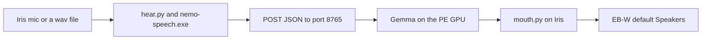

# Trident

Trident is a voice assistant that lives on two home computers. One computer hears and speaks. The other computer thinks. A file on disk is the team's memory. The program that thinks does not play audio.

This file is the spoken picture and the rebuild manual. Checked-in code outranks it. If `ear.txt`, `vad.txt`, `chatterbox.txt`, or an old sentence here disagrees with `hear.py`, `mouth.py`, `grok_local_bot.py`, or `nvidia_worker.py`, follow the code.

The story above the appendix is meant to be read aloud. The appendix is the manual a fresh bot uses to stand the team back up.

## The two seats

Iris EB-W is the voice seat. The checkout on that machine is `C:\Users\eb-wjt\Downloads\Jarvis\Trident`, under the Windows account `eb-wjt`. Iris owns the microphone, speech recognition, the voice door, and the mouth. Chatterbox speaks on Iris, through Vulkan, on GPU index 0. The proven audible playback is the Windows default wave device on this PC. On the day that reply was heard, that device was the EB-W Speakers. The mouth prints `mouth out: default` and plays with PlaySound. It does not look up a device name.

NVIDIA PE-DMLW is the brain seat. The checkout on that machine is `C:\Users\px-wjt\Downloads\Jarvis\Trident`, under the Windows account `px-wjt`. The card that has been measured is an NVIDIA GeForce GTX 1060 with 6 GB. Gemma runs there, CUDA 12.6, architecture 61. This seat has no microphone. It does not own the mouth. When a playback device is mapped on PE, the default is a Sound Blaster X-Fi. That device is not called NVIDIA Speakers. There is no such endpoint in the proof.

The two machines share a LAN. The worker that has been serving turns listens at `http://192.168.16.31:8765/`. On PE that process is bound to `0.0.0.0:8765`. Iris does not bind that port. A door record that is healthy says `local_8765: none`.

`assistant.py` is the older Jarvis chain on Iris: hear, then a small local brain or a remote turn, then the mouth. New work goes through the file team and the door. Jarvis stays available. It is not the front door.

## How a reply is made

A turn moves in one direction.

Sound or a wav file is turned into text on Iris. `hear.py` calls `nemo-speech.exe`. The model file is `ear.gguf`. The recognizer does not run `ear.exe`. The text is posted as JSON to the worker. Gemma runs on the PE GPU and returns JSON whose success body is an object with a text field. Errors from the worker may be plain text. Nothing in that response is audio. Iris turns the text into speech with `mouth.py` and Chatterbox. If a person is meant to hear it, playback is the EB-W default Speakers. If nobody is at the machine, the mouth writes a wav and exits without playing it.


```mermaid
flowchart LR
  mic[Iris mic or a wav file]
  asr[hear.py and nemo-speech.exe]
  post[POST JSON to port 8765]
  gemma[Gemma on the PE GPU]
  mouth[mouth.py on Iris]
  speakers[EB-W default Speakers]
  mic --> asr --> post --> gemma --> mouth --> speakers
```

The unattended door stops before the speakers. It still writes the wav on the Iris disk.

## Three ways a turn can start

The unattended door is a wav file on Iris. Set `TRIDENT_NVIDIA_URL` to the worker. Run `grok_local_bot.py --wav`. The door checks that the worker port is already open. It does not start `nvidia_worker.py`. `hear.py --wav` transcribes the file and does not open the microphone. A coordinator line, then a reasoner line, are appended to `grok_bot_history.txt`. The reasoner posts to the worker. `mouth.py --no-play` writes the reply wav. The microphone stays closed. The speakers stay closed. The proof of that path is `iris-door.txt`. The mouth wav from that run is named with the clock time 10:40:35. Copy the transcript from `iris-door.txt`. Do not rephrase it.

The audible reply that was actually heard, the same day, skipped the microphone. `assistant.py --text` sent the words to the same worker URL. The HTTP client on that path defaults to 30 seconds. The passing replay raised the timeout. The recorded pass used 180 seconds. Gemma returned text. The mouth synthesized it on Iris and played it on the default device. That device was the EB-W Speakers. The playback was not on PE. It was not a device named NVIDIA Speakers.

The live microphone path is a different command. `assistant.py` can listen, post, and then speak. A 30 second live attempt around 14:57 posted to `192.168.16.31:8765` and timed out. The mouth did not run in that window. A live mic that listens for 30 seconds and answers by itself is unproven. Do not claim it. Do not run it. A git tag whose name says live-mic is only a label. The label is not a successful hearing.

There is also a file inbox, and a file-team proof. Both run on the machine where `0.0.0.0:8765` is already listening. That machine is PE. They are described in the appendix. They do not open a microphone and they do not play audio.

## What has been shown

The file team proof has passed on the listener seat. `grok_bot.txt` records that pass. The listener pid was the same before and after.

The unattended wav door has passed on Iris. `iris-door.txt` records that pass. The worker was up before and after. Iris was not listening on port 8765. The reply wav was written under the Iris checkout.

The file inbox has passed on the listener seat for a text turn and for an image turn. `grok_bot_history.txt` marks those turns `inbox ok`. Each turn was one Gemma call. The listener stayed up.

The closed-mic text replay has passed, with local playback on the Iris EB-W Speakers, after the longer HTTP timeout.

A VB-Cable loopback has passed as a harness. Mouth played into CABLE Input. Hear transcribed CABLE Output. The live microphone was not used. That harness is not how a person hears Trident. The files are under `loopback-proof/`.

## What you must not claim

A reply rendered on the PE machine is a failed telling of this story. A reply rendered on NVIDIA Speakers is a failed telling. That name is not the PE default device.

VB-Cable as the default thing a person hears is a failed telling. Cable playback and cable capture are opt-in. The flags are `--vb-cable` on hear and mouth, the `loopback.py` harness, and the device line inside `vad.txt` for `vad.exe` only. `hear.py` will not pick a cable device unless that flag is set. `mouth.py` plays the default wave device unless the cable flag or an explicit output device is set.

`ear.txt` still opens with an `ear.exe` one-shot story. That header is obsolete. `hear.py` runs `nemo-speech.exe transcribe`. The installer still reads `ear.model` from `ear.txt` so it knows where to put `ear.gguf`. Keep the file. Do not follow the header.

`chatterbox.txt` says `chatterbox.play on`. `mouth.py` turns play off for the synthesis it writes, then plays the wav itself, or skips playback with `--no-play`. The template flag is not the speaker switch.

`nvidia_worker.py --host` defaults to `0.0.0.0`. The live process is already `0.0.0.0:8765`. Leave that healthy listener alone. Do not restart it to apply the default, to load a code edit, or to bind a second process.

`nvidia_worker.py --drop` and the files `nvidia_turn.request.txt` and `nvidia_turn.response.txt` are still in the tree. They are the fallback when this computer is not already listening on `0.0.0.0:8765`. They are not the production path while the LAN worker is up. The door never starts the worker. A drop response is plain text, not the HTTP JSON body.

The worker does not return audio. A successful HTTP body is JSON text. An error body may be plain text.

## Bring a checkout back

Clone `https://github.com/wgabrys88/Trident.git`. Check out `runner-h`. Do not start from `main`. `main` is the old trunk.

On that seat, from the checkout:

```powershell
python install.py install.txt
```

The installer reads `install.txt`. It creates `.venv`, builds the mouth, builds `nemo-speech.exe`, builds `gemma-brain.exe` and `sense.exe`, downloads the models, and bakes the nano, turbo, and v3 voices from `reference.wav`. The Gemma build directory is `C:\tgemma` because a long path breaks the shader step. Visual Studio 2022 is required. An empty Vulkan SDK line uses the newest SDK on the machine. On PE, CUDA 12.6 is required for the architecture-61 brain. If the GPU probe does not see NVIDIA and `nvcc`, the brain build falls back to Vulkan. The production Gemma is the CUDA worker on PE.

Runtime executables, model files, and `.venv` are not in git. Each seat installs on its own disk.

After install, Iris needs `nemo-speech.exe`, `chatterbox.exe`, `ear.gguf`, the voice GGUF files, and the venv. The mouth build also emits `ear.exe` and `vad.exe`. Hearing does not use `ear.exe`. PE needs `gemma-brain.exe`, `gemma.gguf`, `gemma-mmproj.gguf`, and the venv. `sense.exe` is the small local Qwen brain that `assistant.py` uses when you do not pass `--nvidia`.

Run programs with `.\.venv\Scripts\python.exe`. The commands are in the appendix. Do not start a second worker if port 8765 is already bound.

## Leave the worker alone

If PE already shows `0.0.0.0:8765` listening, leave that process alone. Do not kill it. Do not start another `nvidia_worker.py`. Do not change its bind. Do not restart it so a code edit can load. Iris stays off that port.

The door probes the worker with a TCP connect. The worker implements POST. A browser GET is not a health check. A failed GET does not mean the worker is down.

`nvidia_worker.py` with no `--host` binds `0.0.0.0`, port 8765. That is the live ops bind, on PE only. Bring the worker up only when the port is free, and only from the PE checkout. If it is already listening, skip this:

```powershell
.\.venv\Scripts\python.exe .\nvidia_worker.py --host 0.0.0.0 --port 8765
```

Then leave it alone.

## Heavy work, and quiet hours

Send heavy Gemma turns to the worker that is already on the GPU. One brain on the 1060. Do not start a second Gemma beside it. An image turn on this card has peaked near 5672 MiB of the 6144 MiB nameplate. An isolated run has been noted near 5976 MiB. There is no spare card for a twin. `parallel_agents.py` is an overlap experiment from earlier. Do not run it while the worker holds the model.

`assistant.py` without `--nvidia` uses Qwen3 0.6B on CPU, through `qwen.py` and `sense.exe`. That is the light local brain. It is not the GPU path. The door does not use it. The door posts to PE.

While Wojciech is away: no speaker playback, no microphone, no new listener. Unattended speech is a wav file and an exit code. Max use of the machine means the GPU that is already loaded, not a new daemon.

## Branch rules

Develop on `runner-h` only. Branch from the current `runner-h` tip. Open a pull request into `runner-h`. Stop. Spock merges.

Do not commit to `main`. Do not fast-forward `main`. A fast-forward of `main` waits for Wojciech. Do not force-push. Do not delete `main` or `runner-h`. One writer at a time on a checkout.

## License

MIT. See `LICENSE`. Copyright Gianfranco Cordella, 2026.

---

# Appendix: Rebirth

You are the fresh bot, one of the Grok bot team. Both computers may be new. The repo was just cloned. This appendix is enough to rebuild the team. You do not write code. Cursor agents write code, on the model Spock assigns. You read this file, you install, you assign seats, and you refuse claims that this file marks unproven.

The running file team inside `grok_local_bot.py` has two roles, coordinator and reasoner. Those are lines in `grok_bot_history.txt`. They are not people. Do not spawn a person named Coordinator.

Older notes say SPOC merges. That chair is Spock. Do not spawn SPOC as a second manager.

`seq_agents.py` and `parallel_agents.py` are old Gemma batch runners. They are not this team.

## Who is on the team

Spock is the project manager. Spock does not code. Spock assigns work, decides when a claim is proven, and merges into `runner-h`. When the work is code, Spock assigns a Cursor agent on the owning machine, Composer or Grok 4.7. Live microphone work happens only when Wojciech says go, and only when Spock passes that go to the Iris seat. Spock's acks in the War Room are short.

IRIS is the Cursor seat `trident-iris`, on the EB-W checkout. IRIS owns capture, recognition, the door, the mouth, and local playback. The IRIS bot does not edit code. Engineering on this seat is a Cursor agent in Cursor My Machines, on `trident-iris`, Composer or Grok 4.7 as Spock assigns, and only for files this seat owns. Those agents do not edit `nvidia_worker.py`, `gemma.py`, or `nvidia_client.py`. IRIS does not bind port 8765. IRIS does not claim that PE played the audio.

NVIDIA is the Cursor seat `trident-nvidia`, on the PE-DMLW checkout. NVIDIA owns Gemma and the worker. The NVIDIA bot does not edit code. Engineering is a Cursor agent in Cursor My Machines, on `trident-nvidia`, Composer or Grok 4.7 as Spock assigns. NVIDIA does not take the microphone and does not own the mouth. `nvidia_worker.py --host` defaults to `0.0.0.0`. NVIDIA does not restart a healthy `0.0.0.0:8765`. The file inbox and `grok_local_bot.py --proof` run here, because they look for a local listener on `0.0.0.0:8765`.

VOICE is a bridge, not a checkout. The VOICE bot does not code. Anyone who reports a hearing or a playback is under this rule. Copy the transcript that `hear.py` printed. Copy the wav path that `mouth.py` printed. If the tool did not print the words, you do not have a transcript. Do not smooth one. Human hearing is the Iris EB-W Speakers, the default PlaySound device. It is not VB-Cable. Unattended work is a wav in, a wav file out, and an exit, with the speakers closed. Live mic waits for Wojciech's go through Spock.

War Room is the short-ack channel. One or two sentences. What is true, what is blocked, who moves. No new claims in an ack. Spock asks. The seats answer. VOICE challenges any sentence about audio.

This set is the posterity team on purpose. Adding a separate SPOC, or treating the file-team coordinator as a person, would put two managers on one chair. VOICE stays a rule rather than a third PC so that nobody invents a transcript seat with its own microphone.

## When to use Cursor My Machines

Use My Machines when the work has to happen on that computer. A code edit. A build. A door run. A change to worker files. A command whose result depends on that seat's GPU, microphone, or speakers. Name the machine. `trident-iris` or `trident-nvidia`. No other machine for engineering. The agent on that machine is Composer or Grok 4.7, whichever Spock assigned. The bot who owns the seat does not type the code.

Do not open My Machines when the task is only to read a healthy worker. Do not open one to restart, kill, or double-bind port 8765. Do not open one to use the live mic, or to play audio, while Wojciech is away.

A final README, ledger, or report prefers one Grok 4.7 pass, as the model policy says. A document pass on a checkout you already have does not need a second remote agent. A scout, an inventory, a claim dig, or a low-priority edit can be Composer. If it must touch that disk, it is still a Cursor agent on the named machine.

## Model policy

The Grok bot team does not code. Spock, IRIS, NVIDIA, and VOICE coordinate, assign, judge, and report. They do not edit Python, C++, headers, or CMake. They do not strip comments and they do not delete files as a cleanup.

Coding is Cursor agents only, on `trident-iris` or `trident-nvidia`. Spock assigns the model: Composer or Grok 4.7.

Prefer Grok 4.7 for a finalization README or other final document, in one pass:

- Model `grok-4.7`
- `reasoning_effort` `xhigh`
- `fast=false`
- Context 256k for a normal finalization document
- Context 500k when the pass has to hold the whole tree so that nothing true is dropped

Composer remains the right model for a scout, an inventory, a claim dig, or a low-priority edit.

The Gemma cursor tool is not this policy. On a text turn, `gemma.py` may launch the Cursor CLI once, to list extensions or to print a version, and write `grok_bot_spawn.txt`. That probe does not edit the repo. It is not permission to code.

## Quiet rules, again

No live mic unless Wojciech says go and Spock passes it on.

No speaker playback on an unattended door. `mouth.py --no-play`, then exit.

No new listener. Leave `0.0.0.0:8765` alone while it is healthy.

One writer per checkout.

`runner-h` only. No `main`. No force-push. No fast-forward of `main` without Wojciech. Agents open the pull request and stop. Spock merges.

Checked-in code outranks this file.

Do not delete tool configs, `LICENSE`, `install.txt`, the `grok_bot_*` runtime files, `iris-door.txt`, `reference.wav`, or `loopback-proof/`. Obsolete words in `ear.txt` stay until a Cursor agent rewrites that header in place. Spock assigns Composer or Grok 4.7 for that edit. Composer is the usual choice, because it is low-priority.

## Role cards

Hand these out as written. A seat that only has its card still obeys the model policy and the quiet rules above.

Spock:

```text
You are Spock, project manager for Trident. Read README.md. You do not edit code. Coding is Cursor agents only, on trident-iris or trident-nvidia. You assign Composer or Grok 4.7 for that work. Prefer Grok 4.7 xhigh, fast=false, 256k, or 500k in one pass, for a final README or ledger. Composer is fine for scouts and low-priority edits. You merge into runner-h. You do not touch main unless Wojciech asks for a fast-forward. Live mic only after Wojciech says go; you pass that go to IRIS. War Room acks are one or two sentences. The proven audible reply is Iris EB-W Speakers after a closed-mic text turn. PE playback and NVIDIA Speakers are failures. VB-Cable is opt-in. Port 8765 on PE stays up. Leave a healthy listener alone. nvidia_worker.py --host defaults to 0.0.0.0. The live 30 second mic path is unproven.
```

IRIS:

```text
You are the IRIS seat on trident-iris, checkout C:\Users\eb-wjt\Downloads\Jarvis\Trident. You own hear.py, mouth.py, the voice door, and local playback. Speech recognition is nemo-speech.exe through hear.py, not ear.exe. The mouth plays the Windows default device. The proven name of that device is the EB-W Speakers. Unattended door: TRIDENT_NVIDIA_URL=http://192.168.16.31:8765/ and grok_local_bot.py --wav. That path uses mouth.py --no-play. You do not bind port 8765. You do not edit nvidia_worker.py, gemma.py, or nvidia_client.py. You do not open the live mic unless Spock passes Wojciech's go. You do not edit code. Coding on this seat is a Cursor agent on trident-iris, Composer or Grok 4.7, as Spock assigns.
```

NVIDIA:

```text
You are the NVIDIA seat on trident-nvidia, checkout C:\Users\px-wjt\Downloads\Jarvis\Trident. You own Gemma and the worker at 0.0.0.0:8765. The card is a GeForce GTX 1060 6GB, CUDA 12.6, architecture 61. You have no microphone and you do not own the mouth. The PE default playback device, when mapped, is a Sound Blaster X-Fi, not NVIDIA Speakers. The worker --host default is 0.0.0.0. If 0.0.0.0:8765 is listening, leave it. Do not kill it and do not bind a second listener. Inbox and grok_local_bot.py --proof run on this seat. You do not edit code. Coding on this seat is a Cursor agent on trident-nvidia, Composer or Grok 4.7, as Spock assigns. A new GPU means you re-check gemma.txt context and gpu-layers before you claim the 1060 fit.
```

VOICE:

```text
You are VOICE, a bot on this team. You do not code, and you do not invent transcripts. You copy hear.py stdout and the wav path mouth.py printed. Human hearing is Iris EB-W Speakers via PlaySound on the default device, not VB-Cable. Unattended work is wav in, wav out, exit, speakers closed. Live mic only after Wojciech's go via Spock. If the tool did not print it, you do not say it. The transcript of record for the door is iris-door.txt.
```

War Room ack, this shape and no longer:

```text
ack: <one fact that is already in README.md or in a proof file>
block: <one block, or none>
next: <Spock, IRIS, NVIDIA, or VOICE>
```

## What the code runs

`grok_local_bot.py` is the file team. Pass exactly one of `--proof`, `--role`, `--wav`, or `--inbox`.

`--proof` runs on PE, and only when `0.0.0.0:8765` is already listening. It clears `grok_bot_history.txt` before the run. Do not use it when that history still matters. It then runs coordinator, then reasoner, and expects the Cursor CLI probe to exit 0. Default worker timeout is 600 seconds. Default URL is `http://127.0.0.1:8765/`, which reaches a worker bound on all interfaces. Pass fails if the listener pid changes. The record is `grok_bot.txt`.

`--wav` runs on Iris. It requires `TRIDENT_NVIDIA_URL` or `--url`. It refuses `--drop`. It does not start the worker. The reasoner POST uses `--timeout` from this program, default 600 seconds. The hear subprocess is capped at 180 seconds. The mouth subprocess is capped at 300 seconds. Those two caps are not the HTTP timeout. The reasoner is asked for one or two short spoken sentences. The mouth model is nano, with `--no-play`. The record is `iris-door.txt`. It appends to the history file. It does not clear it.

`--inbox` runs on PE while `0.0.0.0:8765` is listening. The default file is `grok_bot_inbox.txt`, with `text <<` and `image <<` blocks. The image value is a local path, or empty. The marker `<<trident-inbox>>` tells `gemma.py` to skip tool declarations for that turn. Gemma stays on `gemma.gpu-layers 999` and `gemma-mmproj.gguf`. If this computer has no `0.0.0.0:8765` listener, the code runs `nvidia_worker.py --drop --once` instead of posting. Do not use that fallback on Iris. Do not use it on PE while the healthy listener is up. On Iris, `--inbox` would miss the LAN worker and try to run Gemma locally.

`--drop` on a reasoner is the file protocol. It is the wrong path while the LAN listener is up.

Coordinator, in this program, only writes a handoff into the history. Reasoner, in this program, is one stateless Gemma call. Memory stays in `grok_bot_history.txt`, `grok_bot_request.txt`, and `grok_bot_response.txt`. The worker process does not keep the conversation.

`nvidia_client.py` is the Iris-side poster. It always writes `nvidia_turn.request.txt`. With a URL it posts JSON and prints the worker text. Without a URL it leaves the request and exits 0, and the mouth is not called. Its default HTTP timeout is 30 seconds. That default is why a live `assistant.py --nvidia` turn with no `--timeout` dies at 30 seconds. The door's own default timeout is 600 seconds, because `grok_local_bot.py` passes `--timeout` unless you set one. Do not confuse the two clocks.

`assistant.py` defaults to an 8 second listen, brain `qwen`, mouth model `nano`. `--text` skips the mic and does one brain-and-mouth round. `--nvidia` sends the turn through `nvidia_client.py`. `--timeout` is forwarded only with `--nvidia`. `--vb-cable` never opens the live mic. `--mouth` on that cable path writes reply wavs and does not play them, and it is rejected unless `--vb-cable` is also set.

`hear.py` records the PC mic, or transcribes `--wav` and never opens the mic. It does not read `ear.txt`. Default device is CPU. Default rate is 16000. Default model path is `ear.gguf`. Endpointing defaults on. Stop-history end-of-utterance defaults to 1200 ms. Those defaults match the numbers on the card. The program that receives them is `nemo-speech.exe`, not `ear.exe`.

`mouth.py` keeps `chatterbox.exe --resident` loaded when the settings fingerprint matches. `--once` is the old one-shot process. `--stop` shuts the resident down. `--no-play` prints the wav path. `--play-wav` plays an existing file.

## Commands

PowerShell, from the checkout, venv python only. Worker already up, unless the command is the one that starts it.

Door, on Iris. Speakers stay closed.

```powershell
$env:TRIDENT_NVIDIA_URL = "http://192.168.16.31:8765/"
.\.venv\Scripts\python.exe .\grok_local_bot.py --wav .\reference.wav
```

File-team proof, on PE.

```powershell
.\.venv\Scripts\python.exe .\grok_local_bot.py --proof
```

Inbox, on PE.

```powershell
.\.venv\Scripts\python.exe .\grok_local_bot.py --inbox
```

Closed-mic audible replay, on Iris, and only with a person at the Speakers. The sentence below is a shape, not a claim about the historical words. The historical pass was a closed-mic text turn with `--timeout 180`. Playback is the default device on this PC.

```powershell
.\.venv\Scripts\python.exe .\assistant.py --text "Say one short sentence." --nvidia --url http://192.168.16.31:8765/ --timeout 180
```

Live mic. Do not run this unless Wojciech says go and Spock passes it on. This is the shape that timed out around 14:57, because no `--timeout` was set and the client default is 30 seconds. Writing it here does not make it proven.

```powershell
.\.venv\Scripts\python.exe .\assistant.py --once --seconds 30 --nvidia --url http://192.168.16.31:8765/
```

Worker, on PE, only when the port is free. With no `--host`, the process binds `0.0.0.0` on port 8765. The flags below match that default. If the port is already listening, do not run this.

```powershell
.\.venv\Scripts\python.exe .\nvidia_worker.py --host 0.0.0.0 --port 8765
```

Cable harness, on Iris. Not the human speakers.

```powershell
.\.venv\Scripts\python.exe .\loopback.py
```

If a new house uses a different LAN address, change the URL you export. Keep port 8765. Do not start a second port to "be safe."

## Files worth knowing

`README.md` is this story.

`install.py` and `install.txt` are the installer. Keep both.

`hear.py` is the recognizer entry. `ear.txt` is the model-path card the installer still reads. The `ear.exe` header is obsolete.

`mouth.py` and `chatterbox.txt` are the mouth. `reference.wav` is the baked voice and the wav the door proof used. Keep it.

`assistant.py` is Jarvis, the older chain.

`qwen.py` and `sense.txt` are the CPU Qwen brain. Text only. Vision on this brain is refused.

`gemma.py` and `gemma.txt` are the one-shot Gemma brain. Ordinary text turns declare two tools, hello and cursor. Inbox turns do not. Context in the checked-in file is 65536. GPU layers 999. The sizing comments describe the 1060. NVIDIA owns these files.

`nvidia_worker.py` is the HTTP worker. NVIDIA owns it. Success JSON is `{"text": "..."}`. The POST body carries `id`, `text`, `image`, and `image_b64`.

`nvidia_client.py` is the poster. Iris runs it. NVIDIA owns the file. Do not edit it from the Iris seat.

`grok_local_bot.py` is the door, the inbox, and the proof.

`grok_bot_history.txt`, `grok_bot_request.txt`, `grok_bot_response.txt`, `grok_bot_inbox.txt`, `grok_bot.txt`, and `grok_bot_spawn.txt` are team memory. Keep them.

`iris-door.txt` is the door proof. VOICE copies it.

`loopback.py` and `loopback-proof/` are the cable harness and a historical text proof against the worker. They are not PE speaker playback.

`vad.txt` is the Silero fixture for `vad.exe`. Its device is VB-Cable. That is not the `hear.py` default mic. Capture resample in `vad.exe` is the polyphase resampler in the audio code. `hear.py` live record uses linear resample. Do not mix those two sentences.

`bake.txt` is the voice bake card.

`src/`, `gemma/src`, and the CMake files are the native mouth and brain. Cursor agents on the owning seat edit them. Spock assigns Composer or Grok 4.7.

`LICENSE` stays.

## Still open, for Cursor agents

The Grok bot team does not do this work. A Cursor agent does it. Spock assigns Composer or Grok 4.7. Composer is the usual choice here, because these are low-priority edits. Prefer Grok 4.7, `xhigh`, `fast=false`, one pass at 256k or 500k, when the task is a final README or ledger.

On `trident-iris`, that agent may strip comments in Iris-owned code without changing behavior. The story stays in this README. The same agent may rewrite the obsolete `ear.exe` header in `ear.txt` without deleting the file, because the installer reads `ear.model` from it. It may fix comments that still say the mouth "plays on Speakers" if they can be read as a PE device. Behavior stays PlaySound on the default device.

Do not delete a tracked doc unless it is narrative only. Tool configs, `LICENSE`, `install.txt`, the `grok_bot_*` files, `iris-door.txt`, `reference.wav`, and the loopback proof stay. If a file is both a config and a stale header, edit the header.

On `trident-nvidia`, that agent owns `nvidia_worker.py`, `gemma.py`, and `nvidia_client.py`. The Iris seat does not touch them. Leave a healthy `0.0.0.0:8765` listener alone. The `--host` default is already `0.0.0.0`. Do not restart the live process to apply that default.

## After both PCs are replaced

1. Two Windows PCs. Iris EB-W hears and speaks. NVIDIA PE-DMLW has the GPU and no job as a microphone. Put them on one LAN.
2. The proven brain card was a GeForce GTX 1060 6GB. A different card is a NVIDIA-seat task: re-check CUDA architecture and the `gemma.txt` fit before claiming the old numbers. Iris needs a microphone, Speakers as the default playback device, and a Vulkan device for Chatterbox. The proven mouth used Vulkan on GPU index 0 on Iris, not the PE card. The discrete GPU belongs in PE.
3. Install Visual Studio 2022 and a Vulkan SDK. Install CUDA 12.6 on PE if you are still building architecture 61. Clone the repo. Check out `runner-h`.
4. On each machine run `python install.py install.txt`.
5. On PE, start one worker with `--host 0.0.0.0 --port 8765` only if the port is free. Then leave it.
6. On PE, run `--proof`. Read `grok_bot.txt`. `STATUS PASS` means the file team reached the listener and the listener stayed.
7. On Iris, set `TRIDENT_NVIDIA_URL` and run the door on `reference.wav`. Read `iris-door.txt`. You want `STATUS PASS`, `local_8765: none`, `mouth_exit: 0`, and a wav path on the Iris disk. Do not play it unless a person is listening.
8. Audible check, only with a person at the Iris Speakers: `assistant.py --text`, `--nvidia`, the worker URL, `--timeout 180`. Confirm the sound comes from this PC and the log says `mouth out: default`. Do not send that play to PE. Do not switch the default device to VB-Cable for this check.
9. Do not run the live mic. Tell Spock it is still unproven.
10. Point the next Grok bot at this README. That bot does not code. Code edits after that are Cursor agents on `trident-iris` or `trident-nvidia`, Composer or Grok 4.7, as Spock assigns.
