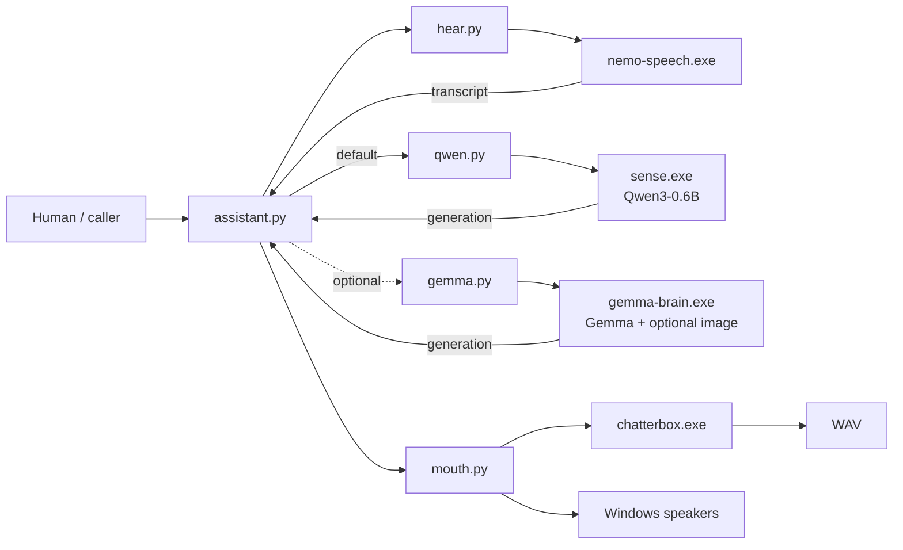
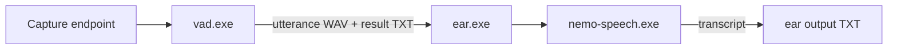
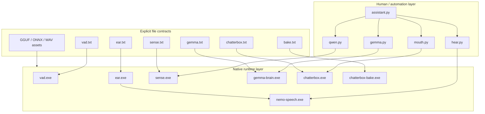
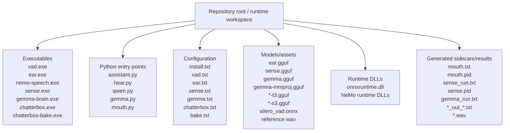
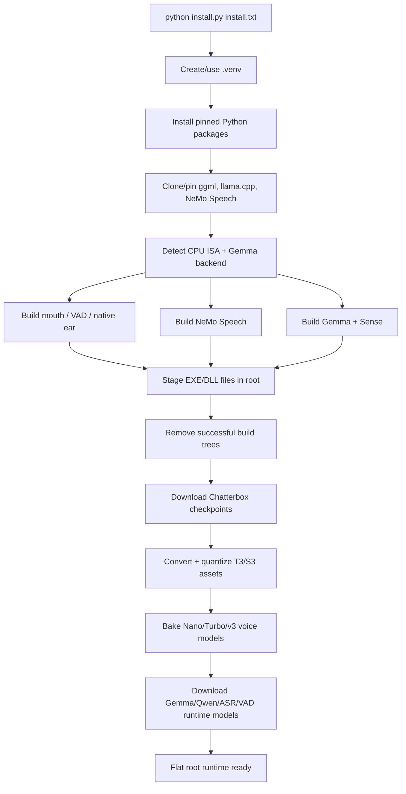
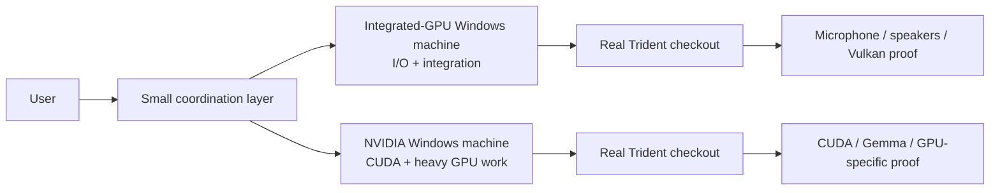
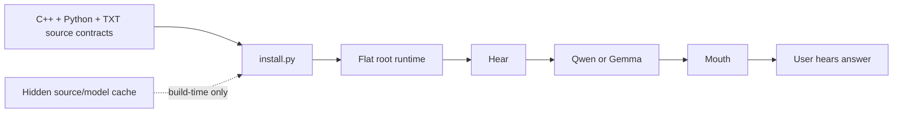

# Trident

**Local Windows voice-assistant runtime built from small native engines and thin Python entry points.**

Trident turns local microphone or text input into a local model response and local speech output. The project keeps the expensive model/runtime work in focused C++ executables, keeps their configuration explicit in text files, and uses small Python wrappers to make the native programs convenient for humans and automation.

The long-term goal is an immediate, modular assistant whose major engines can remain loaded and communicate through simple boundaries. Hear and Gemma still start a process per turn. Qwen stays loaded between sense turns, and Chatterbox stays loaded between mouth turns. `assistant.py` composes that path. The repository is Windows-first and is intended to be built and proven on the real machines that own the relevant audio/GPU hardware.

> **Source of truth:** the checked-in source and configuration files outrank this README. If code and documentation disagree, trace the code, fix the discrepancy, and update this file in the same coherent change.

---

## Contents

- [System at a glance](#system-at-a-glance)
- [Current architecture](#current-architecture)
- [Native programs](#native-programs)
- [Python entry points](#python-entry-points)
- [Root-flat runtime](#root-flat-runtime)
- [Installation](#installation)
- [Running Trident](#running-trident)
- [Configuration contracts](#configuration-contracts)
- [Audio and model flow](#audio-and-model-flow)
- [Repository layout](#repository-layout)
- [Two-machine development model](#two-machine-development-model)
- [Current state versus target state](#current-state-versus-target-state)
- [Rules for coding agents](#rules-for-coding-agents)
- [Change discipline](#change-discipline)
- [Troubleshooting](#troubleshooting)
- [Scratch: Iris transcript toward NVIDIA](#scratch-iris-transcript-toward-nvidia)
- [Scratch: NVIDIA worker on this seat](#scratch-nvidia-worker-on-this-seat)
- [Scratch: VB-Cable loopback on Iris](#scratch-vb-cable-loopback-on-iris)
- [Scratch: VB-Cable into NVIDIA](#scratch-vb-cable-into-nvidia)
- [License](#license)

---

## System at a glance

The working high-level path is:


```mermaid
flowchart LR
    U[Human / caller] --> A[assistant.py]
    A --> H[hear.py]
    H --> N[nemo-speech.exe]
    N -->|transcript| A

    A -->|default| Q[qwen.py]
    Q --> S[sense.exe<br/>Qwen3-0.6B]
    S -->|generation| A

    A -.->|optional| G[gemma.py]
    G --> B[gemma-brain.exe<br/>Gemma + optional image]
    B -->|generation| A

    A --> M[mouth.py]
    M --> C[chatterbox.exe]
    C --> W[WAV]
    M --> SP[Windows speakers]
```

The installer also builds native VAD and native ASR orchestration paths that are not currently used by `assistant.py`:


```mermaid
flowchart LR
    MIC[Capture endpoint] --> V[vad.exe]
    V -->|utterance WAV + result TXT| E[ear.exe]
    E --> NS[nemo-speech.exe]
    NS -->|transcript| OUT[ear output TXT]
```

The project intentionally does **not** require a server, database, message broker, or network protocol for its core local path.

---

## Current architecture

Trident has three layers:


```mermaid
flowchart TB
    subgraph UX[Human / automation layer]
        AS[assistant.py]
        HP[hear.py]
        QP[qwen.py]
        GP[gemma.py]
        MP[mouth.py]
    end

    subgraph Native[Native runtime layer]
        VAD[vad.exe]
        EAR[ear.exe]
        SENSE[sense.exe]
        GEMMA[gemma-brain.exe]
        CHAT[chatterbox.exe]
        BAKE[chatterbox-bake.exe]
        NEMO[nemo-speech.exe]
    end

    subgraph Data[Explicit file contracts]
        VT[vad.txt]
        ET[ear.txt]
        ST[sense.txt]
        GT[gemma.txt]
        CT[chatterbox.txt]
        BT[bake.txt]
        MODELS[GGUF / ONNX / WAV assets]
    end

    AS --> HP --> NEMO
    AS --> QP --> SENSE
    AS --> GP --> GEMMA
    AS --> MP --> CHAT

    VT --> VAD
    ET --> EAR --> NEMO
    ST --> SENSE
    GT --> GEMMA
    CT --> CHAT
    BT --> BAKE
    MODELS --> Native
```

### Design principles

1. **One native role, one executable.** Model/runtime responsibility stays narrow.
2. **One explicit settings file per native program.** Configuration is visible and inspectable.
3. **Thin Python wrappers.** Python makes native engines easy to invoke; it does not reimplement their inference cores.
4. **Simple boundaries.** Files, stdout, WAV files, and process execution are preferred over hidden service machinery.
5. **Local-first inference.** The installed assistant path is designed to run locally after required assets are present.
6. **Real-hardware proof.** Audio, Vulkan, CUDA, and Windows behavior must be tested where those capabilities actually exist.
7. **Current code before historical intent.** Old diagrams and bot workflows are context, not proof of implementation.

---

## Native programs

### `vad.exe` — voice activity detection

Source: `src/vad.cpp`

Configuration: `vad.txt`

Current behavior:

- opens the Windows capture endpoint named by `vad.device`;
- captures through WASAPI;
- resamples to the configured VAD rate using Trident audio code;
- evaluates Silero VAD through ONNX Runtime;
- waits for one completed utterance;
- writes the utterance as a WAV in the current working directory;
- writes a `*_vad_out_*.txt` file containing the WAV filename;
- exits.

It is a one-shot executable today. The historical always-open microphone/resident design remains future work.

### `ear.exe` — native ASR orchestration

Source: `src/ear.cpp`

Configuration: `ear.txt`

Current behavior:

- reads one input WAV path from settings;
- finds `nemo-speech.exe` beside `ear.exe`;
- invokes NeMo Speech with the configured model/options;
- captures recognizer stdout;
- writes the transcript unchanged to `*_ear_out_*.txt`;
- exits.

The executable-location lookup is intentional: keeping `ear.exe` and `nemo-speech.exe` together in the root runtime makes this path independent of a module subdirectory.

### `sense.exe` — Qwen text brain

Source: `gemma/src/sense.cpp`

Configuration: `sense.txt`

One-shot behavior (`sense.exe file.txt`):

- loads the Qwen model named by `sense.model`;
- takes the complete prompt from `sense.text`;
- runs text generation;
- writes the generation to `*_sense_out_*.txt`;
- exits.

Resident behavior (`sense.exe --resident file.txt`):

- loads that same settings file and the GGUF once;
- `qwen.py` writes `sense.pid` at spawn (`pid`, a sha256 of the loaded settings with `sense.text` removed, and `loading`); the process marks that file `ready` after the model loads;
- each `sense.prompt.txt` is one UTF-8 prompt: a decimal request id, a newline, then the text;
- a prompt with no newline, a non-decimal id, or a body over 1MB is answered with `err` and that id when the id can be read;
- writes `sense.response.txt` (`id`, then `ok` and the generation, or `err` and a message);
- leaves the process up until `sense.stop` appears, then deletes `sense.pid` and exits;
- does not reread settings between prompts.

The checked-in configuration currently uses Qwen3-0.6B as a CPU text model. A model or sampling change is a new process, because the resident keeps the settings it loaded at start.

### `gemma-brain.exe` — Gemma multimodal brain

Source: `gemma/src/brain.cpp`

Configuration: `gemma.txt`

Current behavior:

- loads the Gemma text model and multimodal projector;
- accepts the complete native prompt from `gemma.text`;
- accepts optional raw base64 image data from `gemma.image`;
- expects the prompt itself to contain the model media marker when an image is present;
- runs with the backend selected at install/build time;
- writes the generation to `*_gemma_out_*.txt`;
- exits.

The installer chooses the Gemma backend automatically unless configured otherwise: CUDA when the machine has NVIDIA hardware plus a usable CUDA compiler, otherwise Vulkan.

### `chatterbox.exe` — text-to-speech engine

Source: `src/chatterbox.cpp`

Configuration: `chatterbox.txt`

One-shot behavior (`chatterbox.exe file.txt`):

- selects `nano`, `turbo`, or `v3` from configuration;
- loads the matching baked T3/S3 GGUF pair;
- synthesizes `chatterbox.text` using the supplied language tag;
- writes a root-level WAV plus a `*_chatterbox_out_*.txt` file naming that WAV;
- optionally plays the WAV natively when `chatterbox.play on`;
- exits.

Resident behavior (`chatterbox.exe --resident file.txt`):

- loads that same settings file and the GGUF pair once;
- `mouth.py` writes `mouth.pid` at spawn (`pid`, variant, language, a sha256 of the loaded settings with `chatterbox.text` removed, and `loading`); the process marks that file `ready` after the model loads;
- each `mouth.prompt.txt` is one UTF-8 phrase: a decimal request id, a newline, then the text;
- a prompt with no newline, a non-decimal id, or a body over 1MB is answered with `err` and that id when the id can be read;
- writes the same WAV and `*_chatterbox_out_*.txt`, then `mouth.response.txt` (`id`, then `ok <wav-name>` or `err <message>`);
- leaves the process up until `mouth.stop` appears, then deletes `mouth.pid` and exits;
- does not reread settings between phrases.

`mouth.py` sets native playback off and plays the WAV itself. A model, language, or other settings change is a new process, because the resident keeps the settings it loaded at start.

### `chatterbox-bake.exe` — voice preparation utility

Source: `src/bake.cpp`

Configuration: `bake.txt`

This is an installation/preparation program, not one of the intended five assistant residents. It bakes reusable voice conditioning into the model files derived from `reference.wav`.

### `nemo-speech.exe` — external ASR runtime

This executable is built from the pinned NeMo Speech source by `install.py`. It is not authored by this repository, but it is a required installed runtime for both `hear.py` and `ear.exe`.

---

## Python entry points

### `hear.py`

Records the normal PC microphone for a requested number of seconds, writes a temporary WAV, runs `nemo-speech.exe transcribe`, prints the transcript, and removes the temporary recording directory.

Typical use:

```powershell
.\.venv\Scripts\python.exe .\hear.py 8
```

Useful options include microphone selection, language, sample rate, endpointing, verbatim mode, punctuation control, and streaming mode. Run `--help` for the exact current CLI.

### `qwen.py`

Human/agent-friendly wrapper around `sense.exe`.

```powershell
.\.venv\Scripts\python.exe .\qwen.py "Explain the difference between RAM and VRAM."
.\.venv\Scripts\python.exe .\qwen.py --once "Explain the difference between RAM and VRAM."
.\.venv\Scripts\python.exe .\qwen.py --stop
```

By default the wrapper starts or reuses one resident `sense.exe`. `--once` is the old one-shot process. `--stop` asks the resident to exit.

The wrapper:

- reads the canonical `sense.txt`;
- replaces only the runtime prompt field in `sense_run.txt`;
- appends `/no_think` to the user turn unless the question already contains `/think` or `/no_think`, so a short spoken answer is not consumed by an open think block;
- in resident mode, sends that same prompt through `sense.prompt.txt` and prints the generation from `sense.response.txt`;
- in `--once` mode, invokes `sense.exe` in the repository root and prints the newly produced sense output file.

The current Qwen model is text-only. Image input is rejected explicitly.

### Resident sense

`sense.exe` is the resident process. `qwen.py` is the client. Hear, Gemma, VAD, and ear stay one-shot.

Start. The first normal `qwen.py` call writes `sense_run.txt` from `sense.txt` (the canonical model and sampling lines, with empty `sense.text`) and starts `sense.exe --resident sense_run.txt` in the repository root. It writes `sense.pid` immediately (`pid`, a sha256 of those settings excluding `sense.text`, and `loading`) while the model is still loading. The process loads Qwen once, then marks that pid file `ready`. A later `qwen.py` or `assistant.py` turn reuses it when `sense.pid` is still that executable and the stored fingerprint matches the settings that would be loaded now. Context, threads, batch, gpu-layers, the GGUF path, `n-predict`, temperature, top-k, top-p, and the other loaded lines are part of that hash. A mismatch stops the old pid and starts another. Rewriting `sense_run.txt` after spawn, including `qwen.py --once`, does not by itself make the running process match. `qwen.py --stop` terminates a loader that is not ready yet, and asks a ready resident to finish the prompt it already read and then exit. If the loader never becomes ready, that wait kills it. One `sense.lock` file lets only one loader start. Settings are loaded only at process start.

Text. `qwen.py` writes one `sense.prompt.txt` and waits until `sense.response.txt` carries the same request id. The prompt body is the same string one-shot mode stores in `sense.text`. The resident clears the context and answers that prompt only. It does not write `*_sense_out_*.txt`. One sense client at a time: two overlapping `qwen.py` processes would share that slot.

`assistant.py` still launches `qwen.py` once per turn. It does not own the sense lifetime. The resident survives `qwen.py` exiting. `--once` does not attach to it.

Proof, Iris Xe (i5-1145G7), 2026-09-27 20:24 +02, question `Say one short sentence.`:

| Run | Wall | Sense |
|---|---|---|
| `qwen.py --once` | 1574 ms | process exits; no `sense.pid` |
| `qwen.py --once` while a resident is up | 1508 ms | pid 10788 unchanged |
| first resident turn | 1349 ms | pid 10788, started 20:24:31.236, `resident load` 796 ms, `resident generate` 306 ms |
| second resident turn | 503 ms | same pid and start time, `resident generate` 351 ms |
| third resident turn | 468 ms | same pid, `resident generate` 355 ms |

`sense.run.err` for pid 10788 had one llama threadpool init, one `resident load`, one `resident ready pid 10788`, and one `resident generate` per turn. The second turn was 846 ms shorter; that process logged `resident load` 796 ms once. An earlier one-shot measurement on `70a14509` was about 1.36–1.39 s wall with about 0.8 s of that in process load.

`assistant.py --text "Say one short sentence."` stayed on pid 10788 (`resident generate` went from 5 to 6, still one load). The first call left `<think>` unclosed, so assistant reported no speakable answer and did not call mouth. The next call on the same pid closed the tag, logged `assistant: mouth 1 chunk(s)`, started chatterbox pid 5264, and wrote `20-25-47-044_chatterbox_out_000.wav` (197804 bytes). That sense turn's `resident generate` was 361 ms. Mouth logged `resident ready pid 5264 nano en` and `resident speak` 2242 ms. `mouth.py --stop` then logged `resident stop pid 5264`.

Review-fix proof, same machine, 2026-09-27 20:26 +02:

| Check | Result |
|---|---|
| prompt with no newline | 41 ms, `err bad prompt`, pid 10788 stayed |
| non-decimal id | 44 ms, `err bad prompt id`, same pid |
| empty body | 41 ms, `err empty`, same pid |
| body over 1MB | 42 ms, `err prompt too long`, same pid |
| `sense.temp` 0.7 to 0.71 | `settings changed`; pid 10788 replaced by pid 9144 |
| temp restored to 0.7 | `settings changed`; pid 2900 with the original fingerprint |
| `qwen.py --stop` | 302 ms; `resident stop pid 2900`; process and `sense.pid` gone |
| `qwen.py --stop` during load | pid 7704 was `loading` at 95 ms; stop returned in 140 ms; loader exited 1 before `resident ready`; no `sense.pid` remained |

### `gemma.py`

Human/agent-friendly one-shot wrapper around `gemma-brain.exe`.

Text:

```powershell
.\.venv\Scripts\python.exe .\gemma.py "Give a one-sentence summary of Trident."
```

Text plus image:

```powershell
.\.venv\Scripts\python.exe .\gemma.py "Describe this image." --image .\image.png
```

The wrapper base64-encodes the image, constructs the Gemma-native turn form already expected by the C++ executable, writes `gemma_run.txt`, runs the native brain, and prints the newly produced generation.

Text turns also declare one Gemma 4 tool, `hello`. If the generation contains `<|tool_call>call:hello{...}<tool_call|>`, `gemma.py` writes that line to `tool_hello.txt` and runs `gemma-brain.exe` once more with the tool result so the spoken answer can follow. Image turns keep the previous prompt.

### `mouth.py`

Human/agent-friendly TTS wrapper around `chatterbox.exe`.

```powershell
.\.venv\Scripts\python.exe .\mouth.py "Hello from Trident."
.\.venv\Scripts\python.exe .\mouth.py --model v3 --lang pl "Dzień dobry."
```

It can accept multiple already-chunked text arguments. It synthesizes one chunk while the previous chunk is playing, using a single playback worker so speech remains ordered.

By default the wrapper starts or reuses one resident `chatterbox.exe`. `--once` is the old one-shot process. `--stop` asks the resident to exit.

```powershell
.\.venv\Scripts\python.exe .\mouth.py --stop
.\.venv\Scripts\python.exe .\mouth.py --once "Hello once."
```

Current default language behavior:

- `nano`: English when `--lang` is omitted;
- `turbo`: English when `--lang` is omitted;
- `v3`: Polish when `--lang` is omitted.

### Resident mouth

`chatterbox.exe` is the resident process. `mouth.py` is the client. Hear, Gemma, VAD, and ear stay one-shot. Qwen is resident through `sense.exe`.

Start. The first normal `mouth.py` call writes `mouth.txt` from `chatterbox.txt` (requested model, language, `chatterbox.play off`, empty text) and starts `chatterbox.exe --resident mouth.txt` in the repository root. It writes `mouth.pid` immediately, with a sha256 of those settings excluding the phrase text, while the model is still loading. The process loads the voice and Vulkan once, then marks that pid file `ready`. A later `mouth.py` or `assistant.py` turn reuses it when `mouth.pid` is still that executable and the stored fingerprint matches the settings that would be loaded now. Sample rate, gpu, seed, exaggeration, GGUF paths, and the other loaded lines are part of that hash. A mismatch stops the old pid and starts another. Rewriting `mouth.txt` after spawn, including `mouth.py --once`, does not by itself make the running process match. `mouth.py --stop` terminates a loader that is not ready yet, and asks a ready resident to finish the phrase it already read and then exit. If the loader never becomes ready, that wait kills it. One `mouth.lock` file lets only one loader start. Settings are loaded only at process start.

Text. `mouth.py` writes one `mouth.prompt.txt` and waits until `mouth.response.txt` carries the same request id. Chunk N+1 is sent only after chunk N's wav name comes back, so chunks stay ordered. Playback of N overlaps synthesis of N+1. The server polls the slot about every 20 ms; that wait is not a second process. One mouth client at a time: two overlapping `mouth.py` processes would share that slot.

`assistant.py` still launches `mouth.py` once per turn. It does not own the chatterbox lifetime. The resident survives `mouth.py` exiting. `--once` does not attach to it. It runs that one-shot exe in a private directory and moves the wav back, so a resident output written in the same moment is not selected.

Proof, Iris Xe (i5-1145G7), 2026-09-27 18:29 +02, phrase `Say one short sentence.`:

| Run | Wall | Chatterbox |
|---|---|---|
| `mouth.py --once` | 4842 ms | process exits; no `mouth.pid` |
| first resident turn | 4239 ms | pid 6712, started 18:29:36.592, `resident speak` 1424 ms |
| second resident turn | 3580 ms | same pid and start time, `resident speak` 1467 ms |

`mouth.run.err` has one Vulkan device line and one `resident ready pid 6712`. Both wavs are 78764 bytes (~1.64 s), so the 659 ms wall-clock drop is the load the second turn skips. A two-chunk call and `assistant.py --text` stayed on pid 6712. `mouth.py --stop` then logged `resident stop pid 6712` and the process and `mouth.pid` were gone. An earlier one-shot measurement on `70a14509` was 3432–3476 ms for a shorter clip (~0.9 s of audio).

Review-fix proof, same machine, 2026-09-27 19:26 +02, after the fingerprint and loader changes, phrase `Say one short sentence.`:

| Run | Wall | Chatterbox |
|---|---|---|
| first resident turn | 4679 ms | pid 3548, `resident speak` 1424 ms |
| second resident turn | 3642 ms | same pid, one `resident ready`, `resident speak` 1467 ms |

`mouth.py --stop` during load saw pid 4896 with state `loading`, returned in 206 ms, and the loader exited 1 before `resident ready`. No `chatterbox.exe` and no `mouth.pid` remained. With the resident on pid 328, changing `chatterbox.exaggeration` from 0.5 to 0.55 and running `mouth.py --once` left that pid in place; the next normal call logged `settings changed` and started pid 10404. A bad id, a prompt with no newline, and a prompt over 1MB were answered in 50 ms, 44 ms, and 45 ms. A resident phrase and a `--once` phrase that overlapped wrote different wavs (138284 bytes and 69164 bytes).

### `assistant.py`

The current high-level assistant composition layer.

Microphone loop:

```powershell
.\.venv\Scripts\python.exe .\assistant.py
```

One microphone turn:

```powershell
.\.venv\Scripts\python.exe .\assistant.py --once
```

Text-only turn:

```powershell
.\.venv\Scripts\python.exe .\assistant.py --text "What is Trident?"
```

Gemma image turn:

```powershell
.\.venv\Scripts\python.exe .\assistant.py --brain gemma --text "Describe this." --image .\image.png
```

The current default brain is Qwen. The current default mouth model is Nano. Each assistant turn still starts hear, then the brain, then mouth. Qwen reuses the resident `sense.exe`. Mouth reuses the resident Chatterbox. Gemma still starts a process per turn.

`assistant.py` also removes known model-control/thought markers before speech and chunks long responses at natural boundaries. Current approximate chunk limits are 65 words for English and 55 for Polish, with lower preferred split floors of 50 and 45 words respectively.

---

## Root-flat runtime

The **installed runtime surface is intentionally flat**.

After a successful installation, the files a human, wrapper, or native executable needs to launch normal work are in the repository root. There is no Gemma runtime folder, Qwen runtime folder, Mouth runtime folder, or Ear runtime folder.


```mermaid
flowchart TB
    ROOT[Repository root / runtime workspace]

    ROOT --> EXE[Executables<br/>vad.exe<br/>ear.exe<br/>nemo-speech.exe<br/>sense.exe<br/>gemma-brain.exe<br/>chatterbox.exe<br/>chatterbox-bake.exe]
    ROOT --> PY[Python entry points<br/>assistant.py<br/>hear.py<br/>qwen.py<br/>gemma.py<br/>mouth.py]
    ROOT --> CFG[Configuration<br/>install.txt<br/>vad.txt<br/>ear.txt<br/>sense.txt<br/>gemma.txt<br/>chatterbox.txt<br/>bake.txt]
    ROOT --> MODEL[Models/assets<br/>ear.gguf<br/>sense.gguf<br/>gemma.gguf<br/>gemma-mmproj.gguf<br/>*-t3.gguf<br/>*-s3.gguf<br/>silero_vad.onnx<br/>reference.wav]
    ROOT --> DLL[Runtime DLLs<br/>onnxruntime.dll<br/>NeMo runtime DLLs]
    ROOT --> RUN[Generated sidecars/results<br/>mouth.txt<br/>mouth.pid<br/>sense_run.txt<br/>sense.pid<br/>gemma_run.txt<br/>*_out_*.txt<br/>*.wav]
```

### Expected model filenames

The current checked-in settings/install contract stages these model assets in the root:

```text
silero_vad.onnx
ear.gguf
sense.gguf
gemma.gguf
gemma-mmproj.gguf
nano-t3.gguf
nano-s3.gguf
turbo-t3.gguf
turbo-s3.gguf
v3-t3.gguf
v3-s3.gguf
```

### Flat-runtime invariant

A change should preserve these rules unless the architecture is deliberately changed:

- final executables are staged in the repository root;
- final runtime DLLs are staged in the repository root;
- downloaded runtime models named by the checked-in settings files are stored in the repository root;
- baked Chatterbox model files are stored in the repository root;
- Python wrappers resolve their native executables from the repository root;
- generated wrapper sidecars and native result files are root-level and ignored by Git;
- native configuration paths remain relative to the settings file that contains them.

### What may still be a directory

“Root-flat runtime” does **not** mean flattening source code or corrupting build-system requirements.

The repository still contains source directories such as `src/`, `gemma/`, and `scripts/`. The installer also maintains hidden implementation state:

```text
.venv/          Python environment used by installation and wrappers
.install/src/   pinned third-party source checkouts
.install/cache/ downloaded checkpoints, converted GGUF cache, stamps
```

CMake/NeMo build directories are temporary. They are removed after their required runtime files have been staged successfully in the root. Gemma retains the short `C:\tgemma` build path during compilation because the Vulkan shader build historically failed on long paths, but that directory is no longer part of the post-install workspace.

The checked-in `gemma/` directory is **source code**, not the installed Gemma runtime.

---

## Installation

### Target environment

The installer targets Windows x64 and is configured around:

- Python;
- Git;
- CMake;
- Visual Studio 2022 C/C++ toolchain;
- Vulkan SDK;
- optional NVIDIA CUDA 12.6 path for the current CUDA configuration;
- internet access while downloading pinned third-party sources and model assets.

Review `install.txt` before running on a machine with different toolchain locations or backend requirements.

### Install command

From the repository root:

```powershell
python .\install.py .\install.txt
```

The installer creates `.venv` and re-executes itself inside that environment. Its pinned Python package set includes the conversion dependencies plus `sounddevice`, which `hear.py` uses for microphone capture.

### Install pipeline


```mermaid
flowchart TD
    I[python install.py install.txt] --> VENV[Create/use .venv]
    VENV --> PIP[Install pinned Python packages]
    PIP --> SRC[Clone/pin ggml, llama.cpp, NeMo Speech]
    SRC --> DETECT[Detect CPU ISA + Gemma backend]

    DETECT --> MB[Build mouth / VAD / native ear]
    DETECT --> EB[Build NeMo Speech]
    DETECT --> GB[Build Gemma + Sense]

    MB --> STAGE[Stage EXE/DLL files in root]
    EB --> STAGE
    GB --> STAGE

    STAGE --> CLEAN[Remove successful build trees]
    CLEAN --> CKPT[Download Chatterbox checkpoints]
    CKPT --> CONVERT[Convert + quantize T3/S3 assets]
    CONVERT --> BAKE[Bake Nano/Turbo/v3 voice models]
    BAKE --> MODELS[Download Gemma/Qwen/ASR/VAD runtime models]
    MODELS --> READY[Flat root runtime ready]
```

### Build cache behavior

The installer keeps input stamps and reusable source/model caches under `.install`. A native target can therefore be skipped when its input contract is unchanged and its staged root runtime files still exist, even though the large intermediate build tree was removed after the previous successful install.

For NeMo Speech, the installer records the root-level EXE/DLL runtime manifest in its stamp so the build can be skipped only when the files copied by the previous successful build are still present.

---

## Running Trident

### Full local assistant

```powershell
.\.venv\Scripts\python.exe .\assistant.py
```

Flow:

```text
microphone
  -> hear.py
  -> nemo-speech.exe
  -> transcript
  -> qwen.py / sense.exe            [default]
     or gemma.py / gemma-brain.exe  [optional]
  -> model generation
  -> assistant speech cleanup/chunking
  -> mouth.py
  -> chatterbox.exe
  -> Windows speakers
```

### Direct native programs

Each Trident-authored native executable takes one settings file. `sense.exe` and `chatterbox.exe` also accept `--resident` in front of that file:

```powershell
.\vad.exe .\vad.txt
.\ear.exe .\ear.txt
.\sense.exe .\sense.txt
.\sense.exe --resident .\sense_run.txt
.\gemma-brain.exe .\gemma.txt
.\chatterbox.exe .\chatterbox.txt
.\chatterbox.exe --resident .\mouth.txt
.\chatterbox-bake.exe .\bake.txt
```

`nemo-speech.exe` is external and uses its own command-line interface.

### Direct wrappers

```powershell
.\.venv\Scripts\python.exe .\hear.py 8
.\.venv\Scripts\python.exe .\qwen.py "Question"
.\.venv\Scripts\python.exe .\qwen.py --stop
.\.venv\Scripts\python.exe .\gemma.py "Question"
.\.venv\Scripts\python.exe .\mouth.py "Text to speak"
```

Use `--help` on the Python entry points instead of relying on an old command example.

---

## Configuration contracts

The checked-in configuration files are part of the executable interface:

| File | Owner | Purpose |
|---|---|---|
| `install.txt` | `install.py` | source pins, build options, download URLs, conversion settings |
| `vad.txt` | `vad.exe` | capture device, VAD model, thresholds/timing |
| `ear.txt` | `ear.exe` | ASR model, input WAV, NeMo transcription options |
| `sense.txt` | `sense.exe` | Qwen model and generation parameters |
| `gemma.txt` | `gemma-brain.exe` | Gemma model/projector and generation parameters |
| `chatterbox.txt` | `chatterbox.exe` | voice model pairs, synthesis parameters, text/language |
| `bake.txt` | `chatterbox-bake.exe` | reference voice and bake parameters |

The common native settings reader lives in `src/common/config.h`.

Important semantics:

- a native Trident executable receives one settings filename (`sense.exe --resident` and `chatterbox.exe --resident` are the same file, plus that mode flag);
- normal entries are `key value`;
- multiline values use `key <<` followed by content and a line containing only `<<`;
- UTF-8 BOM is tolerated;
- required keys fail when missing;
- paths read through `cfg_path` are resolved relative to the settings-file directory;
- boolean-style values are literal `on` or `off`;
- native output names are reserved without overwriting an existing result file.

Treat a configuration-key rename as an API change. Trace every reader and update the matching template in the same commit.

---

## Audio and model flow

### Hearing path used by `assistant.py`

`assistant.py` currently uses fixed-duration `hear.py`, not native `vad.exe` + `ear.exe`.

```mermaid
sequenceDiagram
    participant U as User
    participant A as assistant.py
    participant H as hear.py
    participant N as nemo-speech.exe
    participant B as Qwen/Gemma wrapper
    participant X as Native brain
    participant M as mouth.py
    participant C as chatterbox.exe
    participant S as Speakers

    A->>H: listen for N seconds
    H->>U: record microphone
    H->>N: transcribe temporary WAV
    N-->>H: transcript
    H-->>A: stdout transcript
    A->>B: question
    B->>X: prompt or settings sidecar
    X-->>B: generation
    B-->>A: generation
    A->>A: strip control/thought markers + chunk
    A->>M: speech chunks
    M->>C: synthesize chunk
    C-->>M: WAV filename
    M->>S: play WAV
    Note over M,C: playback of current chunk can overlap synthesis of next chunk
    Note over B,X: sense.exe stays loaded across qwen.py turns; gemma-brain.exe still exits
    Note over C: chatterbox.exe stays loaded across mouth.py turns
```

### Native VAD/ear path

The lower-level native path is already present but is not wired into the current assistant orchestrator:

```text
vad.exe -> utterance WAV -> ear.exe -> nemo-speech.exe -> transcript TXT
```

A future resident assistant may build on this path, but current one-shot behavior must not be documented as a daemon.

---

## Repository layout

Tracked source is intentionally small:

```text
Trident/
├─ README.md
├─ LICENSE
├─ CMakeLists.txt
├─ install.py
├─ install.txt
├─ assistant.py
├─ hear.py
├─ qwen.py
├─ gemma.py
├─ mouth.py
├─ nvidia_client.py
├─ vad.txt
├─ ear.txt
├─ sense.txt
├─ gemma.txt
├─ chatterbox.txt
├─ bake.txt
├─ reference.wav
├─ utf8.manifest
├─ src/
│  ├─ vad.cpp
│  ├─ ear.cpp
│  ├─ chatterbox.cpp
│  ├─ bake.cpp
│  ├─ common/
│  ├─ gpt2/
│  └─ llama/
├─ gemma/
│  ├─ CMakeLists.txt
│  ├─ cmake/HostCpu.cmake
│  ├─ scripts/detect_cpu.ps1
│  ├─ scripts/detect_gpu.ps1
│  └─ src/
│     ├─ brain.cpp
│     └─ sense.cpp
└─ scripts/
   ├─ convert_t3.py
   ├─ convert_s3.py
   ├─ quant.py
   ├─ quant_t3.json
   └─ quant_s3.json
```

The conversion/quantization scripts are build dependencies. They are not runtime bloat merely because they are absent from the normal inference loop.

---

## Two-machine development model

Trident is designed to be worked on with two real Windows machines when useful:


```mermaid
flowchart LR
    USER[User] --> COORD[Small coordination layer]
    COORD --> IRIS[Integrated-GPU Windows machine<br/>I/O + integration]
    COORD --> NV[NVIDIA Windows machine<br/>CUDA + heavy GPU work]

    IRIS --> REPO1[Real Trident checkout]
    NV --> REPO2[Real Trident checkout]

    REPO1 --> AUDIO[Microphone / speakers / Vulkan proof]
    REPO2 --> CUDA[CUDA / Gemma / GPU-specific proof]
```

Conceptual roles:

### Integrated-GPU machine (“Iris” in historical notes)

- primary integration checkout;
- microphone and speaker proof;
- normal user-facing assistant verification;
- Qwen CPU path;
- Vulkan/integrated-GPU work where applicable.

### NVIDIA machine

- CUDA-specific Gemma work;
- heavier GPU debugging/profiling;
- independent reproduction or read-only review when useful.

Exact machine names, IP addresses, usernames, GPU models, and checkout paths are environment facts. Detect them from the current machines; do not hard-code old values into Trident.

For development automation, the important boundary is not the brand of coordinator. Nontrivial source reasoning, edits, builds, and hardware tests should execute against the real checkout on the real target machine when correctness depends on that environment.

### Grok Bot / Cursor operating preference

When Grok Bot is used as the coordination layer, keep its permanent role set small and its token use low. It should route work, maintain concise state, and perform only narrow local actions that genuinely belong at that layer. Source reading, refactoring, building, debugging, and hardware validation belong to Cursor-style coding agents operating on the real Trident checkout.

Recommended operating pattern:

- one primary coordinator/SPOC rather than many overlapping permanent coding bots;
- direct local Ear/Mouth actions only when a bot actually needs to hear or speak;
- spawn task-specific Cursor workers on the integrated-GPU machine or NVIDIA machine as required;
- use temporary multi-agent/war-room discussion only for decisions that genuinely benefit from it;
- do not spend Grok context repeatedly reading the repository when a coding agent can inspect the checkout directly;
- do not silently substitute a hosted/managed development VM when the task requires the physical Windows/audio/GPU environment;
- hand back compact evidence: changed files, build/run results, commit, and any unresolved hardware proof.

This is an operations preference, not a Trident runtime dependency. Trident must remain runnable without Grok Bot or Cursor.

---

## Current state versus target state

### Current, implemented

- one-shot native executables, except resident Sense between qwen turns and resident Chatterbox between mouth turns;
- one settings file per native executable;
- root-level runtime artifacts;
- fixed-duration Python microphone capture for `assistant.py`;
- local NeMo speech recognition;
- Qwen text brain;
- Gemma text/image brain;
- Nano/Turbo/v3 Chatterbox TTS;
- Python response cleanup and speech chunking;
- overlapping TTS synthesis/playback scheduling;
- one resident `sense.exe` serving later `qwen.py` turns through `sense.prompt.txt` / `sense.response.txt`;
- one resident `chatterbox.exe` serving later `mouth.py` turns through `mouth.prompt.txt` / `mouth.response.txt`;
- native VAD and native ear executable paths available separately;
- installer-driven dependency/model/build preparation.

### Future direction, not current behavior

Historical work explored or proposed:

- resident vad, ear, and gemma (Sense and Chatterbox mouth are already resident);
- always-open native VAD feeding native ASR automatically;
- keeping Gemma weights loaded between turns;
- transparent LAN placement/offload across the two PCs;
- a device-router API;
- multilingual automatic speech-chunk language detection;
- desktop visual grounding/control loops;
- richer persistent assistant memory/persona services.

Do not claim these features exist because an old diagram or commit message described them. Implement them only as explicit future changes with code and proof.

### Intended resident set

The historical five-resident target is:

```text
vad.exe
  -> ear.exe
  -> sense.exe and/or gemma-brain.exe
  -> chatterbox.exe
```

`sense.exe` and `chatterbox.exe` are resident today. `vad.exe`, `ear.exe`, and `gemma-brain.exe` are still one-shot. `chatterbox-bake.exe` remains a preparation utility, and `nemo-speech.exe` remains the underlying external recognizer runtime.

---

## Rules for coding agents

This README is intended to be sufficient context for a new coding agent to begin safely.

### Start here

1. Read `README.md`.
2. Run `git status --short --branch` and `git log -5 --oneline --decorate`.
3. Inspect the actual files involved in the task before proposing edits.
4. Trace callers, callees, configuration keys, generated files, and build targets.
5. Use Git history only when current intent is ambiguous.
6. Keep implementation proof on the real Windows hardware when the task depends on Windows/audio/Vulkan/CUDA behavior.

### Architecture rules

- Keep native roles narrow.
- Do not duplicate a native model engine in Python.
- Keep wrappers thin and explicit.
- Preserve one-settings-file native contracts unless a task intentionally redesigns them.
- Preserve root-flat runtime placement unless a task explicitly changes the deployment model.
- Do not introduce a database, service bus, daemon framework, web server, or network protocol without a concrete requirement.
- Do not turn future historical diagrams into current assumptions.
- Prefer deletion/simplification over parallel abstractions when equivalent behavior already exists.

### Path rules

- Runtime executables and required runtime assets belong in the repository root.
- `gemma/` is source, not the destination for installed Gemma artifacts.
- Python wrappers resolve sibling runtime files from their own repository root.
- C++ settings paths are relative to the settings file.
- `ear.exe` expects `nemo-speech.exe` beside the executable.
- Installer build trees are temporary; reusable source/checkpoint caches live under hidden installer state.

### Configuration rules

- Never invent a configuration default that contradicts the checked-in `.txt` file.
- When adding/removing/renaming a C++ configuration key, update the corresponding template.
- When a Python wrapper rewrites a runtime field, preserve unrelated canonical settings.
- Do not silently change model prompts or language content in native code.

### Git rules

- Keep a task coherent enough to explain in one commit message.
- Avoid committing generated models, executables, DLLs, sidecars, WAV results, logs, virtual environments, or installer caches.
- Do not rewrite published history unless explicitly instructed.
- Before committing, inspect `git diff --check`, `git diff`, and `git status`.

### Proof rules

A source edit is not proven merely because it parses.

Use the strongest applicable evidence available:

```text
Python-only change
    -> syntax/CLI/unit-level checks

CMake/C++ contract change
    -> configure/build affected target on Windows

Audio change
    -> real microphone/speaker run on the I/O machine

Vulkan change
    -> real Vulkan build/run on the applicable machine

CUDA/Gemma change
    -> real NVIDIA/CUDA build/run

Installer change
    -> fresh or controlled reinstall path, then root-runtime inventory
```

When an environment is unavailable, report exactly which proof remains outstanding instead of pretending a static check is hardware validation.

---

## Change discipline

Before changing a path, identify both producer and consumer.

Examples:

- changing `sense.exe` output naming affects `qwen.py`;
- changing `gemma-brain.exe` output naming affects `gemma.py`;
- changing Chatterbox output naming affects `mouth.py`;
- changing a model filename in a `.txt` file affects installer download/bake placement;
- moving `nemo-speech.exe` would break `ear.exe` because it resolves the recognizer beside itself;
- moving runtime configuration files changes how relative model paths resolve.

Before deleting a file, determine whether it is:

```text
runtime source
build source
conversion tooling
configuration
runtime asset
generated output
historical/documentation-only material
```

Only the last two categories are usually deletion candidates without architecture changes, and generated output should normally be ignored rather than tracked.

---

## Troubleshooting

### `assistant.py` says `.venv` Python is missing

Run the installer first:

```powershell
python .\install.py .\install.txt
```

### `hear.py` cannot import `sounddevice`

Re-run the current installer so the pinned runtime dependency is installed into `.venv`, then invoke `hear.py` with that environment.

### `hear.py` chooses the wrong microphone

Use its `--mic` option with a device index or name substring. By default it deliberately avoids VB-Cable when choosing the normal microphone.

### `qwen.py` rejects `--image`

The current Qwen/Sense model is text-only. Use `gemma.py --image ...` or `assistant.py --brain gemma --image ...`.

### `gemma-brain.exe` is missing

Run the installer on a machine with the configured build prerequisites. The final executable must be staged in the repository root; `gemma/` is not a runtime destination.

### A `C:\tgemma` directory remains after a failed build

That location is a short temporary Gemma build tree. A successful current installer run removes it after staging `gemma-brain.exe` and `sense.exe` into the repository root. A failed build may intentionally leave intermediate files for diagnosis.

### Native program says a model is missing

Check the matching `.txt` file first. Native relative paths are resolved from that settings file's directory.

### Sense is still running after qwen.py returns

That is the resident brain. Stop it with:

```powershell
.\.venv\Scripts\python.exe .\qwen.py --stop
```

`sense.pid` is the process id, the fingerprint of the settings loaded at spawn, and `loading` or `ready`. `sense.run.err` has `resident load` and `resident ready` once per process and one `resident generate` line per prompt.

### Chatterbox is still running after mouth.py returns

That is the resident mouth. Stop it with:

```powershell
.\.venv\Scripts\python.exe .\mouth.py --stop
```

`mouth.pid` is the process id, the variant, the language, and the fingerprint of the settings loaded at spawn. `mouth.run.err` has `resident ready` once per process and one `resident speak` line per phrase.

### Output files accumulate in the root

One-shot result text/WAV files are runtime artifacts and are ignored by Git. Remove them when no longer needed; do not commit them.

---

## Minimal mental model

If everything else is forgotten, retain this:


```mermaid
flowchart LR
    INSTALL[install.py] --> ROOT[Flat root runtime]
    ROOT --> HEAR[Hear]
    HEAR --> BRAIN[Qwen or Gemma]
    BRAIN --> MOUTH[Mouth]
    MOUTH --> USER[User hears answer]

    SOURCE[C++ + Python + TXT source contracts] --> INSTALL
    CACHE[Hidden source/model cache] -. build-time only .-> INSTALL
```

- C++ owns the native inference/audio engines.
- Python owns convenient invocation and current orchestration.
- Text files are explicit configuration contracts.
- Installed runtime artifacts live together at the repository root.
- Hidden build/source caches are implementation details, not module-specific runtime trees.
- Hear and Gemma still start a process per turn. Qwen stays resident between sense turns, and Chatterbox stays resident between mouth turns.
- Hardware-dependent work is proven on the actual Windows machine that owns the hardware.

---

## Scratch: Iris transcript toward NVIDIA

Skeleton from the Iris seat, 2026-09-27. Not a resident, not a listener, and not a claim that the NVIDIA worker exists yet.

Iris keeps the microphone, the file hear path, and the mouth. Heavy Gemma stays on the NVIDIA machine. The bridge is one request file, plus an HTTP POST only when a URL is set.

```text
transcript or --text
  -> nvidia_client.py
  -> nvidia_turn.request.txt
  -> (only if TRIDENT_NVIDIA_URL or --url) POST JSON
  -> worker text on stdout, also nvidia_turn.response.txt
```

Request file:

```text
id <time-ns>
text <<
<transcript>
<<
image <<
<path, or empty>
<<
```

A line that is only `<<` inside the transcript would end the text block early. Spoken turns do not need that.

JSON body when a URL is set: `{"id","text","image"}`. `image` is a path string or JSON null. The file bytes are not copied. The worker answer is printed as plain text, or as the `text` field when the body is a JSON object. `nvidia_turn.response.txt` is `id`, then `ok` and the text, or `err` and a reason. No URL deletes a stale response file, writes the request, and exits 0.

```powershell
.\.venv\Scripts\python.exe .\nvidia_client.py "What is Trident?"
.\.venv\Scripts\python.exe .\assistant.py --nvidia --text "What is Trident?"
.\.venv\Scripts\python.exe .\hear.py --wav .\utterance.wav
.\.venv\Scripts\python.exe .\assistant.py --wav .\utterance.wav --nvidia
```

`--nvidia` replaces qwen.py and gemma.py for that turn. Empty client stdout means the request was left and mouth is not called. A worker body is spoken through the existing mouth path.

`--wav` transcribes one file through hear.py and does not open the mic. `--text` and `--wav` together are rejected. The live loop is still fixed-duration hear.py.

Image entry for a local Gemma turn is unchanged:

```powershell
.\.venv\Scripts\python.exe .\assistant.py --brain gemma --text "Describe this." --image .\image.png
```

That forwards to `gemma.py --image`, which base64-encodes the file into `gemma.image` in `gemma_run.txt` and runs `gemma-brain.exe`. `--nvidia --image FILE` only stores that path in the request. Vision proofs stay on the NVIDIA machine.

`vad.exe` is still the separate one-shot that opens `vad.device` and waits for a live utterance. `vad.txt` currently names VB-Cable. Assistant does not call it. Tonight's non-live hear proof is `--wav`. VB-Cable was not opened.

Proof, Iris Xe, 2026-09-27, no microphone and no speakers:

- `nvidia_client.py` with no URL wrote `nvidia_turn.request.txt` and exited 0. `sense.exe`, `chatterbox.exe`, `gemma-brain.exe`, `nemo-speech.exe`, and `vad.exe` stayed down.
- `assistant.py --nvidia --text` logged `nvidia request only` and did not call mouth.
- A POST to a closed port wrote an `err` response and exited 2. A POST to a local JSON stub printed `worker-ok`.
- `hear.py --wav` on one second of silence exited 0 in 2414 ms with an empty transcript. `assistant.py --nvidia --wav` on that file stopped at `hear returned no transcript`.
- `assistant.py --nvidia --wav reference.wav` transcribed the file in 6788 ms, wrote that text into the request, and did not call mouth.

---

## Scratch: NVIDIA worker on this seat

GTX 1060 6GB, CUDA 12.6, 2026-09-27. Localhost. No microphone. Mouth was not started.

STATUS PASS

`nvidia_worker.py` listened on `http://127.0.0.1:8765/`. `nvidia_client.py --url` returned a text turn in 4465 ms (`I am ready to assist you with your requests.`) and wrote `ok` into `nvidia_turn.response.txt`. The same client with `--image vision_sample.jpg` logged `gemma image` and returned in 5638 ms. `--drop --once` on a no-URL request returned in 4317 ms (`The paperwork has been officially filed.`).

Vision: `gemma.py --image vision_sample.jpg` (Hugging Face `transformers/tasks/car.jpg`, 39080 bytes). Question: `What is in this image? Answer in one short sentence.` Exit 0 in 9458 ms. Answer: `A light green classic car is parked on a street in front of a yellow wall.`

Sequential: `seq_agents.py` exit 0. Step 1 4289 ms, step 2 4394 ms. `seq_agents.txt` ends with `result ok`.

`assistant.py --nvidia --url` forwards to the client. It was not run: a successful turn calls mouth and plays audio.

---

## Scratch: VB-Cable loopback on Iris

Iris, 2026-09-28. Intel mic was not opened. Mouth played into the cable; hear transcribed the cable capture.

STATUS PASS

PortAudio names (MME truncates). Chosen pair is WASAPI, by name, not by a fixed index:

- play: `CABLE Input (VB-Audio Virtual Cable)` (this run index 15, 2 ch, 48000)
- capture: `CABLE Output (VB-Audio Virtual Cable)` (this run index 17, 2 ch, 48000)
- also present: `CABLE In 16ch (VB-Audio Virtual Cable)`, DirectSound copies of the same names, WDM-KS `CABLE Output (VB-Audio Point)` / `Output (VB-Audio Point)` / `Input (VB-Audio Point)`
- full dump: `loopback-proof/devices.txt`

Phrase spoken: `Trident cable loopback`
Transcript: `Trident cable loop back`
Exits: synth 0, play 0, hear 0, loopback 0
Capture peak 0.37946. Hear resampled device 48000 down to wav 16000.
Proof HEAD: `9e26994a5cbdde1bf0d85804504963b095c7cb08`

```powershell
.\.venv\Scripts\python.exe .\loopback.py
.\.venv\Scripts\python.exe .\mouth.py --no-play "Trident cable loopback"
.\.venv\Scripts\python.exe .\mouth.py --play-wav .\07-07-09-433_chatterbox_out_000.wav --vb-cable
.\.venv\Scripts\python.exe .\hear.py --vb-cable --language en --save-wav .\loopback-proof\hear.wav 4.06
```

Artifacts: `loopback-proof/intent.txt`, `loopback-proof/transcript.txt`, `loopback-proof/status.txt`, `loopback-proof/synth.txt`, `loopback-proof/play.txt`, `loopback-proof/hear.txt`, `loopback-proof/hear.wav` (wav not committed). Spoken wav: `07-07-09-433_chatterbox_out_000.wav`.

---

## Scratch: parallel agents on this seat

`parallel_agents.py` sits beside `seq_agents.py`. Two threads each run `gemma-brain.exe` in its own working directory so the pair does not share `gemma_run.txt` or `*_gemma_out_*.txt`. One step summarizes a sentence, the other lists 3 keywords, then the script joins both texts and times a `gemma.py` sequential baseline. If either concurrent brain fails, the same prompts run through `gemma.py` behind one lock (staggered). No microphone and no mouth. `seq_agents.py` is unchanged.

```powershell
.\.venv\Scripts\python.exe .\parallel_agents.py
```

STATUS PASS. 2026-09-28. Exit 0. Mode concurrent (`gemma_overlap yes`). Parallel wall 16463 ms, sequential `gemma.py` baseline 19798 ms. GPU at start 1474 MiB used, 4556 free, 6144 total. Peak during the pair 5976 MiB. Summarize: `The local assistant runs Gemma on an NVIDIA card while keeping the microphone unused.` Keywords: `Parallel, agents, overlapping.` Transcript `parallel_agents.txt`, log `parallel_agents.log`.

---

## Scratch: LAN vision image bytes

`nvidia_client.py --image FILE` POSTs `image_b64` (standard base64 of the file bytes) plus the existing `image` path. `nvidia_worker.py` decodes `image_b64` to a temp file and passes that to `gemma.py --image`, so the picture does not have to already sit on the worker disk. A JSON body with only `image` still uses a path on the worker. Iris `assistant.py --nvidia --image` already calls this client. STATUS PASS. 2026-09-28. Worker: `.\.venv\Scripts\python.exe .\nvidia_worker.py --host 0.0.0.0 --port 8765`. Client: `.\.venv\Scripts\python.exe .\nvidia_client.py --url http://127.0.0.1:8765/ --timeout 300 --image $env:TEMP\trident-car-0867.jpg "What is in this image? Answer in one short sentence."` File is Hugging Face `transformers/tasks/car.jpg` (39080 bytes) at that unique temp path, not `vision_sample.jpg`. Worker log: `image_b64 39080 bytes -> C:\Users\px-wjt\AppData\Local\Temp\trident-nvidia-di_f1k8l.jpg`, then `gemma image_b64` in 7223 ms. Reply: `A light blue vintage Volkswagen Beetle is parked on a street in front of a tan building.` Proof HEAD `9e094cfe0c15727686f6b2afa6de579e328d2a95`.

---

## Scratch: VB-Cable into NVIDIA

Iris Jarvis path. `assistant.py --vb-cable` is the entrypoint. It runs `loopback.py` so mouth plays a phrase into CABLE Input and hear transcribes CABLE Output, then posts that transcript with `nvidia_client.py` when `--nvidia` is set. The live microphone is not opened. `--mouth` synthesizes the reply through `mouth.py --no-play` and does not open the speakers. `--text` is the spoken phrase on this path. Omit it and the phrase is `Trident cable loopback`.

```powershell
.\.venv\Scripts\python.exe .\assistant.py --vb-cable --nvidia --url http://192.168.16.31:8765/ --timeout 180 --text "Trident cable loopback"
.\.venv\Scripts\python.exe .\assistant.py --vb-cable --nvidia --url http://192.168.16.31:8765/ --mouth --text "Trident cable loopback"
```

Chain result: `loopback-proof/jarvis.txt`. Cable capture stays in the other `loopback-proof/*.txt` files. The worker reply is also `loopback-proof/nvidia.txt`.

STATUS PASS. 2026-09-28. Iris Wi-Fi `192.168.16.45`. Worker `http://192.168.16.31:8765/` was already listening and was left running. Assistant exit 0. Loopback 0, synth 0, play 0, hear 0, nvidia 0. `--mouth` was not passed (`mouth_exit skipped`).

- play: `CABLE Input (VB-Audio Virtual Cable)` (this run index 15)
- capture: `CABLE Output (VB-Audio Virtual Cable)` (this run index 17)
- phrase: `Trident cable loopback`
- transcript: `Trydam cable loop back` (ratio 0.821)
- reply: `I have written "Trydam cable loop back" to a file named tool_hello.txt. Is there anything else I can help you with regarding that cable loop?`
- spoken wav: `07-26-36-345_chatterbox_out_000.wav`
- hear wav: `loopback-proof/hear.wav` (not committed)
- HEAD at the run: `a06c2f30780ff26937aeda8b88434afd0f6a168c`

---

## License

Trident is licensed under the MIT License. See [`LICENSE`](LICENSE) for the project license and third-party notices.
