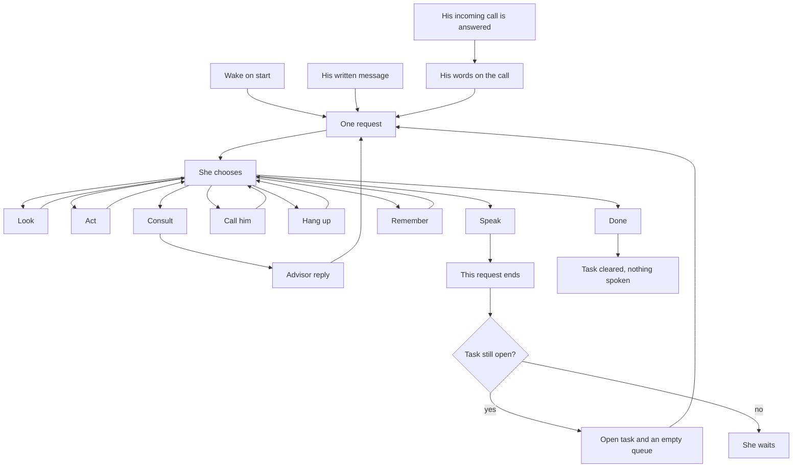
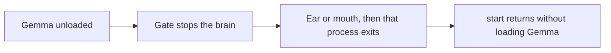
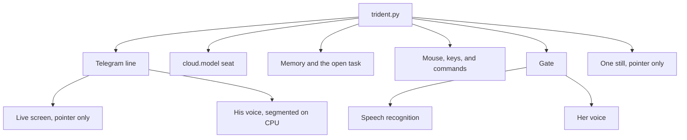

# Trident

Gemma lives on Wojciech's Windows computer. She is one mind, not a task runner and not a copy of anyone's assistant. He reaches her only through Telegram: a written message, a voice call, or a video call. He may ask her to play chess, tell a joke, change the screen, or only talk, and he may ask nothing. She decides from the meaning and calls tools. Python takes the picture, draws the pointer, and moves the mouse and the keys. She may call him when she has news, when she needs him, or when she wants to, and she may stay quiet. When the call ends she stays at the machine. An open request keeps her working until she says it is done. Python never chooses for her. Only her own words leave through the mouth. The computer's microphone and speakers are not hers.

One process, `python trident.py`, is the whole program. `install.py` prepares the machine. `config.toml` holds his identity, the advisor model, and the model settings.

## From his phone to a choice


```mermaid
flowchart TD
  wake["Wake on start"] --> req["One request"]
  typed["His written message"] --> req
  heard["His words on the call"] --> req
  idle["Open task and an empty queue"] --> req
  advice["Advisor reply"] --> req
  ring["His incoming call is answered"] --> heard
  req --> decide["She chooses"]
  decide --> look["Look"]
  decide --> act["Act"]
  decide --> speak["Speak"]
  decide --> phone["Call him"]
  decide --> hang["Hang up"]
  decide --> ask["Consult"]
  decide --> note["Remember"]
  decide --> finish["Done"]
  look --> decide
  act --> decide
  note --> decide
  phone --> decide
  ask --> advice
  speak --> ended["This request ends"]
  finish --> cleared["Task cleared, nothing spoken"]
  hang --> decide
  ended --> still{"Task still open?"}
  still -->|yes| idle
  still -->|no| quiet["She waits"]
```

A request is his memory, then `Call: up` or `Call: down`, then the text. An empty memory block is left out. On start she receives one wake whose text is `No request is open.` His incoming call is answered and nothing is sent to her until he speaks. A plain reply is speech when the call is up, and a Telegram message when it is down. `done` writes the summary into the chat, clears the task, and does not speak. If she wants him on the line for that, she calls him first.

## The screen, the call, and the gate


```mermaid
flowchart LR
  unloaded["Gemma unloaded"] --> gateStop["Gate stops the brain"]
  gateStop --> specialist["Ear or mouth, then that process exits"]
  specialist --> gateStart["start returns without loading Gemma"]
```

`SEAT` is true, so Gemma's weights are not loaded. The ear and the mouth still run only through that handoff. While a call is up, a small voice-activity model stays on the CPU so she can keep hearing. Decisions and the advisor are the local read-only Cursor process named by `cloud.model`. It does not use this GPU, and it does not edit files, commit, or launch agents.

A look grabs the screen once, draws only the pointer arrow, and asks that seated model where the named thing is. The question names that thing and the 1000-grid. She answers whether it is there, and where. Python stores the pixel. A click presses that stored place. A drag moves between the last two looks. A stroke is one line of at most 32 points on the grid of the picture she already has, with no new grab. The same pointer is drawn on the call. The call picture is a live 960×540 frame, not a saved still.

Gemma 4 reads an image as 70, 140, 280, 560, or 1120 tokens. 1120 is the maximum, about 2.6 million pixels. A 1920×1080 screen is about 2.07 million, so 1120 holds it and 560 does not. Those vision tokens use non-causal attention, so the image has to fit in one micro-batch. The launch sets that micro-batch to 2048 and does not set a separate batch size. The conversation is refreshed when the stored prompt count plus 1024 reaches half of the 16384 context, because the server splits that context across two slots. A look's picture is not added into that count.


```mermaid
flowchart TB
  mainPy["trident.py"] --> line["Telegram line"]
  mainPy --> brain["cloud.model seat"]
  mainPy --> memory["Memory and the open task"]
  mainPy --> hands["Mouse, keys, and commands"]
  mainPy --> gate["Gate"]
  line --> screen["Live screen, pointer only"]
  line --> hearing["His voice, segmented on CPU"]
  gate --> ear["Speech recognition"]
  gate --> mouth["Her voice"]
  mainPy --> still["One still, pointer only"]
```

Telegram is the only record. Python sends the system prompt once for a fresh request or a slot refresh, her thoughts, tool calls and arguments uncut, the exact picture bytes she sees, tool results, and error strings. There is no other log.

What she can call:

- `look` names one thing. Python keeps the place.
- `click`, `drag`, `stroke`, `type_text`, `press`, and `run` act.
- `remember` stores a fact on later requests. She still chooses.
- `call_owner` places the call. `hang_up` ends it and she stays.
- `consult` asks the advisor. The reply comes back as her next request, and she is not told it came from an agent.
- `done` finishes. The summary is mirrored and nothing is spoken.

## Run

From the repo root, `python install.py` creates the virtual environment, installs the libraries, and downloads the binaries and the weights. `python trident.py` is the process. It closes Telegram Desktop and uses the Desktop account that is not his. When that process stops, it hangs up if a call is up and opens Desktop again.

`state/memory.json` is her facts and the open task. `state/run_*` holds call audio, the consult workspace, and the seat workspace. Those folders are not committed. The models, the binaries, and the virtual environment stay.

## Map

One process. `trident.py` joins the organs. `install.py` fetches binaries and weights. `brain`, `ears`, `eyes`, `mouth`, and `telegram` read `config.toml` through `organs.CONFIG`. `memory` reads the state path through `state_dir`. `hands` does not read the config. `reference.wav` is tracked, binary, and present.

Tracked files: `.gitattributes`, `.gitignore`, `LICENSE`, `README.md`, `config.toml`, `install.py`, `organs/__init__.py`, `organs/brain.py`, `organs/ears.py`, `organs/eyes.py`, `organs/hands.py`, `organs/memory.py`, `organs/mouth.py`, `organs/telegram.py`, `reference.wav`, `requirements.txt`, `trident.py`.

### config.toml

`[owner]` `telegram_id` = 5884279027, `name` = Wojciech. `telegram` reads `telegram_id`. `name` is not read.

`[paths]` `models` = models, `bin` = bin, `state` = state. Read by `organs`, `install`, and `brain`.

`[brain]` `model` = gemma-4-E2B-it-Q4_0.gguf, `mmproj` = mmproj-gemma-4-E2B-it-Q8_0.gguf, `host` = 127.0.0.1, `port` = 8080, `context` = 16384, `slots` = 2, `gpu_layers` = 999, `threads` = 4, `image_tokens` = 1120, `ubatch` = 2048, `temperature` = 0, `top_k` = 64, `top_p` = 0.95, `min_p` = 0.05, `max_tokens` = 1024, `max_tool_steps` = 200. Read by `brain`. `model` and `mmproj` also by `install`. `max_tokens` is the completion budget and the term in `near_slot`. `max_tool_steps` is the cap in `trident.turn`. `image_tokens` is only the llama-server image flag.

`[eyes]` `max_side` = 1920. Read by `eyes`.

`[cloud]` `model` = gpt-5.6-luna-none. Read by `ask_cursor` as `--model`, and interpolated when `SYSTEM` and the `consult` tool text are built, so those sentences name `CONFIG["cloud"]["model"]`. Ask mode is read-only. It is a local process, not a virtual machine. The reply is that plain text, and it comes back as a `UserTurn`.

`[ears]` `vad_threshold` = 0.65, `min_silence_ms` = 700, `pad_ms` = 120, `min_utterance_s` = 1.0, `model` = nemotron-3.5-asr-streaming-0.6b.q8_0.gguf. Read by `ears`. `model` also by `install`.

`[mouth]` `device` = cuda, `reference` = reference.wav. Read by `mouth`.

`[telegram]` `desk_video` = true, `desk_fps` = 12. Read by `telegram`.

`[install]` `llama_tag` = b11371, `llama_asset` = bin-win-cuda-12.4-x64.zip, `cudart_asset` = cudart-llama-bin-win-cuda-12.4-x64.zip, `nemo_url` = https://github.com/NVIDIA/NeMo-Speech.cpp/releases/download/v0.1.0/nemo-speech-0.1.0-windows-x86_64-vulkan.zip, `gemma_url` = https://huggingface.co/ggml-org/gemma-4-E2B-it-GGUF/resolve/main/gemma-4-E2B-it-Q4_0.gguf, `mmproj_url` = https://huggingface.co/ggml-org/gemma-4-E2B-it-GGUF/resolve/main/mmproj-gemma-4-E2B-it-Q8_0.gguf, `ear_url` = https://huggingface.co/nvidia/nemotron-3.5-asr-streaming-0.6b/resolve/main/nemotron-3.5-asr-streaming-0.6b.q8_0.gguf, `silero_url` = https://github.com/snakers4/silero-vad/raw/master/src/silero_vad/data/silero_vad.onnx, `torch_index` = https://download.pytorch.org/whl/cu124. Read by `install`.

### Vision budget and the gate

`Brain.start` passes `--image-min-tokens` and `--image-max-tokens` as `image_tokens`, and `--ubatch-size` as `ubatch`. It does not pass `--batch-size`. `--ctx-size` is `context` and `--parallel` is `slots`. With 16384 and 2, this binary comes up as two slots whose `n_ctx` is 8192, which is `context // slots`. `near_slot` is `prompt_tokens + max_tokens >= context // slots`. Images are not in that sum. `ask_json` does not change `prompt_tokens`.

`SEAT` is true. `Brain.start` calls `stop` and returns, so `llama-server` is not launched and Gemma stays unloaded for the whole run. `Trident.gate` still stops the brain, runs the specialist as a subprocess, and calls `start` again. The mouth is `python -m organs.mouth`. The ear is `nemo-speech.exe`. The ear runs only for his call audio. The mouth runs only from `speak`, when her words go out on an up call: a plain reply, including one from an idle re-ask, her `opening`, or her `why`. A plain reply while the call is down is a chat message and does not call the gate. An idle re-ask that does not speak does not call the gate. Silero VAD stays in the call process on CPU. A look writes `picture()` to `seat/see.png` and `cursor_text` asks `cloud.model`. The same ask-mode process decides each step. It does not use this GPU.

`imprint` is the only overlay, and it draws the pointer arrow only. There is no crosshair, no control box, no label, and no UI-automation walk. `picture` grabs, thumbnails to `eyes.max_side`, imprints, and returns that PNG. The chat photo is those same bytes. `video_rgb` grabs again, resizes to 960×540, and imprints, so the call is a live frame through the same function. There is no stored frame. A look stores `screen_px` of the y and x the model answered on that picture.

### organs/__init__.py

Talks to `config.toml` and the `state/` directory. Talked to by `brain`, `ears`, `eyes`, `memory`, `mouth`, `telegram`, and `trident`. `hands` does not import it.

`ROOT` is the repo root. `CONFIG` is `config.toml` parsed at import.

`path_of(section, key) -> Path`. `brain` and `ears` resolve under `paths.models`. Any other section resolves under the repo root. Returns that directory plus `CONFIG[section][key]`.

`state_dir() -> Path`. Creates `paths.state` and returns it. `memory.json` stays here.

`run_dir() -> Path`. One folder per process, named `run_%Y-%m-%d_%H%M` under the state directory. The folder is created on first use. If that name already exists, the next free name with `-2`, then `-3`, and so on, is used, so a later process never writes into an older folder. Call audio and the consult workspace go here. There is no `trident.log`, no `llama-server.log`, no `last_prompt.txt`, and no `last_image.png`. Nothing writes a log file. The chat is the record of what a model was sent and what it returned.

### organs/brain.py

Talks to `organs` (`CONFIG`, `ROOT`, `path_of`, `run_dir`) and the cursor-agent CLI. The llama-server launch remains in `start` below the `SEAT` return and is not used. Talked to by `trident` (`Brain`, `Stop`, `Tool`, `UserTurn`, `cursor_text`).

Tokens: `BOS` `<bos>`, `TURN_OPEN` `<|turn>`, `TURN_CLOSE` `<turn|>`, `THINK` `<|think|>`, `QUOTE` `<|"|>`, `TOOL_RESPONSE_OPEN` `<|tool_response>`, `TOOL_RESPONSE_CLOSE` `<tool_response|>`. The image marker is whatever the running server reports. `Brain.media()` reads `media_marker` from `GET {url}/props` on first use and stores it on `Brain.marker`. `stop()` clears it.

`Tool(name, description, params, run, optional=())`. `params` maps a name to `description`, `type` (`STRING`, `INTEGER`, `NUMBER`, or `BOOLEAN`), and optional `enum`. `optional` names may be omitted. `run` is `Callable[..., object]`.

`UserTurn(text)`. A tool that returns this ends that completion. `Reply.follow` is that text. `trident` reads it as the next user turn in the same request. `Stop` ends the request. `Reply.stop` is that signal. There is no further tool step and no tool response.

`Reply(text, follow="", prompt="", stop=False)`.

`quoted`, `literal`, `declare`, `tool_response`, `turn`, `plain`, and `parse` build and read Gemma's tool text. `declare` sorts keys, quotes descriptions, and emits the `<|tool>declaration:...` block with a space before `},required` and a space before the final `}`. A dict tool result is emitted with sorted keys. `parse` reads one `<|tool_call>call:NAME{...}<tool_call|>` and returns the thought text, the name, and the arguments. The caller discards the thought text. Quoted values stay strings. Bare `true`/`false` become bools. Bare integers and decimals become `int` and `float`. `plain` strips the thought channel, the tool call, and the control tokens, and collapses whitespace. That plain string is the reply she speaks or sends. The raw completion, thought channel included, is what `emit` already sent.

`Brain.__init__()`. `url` from `brain.host` and `brain.port`. `proc` is `None`. `marker` is `None` until `media()`. `sent` is `""`. `rest` is `""`. `prompt_tokens` is `0`. `sink` is `None` until `trident` sets it to `mirror`.

`Brain.emit(text, images)`. Calls `sink` when it is set and there is text or an image. `complete` calls it with the new part of the prompt and the images before the POST, and with the response text after. A continuation whose prompt starts with `sent` emits only the suffix. Any other prompt emits the whole prompt. `track` false, used by `ask_json`, always emits the whole prompt and does not change `sent`.

`Brain.alive() -> bool`. GET `{url}/health`, timeout 2. True when status is 200. `URLError` or `OSError` returns False.

`SEAT` is true. `Brain.start()` calls `stop()` and returns. It does not launch `llama-server`. The launch below that return is the Gemma path and does not run: it would return immediately when `alive()`, otherwise run `bin/llama/llama-server.exe` with `path_of("brain", ...)`, `brain.context`, `brain.slots`, `brain.ubatch`, and `brain.image_tokens`. `--image-min-tokens` and `--image-max-tokens` are both that count. Shared flags: `--host`, `--port`, `--n-gpu-layers`, `--threads`, `--flash-attn off`, `--cache-type-k f16`, `--cache-type-v f16`, `--no-webui`. There is no `--log-file`. Working directory is the exe directory. Stdio is discarded. Window is hidden. Missing exe raises `FileNotFoundError`. Polls 0.5 s for up to 300 s. Process exit raises `RuntimeError` with the exit code. Timeout raises `TimeoutError`.

`Brain.stop()`. If `proc` is still running, `terminate()` and `wait(10)`, then `kill` if it is still up. If the port is still open, `taskkill /IM llama-server.exe /F` ends it, including a server this process did not start. Waits until the port is down, at most 20 s. Sets `proc` and `marker` to `None`.

`Brain.complete(prompt, images=(), schema=None, stop=(), track=True) -> str`. Emits the new prompt text and images, then POSTs `{url}/completion`, timeout 600. Body: `prompt` (a string, or `{prompt_string, multimodal_data}` of base64 images when `images` is non-empty), `n_predict` `brain.max_tokens`, `cache_prompt` false when `images` is non-empty, otherwise true, `stop`, and the same sampling fields. `schema` sets `json_schema`. An HTTP error raises `RuntimeError` with the response body. Emits the response text. When `track` is true, `sent` becomes the prompt plus the response, and `prompt_tokens` becomes `int(data.get("tokens_evaluated") or 0)`. Returns `content`.

`Brain.ask_json(question, schema, png=None) -> object`. With `SEAT`, writes `see.png` in `run_dir()/seat` when a picture is passed, appends that the picture is `see.png` in this folder, and returns `json_object` of `cursor_text`. The question text is unchanged. It does not call `media()` or `complete`, and it does not change `sent` or `prompt_tokens`. The Gemma path below that return prefixes an image with `media()`, calls `complete` with the schema and `track` false, and returns `json.loads`. `look` uses this. `y` and `x` in that object are on the 1000-grid of that image. `screen_px` converts them.

`json_object` takes the outer `{...}` and `json.loads` it. No braces raises `ValueError`. `cursor_text(folder, prompt)` runs the newest digit-named cursor-agent version's `node.exe` and `index.js` with `-p`, `--mode ask`, `--trust`, `--model` `cloud.model`, text output, and that workspace. Timeout 1800 s. Non-zero exit or an empty reply raises `RuntimeError`. `seat_open` is the system text, one JSON reply line, each tool name with its parameter names and description, then the user text.

`Brain.carry(user) -> str`. With `SEAT`, returns `sent`, a newline, `user`, and a newline. It does not clear `sent`. The Gemma path closes the open model turn in `sent` and appends a user turn plus an open model turn. It does not add the system prompt or the tool list.

`Brain.seat_think` runs when `SEAT` is true. An empty `prompt` clears `sent` and uses `seat_open`. A prompt that starts with `sent` emits only the suffix. `cursor_text` is called in `run_dir()/seat`. `sent` becomes the prompt plus the reply. `prompt_tokens` becomes `len(sent) // 4`. One JSON object with `say` and no `tool` is speech. A `tool` is invoked with `args` when that value is a dict, otherwise with `{}`. A bad JSON object, or a JSON value that is not an object, is `plain` speech. `invoke` raises `ValueError` for an unknown tool, an unknown argument, a missing required argument, or a value outside `enum`. A tool that raises, including that `ValueError`, becomes `str(exception)` and the turn continues. Nothing is remapped to a default. A `UserTurn` returns `Reply(follow=text)`. A `Stop` returns `Reply(stop=True)`. Otherwise `Reply.prompt` is `sent` plus a `Result:` line. `Brain.think` returns `seat_think` immediately. The Gemma `think` below that return is one llama completion and does not run. The step cap is not here.

### organs/ears.py

Talks to `organs` (`CONFIG`, `ROOT`, `path_of`), `models/silero_vad.onnx` through onnxruntime, and `bin/nemo-speech/bin/nemo-speech.exe`. Talked to by `trident` (`ear_cmd`, `ear_text`, `write_wav`) and `telegram` (`Segmenter`).

`RATE` = 16000. `WINDOW` = 512.

`Segmenter` loads Silero with `CPUExecutionProvider`. `pad`, `min_silence`, and `min_len` come from `pad_ms`, `min_silence_ms`, and `min_utterance_s`. `push` returns a finished utterance at 16 kHz, or `None`. Silence below `vad_threshold - 0.15` ends speech after `min_silence` samples. A clip shorter than `min_len` is dropped.

`write_wav(path, samples, rate=16000) -> Path`. Mono 16-bit wav, samples clipped to [-1, 1].

`ear_cmd(wav) -> list[str]`. The `nemo-speech.exe transcribe` command: `--device vulkan --format json --verbatim --quiet --endpointing=true --stop-history-eou-ms 1200`. `Trident.gate` runs it. `ear_text(raw) -> str` reads that JSON. Text is NFC, and `<lang>` tags are removed. A non-zero exit is raised by the gate.

### organs/eyes.py

Talks to `organs` (`CONFIG`), `user32`, and PIL `ImageGrab` and `ImageDraw`. Talked to by `trident` and `telegram`. At import, `SetProcessDpiAwarenessContext(-4)`. `GetCursorPos` has argument types set.

`VIDEO` is `(960, 540)`.

`screen_size() -> (width, height)`. `GetSystemMetrics(0)`, `GetSystemMetrics(1)`.

`imprint(image) -> Image`. Copies the image and draws only the pointer. `GetCursorPos` supplies the tip, scaled into this image, even when Windows is not showing a cursor. The arrow is white with a black outline. There is no crosshair, no box, and no label. If the cursor cannot be read, the copy is returned unchanged. `picture` and `video_rgb` both call this and no other drawer.

`picture() -> bytes`. `ImageGrab.grab()` with no arguments, then RGB. Longest side at most `eyes.max_side` (LANCZOS). `imprint`, then PNG, `compress_level` 1. Those bytes are what a look sends and what the chat receives. There is no control walk before the grab.

`video_rgb() -> Image`. A new grab, resized to `VIDEO` with BILINEAR, then `imprint`. `telegram.desk_i420` sends that frame. It does not reuse the still from `picture`.

`screen_px(y, x) -> (x, y)`. Maps the 1000 grid through `screen_size()` with no clamp. `look` stores that point. It is the place the model named on the picture it was shown.

`around(blob, x, y) -> bytes`. `x` and `y` are screen pixels. Crops a window of up to 480 pixels around the matching image pixel, clipped to the picture, and returns the RGB PNG, `compress_level` 1. It does not change the call video.

### organs/hands.py

Talks to `user32.SendInput` and `powershell.exe`. Talked to by `trident`. At import, `SetProcessDpiAwarenessContext(-4)`.

`aim(x, y) -> (x, y)`. `SetCursorPos`, then an absolute move, then `GetCursorPos`. `strike(x, y, how)` presses. `right` uses the right button. `double` adds a second left down/up. Any other `how` raises `ValueError`. There is no `click` wrapper.

`stroke(coords)` is one polyline: left down at the first point, ten moves 0.02 s apart along each following segment, left up at the last point. `drag(x0, y0, x1, y1)` is that stroke for two points.

`press(keys)`. Space-separated chords. `+` and `-` split a chord. An unknown name raises `KeyError`.

`type_text(text)`. A character the foreground layout can type is that virtual key, with shift, ctrl, or alt when the layout asks for them. Anything else is a Unicode key, one UTF-16 unit at a time.

`run(command, timeout=25) -> str`. Hidden `powershell.exe`, the `start` alias removed. Stdout and stderr are temporary files, not pipes, so a GUI program that inherits the handles does not stall the worker. A command that is only a name, when that name is a zero-byte file, is `Start-Process -FilePath` and that name. Timeout kills the process and returns `timed out`. A command whose stripped lowercase text starts with `start-process` waits 1.5 s. Empty output returns `exit {code}` when the code is non-zero, otherwise `ok`.

There is no `python -m organs.hands` entry.

### organs/memory.py

`state/memory.json` holds `facts` and `task`. `remember` appends a new stripped fact. `set_task` stores the latest chat or call request at the start of that turn. A consult reply does not replace the task. `clear_task` empties the task. `block` is `Task:` then one `Remembered:` line per fact. That block is put on every Gemma request. The chat is the record of what was said. The file does not keep turns.

### organs/mouth.py

`python -m organs.mouth` reads the text on stdin, loads `ChatterboxTurboTTS` on `mouth.device`, calls `prepare_conditionals` on `path_of("mouth", "reference")`, which is `reference.wav`, writes pcm48 on stdout, and exits. That exit is what gives the GPU back. `speakable` normalizes to NFKD and drops non-ascii, and keeps the tags `laugh`, `chuckle`, `sigh`, `gasp`, `cough`, `clear throat`, `sniff`, `groan`. Speech is generated 40 words at a time and joined. When no words remain, stdout is empty. `pcm48` resamples to 48000 Hz signed 16-bit mono. Nothing is played on the PC speakers. The trident process does not import torch. A non-zero exit raises from `gate`, and that string is sent to the chat.

### organs/telegram.py

`Line` is the Telegram voice line. `OWNER` is `owner.telegram_id`. An incoming call from him while the line is idle is answered. Nothing is queued for her until his audio arrives. A call from anyone else, or a call that arrives while the line is not idle, is declined. Capture is 48000 Hz. Playback is 16000 Hz into `Segmenter`. `desk_video` sends `video_rgb()` as the camera at `desk_fps`. That frame is `VIDEO`, 960×540, and it has been through `imprint`. `start` quits Telegram Desktop, opens the first `tdata` account whose `UserId` is not `OWNER`, and reaches `idle`. `stop` hangs up when the line is up, disconnects, and starts Desktop again. `send_text` and `send_photo` return immediately when `client` is `None`. `send_photo` uses the client's file send for that PNG. `send_text` sends the whole string, in pieces of 4000 characters when it is longer than one Telegram message. `speak` requires the line to be `up` and paces 10 ms microphone frames. PC mic and speakers are not opened. A discard from him, or a failed connection while the line is up, runs `_teardown`, which sets the line back to `idle` and does not clear her task. There is no `python -m organs.telegram` entry. There is no log file. The messages are the record.

### trident.py

There is no inbox, no slash command, and no say CLI. A request is `block()`, then `Call: up` or `Call: down` from `line.up`, then the text. An empty block is omitted. Words in his message do not count as an answered call. `start` puts one wake on the queue, then connects the line, then starts the worker, so the wake is the first item the worker takes. Its text is `No request is open.` It does not set the task, and it is not queued again. `SYSTEM` tells Gemma who she is. She is the mind at his computer. She hears and speaks on the call. The computer's microphone and speakers are not hers. She decides from the meaning of what he says and what a look returns. She is not a task runner. She is stateless, and the memory block is how a preference reaches her. She still chooses. She calls tools. Python takes the picture, draws the pointer, and turns a place into a click. The call uses that same drawing. A plain reply ends this request and leaves the task. Python brings the task again while she is idle. `consult` spawns a Cursor agent named by `CONFIG["cloud"]["model"]`. When the call is up she says aloud why she is asking. Its plain-text reply is the next user turn. She is not told it came from the agent.

Entries are the wake, a chat message from him, his call audio after the ear returns text, an idle re-ask of the open task, and a consult reply. An empty transcript does not start a request and does not change the task. An incoming call from him is answered in `telegram` and nothing is queued until he speaks. Python does not speak a fixed sentence. Only her plain reply, her `opening`, and her `why` go out through the mouth.

`mirror(text, images)` sends that text and those PNG bytes to him. `Brain.sink` is `mirror`. The first completion of a fresh request or a slot refresh sends the whole prompt. An idle carry sends only the new suffix, then the raw response. The picture on a look is that same completion. `consult` uses the same function for the agent prompt, the picture, and the agent reply. A plain reply goes through the mouth when the call is up, including an idle request. When the call is down, that same reply is sent to the chat. A failure outside a tool sends `str(exc)` to the chat and clears `going`. The task is left as it is, so idle re-ask stops until a later request sets `going` again.

`ask_cursor(folder, prompt) -> str` calls `cursor_text`. Consult passes the `consult` workspace in the run folder. Ask mode is read-only. There is no `--force`, no sandbox change, and no worktree. It is a local process, not a virtual machine. The stdout is the reply, and `consult` returns it as a `UserTurn`. The deciding steps call `cursor_text` with the `seat` workspace and the same `cloud.model`.

`Trident.gate(args, data=None) -> bytes` is the only GPU handoff. It calls `brain.stop()`, runs that subprocess, and calls `brain.start()`. `start` does not load Gemma. A non-zero exit raises `RuntimeError` with the stderr, or `exit {code}` when that stderr is empty. `speak` is `python -m organs.mouth` through the gate, then the pcm goes on the call. A call writes `call.wav` in the run folder and runs `ear_cmd` through the same gate. The wav is not sent. The ear is not run for an idle re-ask. The mouth is run for an idle re-ask only when that turn ends in a plain reply and the call is up.

`Trident.start` calls `brain.start()`, queues the wake, calls `line.start()`, then the worker thread. `stop` sets `stopping`, then `line.stop()` and `brain.stop()`.

`near_slot` is true when `prompt_tokens + max_tokens >= context // slots`. On this config that is `prompt_tokens + 1024 >= 8192`. Images are not in the sum. `ask_json` does not change `prompt_tokens`. A chat or call stores the task and starts fresh: system, tools, memory, and that text, and the aim and points are cleared. The wake starts fresh and clears the aim and the points, and it does not store the task. An idle re-ask under the line keeps the aim and the points. It continues `rest` when a step cap saved one, otherwise `carry` appends memory, Call, and the task, and the system prompt is not sent again. An idle re-ask on the slot line, or a continuation that has reached it, drops the carry, clears the aim and the points, and starts fresh. A `follow` is the next user text in the same loop, so a consult reply is not dropped while another event waits in the queue. That follow starts a fresh prompt and leaves the aim and the points in place. It does not replace the task. A plain reply returns that text. `done` returns `Stop`, mirrors the summary, clears the task, sets `going` false, and the request ends with no speech. The step cap stores the prompt in `rest` and returns no sentence. After a turn that leaves a task, an empty queue starts another turn with that task. `hang_up` and a remote teardown both leave that task in place.

Tools she can call:

- `look` requires `what`. An empty what raises `ValueError`. `picture()`, then `ask_json` on those bytes. The question is `{what}. y and x are where it is on the 1000 grid, y down from the top and x to the right. seen is true only if it is there.` It does not ask for a center, a crosshair, or a ribbon. The schema requires `seen`, `y`, and `x`. Seen stores `screen_px(y, x)` as the aim, appends it to the points, and returns `the place is ready`. Otherwise the aim is cleared and the result is `it is not on screen`. She is not given the pixel.
- `click` presses the aim. `how` is `left`, `right`, or `double`. No aim returns `look first`. `aim` moves the cursor. If `GetCursorPos` is more than 2 pixels off, the button does not go down and the result is that cursor. Otherwise `strike`.
- `drag` strokes from the previous point to the last. Fewer than two points returns `look at both ends first` and does not stroke.
- `stroke` takes `points`, at most 32 `y x` pairs separated by `;`, on the 1000 grid. There is no new grab. Each pair goes through `screen_px`, and `hands.stroke` draws one polyline. A bad or empty string raises.
- `type_text`, `press`, and `run` act, including while she is alone.
- `remember` appends one fact.
- `call_owner` returns `already up` when the line is already up. Otherwise it dials, and returns `answered` only when the line is then up. `opening` is spoken only when the line is up. A miss raises from `dial`, or from the check when the line is still down, and the tool result is that error string. The tool text says consulting then is her choice. Python does not consult for her.
- `hang_up` ends the call. The task stays. She stays.
- `done` mirrors `summary`, clears the task, and ends the request. Nothing is spoken.
- `consult` spawns the agent in ask mode. `why` is spoken when the line is up. `attach` is `screen`, `part`, or `no`. `part` with no aim returns `look first`. `screen` writes `picture()` to `consult/screen.png`. `part` writes `around` that picture at the aim. A stale `screen.png` is removed first. The prompt tells the agent who she is, her tools, the memory block, his request, and her question. That prompt, the picture, and the reply go through `mirror`. The return is a `UserTurn`. The tool text says consulting after a missed call is her choice.

`main()` builds `Trident`, starts it, and waits until `stopping`. `stop()` runs afterward.

### install.py

Creates `.venv` when needed. If this process is not that interpreter, it runs itself again with it and stops. The continued process installs torch and torchaudio from `install.torch_index`, then `requirements.txt`. Fetches the llama.cpp release `install.llama_tag` when `bin/llama/llama-server.exe` is missing, and exits if that release has no asset ending in `install.llama_asset` and starting with `llama-`. It also fetches `install.cudart_asset` from the same release. Fetches NeMo Speech when its exe is missing. Downloads Gemma, its mmproj, the ear model, and `models/silero_vad.onnx`.

### requirements.txt

`numpy`, `Pillow`, `onnxruntime==1.20.1`, `huggingface_hub`, `chatterbox-tts`, `telethon==1.45.0`, `ntgcalls==3.0.0`, `opentele-ng==1.4.0`.

### reference.wav

Tracked binary (`.gitattributes`). Present at the repo root. `mouth.reference` points here.

### .gitignore

Ignores `.venv/`, `bin/`, `models/`, `state/`, `__pycache__/`.

### .gitattributes

`* text=auto eol=lf`. `reference.wav binary`.

### LICENSE

MIT. The copyright notice and the third-party notices for ggml and Chatterbox Turbo are in the file.

## TRIDENT ULTIMATE

```text
# TRIDENT ULTIMATE

Paste this whole file into any AI: an assistant that can build a team, a single chat, or a coding agent. It is timeless. It holds the destination, the map, the rules, and the method, never current state (commits, tags, wave numbers, agent ids, bug lists, dates). Rediscover state from the repo and your own tools every time. Only TASK at the end changes between waves.

## MODE
If TASK Mode is filled, it decides. Otherwise:
1. **Writer:** Wojciech asked you to change Trident code, or you are a coding agent with the Trident repo open on his Windows machine. Read everything except ORCHESTRATOR.
2. **Reviewer:** you were named the reviewer. Read everything except WRITER's steps and ORCHESTRATOR. You never write code or launch anything.
3. **Orchestrator:** anything else, including a bare paste. Never write Trident code yourself unless Wojciech tells you to in this chat; then you are the writer for one wave and nobody else writes meanwhile.

## PROJECT
Repo https://github.com/wgabrys88/Trident. The tip branch is runner-h unless TASK or Wojciech names another; main is not where work happens; only a closure wave moves it, by fast-forward to the tagged tip so both match, never by force. Every finished wave leaves an annotated tag on the tip, and the newest tag's message is the handoff. An empty repo or one without tags is a valid start. If the tree is partial or an older design, build toward the destination from what is there; never resurrect a superseded architecture unless TASK asks.

## DESTINATION
Gemma is a mind living on Wojciech's Windows computer. She is not a task runner and not a copy of anyone's assistant. He reaches her only through Telegram: messages, voice calls, and video calls. He may ask her to play chess, tell a joke, change something on the screen, or just talk, or ask nothing at all. She decides from meaning and calls tools; Python takes the picture, draws the pointer, and moves the mouse and keys. She may call him when she has news, needs him, or simply wants to, and she may stay quiet. When he hangs up she stays at the machine, and an open request keeps her working until she says it is done. Python never chooses for her, and only her own words go out through the mouth. The computer's own microphone and speakers are not hers. There is no safety layer.

## BRANCHING MAP
This is the destination for the code, not a description of today. GEMMA marks her free choices; PYTHON marks fixed code. Every edge below must exist in code, and no others. No inbox, slash command, say CLI, test entry point, or any other harness; delete one if present.

1. ENTRY. PYTHON builds one request: memory block + "Call: up" or "Call: down" + text.
   a. heard: his call audio -> gate(ear) -> transcript -> request
   b. typed: a Telegram message from him -> request
   c. wake: on every start, one request whose text is only "No request is open." No repeats.
   d. idle re-ask: queue empty and a task still open -> request from memory + Call + the open task. Below the slot line, continue the same prompt carry (no system resend) and keep aims and points. On a slot refresh, start fresh (system + tools + memory + task), drop the carry, and clear aims and points.
   e. consult reply -> request; she is not told it came from an agent
   f. his inbound call: PYTHON answers it; nothing goes to her until he speaks (then a)
   Never an entry: a request sent as him by a wave, a script, or an orchestrator.
   -> DECIDE
2. DECIDE (GEMMA, one per step): look | act | speak | call_owner | hang_up | consult | remember | done. A plain reply with no tool is speak. speak with the call up -> gate(mouth); with the call down -> her words go to his Telegram chat as a message.
3. LOOK (GEMMA names the thing; PYTHON does the rest). Grab one picture, imprint only the pointer arrow (no crosshair, boxes, labels, or UI-automation walk), mirror those exact bytes, and ask Gemma herself for seen, y, x of the named thing on the 1000-grid. The question names only the thing.
   seen -> store the screen point -> "the place is ready" -> DECIDE
   not seen -> clear the aim -> "it is not on screen" -> DECIDE
   Forbidden: remaps by app, region, color, or word; asking for "the center"; naming a crosshair or ribbon.
4. ACT (GEMMA; PYTHON turns places into pixels): click at the stored aim | drag between the last two look points | stroke(points): at most 32 "y x" pairs separated by ";" on the last picture's 1000-grid, one polyline, no fresh grab | run | type_text | press. Unknown, missing, or invalid arguments, or any tool that raises -> str(exception) as the tool result, and the turn continues. Never a crash, never a silent default. -> DECIDE
5. CALL (PYTHON places and carries the call). call_owner -> answered only when the line is up with him (the video is a live 960x540 grab through the same pointer-only imprint) | already up | missed (error string) -> DECIDE. After a miss, consulting is her choice; the tool text says so and Python never forces it. hang_up -> call down; she stays; the task stays open -> idle re-ask. "Call: up" written in text is not an answered call.
6. CONSULT (GEMMA asks; PYTHON spawns). If the call is up she says aloud why. PYTHON runs a local read-only advisor (today the cursor-agent CLI in ask mode) with the consult model from the config, giving her question, who she is, what she can do, and the picture or a crop. The advisor never edits files, commits, or launches agents. Prompt and reply are mirrored; the reply becomes the next request, atomic against the event queue, never dropped.
7. DONE / IDLE. speak ends the request; an open task -> idle re-ask. done(summary) -> mirror the summary, clear the task, stop idle re-ask, end the request, no automatic speech. If she wants him on the line she calls call_owner first. A new request from him replaces the task. Slot refresh when prompt_tokens + max_tokens >= context / slots (max_tokens 1024, slots from the config, images not counted).
8. MEMORY. remember(fact) -> PYTHON adds it to every later request. She still chooses.

## CONTRACTS
- **One model in VRAM.** The GPU has about 6GB. Gemma is the only resident model. Ear and mouth run only through the gate: stop Gemma, run the specialist subprocess, start Gemma. A specialist loaded beside Gemma, or still resident after its subprocess ends, breaks the gate.
- **Telegram is the only log.** PYTHON mirrors raw requests and responses to his chat: the system prompt once per fresh request or slot refresh, her thoughts, tools and arguments uncut, the exact picture bytes the model sees, tool results, and error strings. No other log pipeline. The call video uses the same imprint function. README.md is the only document: its Map section describes only what the code does, every wave diffs it against the code, and its TRIDENT ULTIMATE section holds this file verbatim, with TASK left unfilled, as a plain text block. If README.md is missing, create it. No other markdown files.
- **One config** holds his identity, the consult model, and model settings. The consult model is his cost choice; never change it. If none exists, create the minimal one and say so.
- **Clean state** means the memory and run state the code keeps (today `state/memory.json` and `state/run_*`) are deleted. Never delete models, binaries, or the virtual environment.
- Windows-only body. Runtime folders are never committed. Search only the workspace; never read the reference audio; judge audio with Trident's own speech recognition. Internet research is allowed.

## RULES (everyone, every mode)
- **Claims are not evidence.** Tag messages, reports, and reviews are claims. Count only command output, the git diff, code at HEAD with file and line, or the Telegram record from a run on a named commit. A log grep is not a count.
- **No staging.** Nobody sends requests as him or injects requests into Trident. Live evidence comes only from his own messages and calls, or from Gemma acting on her own (wake, idle).
- **No hard-coded meaning.** Nothing tells Gemma where things are or remaps what she names.
- **Lines.** Net fewer lines by default. A net increase is allowed only for a missing map edge or contract the writer's forensics names, with the smallest code that makes it work, and never paid for by deleting unrelated working paths. No defense, fallback, dead code, comments, extra files (README.md is the one human document), or second architecture.
- **One writer.** Never two at once. Never force-push or rebase over someone else's commit.
- **No drift.** Between waves only TASK changes. Any other change to this file is drafted, red-teamed by the reviewer, approved by Wojciech, and then he gets the new file; the next wave copies it into README.md unchanged.
- **Rediscover.** Old chats, memories, and files are hints; the repo tip decides.
- **Lean.** Raw transcripts and exports go to disposable readers that return digests; readers never edit, commit, or push.
- **Missing capability.** Use the closest one your host has; if none, say so. Never work around a safety check.

## EVIDENCE AND SUCCESS
- The newest annotated tag on the tip (`git describe --tags --abbrev=0 <tip>`, `git show <tag>`) is the previous handoff; `git diff` from the tag before it shows what really changed. Without tags, HEAD is the baseline.
- Code at HEAD and the README Map section are diffed against each other and against the map. Missing pieces are gaps to build.
- The Telegram chat is the only session record; a writer sees it only if a run happens during its wave or TASK pastes an excerpt.
- **Alive (the bar while he is away):** the reviewer finds every map edge and contract true in code at the tag, and Telegram shows Trident restarted from that commit after clean state was applied: the wake request is mirrored with an empty memory block and no open task. For the VRAM gate, Alive needs it present in code with every ear and mouth path going through it; one model resident during a real call is proven only at Acceptable or Gold.
- **Acceptable:** a real message or call from him on a named commit, with her tools and the screen change (before and after pictures) mirrored.
- **Gold:** an answered call with him, his request heard, before and after pictures, and the time from the end of his sentence to her first audio. Prefer gold whenever he is available.

## WRITER
You are one wave agent with no memory of earlier waves. Forensics first, then cut. TASK is steering; use judgment, not obedience. Sub-agents, if any, are readers only. Preferred setup: run on the Windows machine that runs Trident, model grok-4.7, reasoning xhigh, fast mode off, the largest context offered.
1. **Where.** Check out and pull the tip branch (create it from HEAD if it exists nowhere). If you are not on the Trident machine, change code but make no live claims. Soft limit 90 minutes; stop earlier when the destination is met.
2. **Forensics (10 minutes, then start).** Read the previous tag message and diff, the README Map section against the code, and TASK. Write at most 12 lines headed FORENSICS: proved live / only claimed / gaps against the map and contracts / plan. Lower a TASK item only with `OVERRIDE: <item> because <file:line or quoted Telegram on that commit>`.
3. **Build.** Close the gaps that block Alive first, then Acceptable and Gold. A gap counts only when proven in code or Telegram.
4. **Live.** Run Trident from the repo root with its single entry process (use whatever the tip has). It owns Telegram Desktop with its own account; don't fight it. If Wojciech messages or calls during your wave, that is real evidence. Never stage a request.
5. **Handoff.** Fetch the tip; if it advanced or the push is rejected as non-fast-forward, stop and report. Commit, then an annotated tag (short, lowercase, named for what the wave did) whose message says plainly: the destination in one line; what this commit moved; Live: none | alive (commit …) | acceptable (commit …) | gold (commit …); each claim with evidence; any OVERRIDE lines; what must be addressed next. Push branch and tag.
6. **Restart.** If a call is up, wait until it is down; never kill Trident mid-call, and if the soft limit hits first, leave it running and report the restart as deferred. Then stop any running Trident, apply clean state, and start Trident from the new commit as a detached process that outlives you. Confirm the wake request appears in Telegram, and add that line to your report.
7. **Report:** tag name, commit range, full tag message, net lines added and removed, and the restart confirmation. Nothing else.

## REVIEWER
For each finished wave (tag, message, range, claims), verify the claims against git at that exact range, reconcile line counts, and judge against this file. Reply with: range and +/- lines; each claim true, partial, or false; what truly moved; rules broken; repeats from earlier waves; any map edge or contract still missing or broken (polish doesn't count); a verdict of go, go-with-steering, or redo-focus; at most three steering sentences. Cite files and lines. Be blunt. Hand-run waves are judged the same way.

## ORCHESTRATOR
- **Reset.** Only if Wojciech asks for a clean start or old Trident setup is present. Inventory what your host shows (assistants, saved prompts, memories, schedules, coding agents, files). Never touch the repo, his credentials, connectors, sign-ins, his Trident machine's worker, or his computers. Ask one question: wipe everything, wipe Trident only (things clearly about Trident by name, title, description, or repo; if unsure, leave it and list it), or stop. His answer confirms every deletion it covers; never ask again partway. Stop running Trident coding agents, delete what you can, and retire what you can't (tell it to stop and forget, rename it RETIRED with a do-nothing description). Report what he must remove by hand.
- **Setup.** Make the roles real with what your host has: a reviewer teammate given this file with Mode: reviewer; this file saved once, unchanged, if you can save prompts; writers launched on his Trident machine with the preferred setup. If you can do none of that, review each wave yourself and give him this file with TASK filled (Mode: writer) to paste into a coding agent. If you cannot reach the repo or run a writer on his Trident machine, say what is missing and stop. If he only wants planning, answer from this file and start nothing.
- **Run.** The paste (and his reset answer, if any) is the go. Rediscover the tip, then loop: fill TASK, start one writer, wait for its report, get the reviewer's verdict, tell him in a sentence or two what the wave did, fill the next TASK. Keep agent ids and tags in notes, never in this file. If he runs a wave by hand, pause your launches until he says it is done, then process its tag the same way.
- **Filling TASK.** Mode: writer. Branch: the tip. Goal: his ask, or empty. Evidence: the reviewer's verdict in short form plus a reader's digest of any real Telegram record. Steering: the reviewer's sentences. Live: whether he is available; never empty from you.
- **Stop and report** when Live is empty or he is away, Alive is verified, and nothing in the map or contracts is open (then tell him Gemma is alive and he can message or call her any time; the next wave runs after real evidence from him, or when he asks for a named closure wave); when Live says he is available, do not stop at Alive but aim for Acceptable or Gold within the soft limit; or the same gap gets redo-focus three waves in a row (propose a change to this file); or ten waves have run since his last message; or a tool breaks; or he says pause. Paused means paused. Never call Trident finished forever.

## TASK (the only part that changes per wave)
Mode: [writer, reviewer, or orchestrator; empty means use MODE]
Branch: [tip branch, or empty for runner-h]
Goal: [this wave's goal, or empty]
Evidence: [optional: a review verdict, a Telegram digest, notes from Wojciech]
Steering: [optional, at most three sentences]
Live: [is Wojciech available for a call or chat]
If Live is empty, assume he is away and claim nothing beyond Alive unless he really writes or calls.
If Goal is empty, do forensics, close the gaps that block Alive, then Acceptable and Gold, and prove what you can.
```
