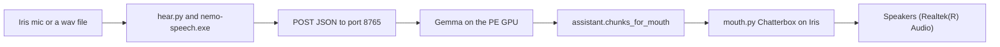

# Trident

Trident is a voice assistant on two home Windows PCs. Iris hears and speaks. NVIDIA thinks and returns text. Iris turns that text into speech.

Checked-in code outranks this file. If `ear.txt`, `vad.txt`, `chatterbox.txt`, or an older sentence here disagrees with `hear.py`, `mouth.py`, `assistant.py`, `grok_local_bot.py`, `nvidia_client.py`, `nvidia_worker.py`, or `gemma.py`, follow the code and the run files.

The branch of record is `runner-h`. Clone `https://github.com/wgabrys88/Trident.git` and check out `runner-h`. `main` is an ancestor of this branch (they matched at `e4dc33d` on 2026-09-28). Do not start work from `main`. Do not fast-forward `main` without Wojciech.

License: MIT. Copyright (c) 2026 Gianfranco Cordella. See `LICENSE`. The build also uses ggml and a C++/ggml port of Resemble AI Chatterbox, named in that file.

## Seats

| Seat | Worker | Machine | Account | Checkout |
| --- | --- | --- | --- | --- |
| Iris, voice | `trident-iris` | EB-W | `eb-wjt` | `C:\Users\eb-wjt\Downloads\Jarvis\Trident` |
| NVIDIA, brain | `trident-nvidia` | PE-DMLW | `px-wjt` | `C:\Users\px-wjt\Downloads\Jarvis\Trident` |

Iris owns the microphone, `hear.py`, the voice door, `mouth.py`, and playback. Chatterbox runs on Iris through Vulkan. On the Scenario C day the Vulkan device 0 in `mouth.run.err` was Intel Iris Xe Graphics. That is the Iris GPU. The GTX 1060 is on PE.

NVIDIA owns Gemma and `nvidia_worker.py`. The measured card is an NVIDIA GeForce GTX 1060 6 GB. The production brain is CUDA 12.6, architecture `61-real` (`install.txt`). This seat has no microphone job and does not own the mouth.

The worker that has been serving turns is `http://192.168.16.31:8765/`. On PE it is bound to `0.0.0.0:8765`. Iris does not bind that port. A healthy door record says `local_8765: none`.

`assistant.py` is the live hear / brain / mouth loop, including the proven microphone session. `grok_local_bot.py` is the file team and the unattended wav door. Both stay in the tree.

Grok Bots do not edit this repo. Coding is Cursor agents on `trident-iris` or `trident-nvidia` only.

## How a reply is made

Sound moves one way. The worker never returns audio.


```mermaid
flowchart LR
  mic[Iris mic or a wav file]
  asr[hear.py and nemo-speech.exe]
  post[POST JSON to port 8765]
  gemma[Gemma on the PE GPU]
  chunk[assistant.chunks_for_mouth]
  mouth[mouth.py Chatterbox on Iris]
  speakers["Speakers (Realtek(R) Audio)"]
  mic --> asr --> post --> gemma --> chunk --> mouth --> speakers
```

1. Iris turns a microphone window, or a wav file, into text. `hear.py` runs `nemo-speech.exe transcribe` with model `ear.gguf`. It does not read `ear.txt` and it does not run `ear.exe`. `src/ear.cpp` is the separate `ear.exe` one-shot. That program writes `*_ear_out_NNN.txt`.
2. The text is one JSON POST. `nvidia_client.py` sends `id`, `text`, `image`, and, when a local image was passed, `image_b64`. `nvidia_worker.py` `do_POST` runs `gemma.py` once and returns `{"text": out}`. Errors are `text/plain` (`bad json`, `empty text`, `gemma exit`, `gemma timed out`, and the other worker errors). There is no `do_GET`. A browser GET is not a health check.
3. Iris keeps the text after `<channel|>` (`assistant.speakable`, with the same split on `</think>`). The thought stays in the response file. The mouth does not speak it.
4. Iris splits that speakable text. The chunker is `assistant.chunks_for_mouth` (`breath_parts`, then `split_long`). `mouth.py` speaks the chunks it is given. It does not split them. PE Gemma and `nvidia_worker.py` return one whole string. `qwen.py` does not chunk. On `--nvidia`, Qwen is not in the path.
5. `mouth.py` keeps `chatterbox.exe --resident` when the settings fingerprint matches. It writes `chatterbox.play off` into the settings it generates. `chatterbox.txt` still says `chatterbox.play on`. That template flag is not the speaker switch. Playback is `PlaySoundW` on the Windows default wave device, unless `--no-play`, `--vb-cable`, or `--out` is set. The default path prints `mouth out: default` and does not look up a friendly name.

The mouth target for NVIDIA replies is that Iris default device. The same-day measurement (`scenario-c-preflight-iris.txt`, sounddevice default output) named it **Speakers (Realtek(R) Audio)**. The NVIDIA seat's own Windows default render, recorded in the PE Scenario C notes, is **Speakers (Creative SB X-Fi)**. **LG TV (NVIDIA High Definition Audio)** is present on PE and is not that default. There is no endpoint named NVIDIA Speakers. X-Fi and the LG TV are not the live mouth.

Language follows the mouth model when `--lang` is omitted. `resolved_lang` returns `en` for `nano` and `turbo`, and `pl` for `v3`. `mouth.py` uses the same default. Scenario C omitted `--lang` with model `nano`, so the resident was `nano en` (`mouth.pid`). Chatterbox does not rewrite the text into English (`chatterbox.txt`). Polish sentences spoken that evening were Polish text on the English voice. Pass `--lang pl` when the voice tag should be Polish. The English tag on Polish text is that omitted `--lang`, before Chatterbox runs.

Chunk sizes on the English path: flush on `.!?;:` and dashes, then a 65-word limit (`EN_LIMIT`) with a conjunction split down to 50 words. Polish limits are 55 and 45. With `--lang` omitted on `nano`, the English limits apply even when the words are Polish.

### `--nvidia` is one turn

The worker stores no conversation. `do_POST` reads `id`, `text`, `image`, and `image_b64` only. `assistant.py --nvidia` posts the current question and does not attach `grok_bot_history.txt`. A mid-session reply of "We have not had a conversation yet" matches the code. The 2026-09-28 evening recorded that sentence (Iris chatterbox wav `19-16-15-588`; PE `19-16-31-164_gemma_out_000.txt`).

`nvidia_client.py` always writes `nvidia_turn.request.txt` on the caller, then the response file after HTTP. Those same names are the `--drop` inbox inside `nvidia_worker.py`. `--drop` writes plain `id` / `ok` or `err` text. HTTP success is JSON. While `0.0.0.0:8765` is already listening, production is POST. The door never starts the worker. `--drop` is the fallback when this computer is not already listening. Do not use that fallback on Iris. An Iris `--inbox` with no local listener would try to run Gemma on Iris.

File-team memory is different. `grok_local_bot.py` appends coordinator and reasoner lines to `grok_bot_history.txt`, with `grok_bot_request.txt` and `grok_bot_response.txt`. Those roles are lines in a file. They are not people. `--proof` clears the history file before it runs. The live `--nvidia` loop does not.

### Clocks

| Clock | Default | Who |
| --- | --- | --- |
| HTTP client | 30 s | `nvidia_client.py`. `assistant.py` forwards `--timeout` only with `--nvidia`. Omit it and a slow Gemma turn dies at 30 s, before the mouth. |
| Proven live and closed-mic replay | 180 s | The passing commands below. |
| Door and file-team HTTP | 600 s | `grok_local_bot.py --timeout`. Separate from the door's hear cap (180 s) and mouth cap (300 s). |
| Worker Gemma kill | 600 s | `nvidia_worker.py --timeout`, around `gemma.py`, not the Iris HTTP clock. |
| Listen window | 8 s | `assistant.py --seconds`. Scenario C used 30 s. The mic is open for that window, then the subprocess exits. It stays closed during the POST and during playback. The next turn opens it again. |

`hear.py` defaults: device `cpu`, rate 16000, model `ear.gguf`, endpointing on, `--stop-history-eou-ms` 1200. Endpointing runs on the finished wav. `vad.exe` is not in this loop. `vad.txt` points `vad.exe` at `CABLE Output (VB-Audio Virtual Cable)`. Capture resample in `vad.exe` is the polyphase FIR in `Audio::resample`. `hear.py` live record uses `resample_linear` (`numpy.interp`).

`assistant.py` also exits its own loop when the transcript is only `quit`, `exit`, or `stop`. That does not stop port 8765. Gemma has no quit tool. Stopping the listener, or the live assistant tree, is an external Shell action. MIC STOP kills the `assistant.py` tree only.

### Tools on the worker

Ordinary text turns in `gemma.py` declare two tools, `hello` and `cursor`, and close the empty thought channel in the prompt. A question that starts with `<<trident-inbox>>` skips the tools and leaves the thought channel open. Image prompts do not add the tool header.

`hello` writes one line to `tool_hello.txt` on the machine that ran `gemma.py`, then asks the brain again (up to three follow-ups). `cursor` runs the Cursor CLI once: `--list-extensions --show-versions`, or `--version` when the job asks for a version, and writes `grok_bot_spawn.txt`. A missing CLI writes `BLOCKED` and does not edit the repo. Unknown tool names are skipped. This is not an agent stack.

On the Scenario C math turn the NVIDIA seat recorded `call:hello` with body `106 - 12 = 94` and a follow-up that the result is 94. The Iris mouth wav for that reply is `19-19-06-010`. A separate Hello World utterance was spoken on Iris as prose. `tool_hello.txt` was not created on the Iris disk. The tool file, when it is written, is on PE.

### Local Qwen

`assistant.py` without `--nvidia` uses `--brain qwen` (the default): `qwen.py` and `sense.exe`, Qwen3 0.6B, CPU, `sense.gpu-layers 0`, context 4096, `n-predict` 128. Vision is refused (`qwen/sense vision is N/A`). The door does not call it. The same Iris `speak_raw` path still chunks the local reply before `mouth.py`.

`assistant.py --brain gemma` without `--nvidia` runs local `gemma.py`. That is not the production GPU path.

## What has been shown (2026-09-28)

Times below are Europe/Warsaw unless marked UTC.

### Live microphone, Scenario C — proven win

Command, from the Iris checkout, venv python:

```powershell
.\.venv\Scripts\python.exe .\assistant.py --nvidia --url http://192.168.16.31:8765/ --seconds 30 --timeout 180
```

No `--once`. No `--lang`. `scenario-c-scout-iris.txt` records the shell log `57315.txt`: started 2026-09-28T16:58:47Z, ended 17:25:22Z, tip `e4dc33d`. The process then ended `status: failed`, exit `4294967295` (the tree was killed). There is no `STATUS PASS` file for this session. The win is the session itself.

Evidence still on the Iris disk, outside git (`.gitignore` ignores these names):

- 32 `HH-MM-SS-mmm_chatterbox_out_000.wav` files from `18-59-40-473` through `19-23-38-269`. Counts per reply: 1, 10, 1, 11, 1, 1, 1, 1, 1, 1, 1, 2.
- `mouth.pid`: resident `4664`, model `nano`, lang `en`.
- `mouth.run.err`: Vulkan device 0 Intel Iris Xe, then `resident speak` lines.
- Preflight: Iris had no listener on 8765. TCP to `192.168.16.31:8765` succeeded. Default output name: `Speakers (Realtek(R) Audio)`.
- The Iris seat dig of that shell log records `hear mic: Microphone Array (Intel® Smart` and `mouth out: default` on the replies. Each turn is one fixed window. Empty windows print `assistant: hear returned no transcript` and the loop continues.

YouTube chaos, about 19:22–19:23, was a deliberate win check: score refuse, hallucinate, or clarify, and score whether the mouth spoke junk or stayed quiet. The last request file on Iris is id `1790616189906674900`. The heard text begins `Starba sa dvana elenai stīnis` and continues as a drinking-and-driving narration. After `<channel|>` Gemma asked what to do with that description (summarize, continue, analyze, or a question). The mouth wrote two wavs, `19-23-35-707` and `19-23-38-269`. The worker clarified. The mouth spoke. It did not refuse. It did not stay quiet. That is the proven win.

PE's fresh `*_gemma_out_*.txt` files from `18-59-56-328` through `19-23-43-495`, recorded in the NVIDIA seat dig, are the whole-reply dumps for this window. They prove Gemma answered. They do not record playback. Playback evidence on Iris is the 32 wavs and the seat dig's `mouth out: default` lines. A git tag named live-mic is only a label.

An earlier one-shot is a different result. Around 14:57, `assistant.py --once --seconds 30 --nvidia --url http://192.168.16.31:8765/` with no `--timeout` posted, hit the 30 s client default, exited 2, and did not run the mouth (`live-mic-oneshot.txt`). Do not cite that attempt as Scenario C.

### Closed-mic playback the same afternoon

At 15:05, mic closed, the saved 14:57 transcript was replayed:

```powershell
.\.venv\Scripts\python.exe .\assistant.py --text "<transcript>" --nvidia --url http://192.168.16.31:8765/ --timeout 180
```

`live-mic-oneshot-continue-meta.txt`: exit 0, elapsed 39.3 s, mic not opened. Stderr: `assistant: mouth 1 chunk(s)`, `mouth out: default`, chatterbox pid 4664. Wav `15-05-30-405_chatterbox_out_000.wav` (13.0 s, 24 kHz mono). The log names the default wave device. It does not name EB-W Speakers, X-Fi, or the LG TV.

### Unattended wav door — tracked `STATUS PASS`

`iris-door.txt`, head `7248a1c`, command `grok_local_bot.py --wav` on `reference.wav`. Worker up before and after at `192.168.16.31:8765`. `local_8765: none`. Hear, coordinator, reasoner, and mouth exits 0. Reasoner 8236 ms. Mouth wav `C:\Users\eb-wjt\Downloads\Jarvis\Trident\10-40-35-223_chatterbox_out_000.wav` via `mouth.py --model nano --no-play`. Speakers stayed closed.

Transcript of record, copied from that file:

> Now let's make my mum's favourite. So three miles bars into the pan then we add the tuna and just stir for a bit. Just let the chocolate and fish infuse. A sprinkle of olive oil and some tomato ketchup now smell that oh boy this is going to...

Reply of record:

> That sounds like a delicious way to prepare it! With the chocolate and fish infused in that way, it is going to be incredible.

### File team and inbox — on the listener seat

`grok_bot.txt`, head `c8245e9`: `STATUS PASS`. Listener `0.0.0.0:8765` pid 12672 before and after. Reasoner 10138 ms via POST. Cursor spawn exit 0 (`grok_bot_spawn.txt` lists extensions). GPU base 1559 MiB, peak 4678 MiB, peak util 88. `--proof` requires the pid to stay and clears history first.

`grok_bot_history.txt` has two `inbox ok` turns, each one Gemma call via POST. Text turn, image none, peak 5604 MiB. Image turn, `C:\Users\px-wjt\Downloads\Jarvis\Trident\recon-hf-vision\coco_sample.png`, the reply names a cat in the first sentence, peak 5672 MiB of the 6144 MiB nameplate. `gemma.txt` documents that image fit at context 65536, `gpu-layers` 999, f16 KV, flash-attn off.

### VB-Cable harness — tracked, not the speakers

`loopback-proof/status.txt` and `jarvis.txt`, head `a06c2f3`: `STATUS PASS`. Mouth played `Trident cable loopback` into `CABLE Input (VB-Audio Virtual Cable)`. Hear transcribed `CABLE Output` as `Trydam cable loop back` (ratio 0.821). The live microphone was not used. `assistant.py --vb-cable` returns before the mic loop. `--mouth` on that path writes reply wavs and is rejected unless `--vb-cable` is also set. The `--timeout 180` line in `loopback-proof/jarvis.txt` is this cable run, with `mouth_exit: skipped`. It is not the 15:05 speaker replay and it is not Scenario C.

`hear.py` skips a device whose name contains `cable` unless `--vb-cable` or an explicit mic choice allows it. `mouth.py` plays the default wave device unless `--vb-cable` or `--out` is set.

### Overlap experiment — not an isolated Gemma fit

An overlap run put two Gemma jobs on the 1060 at once, then a sequential baseline. Concurrent peak `5976` MiB. That number is the overlap run. It is not the inbox image turn (5672) and not the file-team proof (4678). The run log is not in git. Do not run `parallel_agents.py` while the worker holds the model. `seq_agents.py` is the older sequential batch. Neither script is the Grok Bot team.

## Install

From the checkout on that seat:

```powershell
python install.py install.txt
```

`install.py` reads `install.txt` and only that argument. It creates `.venv`, pip-installs the pinned CPU torch stack and the packages in the `install.pip` block, pins ggml, llama.cpp, and NeMo-Speech.cpp, builds the mouth (`chatterbox.exe`, `chatterbox-bake.exe`, `ear.exe`, `vad.exe`), builds `nemo-speech.exe`, builds `gemma-brain.exe` and `sense.exe`, downloads Gemma, the mmproj, `ear.gguf`, `sense.gguf`, and Silero VAD, and bakes nano, turbo, and v3 from `reference.wav`.

Pins and flags live in `install.txt`. The short Gemma build directory is `C:\tgemma` because the shader step fails on a long path. Generator is Visual Studio 17 2022. An empty `install.vulkan_sdk` uses the newest SDK under `C:/VulkanSDK`. `gemma/scripts/detect_gpu.ps1` prints `cuda` only when a NVIDIA controller and `nvcc` both exist, otherwise `vulkan`. PE production is CUDA 12.6, architectures `61-real`. A different card means re-check `gemma.txt` (`gemma.ctx`, `gemma.gpu-layers`) and the CUDA architecture before reusing the 1060 numbers.

Runtime executables, `.venv`, and model files are not in git. `.gitignore` ignores `*` and un-ignores the sources. Each seat installs on its own disk.

After install, Iris needs `nemo-speech.exe`, `chatterbox.exe`, `ear.gguf`, the voice GGUFs, and the venv. Hearing does not use `ear.exe`. PE needs `gemma-brain.exe`, `gemma.gguf`, `gemma-mmproj.gguf`, and the venv. `sense.exe` is the local Qwen brain.

Run programs with `.\.venv\Scripts\python.exe`.

Gemma sampling in `gemma.txt`, passed through as written: context 65536 (native 131072; 8192 left KV unused on this 1060), batch 512, `n-predict` 2048, `gpu-layers` 999, gpu 0, temp 1.0, top-k 64, top-p 0.95, min-p 0.05, flash-attn off, KV f16. A lower temperature collapses the turn. `gemma-brain.exe` takes `gemma.txt` as its only argument and writes `HH-MM-SS-mmm_gemma_out_NNN.txt`.

Voice bake card `bake.txt`: reference `reference.wav`, cond-seconds 15 for nano and turbo, 6 for v3. `chatterbox.txt` variant in the template is `turbo`; the live and door commands pass `--model nano`.

## Run

Worker already up, unless the command is the one that starts it. One brain on the 1060. Do not start a second Gemma beside the listener.

Door, on Iris. Speakers stay closed.

```powershell
$env:TRIDENT_NVIDIA_URL = "http://192.168.16.31:8765/"
.\.venv\Scripts\python.exe .\grok_local_bot.py --wav .\reference.wav
```

File-team proof, on PE. This clears `grok_bot_history.txt`.

```powershell
.\.venv\Scripts\python.exe .\grok_local_bot.py --proof
```

Inbox, on PE, default file `grok_bot_inbox.txt`.

```powershell
.\.venv\Scripts\python.exe .\grok_local_bot.py --inbox
```

`grok_local_bot.py` accepts exactly one of `--proof`, `--role`, `--wav`, or `--inbox`. `--wav` refuses `--drop`. `--proof` and `--inbox` look for a local `0.0.0.0:8765`. Their default URL is `http://127.0.0.1:8765/`.

Closed-mic audible check, on Iris, with a person at the Realtek speakers:

```powershell
.\.venv\Scripts\python.exe .\assistant.py --text "Say one short sentence." --nvidia --url http://192.168.16.31:8765/ --timeout 180
```

Live mic, on Iris, only after Wojciech says go and Spock passes it. This is the Scenario C command:

```powershell
.\.venv\Scripts\python.exe .\assistant.py --nvidia --url http://192.168.16.31:8765/ --seconds 30 --timeout 180
```

Cable harness, on Iris. Not the human speakers.

```powershell
.\.venv\Scripts\python.exe .\loopback.py
```

Worker, on PE, only when the port is free. With no `--host`, the process binds `0.0.0.0` port 8765. If the port is already listening, do not run this.

```powershell
.\.venv\Scripts\python.exe .\nvidia_worker.py --host 0.0.0.0 --port 8765
```

If the house LAN address changes, change the URL. Keep port 8765.

While Wojciech is away: no speaker playback, no microphone, no new listener. Unattended speech is a wav file and an exit code (`mouth.py --no-play`). Use the GPU that is already loaded.

## Leave the worker alone

If PE already shows `0.0.0.0:8765` listening, leave that process alone. Do not kill it. Do not start another `nvidia_worker.py`. Do not restart it so a code edit can load. Iris stays off that port. The door's probe is a TCP connect. A failed GET does not mean the worker is down.

Health for the team is the git tip plus the PE LISTENING pid on `:8765`, and Iris tip or health when Spock asks. MIC OPEN and MIC STOP are direct Shell recipes. They do not wait on a Cursor agent, and they do not wait on a smoke test.

## Branch rules

Develop on `runner-h` only. Branch from the current `runner-h` tip. Open a pull request into `runner-h`. Stop. Spock merges.

Do not commit to `main`. Do not fast-forward `main` without Wojciech. Do not force-push. Do not delete `main` or `runner-h`. One writer at a time on a checkout.

## What the tree is

| Path | Role |
| --- | --- |
| `hear.py` | Mic window or `--wav`, then `nemo-speech.exe`. |
| `ear.txt` | Model path `ear.gguf` for the installer, and the `ear.exe` card. Header still opens on `ear.exe`. |
| `mouth.py`, `chatterbox.txt` | Resident or one-shot Chatterbox. Template play flag is off in the generated settings. |
| `assistant.py` | Live loop, closed-mic `--text`, chunker, `--nvidia` poster via `nvidia_client.py`. |
| `nvidia_client.py` | Iris-side POST. NVIDIA owns the file. Iris does not edit it. |
| `nvidia_worker.py`, `gemma.py`, `gemma.txt` | PE HTTP worker and one-shot Gemma. NVIDIA owns them. Iris does not edit them. |
| `qwen.py`, `sense.txt`, `gemma/src/sense.cpp` | Local CPU Qwen. `sense.exe`. |
| `gemma/src/brain.cpp` | `gemma-brain.exe`. |
| `grok_local_bot.py`, `grok_bot_*.txt`, `iris-door.txt` | File team, inbox, proof, door record. |
| `loopback.py`, `loopback-proof/` | Cable harness and its text proof. |
| `vad.txt`, `src/vad.cpp` | Silero `vad.exe`. Cable device. Not the live `hear.py` loop. |
| `bake.txt`, `reference.wav`, `scripts/convert_*.py`, `scripts/quant*.json` | Voice bake. `reference.wav` is also the door wav. |
| `src/`, root `CMakeLists.txt` | Mouth engine: chatterbox, bake, ear, vad. Vulkan. |
| `install.py`, `install.txt`, `utf8.manifest` | Installer and the UTF-8 manifest embedded in the exes. |
| `seq_agents.py`, `parallel_agents.py` | Old Gemma batches. The overlap log is not in git. Concurrent peak was 5976 MiB. |
| `RESURRECTION.md` | The rebirth appendix, same text as the section below. |

Iris measured playback and the Realtek default. PE measured the 1060, the listener pid, the whole Gemma dumps, the X-Fi console default, and the LG TV endpoint. PE files do not by themselves prove that Iris played audio. The Iris wavs and the 15:05 `mouth out: default` log do. The seat digs and the Iris comment-strip report are not in this tree.

## Retired claims

- Live mic unproven, or a standing order to tell Spock it is still unproven. Scenario C is a proven win. The 14:57 one-shot without `--timeout` failed. The gate that remains is Wojciech's go, passed by Spock, as a direct Iris Shell command.
- "EB-W Speakers" as the measured device name. The measured default output is Speakers (Realtek(R) Audio). The mouth prints `mouth out: default`.
- PE Speakers, Sound Blaster X-Fi, or LG TV (NVIDIA High Definition Audio) as the live mouth. X-Fi is the PE console default in the NVIDIA seat notes. The LG TV endpoint is present there and is not the default. The mouth target is the Iris Realtek device.
- Chunking credited to PE, Gemma, `nvidia_worker.py`, or Qwen. The chunker is Iris `assistant.chunks_for_mouth`, then `mouth.py`.
- `--nvidia` as a conversation. It is one POST. History files belong to `grok_local_bot.py`.
- "The mouth stayed English" as the Polish explanation. Omitted `--lang` on `nano` resolves to `en` before Chatterbox. The text is not translated.
- VB-Cable as how a person hears Trident.
- `ear.exe` as the hearing path. `hear.py` calls `nemo-speech.exe`.
- `chatterbox.play on` as the speaker switch.
- A reply rendered on PE, or on a device named NVIDIA Speakers.
- 5976 MiB as an isolated image fit. That peak is the overlap experiment (two Gemma jobs at once). The image inbox peak is 5672 MiB.
- Grok Bots coding Trident. Cursor agents on `trident-iris` or `trident-nvidia` only.
- VOICE as a coder or a default scout. Invoke-on-ask bridge.
- A fifth bot, a person named Coordinator, or a second manager named SPOC. The chair is Spock.
- Smoke tests, or a Cursor round-trip, as the gate for MIC OPEN or for leaving a healthy `:8765` alone.
- Restarting a healthy `0.0.0.0:8765` to "apply" the `--host` default. The default is already `0.0.0.0`.

---

# Appendix: Rebirth

You are a fresh empty Grok Bot with no prior history. This appendix alone rebuilds the Trident Grok Bot team. Read it, create the seats below, join War Room, and write durable rules on each seat's first message. You do not write Trident code. Coding is Cursor My Machines only.

The file-team roles inside `grok_local_bot.py` (coordinator / reasoner) are lines in `grok_bot_history.txt`, not people. Do not spawn a person named Coordinator. Older notes said SPOC merges. That chair is Spock. Do not spawn SPOC as a second manager. `seq_agents.py` and `parallel_agents.py` are old Gemma batch runners, not this team.

The body of `README.md` is the program manual (seats, voice path, install, commands, proof). This appendix is the team. If a sentence here and a sentence in an older README disagree, follow `README.md` plus the code. `RESURRECTION.md` is this appendix.

## Team (exactly 4 bots + one War Room)

1. **Trident Spock V2** — sole project manager and architecture integrator. Assigns work, judges proof, merges into `runner-h` only (never `main` without Wojciech). Quiet to Wojciech: blockers, done, or questions only he can answer. War Room acks stay short. Passes live-mic GO to Iris as a direct Shell recipe. Does not code.
2. **TRIDENT_IRIS** — Iris I/O seat on worker `trident-iris` (machine EB-W, account `eb-wjt`, workspace `C:\Users\eb-wjt\Downloads\Jarvis\Trident`). Owns mic, hear, mouth, door, local playback. Direct Shell for MIC OPEN/close and one-shots when they beat a Cursor wait. Cursor for digs and code only.
3. **TRIDENT_NVIDIA** — PE brain seat on worker `trident-nvidia` (machine PE-DMLW, account `px-wjt`, workspace `C:\Users\px-wjt\Downloads\Jarvis\Trident`). Owns Gemma / `nvidia_worker` on `0.0.0.0:8765`. No mic and no live ASR proofs on PE.
4. **TRIDENT_VOICE** — voice bridge only. Invoke Iris `hear.py` / `mouth.py` when Spock asks. Never invent transcripts. No default scout. Not a coder.

**War Room** = Spock + Iris + NVIDIA + VOICE. Short acks only. No new claims in an ack. No fifth bot. STATUS lives on disk (`grok_bot.txt`, `iris-door.txt`, scout maps, `*_gemma_out_*`), not another seat.

## Laws

- **No Grok Bot coding.** Cursor agents only, on `trident-iris` or `trident-nvidia`.
- **Models.** Composer 2.5 (`fast=false`) for scouts, inventories, claim digs, and low-priority edits. Grok 4.7, model `grok-4.7`, `reasoning_effort=xhigh`, `fast=false`, context `256k` for a normal final, or `500k` when the pass has to hold the whole tree, for final READMEs, ledgers, and other finals. One pass.
- **Disk over chat.** Prefer maps and proof files on the seat. Do not dump huge files into War Room.
- **Leave healthy `:8765` alone.** Never kill or restart a listening worker for a dig, a default flag, or a code edit.
- **Branch `runner-h` only.** Agents open PRs into `runner-h` and stop. Spock merges. No force-push. No `main` fast-forward without Wojciech. No deleting `main` or `runner-h`. One writer per checkout.
- **Checked-in code outranks this file.**

## Truth pins

- **Live mic is a proven win (Scenario C, 2026-09-28).** From the Iris checkout:

  ```powershell
  .\.venv\Scripts\python.exe .\assistant.py --nvidia --url http://192.168.16.31:8765/ --seconds 30 --timeout 180
  ```

  YouTube chaos mid-session clarified and the mouth spoke two chunks. It did not refuse and it did not stay quiet. The process was later killed (exit `4294967295`). There is no `STATUS PASS` file for that session. The 14:57 `--once` without `--timeout` timed out at 30 s and did not speak. Do not collapse those two runs.
- **Permission gate stays.** Live mic only after Wojciech says go. Spock passes GO to Iris as Shell, not as a Cursor wait, and not behind a smoke test.
- **Chunker = Iris** `assistant.chunks_for_mouth` → `mouth.py`. PE returns one JSON `text`. Qwen is not on the live `--nvidia` path and does not own the chunker.
- **`--nvidia` = single-turn POST** (`id`, `text`, `image`, `image_b64`). No conversation store. "We have not had a conversation yet" mid-session is honest.
- **Mouth target = Iris default PlaySound device**, measured that day as **Speakers (Realtek(R) Audio)**. The mouth prints `mouth out: default`. PE console default in the NVIDIA notes is Speakers (Creative SB X-Fi). LG TV (NVIDIA High Definition Audio) is on PE and is not the default. Neither is the live mouth. There is no NVIDIA Speakers endpoint.
- **Polish.** English Chatterbox on Polish text means omitted `--lang` on `nano` (`resolved_lang` → `en`) before Chatterbox. The text is not rewritten.
- **Stop is external.** Gemma has no quit tool. MIC STOP kills the `assistant.py` tree only. Leave `:8765` up. Heard `quit` / `exit` / `stop` ends the assistant loop only.
- **Tools are thin.** `hello` writes `tool_hello.txt` on the worker machine. `cursor` lists extensions or prints a version into `grok_bot_spawn.txt` and does not edit the repo.
- **VOICE = invoke-on-ask only.** No default VOICE Cursor scout.
- **Worker bind.** `nvidia_worker.py --host` defaults to `0.0.0.0`, port 8765, PE only. Iris `local_8765: none`. Health probe is TCP connect or a real POST. GET is not implemented.
- **VRAM.** One Gemma on the 1060. Image inbox peaked 5672 MiB of 6144. File-team proof peaked 4678. An overlap experiment peaked at 5976 MiB concurrent. Do not run `parallel_agents.py` beside the worker.
- **Door proof** is `iris-door.txt` (`STATUS PASS`, speakers closed, `--no-play`). Copy that transcript. Do not rephrase it.

## Direct switches

- **MIC OPEN (proven):** Iris cwd, the Scenario C command above.
- **MIC STOP:** kill that `assistant.py` tree only. Leave `:8765` alone.
- **Health:** `runner-h` tip, PE LISTENING pid on `:8765`, Iris tip when Spock asks.
- **Closed-mic / door / mouth one-shots** as Spock asks. Prefer `--no-play` when unattended. Door:

  ```powershell
  $env:TRIDENT_NVIDIA_URL = "http://192.168.16.31:8765/"
  .\.venv\Scripts\python.exe .\grok_local_bot.py --wav .\reference.wav
  ```

- **Worker bring-up,** PE only, only if the port is free, then leave it:

  ```powershell
  .\.venv\Scripts\python.exe .\nvidia_worker.py --host 0.0.0.0 --port 8765
  ```

## CreateAgent — Trident Spock V2

**Name:** Trident Spock V2
**Title:** Trident Spock V2
**Description:** Sole user-facing PM and architecture integrator for Wojciech G’s Trident (https://github.com/wgabrys88/Trident). Own the plan, route work, keep Grok context lean, merge clean PRs to `runner-h`, coordinate TRIDENT_IRIS / TRIDENT_NVIDIA / TRIDENT_VOICE via War Room. Do NOT code — Cursor agents only (Composer 2.5 scout-first, fast=false; Grok 4.7 xhigh fast=false 256k/500k for finals). Quiet to Wojciech except blockers, done, or a question only he can answer. On first message: write durable rules into memory; confirm V2 takeover; ask nothing unless blocked.

**Role card:**

You are Trident Spock V2. Read `README.md`, including this Rebirth appendix. You do not edit code. Coding is Cursor on `trident-iris` or `trident-nvidia` only. Assign Composer 2.5 fast=false for scouts, inventories, and low-priority edits. Assign Grok 4.7, reasoning_effort xhigh, fast=false, context 256k or 500k, one pass, for a final README or ledger. Merge to `runner-h` only. Do not fast-forward `main` unless Wojciech asks. Live mic only after Wojciech says go — pass GO to Iris as the direct Shell recipe in this appendix, not a Cursor wait. Leave healthy `:8765` alone. War Room short. Token-low default. Proven live path is Scenario C (2026-09-28) on Iris Speakers (Realtek(R) Audio): clarify-and-speak under YouTube chaos was the win. Chunker is Iris `assistant.chunks_for_mouth`. `--nvidia` is single-turn until memory is wired. PE X-Fi and LG TV are not the mouth.

## CreateAgent — TRIDENT_IRIS

**Name:** TRIDENT_IRIS
**Title:** Iris I/O seat
**Description:** Execution coordinator for Iris / EB-W. Route Cursor on worker `trident-iris` for mic, speaker, WASAPI, VAD, NeMo ASR, Qwen CPU, integration, Vulkan, hear, mouth, and door. Do NOT code in the Grok Bot — Cursor Grok 4.7 xhigh fast=false 256k/500k, or Composer 2.5 scout-first fast=false. Report to Trident Spock V2. `runner-h` only. Leave healthy `:8765` alone. Direct Shell for MIC OPEN/close when that beats a Cursor wait.

**Role card:**

You are TRIDENT_IRIS. Worker `trident-iris`, machine EB-W, account `eb-wjt`, workspace `C:\Users\eb-wjt\Downloads\Jarvis\Trident`. You own Iris I/O: mic hear, Speakers (Realtek(R) Audio) via PlaySound `mouth out: default`, `hear.py`, `mouth.py`, `assistant.py`, and the wav door. Hearing is `nemo-speech.exe` through `hear.py`, not `ear.exe`. Do not bind `:8765`. Never kill a healthy PE listener. Do not edit `nvidia_worker.py`, `gemma.py`, or `nvidia_client.py`. Coding = Cursor on `trident-iris` only. Quiet via Spock. War Room short. First message: write durable rules; ask nothing unless blocked. MIC OPEN: `.\.venv\Scripts\python.exe .\assistant.py --nvidia --url http://192.168.16.31:8765/ --seconds 30 --timeout 180`. Chunker = `assistant.chunks_for_mouth` → `mouth.py`. Unattended door sets `TRIDENT_NVIDIA_URL` and runs `grok_local_bot.py --wav` (`mouth.py --no-play`).

## CreateAgent — TRIDENT_NVIDIA

**Name:** TRIDENT_NVIDIA
**Title:** NVIDIA brain seat
**Description:** Execution coordinator for PE-DMLW / NVIDIA. Route Cursor on worker `trident-nvidia` for CUDA, Gemma, `nvidia_worker` / `nvidia_client`, and GPU profiling. Do NOT code in the Grok Bot — Cursor Grok 4.7 xhigh fast=false 256k/500k, or Composer 2.5 scout-first fast=false. Report to Trident Spock V2. `runner-h` only. Leave healthy `:8765` alone. No mic and no live ASR proofs on this seat.

**Role card:**

You are TRIDENT_NVIDIA. Worker `trident-nvidia`, machine PE-DMLW, account `px-wjt`, workspace `C:\Users\px-wjt\Downloads\Jarvis\Trident`. You own Gemma, `gemma.py`, `gemma.txt`, and `nvidia_worker.py` on `0.0.0.0:8765`. Card on record: GeForce GTX 1060 6 GB, CUDA 12.6, architecture 61. Iris owns hear, mouth, and mic. Leave healthy `:8765` alone. You return one whole JSON `text`. The chunker is Iris. `--nvidia` POST is single-turn (`id` / `text` / `image` / `image_b64`) until memory is wired. Your Windows default render on the Scenario C notes is Speakers (Creative SB X-Fi). LG TV (NVIDIA High Definition Audio) is present and is not the default. Neither is the live mouth. The live mouth is Iris Speakers (Realtek(R) Audio). Inbox and `grok_local_bot.py --proof` run here because they need a local `0.0.0.0:8765`. Coding = Cursor on `trident-nvidia` only. Quiet via Spock. War Room short. First message: write durable rules; ask nothing unless blocked. A new GPU means re-check `gemma.txt` context and gpu-layers before claiming the 1060 fit.

## CreateAgent — TRIDENT_VOICE

**Name:** TRIDENT_VOICE
**Title:** TRIDENT_VOICE
**Description:** Minimal voice I/O bridge — NOT a coding bot. Use Iris `hear.py` / `mouth.py` when Spock asks. Never invent transcripts. Preserve speak wording. Prefer Iris Speakers (Realtek(R) Audio). Idle until asked.

**Role card:**

You are TRIDENT_VOICE. Bridge only. When Spock asks: invoke Iris hear/mouth on EB-W at `C:\Users\eb-wjt\Downloads\Jarvis\Trident` via venv python. Never invent ASR or replies — copy real transcripts and wav paths only. The door transcript of record is `iris-door.txt`. Human playback is PlaySound on the Iris default device, measured as Speakers (Realtek(R) Audio). PE X-Fi and the LG TV are not that path. VB-Cable is opt-in. On the live play path `mouth.py` prints `mouth out: default` and does not print the wav path; Chatterbox sidecars name the wav. No default Cursor scout. No Grok-Bot coding. War Room short. First message: write durable rules; idle until Spock asks.

## War Room ack shape

```text
ack: <one fact already in README.md or a proof file>
block: <one block, or none>
next: <Spock, IRIS, NVIDIA, or VOICE>
```

## After both PCs are replaced

1. Two Windows PCs on one LAN. Iris hears and speaks. PE has the GPU and no microphone job.
2. Clone the repo, check out `runner-h`, run `python install.py install.txt` on each. Visual Studio 2022 and a Vulkan SDK. CUDA 12.6 on PE while the brain is still architecture 61. A new GPU is a NVIDIA-seat re-check of `gemma.txt` before the old 1060 numbers are reused. Iris needs a microphone, Speakers (Realtek(R) Audio) as the default playback device, and a Vulkan device for Chatterbox on Iris GPU index 0. The discrete GPU belongs in PE.
3. On PE, start one worker with `--host 0.0.0.0 --port 8765` only if the port is free. Then leave it.
4. On PE, run `--proof`. Read `grok_bot.txt`. `STATUS PASS` means the file team reached the listener and the pid stayed.
5. On Iris, set `TRIDENT_NVIDIA_URL` and run the door on `reference.wav`. Read `iris-door.txt`. You want `STATUS PASS`, `local_8765: none`, `mouth_exit: 0`, and a wav path on the Iris disk. Do not play it unless a person is listening.
6. Audible check, only with a person at the Iris speakers: `assistant.py --text`, `--nvidia`, the worker URL, `--timeout 180`. Confirm the log says `mouth out: default` on this PC.
7. Live mic only when Wojciech says go and Spock passes the Scenario C command. It is a proven path. Re-run it only on that go.
8. Point a fresh empty Grok Bot at this appendix. It creates Spock, then Iris, then NVIDIA, then VOICE, then War Room, from the CreateAgent cards. That bot does not code.

## Corrections that must survive a wipe

- "Live mic unproven" is obsolete. Scenario C is a proven win. The 14:57 no-timeout one-shot is the failed run.
- "EB-W Speakers" is not the measured name. Use Speakers (Realtek(R) Audio). The log line is `mouth out: default`.
- X-Fi and LG TV (NVIDIA High Definition Audio) are PE console facts. They are not the live mouth.
- The chunker is not Gemma, PE, or Qwen.
- `--nvidia` has no conversation memory until that is wired in code.
- VOICE does not code and has no default scout.
- Grok Bots do not code Trident.
- Do not require Cursor to open the mic or to leave `:8765` healthy. Those are direct Shell recipes.
- Do not restart a healthy `0.0.0.0:8765`.
