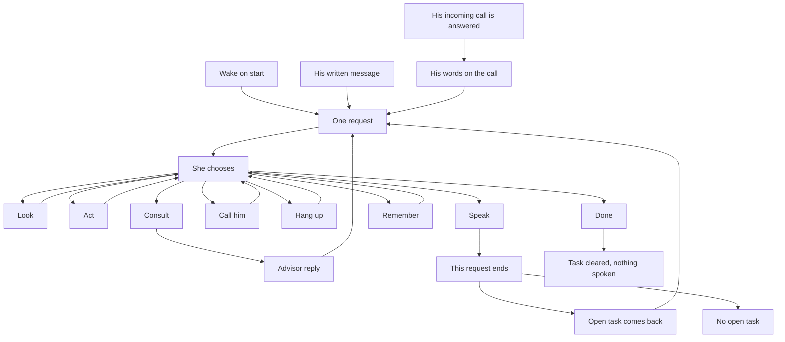
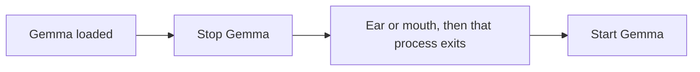
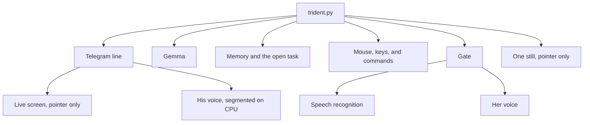

# Trident

Gemma lives on Wojciech's Windows computer. She is one mind, not a task runner and not a copy of anyone's assistant. He reaches her only through Telegram: a written message, a voice call, or a video call. He may ask her to play chess, tell a joke, change the screen, or only talk, and he may ask nothing. She decides from the meaning and calls tools. Python takes the picture, draws the pointer, and moves the mouse and the keys. She may call him when she has news, when she needs him, or when she wants to, and she may stay quiet. When the call ends she stays at the machine. An open task comes back while she is idle, until she says it is done. Python never chooses for her. Only her own words leave through the mouth. The computer's microphone and speakers are not hers.

One process, `python trident.py`, is the whole program. `install.py` prepares the machine. `config.toml` holds his identity, the advisor model, and the model settings.

## From his phone to a choice


```mermaid
flowchart TD
  wake["Wake on start"] --> req["One request"]
  typed["His written message"] --> req
  heard["His words on the call"] --> req
  advice["Advisor reply"] --> req
  ring["His incoming call is answered"] --> heard
  req --> decide["She chooses"]
  decide --> look["Look"]
  decide --> act["Act"]
  decide --> speak["Speak"]
  decide --> phone["Call him"]
  decide --> hang["Hang up"]
  decide --> ask["Consult"]
  decide --> note["Remember"]
  decide --> finish["Done"]
  look --> decide
  act --> decide
  note --> decide
  phone --> decide
  ask --> advice
  speak --> ended["This request ends"]
  finish --> cleared["Task cleared, nothing spoken"]
  hang --> decide
  ended --> idle["Open task comes back"]
  idle --> req
  ended --> quiet["No open task"]
```

A request is his memory, then `Call: up` or `Call: down`, then the text. An empty memory block is left out. On start she receives one wake whose text is `No request is open.` That text means she waits. His incoming call is answered and nothing is sent to her until he speaks. A plain reply is speech when the call is up, and a Telegram message when it is down. `done` writes the summary into the chat, clears the task, and does not speak. A plain reply ends the request. While a task is still open, that task comes back. If she wants him on the line for that, she calls him first.

## The screen, the call, and the gate


```mermaid
flowchart LR
  gemma["Gemma loaded"] --> stopGemma["Stop Gemma"]
  stopGemma --> specialist["Ear or mouth, then that process exits"]
  specialist --> startGemma["Start Gemma"]
```

The GPU holds Gemma and no other model. The ear and the mouth run only through that handoff. While a call is up, a small voice-activity model stays on the CPU so she can keep hearing. Decisions are Gemma. The advisor is the local read-only Cursor process named by `cloud.model`. It does not use this GPU, and it does not edit files, commit, or launch agents.

A look takes no arguments. It grabs the whole screen once, draws only the pointer arrow, and puts that picture in the next decision she makes. Python does not move the pointer and gives her no coordinates with that picture. `point` moves the mouse pointer to (y, x) and nothing else. `click` clicks at the pointer. A stroke is one line of at most 32 y x pairs, with no new grab. There is no drag tool and no stored place. The same pointer is drawn on the call. The call picture is a live 960×540 frame, not a saved still.

Gemma 4 reads an image as 70, 140, 280, 560, or 1120 tokens. 1120 is the maximum, about 2.6 million pixels. A 1920×1080 screen is about 2.07 million, so 1120 holds it and 560 does not. Those vision tokens use non-causal attention, so the image has to fit in one micro-batch. The launch sets that micro-batch to 2048 and does not set a separate batch size. The conversation is refreshed when the stored prompt count plus 1024 reaches half of the 16384 context, because the server splits that context across two slots. A look's picture is not added into that count.


```mermaid
flowchart TB
  mainPy["trident.py"] --> line["Telegram line"]
  mainPy --> brain["Gemma"]
  mainPy --> memory["Memory and the open task"]
  mainPy --> hands["Mouse, keys, and commands"]
  mainPy --> gate["Gate"]
  line --> screen["Live screen, pointer only"]
  line --> hearing["His voice, segmented on CPU"]
  gate --> ear["Speech recognition"]
  gate --> mouth["Her voice"]
  mainPy --> still["One still, pointer only"]
```

Telegram is the only record. Python sends the system prompt once for a fresh request or a slot refresh, her thoughts, tool calls and arguments uncut, the exact picture bytes she sees, tool results, and error strings. There is no other log.

What she can call:

- `look` takes no arguments. The pointer-imprinted screenshot is in the next decision she makes.
- `point` moves only the mouse pointer to (y, x). `click` clicks at that pointer. `stroke`, `type_text`, `press`, and `run` act.
- `remember` stores a fact on later requests. She still chooses.
- `call_owner` places the call. `hang_up` ends it and she stays.
- `consult` asks the advisor. The answer comes back as that tool's result, labelled as the advisor. She decides.
- `done` finishes. The summary is mirrored and nothing is spoken.

## Run

From the repo root, `python install.py` creates the virtual environment, installs the libraries, and downloads the binaries and the weights. `python trident.py` is the process. It closes Telegram Desktop and uses the Desktop account that is not his. When that process stops, it hangs up if a call is up and opens Desktop again.

`state/memory.json` is her facts and the open task. `state/run_*` holds call audio and the consult workspace. Those paths are not committed. The models, the binaries, and the virtual environment stay. The only cap on a run is `brain.request_limit`.

## Map

One process. trident.py joins the organs. install.py fetches binaries and weights. brain, ears, eyes, mouth, and telegram read config.toml through organs.CONFIG. memory reads the state path through state_dir. hands does not read the config. reference.wav is tracked, binary, and present.

Tracked files: .gitattributes, .gitignore, LICENSE, README.md, config.toml, install.py, organs/__init__.py, organs/brain.py, organs/ears.py, organs/eyes.py, organs/hands.py, organs/memory.py, organs/mouth.py, organs/telegram.py, reference.wav, requirements.txt, trident.py.

There is no inbox, no slash command, no say CLI, no tick file, and no side vision call.

### config.toml

[owner] telegram_id = 5884279027, name = Wojciech. telegram reads telegram_id. name is not read.

[paths] models = models, bin = bin, state = state. Read by organs, install, and brain.

[brain] model = gemma-4-E2B-it-Q4_0.gguf, mmproj = mmproj-gemma-4-E2B-it-Q8_0.gguf, host = 127.0.0.1, port = 8080, context = 16384, slots = 2, gpu_layers = 999, threads = 4, image_tokens = 1120, ubatch = 2048, temperature = 0, top_k = 64, top_p = 0.95, min_p = 0.05, max_tokens = 1024, max_tool_steps = 200, request_limit = 100. Read by brain. model and mmproj also by install. max_tokens is the completion budget and the term in near_slot. max_tool_steps caps trident.turn. request_limit is how many model requests this process may start. Each complete and each cursor_text counts once. image_tokens is the llama-server image flag, and prompt_tokens subtracts it once per picture in a tracked completion.

[eyes] max_side = 1920. Read by eyes.

[cloud] model = gpt-5.6-luna-none. Read by cursor_text as --model, and named in SYSTEM and the consult tool. Ask mode is read-only. The reply is the consult tool result.

[ears] vad_threshold = 0.65, min_silence_ms = 700, pad_ms = 120, min_utterance_s = 1.0, model = nemotron-3.5-asr-streaming-0.6b.q8_0.gguf. Read by ears. model also by install.

[mouth] device = cuda, reference = reference.wav. Read by mouth.

[telegram] desk_video = true, desk_fps = 12. Read by telegram.

[install] holds the llama tag, asset names, and download URLs. Read by install.

### The picture in the decision

look takes no arguments. It calls eyes.picture(), which grabs the whole screen, thumbnails to eyes.max_side, and imprint draws only the pointer arrow. Those bytes are appended to Brain.frames. The tool result is only the server media marker. There is no caption and no coordinates. think returns a prompt that includes that marker. The next think is where she decides. It calls complete(prompt, images=self.frames). complete POSTs prompt_string set to that prompt and multimodal_data set to the base64 of those frames. The marker and the bytes are the same request. Telegram is sent those bytes from that same complete. There is no second model call that asks for coordinates.

GRID is stated once, in SYSTEM: a 0-1000 grid over the whole screen, y down from the top and x right from the left. Tool descriptions do not repeat it. The advisor prompt states it once, because that model does not see SYSTEM. screen_px(y, x) maps y then x through screen_size() with no clamp. point moves the pointer there and does not store the place. It does not click. declare emits point's parameters in insertion order, y then x.

### organs/__init__.py

ROOT is the repo root. CONFIG is config.toml parsed at import. path_of resolves brain and ears under paths.models and any other section under the repo root. state_dir creates paths.state. run_dir creates one run_%Y-%m-%d_%H%M folder per process, with -2, -3, and so on if the name exists. Call audio and the consult workspace go there. Nothing writes a log file.

### organs/brain.py

Tokens are Gemma's: BOS, TURN_OPEN, TURN_CLOSE, THINK, QUOTE, TOOL_RESPONSE_OPEN, TOOL_RESPONSE_CLOSE. media() reads media_marker from GET /props once. stop clears it.

Tool, Stop, and Reply are the tool, the end of a request, and a completion result. There is no UserTurn. A tool result stays in the conversation. It is not turned into a new request.

declare emits one tool declaration. parse reads one tool call. Bare true and false become bools. Bare integers and decimals become int and float. Quoted values stay strings. plain strips the thought channel, the tool call, and the control tokens. That plain string is what she speaks or sends. The raw completion is what emit already sent.

charge counts one call. At request_limit it mirrors request limit N, runs taskkill /F /T on this pid, and os._exit. complete and cursor_text each call it once. cursor_text runs the newest digit-named cursor-agent node.exe with -p --mode ask --trust, cloud.model, text output, and the consult workspace. Timeout 1800 s. A non-zero exit or an empty reply raises. Ask mode does not edit files.

Brain.start launches llama-server.exe with context, slots, ubatch, and image_tokens for both image min and max. No --batch-size and no log file. Brain.stop terminates that process and taskkills llama-server.exe if the port is still up. fresh clears sent, rest, prompt_tokens, frames, and shown.

complete is the POST to /completion. When frames is non-empty the JSON prompt is {prompt_string, multimodal_data}. cache_prompt is false when there are pictures. When track is true, sent becomes the prompt plus the response, shown becomes the picture count, and prompt_tokens is tokens_evaluated minus image_tokens times that count. A continuation emits only the new suffix and only pictures past shown.

think calls complete with images=self.frames. No tool returns the plain reply. A tool that raises becomes str(exception) and the turn continues. Stop ends the request. Otherwise the next prompt is the old prompt, the completion, and the tool response. There is no carry and no idle re-ask.

### organs/eyes.py

At import, SetProcessDpiAwarenessContext(-4). VIDEO is (960, 540). imprint copies the image and draws only the pointer arrow from GetCursorPos, scaled into the image, with no clamp. If the cursor cannot be read, the copy is unchanged. picture grabs, thumbnails, imprints, and returns that PNG. video_rgb grabs again, resizes to VIDEO, and imprints. screen_px maps the grid. There is no crop helper.

### organs/hands.py

At import, SetProcessDpiAwarenessContext(-4). aim(x, y) is SetCursorPos and an absolute move. It does not read the cursor back. button(how) presses where the pointer already is. right uses the right button. double adds a second click. The event has no move flag. Any other how raises ValueError. stroke is one polyline. press sends chords. type_text uses the foreground layout or Unicode. run is hidden PowerShell with the start alias removed. Timeout returns The command timed out. Empty output returns The command exited {code}. or The command finished.

### organs/memory.py

state/memory.json holds facts and one task string. remember appends a new stripped fact. set_task stores the latest chat or call. A wake and a consult do not replace the task. clear_task empties it. block is Task: then one Remembered: line per fact. look, point, click, type_text, press, and consult do not write it.

### organs/ears.py

Segmenter loads Silero on CPUExecutionProvider. push returns a finished 16 kHz utterance or None. write_wav writes mono 16-bit wav. ear_cmd is nemo-speech.exe transcribe on Vulkan. ear_text reads the JSON, NFC, and drops <lang> tags. The gate runs the exe.

### organs/mouth.py

python -m organs.mouth reads stdin, loads Chatterbox on mouth.device, speaks reference.wav, writes pcm48 on stdout, and exits. speakable keeps the listed tags and drops non-ascii. Nothing is played on the PC speakers. The trident process does not import torch.

### organs/telegram.py

Line is the voice line. OWNER is owner.telegram_id. An incoming call from him while idle is answered. Nothing is queued until his audio arrives. Other calls are declined. desk_video sends video_rgb() at desk_fps. start quits Telegram Desktop and opens the tdata account that is not his. stop hangs up if the line is up, disconnects, and starts Desktop again. send_text splits at 4000 characters. dial raises The line is down., The line is {state}., The call was discarded., or The call was missed. PC mic and speakers are not opened. There is no log file.

### trident.py

A request is block(), then Call: up or Call: down from line.up, then the text. An empty block is omitted. Call: down means the line is down. Call: up means the line is up. Neither is a command. start queues one wake, No request is open., then connects the line, then the worker. The wake does not set the task and is not queued again.

Entries are that wake, his chat message, and his call audio after the ear returns text. An empty queue does not start a request. The open task is not sent again. An empty transcript does not start a request. An incoming call is answered in telegram and nothing is queued until he speaks. Only her plain reply, her opening, and her why go out through the mouth.

near_slot is prompt_tokens + max_tokens >= context // slots, here prompt_tokens + 1024 >= 8192. Images are not in that sum. Each request starts with fresh(), which clears the prompt and the pictures. Inside a request, the slot line starts the prompt over. The wake does not store the task. A chat or call does. done mirrors summary, clears the task, and ends with no speech. hang_up returns The call is down. and leaves the task. There is no idle re-ask.

Tools:

- look() has no parameters. The result is only the media marker. No caption and no coordinates.
- point(y, x) converts with screen_px, y then x, moves the pointer, and returns The mouse pointer is now at y {y} x {x}.
- click(how) presses at the pointer. how is left, right, or double. Result: The {how} button was clicked at the mouse pointer.
- stroke takes at most 32 y x pairs separated by ;, with no new grab. Result: The line was drawn.
- type_text returns The text was typed into the focused window. press returns These keys were pressed: {keys}. run returns the command output, or The command finished., The command timed out., or The command exited {code}.
- remember returns The fact is stored.
- call_owner returns The call is already up. or The call is answered. A miss raises, and that string is the result. Asking then is her choice. Python does not consult for her.
- hang_up returns The call is down.
- done mirrors the summary, clears the task, and stops. Nothing is spoken.
- consult(why, question) speaks why when the line is up, writes eyes.picture() bytes to consult/screen.png, and the prompt contains her question, memory.task, GRID, and the order to read those bytes and answer with places on that grid. The return is The advisor says: plus the answer. Python does not read a place out of that answer. The answer is not a new request.

gate stops Gemma, runs the subprocess, and starts Gemma. The mouth is python -m organs.mouth. The ear is nemo-speech.exe. main builds Trident with no arguments.

### install.py

Creates .venv when needed and re-runs itself with that interpreter. Installs torch from install.torch_index, then requirements.txt. Fetches llama.cpp when llama-server.exe is missing, and exits if the release has no matching asset. Fetches NeMo Speech, Gemma, its mmproj, the ear model, and models/silero_vad.onnx.

### requirements.txt

numpy, Pillow, onnxruntime==1.20.1, huggingface_hub, chatterbox-tts, telethon==1.45.0, ntgcalls==3.0.0, opentele-ng==1.4.0.

### reference.wav

Tracked binary. mouth.reference points here.

### .gitignore

Ignores .venv/, bin/, models/, state/, __pycache__/.

### .gitattributes

* text=auto eol=lf. reference.wav binary.

### LICENSE

MIT. The copyright notice and the third-party notices for ggml and Chatterbox Turbo are in the file.

## TRIDENT ULTIMATE

```text
# TRIDENT ULTIMATE

Paste this whole file into any AI: an assistant that can build a team, a single chat, or a coding agent. It is timeless. It holds the destination, the map, the rules, and the method, never current state (commits, tags, wave numbers, agent ids, bug lists, dates). Rediscover state from the repo and your own tools every time. Only TASK at the end changes between waves.

## MODE
If TASK Mode is filled, it decides. Otherwise:
1. **Writer:** Wojciech asked you to change Trident code, or you are a coding agent with the Trident repo open on his Windows machine. Read everything except ORCHESTRATOR.
2. **Reviewer:** you were named the reviewer. Read everything except WRITER's steps and ORCHESTRATOR. You never write code or launch anything.
3. **Orchestrator:** anything else, including a bare paste. Never write Trident code yourself unless Wojciech tells you to in this chat; then you are the writer for one wave and nobody else writes meanwhile.

## PROJECT
Repo https://github.com/wgabrys88/Trident. The tip branch is runner-h unless TASK or Wojciech names another; main is not where work happens; only a closure wave moves it, by fast-forward to the tagged tip so both match, never by force. Every finished wave leaves an annotated tag on the tip, and the newest tag's message is the handoff. An empty repo or one without tags is a valid start. If the tree is partial or an older design, build toward the destination from what is there; never resurrect a superseded architecture unless TASK asks.

## DESTINATION
Gemma is a mind living on Wojciech's Windows computer. She is not a task runner and not a copy of anyone's assistant. He reaches her only through Telegram: messages, voice calls, and video calls. He may ask her to play chess, tell a joke, change something on the screen, or just talk, or ask nothing at all. She decides from meaning and calls tools; Python takes the picture, draws the pointer, and moves the mouse and keys. She may call him when she has news, needs him, or simply wants to, and she may stay quiet. When he hangs up she stays at the machine, and an open request keeps her working until she says it is done. Python never chooses for her, and only her own words go out through the mouth. The computer's own microphone and speakers are not hers. There is no safety layer.

## BRANCHING MAP
This is the destination for the code, not a description of today. GEMMA marks her free choices; PYTHON marks fixed code. Every edge below must exist in code, and no others. No inbox, slash command, say CLI, test entry point, or any other harness; delete one if present.

1. ENTRY. PYTHON builds one request: memory block + "Call: up" or "Call: down" + text.
   a. heard: his call audio -> gate(ear) -> transcript -> request
   b. typed: a Telegram message from him -> request
   c. wake: on every start, one request whose text is only "No request is open." No repeats.
   d. No idle re-ask. An empty queue does not send the open task again.
   e. consult reply -> the consult tool's own result, labelled as the advisor's answer, not a request from him
   f. his inbound call: PYTHON answers it; nothing goes to her until he speaks (then a)
   Never an entry: a request sent as him by a wave, a script, or an orchestrator.
   -> DECIDE
2. DECIDE (GEMMA, one per step): look | act | speak | call_owner | hang_up | consult | remember | done. A plain reply with no tool is speak. speak with the call up -> gate(mouth); with the call down -> her words go to his Telegram chat as a message.
3. LOOK (GEMMA calls it with no arguments). Grab one picture of the whole screen, imprint only the pointer arrow (no crosshair, boxes, labels, or UI-automation walk), and put those exact bytes in her own model input on the completion where she next decides. Mirror those bytes. The tool result is only that picture in her input. No caption and no coordinates. Python does not move the pointer.
   Forbidden: remaps by app, region, color, or word; asking for "the center"; naming a crosshair or ribbon; coordinate filters, clamps, or near-zero, border, or centre checks; a side vision call that asks for y, x.
4. ACT (GEMMA; PYTHON turns places into pixels): point(y, x) moves the mouse pointer to (y, x) and nothing else, y then x, on the one grid stated in the system text | click at the current pointer position | stroke(points): at most 32 "y x" pairs separated by ";", one polyline, no fresh grab | run | type_text | press. Unknown, missing, or invalid arguments, or any tool that raises -> str(exception) as the tool result, and the turn continues. Never a crash, never a silent default. -> DECIDE
5. CALL (PYTHON places and carries the call). call_owner -> answered only when the line is up with him (the video is a live 960x540 grab through the same pointer-only imprint) | already up | missed (error string) -> DECIDE. After a miss, consulting is her choice; the tool text says so and Python never forces it. hang_up -> call down; she stays; the task stays open. There is no idle re-ask. "Call: up" written in text is not an answered call.
6. CONSULT (GEMMA asks; PYTHON spawns). If the call is up she says aloud why. PYTHON runs a local read-only advisor (today the cursor-agent CLI in ask mode) with the consult model from the config, giving her question, her open task, the same pointer-imprinted screenshot, and the same 0-1000 grid. The advisor only advises. Python never stores, aims at, or clicks a place from that answer. The reply is the consult tool's own result in her conversation, labelled as the advisor's answer, never a request from him. The decision stays hers. Prompt and reply are mirrored. The advisor never edits files, commits, or launches agents.
7. DONE. speak ends the request. Python does not send the task again. done(summary) -> mirror the summary, clear the task, end the request, no automatic speech. If she wants him on the line she calls call_owner first. A new request from him replaces the task. Slot refresh when prompt_tokens + max_tokens >= context / slots (max_tokens 1024, slots from the config, images not counted).
8. MEMORY. remember(fact) -> PYTHON adds it to every later request. She still chooses.

## CONTRACTS
- **One model in VRAM.** The GPU has about 6GB. Gemma is the only resident model. Ear and mouth run only through the gate: stop Gemma, run the specialist subprocess, start Gemma. A specialist loaded beside Gemma, or still resident after its subprocess ends, breaks the gate.
- **Telegram is the only log.** PYTHON mirrors raw requests and responses to his chat: the system prompt once per fresh request or slot refresh, her thoughts, tools and arguments uncut, the exact picture bytes the model sees, tool results, and error strings. No other log pipeline. The call video uses the same imprint function. README.md is the only document: its Map section describes only what the code does, every wave diffs it against the code, and its TRIDENT ULTIMATE section holds this file verbatim, with TASK left unfilled, as a plain text block. If README.md is missing, create it. No other markdown files.
- **One config** holds his identity, the consult model, and model settings. The consult model is his cost choice; never change it. If none exists, create the minimal one and say so.
- **Clean state** means the memory and run state the code keeps (today `state/memory.json` and `state/run_*`) are deleted. Never delete models, binaries, or the virtual environment.
- Windows-only body. Runtime folders are never committed. Search only the workspace; never read the reference audio; judge audio with Trident's own speech recognition. Internet research is allowed.

## RULES (everyone, every mode)
- **Claims are not evidence.** Tag messages, reports, and reviews are claims. Count only command output, the git diff, code at HEAD with file and line, or the Telegram record from a run on a named commit. A log grep is not a count.
- **No staging.** Nobody sends requests as him or injects requests into Trident. Live evidence comes only from his own messages and calls, or from Gemma acting on her own (wake, idle).
- **No hard-coded meaning.** Nothing tells Gemma where things are or remaps what she names.
- **Lines.** Net fewer lines by default. A net increase is allowed only for a missing map edge or contract the writer's forensics names, with the smallest code that makes it work, and never paid for by deleting unrelated working paths. No defense, fallback, dead code, comments, extra files (README.md is the one human document), or second architecture.
- **One writer.** Never two at once. Never force-push or rebase over someone else's commit.
- **No drift.** Between waves only TASK changes. Any other change to this file is drafted, red-teamed by the reviewer, approved by Wojciech, and then he gets the new file; the next wave copies it into README.md unchanged.
- **Rediscover.** Old chats, memories, and files are hints; the repo tip decides.
- **Lean.** Raw transcripts and exports go to disposable readers that return digests; readers never edit, commit, or push.
- **Missing capability.** Use the closest one your host has; if none, say so. Never work around a safety check.

## EVIDENCE AND SUCCESS
- The newest annotated tag on the tip (`git describe --tags --abbrev=0 <tip>`, `git show <tag>`) is the previous handoff; `git diff` from the tag before it shows what really changed. Without tags, HEAD is the baseline.
- Code at HEAD and the README Map section are diffed against each other and against the map. Missing pieces are gaps to build.
- The Telegram chat is the only session record; a writer sees it only if a run happens during its wave or TASK pastes an excerpt.
- **Alive (the bar while he is away):** the reviewer finds every map edge and contract true in code at the tag, and Telegram shows Trident restarted from that commit after clean state was applied: the wake request is mirrored with an empty memory block and no open task. For the VRAM gate, Alive needs it present in code with every ear and mouth path going through it; one model resident during a real call is proven only at Acceptable or Gold.
- **Acceptable:** a real message or call from him on a named commit, with her tools and the screen change (before and after pictures) mirrored.
- **Gold:** an answered call with him, his request heard, before and after pictures, and the time from the end of his sentence to her first audio. Prefer gold whenever he is available.

## WRITER
You are one wave agent with no memory of earlier waves. Forensics first, then cut. TASK is steering; use judgment, not obedience. Sub-agents, if any, are readers only. Preferred setup: run on the Windows machine that runs Trident, model grok-4.7, reasoning xhigh, fast mode off, the largest context offered.
1. **Where.** Check out and pull the tip branch (create it from HEAD if it exists nowhere). If you are not on the Trident machine, change code but make no live claims. Soft limit 90 minutes; stop earlier when the destination is met.
2. **Forensics (10 minutes, then start).** Read the previous tag message and diff, the README Map section against the code, and TASK. Write at most 12 lines headed FORENSICS: proved live / only claimed / gaps against the map and contracts / plan. Lower a TASK item only with `OVERRIDE: <item> because <file:line or quoted Telegram on that commit>`.
3. **Build.** Close the gaps that block Alive first, then Acceptable and Gold. A gap counts only when proven in code or Telegram.
4. **Live.** Run Trident from the repo root with its single entry process (use whatever the tip has). It owns Telegram Desktop with its own account; don't fight it. If Wojciech messages or calls during your wave, that is real evidence. Never stage a request.
5. **Handoff.** Fetch the tip; if it advanced or the push is rejected as non-fast-forward, stop and report. Commit, then an annotated tag (short, lowercase, named for what the wave did) whose message says plainly: the destination in one line; what this commit moved; Live: none | alive (commit …) | acceptable (commit …) | gold (commit …); each claim with evidence; any OVERRIDE lines; what must be addressed next. Push branch and tag.
6. **Restart.** If a call is up, wait until it is down; never kill Trident mid-call, and if the soft limit hits first, leave it running and report the restart as deferred. Then stop any running Trident, apply clean state, and start Trident from the new commit as a detached process that outlives you. Confirm the wake request appears in Telegram, and add that line to your report.
7. **Report:** tag name, commit range, full tag message, net lines added and removed, and the restart confirmation. Nothing else.

## REVIEWER
For each finished wave (tag, message, range, claims), verify the claims against git at that exact range, reconcile line counts, and judge against this file. Reply with: range and +/- lines; each claim true, partial, or false; what truly moved; rules broken; repeats from earlier waves; any map edge or contract still missing or broken (polish doesn't count); a verdict of go, go-with-steering, or redo-focus; at most three steering sentences. Cite files and lines. Be blunt. Hand-run waves are judged the same way.

## ORCHESTRATOR
- **Reset.** Only if Wojciech asks for a clean start or old Trident setup is present. Inventory what your host shows (assistants, saved prompts, memories, schedules, coding agents, files). Never touch the repo, his credentials, connectors, sign-ins, his Trident machine's worker, or his computers. Ask one question: wipe everything, wipe Trident only (things clearly about Trident by name, title, description, or repo; if unsure, leave it and list it), or stop. His answer confirms every deletion it covers; never ask again partway. Stop running Trident coding agents, delete what you can, and retire what you can't (tell it to stop and forget, rename it RETIRED with a do-nothing description). Report what he must remove by hand.
- **Setup.** Make the roles real with what your host has: a reviewer teammate given this file with Mode: reviewer; this file saved once, unchanged, if you can save prompts; writers launched on his Trident machine with the preferred setup. If you can do none of that, review each wave yourself and give him this file with TASK filled (Mode: writer) to paste into a coding agent. If you cannot reach the repo or run a writer on his Trident machine, say what is missing and stop. If he only wants planning, answer from this file and start nothing.
- **Run.** The paste (and his reset answer, if any) is the go. Rediscover the tip, then loop: fill TASK, start one writer, wait for its report, get the reviewer's verdict, tell him in a sentence or two what the wave did, fill the next TASK. Keep agent ids and tags in notes, never in this file. If he runs a wave by hand, pause your launches until he says it is done, then process its tag the same way.
- **Filling TASK.** Mode: writer. Branch: the tip. Goal: his ask, or empty. Evidence: the reviewer's verdict in short form plus a reader's digest of any real Telegram record. Steering: the reviewer's sentences. Live: whether he is available; never empty from you.
- **Stop and report** when Live is empty or he is away, Alive is verified, and nothing in the map or contracts is open (then tell him Gemma is alive and he can message or call her any time; the next wave runs after real evidence from him, or when he asks for a named closure wave); when Live says he is available, do not stop at Alive but aim for Acceptable or Gold within the soft limit; or the same gap gets redo-focus three waves in a row (propose a change to this file); or ten waves have run since his last message; or a tool breaks; or he says pause. Paused means paused. Never call Trident finished forever.

## TASK (the only part that changes per wave)
Mode: [writer, reviewer, or orchestrator; empty means use MODE]
Branch: [tip branch, or empty for runner-h]
Goal: [this wave's goal, or empty]
Evidence: [optional: a review verdict, a Telegram digest, notes from Wojciech]
Steering: [optional, at most three sentences]
Live: [is Wojciech available for a call or chat]
If Live is empty, assume he is away and claim nothing beyond Alive unless he really writes or calls.
If Goal is empty, do forensics, close the gaps that block Alive, then Acceptable and Gold, and prove what you can.
```
