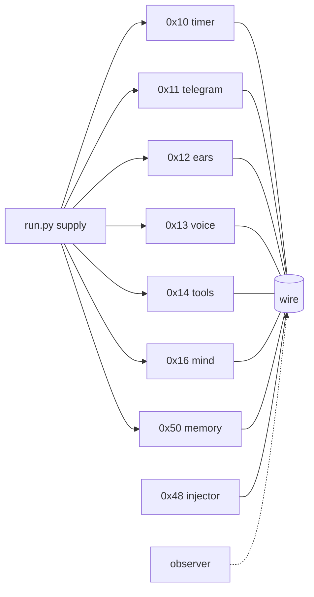

# Trident

Data sheet status: **Preliminary**. Rev. 21, 2026-10-08. Tag `v21-protocol`.

Preliminary means the tree is built and the self-tests pass. It is not live-proven. Product status waits on a real Telegram user call, journaled, as section 13 describes.

## 1. General description

Trident is one organism on the owner's Windows computer. Each device is its own process at its own 7-bit address. The devices share a folder that stands in for the wire. `run.py` is the supply. It is not on the bus and it carries no frames.

The mind is the device at `0x16`. The part fitted in that slot today is named in section 6.4.7. Swapping that part is a change to this datasheet and to `config.toml`. It is not a second device.

`i2c.py` is the bus library. Every device links it and imports no other device. Started without `--test` it prints `i2c.py is the wire` and exits 1.

## 2. Features

- One process per device. A new capability is a new device or a new register, written here first.
- Frames follow NXP UM10204. The folder layout is a recorded choice where a file cannot be SDA or SCL.
- Fault confinement is Bosch CAN 2.0 Part A §7, two counters, with the wire limits in section 6.3.
- The supply restarts a device that exits, and stops the whole organism when any device reaches the restart cap.
- Large payloads stay in files. A frame carries a path.
- One self-test flag, `--test`. One injector. One observer with no address.

## 3. Ordering information

| Item | Value |
| --- | --- |
| Host | 64-bit Windows, Python 3.11 |
| Python packages | `requirements.txt` |
| Start | `artifacts\python\Scripts\python.exe run.py` |
| Install | `py -3.11 install.py` |
| Mind slot | `0x16`, process `mind.py` |
| Fitted part | section 6.4.7, keys under `[mind]` |
| Ear, voice, vision | `[ears]`, `[voice]`, `[vision]`, fetched by `[fetch]` |

No key or credential is stored in the tree. The Telegram session is the owner's Desktop `tdata`, path key `telegram.tdata`.

## 4. Block diagram


```mermaid
flowchart LR
  run[run.py supply]
  t10[0x10 timer]
  t11[0x11 telegram]
  t12[0x12 ears]
  t13[0x13 voice]
  t14[0x14 tools]
  t16[0x16 mind]
  t50[0x50 memory]
  t48[0x48 injector]
  obs[observer]
  run --> t10
  run --> t11
  run --> t12
  run --> t13
  run --> t14
  run --> t16
  run --> t50
  t10 --- bus[(wire)]
  t11 --- bus
  t12 --- bus
  t13 --- bus
  t14 --- bus
  t16 --- bus
  t50 --- bus
  t48 --- bus
  obs -.-> bus
```

The supply does not start `0x48` or the observer. The injector is on the bus because it is a device. The observer is dotted because it has no address.

## 5. Pinning information

### 5.1 Address map

| Address | Process | Role |
| --- | --- | --- |
| 0x10 | timer.py | Boot identity read, boot dial, redial |
| 0x11 | telegram.py | Owner's Telegram user, chat and call. Owner's line. |
| 0x12 | ears.py | Nemotron on a PCM file. Owner's line. |
| 0x13 | voice.py | Chatterbox nano, turbo s3gen codec |
| 0x14 | tools.py | Screenshot, shell, vision, pointer and keys |
| 0x16 | mind.py | Mind slot. One turn off the bus. |
| 0x48 | injector.py | Controller-only test device. Not started by the supply. |
| 0x50 | memory.py | SQLite records |

`run.py` starts timer, telegram, ears, voice, tools, mind, memory, in that order, each with the `RUN_<stamp>` path.

### 5.2 Address description

Addresses are 7-bit. 10-bit addressing (UM10204 §3.1.11) is not used. Reserved addresses `0000 XXX` and `1111 XXX` (UM10204 §3.1.12) are not used.

`0x48` is `1001 000b`. SMBus 3.3.1 §6.2.2.3, quoted from the SMBus 3.3 text of that section:

> The Prototype addresses (1001 0XXb) are reserved for device prototyping and experimenting in applications that utilize purpose-assigned addresses. They are not intended for production parts and should never be assigned to any device.

Recorded choice: `0x48` is assigned anyway, and only to the injector, because the injector is not a production part and the supply does not start it.

Not used, and not implemented: SMBus PEC, ARP, Alert, Host Notify (SMBus §6.5.9), Hs-mode, general call, the SMBus Host role, and UM10204 §3.1.17 Device ID. Device ID needs reserved address `0x7C` and a repeated START to a different address. Both are excluded here.

SMBus §5.2 says a device must acknowledge its own address even when busy. That rule is not borrowed. A busy address NACK is UM10204 §3.1.6 condition 2.

## 6. Functional description

### 6.1 Provenance and precedence

Each mechanism is one of these: NXP UM10204 Rev. 7.0 (1 October 2021), SMBus 3.3.1 (20 October 2024), Bosch CAN 2.0 Part A §7 (the fetched text of the fault-confinement rules; ISO 11898-1:2015 clause 12.1 is the same rule set), or a recorded choice. A recorded choice is where the standard is silent, or where a folder on this computer cannot be a wire. A recorded choice is protocol.

The documentation order of this file follows the NXP and TI product-datasheet convention. That convention ranks under the bus protocols. Format follows the convention. Content follows the protocols.

| Mechanism | Source |
| --- | --- |
| Frame line `S`, address, `W` or `R`, `A` or `NA`, data bytes, one `Sr`, `P` | I2C UM10204 §3.1.4, §3.1.5, §3.1.6, §3.1.10. |
| ACK means the byte arrived. The result is a later read. | I2C UM10204 §3.1.6. Recorded choice: the standards do not define a second channel, so the result is the repeated-START read or a later read. |
| Five NACK causes | I2C UM10204 §3.1.6, used as section 6.2 states. |
| A target acts only when addressed | I2C UM10204 §3.1.10. The mind wakes only on a frame to `0x16`. No device sends it a frame on a timer. |
| At most one `Sr`, and only to the same address | UM10204 §3.1.10 says a controller can repeat-START another target. It does not require it. Two files would be STOP then START and would lose the §3.1.4 busy guarantee, because this carrier has no global busy state. Not used. `legal()` rejects a frame whose `Sr` names another address. |
| `0x48` | SMBus 3.3.1 §6.2.2.3, section 5.2. |
| Clock stretch | UM10204 §3.1.9. Only tools holds SCL, and only while a register `01`–`04` job still owes its result bytes. |
| Held-clock detection | SMBus 3.3.1 §4.2.2. Recorded choice: the budget is `busy.tools`, not the 25 ms to 35 ms `tTIMEOUT`, because the job is a screenshot, a shell, a vision request, or a pointer action. |
| Killing a live holder the supply started | UM10204 §3.1.16 power-cycle analogue. The supply terminates that process. It does not terminate a process it did not start. Deleting a dead process's SCL file is the line released. |
| Fault confinement | Bosch CAN 2.0 Part A §7, section 6.3. |
| Bus-off restart | CAN rule 12, plus the wire limit that a folder has no recessive bits. Not SMBus §4.2.2 and not UM10204 §3.1.16. |
| Folders and files instead of SDA and SCL | Recorded choice. `wire/<aa>/inbox/` is the target. `q-<controller>-<seq>` is the frame. The reply is `r-<seq>` in the controller's inbox. |
| No sender field. The filename carries the controller address. | Recorded choice. UM10204 §3.1.10 sends the target address, not the controller's. The journal column `src` is that filename address. The mind's stdin ends with that address and then the message. |
| No global lock. Two targets can be addressed at once. Two frames for one target are taken in filename order. | Recorded choice. UM10204 §3.1.7 and §3.1.8 arbitrate with a wired-AND. A file has no wired-AND, so there is no arbitration. A waiting controller still serves its inbox, which is the §3.1.8 duty to be a target while it waits. |
| Sharing errors 5 and 32 retry `share_retries` times from `share_delay`, doubling | Recorded choice. Windows file sharing is not an I2C event. |
| Only telegram `0x11` and ears `0x12` carry the owner's words | Recorded choice. The standards have no owner. Any other controller may still address the mind. |
| Cause-2 retry has no cap | Recorded choice. UM10204 does not define a retry count for a busy address NACK. |
| Data-NACK retry count is `nack_retries` | SMBus 3.3.1 §5.2 says the controller must STOP and retry, and it gives no count. |
| `q-` deleted after the reply is placed | Recorded choice, owner decision D3. Delivery is at-least-once. A crash can repeat one message or one dial. |
| Counters zero on `wire/` deletion and on the bus-off restart, and survive a crash restart | Recorded choice. CAN rule 12 zeros the counters on recovery. The fetched text gives no power-on value. Deleting `wire/` is power-on of the bus. |
| No hourly cap on paid turns | Recorded choice, owner decision D1. CAN counts faults, not successful turns. |
| Chat during a telegram restart keeps only ids newer than the last one seen at start | Today's behaviour. Owner decision D4 is open: drop, as today, or catch up. Not decided. |

### 6.2 Bus

A frame is one ASCII line:

```text
S <aa> <W|R> <A|NA> (<hh> <A|NA>)* [Sr <aa> <W|R> <A|NA> (<hh> <A|NA>)*] P
```

`aa` is the 7-bit address in hex. `hh` is one data byte. `A` means that byte arrived. `NA` is NACK. At most one `Sr`, and it names the same address as `S`. A read with data ends with `NA` on the last data byte. An empty read has no data byte. A legal frame names an address in `config.toml` `[address]`.

The controller writes the frame to a temp file, fsyncs it, and renames it to `q-<controller>-<seq>`. The target scans its inbox, takes the first `q-` name in filename order, handles it, writes `r-<seq>` into the controller inbox, and then deletes the `q-` file. ACK is only delivery.

Owner decision D3: deleting `q-` after the reply is placed is at-least-once. A crash after the handler has started and before that delete can run the handler again. A dial or a chat send can therefore happen twice. That is recorded, not hidden.

NACK, the five causes in UM10204 §3.1.6, as this bus uses them:

| Cause | What the code does |
| --- | --- |
| 1 no receiver | No `alive` file, or the target's `busoff` file is present. `request` does not place the frame. The counters do not move. Absence is not a CAN error frame. There is no node to charge. A bus-off unit has no influence on the bus (CAN §7), so it is not addressed. |
| 2 not ready | Address `NA` while `alive` exists and the device is not bus-off. The mind does this while a turn is open. The reply keeps the request's `W` or `R` (UM10204 §3.1.10: the R/W bit is part of the address byte). The controller keeps the frame and retries after `frame_timeout` for as long as the target is alive and not bus-off. No retry cap. Not a counter event. |
| 3 command rejected | A deliberate `Nack`, or a handler exception. The reply is `NA` on the first data byte, or an address `NA` when the write has no data byte. A deliberate `Nack` charges nobody. A handler exception adds 1 to the target's REC (CAN rule 1) and uses the same wire shape, because the wire has no third NACK. The controller sends STOP and retries `nack_retries` times (SMBus §5.2). It does not add to TEC. When the retries are exhausted it raises. |
| 4 no more room | Not a separate path. A bad register uses cause 3. |
| 5 end of read | The last read data byte is `NA`. Not a fault. |

An illegal line in an inbox is a form error. The target adds 1 to REC and replies. If the first data byte is hex, the reply is a data NACK of that byte. Otherwise the reply is an address NACK with the request's R/W bit, or `W` when the line has no direction. The controller then follows cause 2 or cause 3 from that shape.

`frame_timeout` is how long a controller waits for `r-<seq>` when SCL is free. If `wire/scl/<aa>` exists and that address has a `[busy]` key, the wait extends to that key. The file contains the pid and the time. Only tools writes it. `run.py` deletes it when that process is dead. If the process is alive, the supply started it, and the hold is older than `busy.tools`, `run.py` terminates it.

One journal line per handled frame, and one from the controller on timeout, in `RUN_<stamp>/bus.log`:

```text
<time> <src> <dst> <note> <ms> <frame>
```

`src` is the controller address. `dst` is the target. The handled line's frame is the reply. The timeout line's frame is the request. `note` is `ack`, `nack`, `fault`, `form`, `timeout`.

Large data does not ride the bus. A frame carries a path. The run folder holds `bus.log`, `turn-<n>.txt`, `pcm/<n>.pcm`, and `wav/<n>.wav`. A `turn-<n>.txt` file is written only when the mind process returns zero.

### 6.3 Fault confinement

Bosch CAN 2.0 Part A §7, borrowed with the wire limits below. Each device keeps `wire/<aa>/tec` and `wire/<aa>/rec`.

| State | Rule | Condition |
| --- | --- | --- |
| error-active | rule 11 | TEC ≤ 127 and REC ≤ 127 |
| error-passive | rule 9 | TEC ≥ 128 or REC ≥ 128 |
| bus-off | rule 10 | TEC ≥ 256 |

The numbers 8, 1, 128, 256, 119 and 127 are protocol constants in `i2c.py`. They are not keys in `config.toml`.

As controller, a timeout is an acknowledgement error. While the controller is error-active it adds 8 to TEC (rule 3). While it is error-passive it adds nothing (rule 3, exception 1), so a silent target cannot put its controller bus-off. A reply the controller accepts subtracts 1 from TEC, and TEC stays 0 when it is already 0 (rule 7).

As target, a frame it cannot parse, or an exception while handling one, adds 1 to REC (rule 1). A frame it acknowledges applies rule 8: REC subtracts 1 when it was from 1 to 127, stays 0 when it was 0, and is set to 119 when it was greater than 127. 119 is the value chosen inside the rule's range 119 to 127.

On this carrier the only transmit fault a frame can produce is that acknowledgement error. Exception 1 therefore stops TEC at the error-passive threshold. The self-test drives rule 3's +8 step, which a folder cannot produce as a bit error, to prove the bus-off threshold at 256.

Wire limits, recorded because a file has no dominant bit, no bit stuffing, and no error flag: rule 2, rule 3 exception 2, rule 4, rule 5, rule 6, and the sentence of rule 9 that an error-passive transition sends an active error flag. Those events do not occur.

An error-passive controller waits before it masters again (CAN suspend transmission: eight recessive bits after intermission). Recorded choice: a folder has no bit time, so the wait is one `frame_timeout`. During that wait the controller serves its inbox.

At TEC ≥ 256 the device writes `busoff` and exits. It does not print. A bus-off unit may have no influence on the bus (CAN §7). The supply prints `<aa> bus-off` and restarts the process after the backoff, unless that exit reaches `restart_cap`. On that start, `up` sees `busoff`, sets TEC and REC to 0, and deletes the file. That restart stands in for CAN rule 12, which needs 128 occurrences of 11 consecutive recessive bits. Recorded choice: a folder has no recessive bits.

Counters start at 0 when the supply deletes `wire/` (power-on). A crash restart keeps both files. Only the bus-off restart zeros them.

Any device whose fast exits reach `restart_cap` stops the whole organism. A fast exit is one that did not stay up for `stable_seconds`. The supply prints one line, `<aa> cannot start`, writes `wire/<aa>/down`, terminates the processes it started, and exits 1. It does not start that device again. Owner decision D2. If the device is telegram, the owner's line is down because the organism has stopped. An uncaught Telegram flood is one of those exits.

A run longer than `stable_seconds` zeros that device's crash count and its backoff.

### 6.4 Registers

Bytes after the address. A bare read is `S <aa> R`. A command result is the same write plus `Sr <aa> R`. The shared helpers `reply`, `accept`, `post`, `main_for`, and `rehearse` frame those bytes. They do not choose a register.

#### 6.4.1 0x10 timer

| Bytes | Dir | Meaning |
| --- | --- | --- |
| `02` | W | He did not answer. ACK. If no wait is already set, redials are under `redial_cap`, and the mind is up, arm one wait of `retry_seconds`. A second `02` does not move that deadline. |
| `03` | W | Cancel the wait and zero the redial count. |
| other | W | Data NACK. |
| read | R | `00` idle, `01` a wait is armed. |

The wait does not hold SCL. Before the boot dial, and only when telegram is alive and the mind is up, the timer masters `F0` with `Sr` to `0x16` and then masters telegram `01`. The identity bytes are the journal line of that read.

#### 6.4.2 0x11 telegram

The session is the owner's Telegram Desktop `tdata`. The account must be one user who is not the owner and not a bot. Incoming calls from the owner are answered. Chat is his private messages only.

Owner decision D4 is open. Today's behaviour, which stays until he decides, takes only message ids newer than the last one seen at start. A chat he sends while this process is down is not delivered after the restart.

This device is on the owner's line. The frames it masters to the mind are his words.

| Bytes | Dir | Meaning |
| --- | --- | --- |
| `01` | W | Dial. ACK and start the call only when state is down. Otherwise data NACK. The ring wait is `ring_seconds`. |
| `02` | W | Hang up. |
| `10` then UTF-8 | W | Send that chat text, in slices of `chat_slice`. If the call is up, also master voice `01` plus the same text. |
| `20` then a path | W | Queue that wav. `pump` plays it only while the call is up. |
| other | W | Data NACK. |
| read | R | `00` down, `01` dialing, `02` up. |

Microphone audio is 16-bit mono PCM at `pcm_rate`, in frames of `frame_ms` ms. VAD uses `rms_threshold`, `silence_ms`, `padding_ms`, and `utterance_seconds`. Each finished utterance is `RUN_<stamp>/pcm/<n>.pcm`, then ears register `01` plus that path. No answer hangs up and masters timer `02`. The connect wait after accept, and the wait for the confirmed call, are `connect_seconds`.

Playback is 16-bit signed little-endian mono. A stereo WAV is mixed down. The sample rate is converted to `play_rate`. Bytes per second are `play_rate` times 2. Frames are `play_frame` bytes.

The client is built with `request_retries`, `connection_retries`, and `flood_sleep_threshold` from `[telegram]`, with `auto_reconnect` false, with `raise_last_call_error` true, and with `catch_up` true. There is no key for reconnect or for those two flags. `catch_up` can deliver older updates. The id filter above is what drops them. `FloodWait` is not caught. The call protocol uses `min_layer` and a DH size of `dh_bytes`. Recorded choice: those are the values this Telegram stack requires. The `facd00f` photo-send and digest guards are not in this tree and are not restored.

A partial install is not this device's problem. Section 15 says how a failed install is cleared.

#### 6.4.3 0x12 ears

This device is on the owner's line. A non-empty transcript it masters to the mind is his words.

| Bytes | Dir | Meaning |
| --- | --- | --- |
| `01` then a PCM path | W | ACK, then off the bus run VAD on the file and Nemotron at `pcm_rate`. Non-empty text is mastered to the mind as raw UTF-8, with no register byte. |
| other | W | Data NACK. |

Load of the DLL must finish within `start.ears` or the process exits. That wait is not a clock stretch. The VAD frame is `frame_ms` at `pcm_rate`, 16-bit mono.

#### 6.4.4 0x13 voice

| Bytes | Dir | Meaning |
| --- | --- | --- |
| `01` then UTF-8 | W | ACK, then synthesize off the bus. The wav is `RUN_<stamp>/wav/<n>.wav`. Then master telegram `20` plus that path. |
| other | W | Data NACK. |

The server must answer `/health` within `start.voice`. That wait is not a clock stretch. The health request uses `health_timeout`. Speech is `POST` to `<url>/v1/audio/speech` with `http_timeout`. Stderr kept for the exit line is `stderr_keep` bytes. The poll between health checks is `health_poll`.

#### 6.4.5 0x14 tools

Holds SCL until the job returns. A following `Sr` read is the result bytes. The same process takes the screenshot and moves the pointer. Before either call it sets per-monitor DPI awareness with `SetProcessDpiAwarenessContext(-4)`.

| Bytes | Dir | Meaning |
| --- | --- | --- |
| `01` then a png path | W | Screenshot of the virtual screen into that path. Result is the path text. |
| `02` then a command | W | `cmd` shell. Result is stdout plus stderr, and `exit <code>` when the code is not 0. |
| `03` then an image path | W | Local vision model. The only prompt is "Describe this image." Temperature is `vision.temperature`. The token cap is `vision.max_tokens`. Result is that text. Not a mind. |
| `04` then UTF-8 | W | `click y x`, `type text`, or `key name`. `y` and `x` are integers from 0 through `grid`, y down and x right. A bad verb, a coordinate outside the grid, or an unknown key is data NACK. |
| other | W | Data NACK. |

The virtual screen is `GetSystemMetrics` 76, 77, 78, 79: left, top, width, height. The origin can be negative. Grid `(0, 0)` is the top-left pixel. Grid `grid` is the last pixel.

```text
px = left + round(x * (width - 1) / grid)
py = top + round(y * (height - 1) / grid)
nx = round((px - left) * 65535 / (width - 1))
ny = round((py - top) * 65535 / (height - 1))
```

The click is `SendInput` with `MOUSEEVENTF_MOVE | MOUSEEVENTF_ABSOLUTE | MOUSEEVENTF_VIRTUALDESK`. The range 0 to 65535 is the Win32 call, not a limit. The screenshot is a GDI `BitBlt` of that same rectangle into a PNG. The result of a click is the screen pixels `<px> <py>`, horizontal then vertical. The result of type or key is the text that was sent.

Named keys are enter, tab, esc, space, backspace, up, down, left, right, delete, home, and end. One ASCII letter or digit is that key.

`prompt.txt` says the grid as `0 to 1000`. That string is `limits.grid`. The mind self-test and the tools self-test both read the key and require the file to contain it.

The vision server must answer `/health` within `start.tools`. The health request uses `health_timeout`. The request is `POST` to `<url>/v1/chat/completions` with `http_timeout`. Stderr kept for the exit line is `stderr_keep` bytes. The poll between health checks is `health_poll`. SCL while a job runs is `busy.tools`, a separate key.

#### 6.4.6 0x16 mind

This section is the slot. Any fitted part has to keep it. The part that is fitted today is section 6.4.7.

| Bytes | Dir | Meaning |
| --- | --- | --- |
| `F0` and `Sr` to this address | W then R | Read the identity. The payload is UTF-8 `manufacturer;part;revision;capabilities`. This is not a turn. It answers while a turn is open. |
| UTF-8, no register | W | The incoming message, including a message whose first byte is `F0` when the frame is not exactly `F0` plus `Sr`. ACK at once, then one turn off the bus. A write while that turn is open is address NACK, cause 2. The status read still works. |
| read, no write data | R | `00` idle, `01` the turn is open. |

Nothing addresses the mind unless a device masters that frame.

Stdin is `prompt.txt`, then one line per `[address]` entry as `aa name` in config order, then the conversation kept in this process, then one line with the controller address, then the message. Words from `0x11` and `0x12` are the owner's. A write from either zeros the self-turn counter. A write from `0x16` increments it. A write from any other address does not zero it and still starts a turn.

The turn runs off the bus. This device does not hold SCL.

Stdout, one line at a time: a legal frame is mastered. A line that starts with `S ` and is not a legal frame is queued as the next turn, the text `illegal frame: ` plus that line, and is not sent to the owner. Any other text is one telegram `10` write. Empty text sends nothing. A read's payload, and a write it addresses to `16`, are placed in its inbox after the turn and count as self-turns. Past `self_turn_cap` the frame is ACKed and no process starts.

If a frame it masters is NACKed or times out, the exception text is queued as its next turn, and the later lines of that output are still mastered or said. A failed turn process is not that path. The turn process has its own sentences, below, and those sentences go out through the same send path. If that send fails, the transmit rules in section 6.3 apply, once, and the error text is the next turn.

The conversation is kept in this process until `mind.context_chars`. Older `In`/`Out` blocks are dropped first. A single block that is still over the cap keeps its tail. The conversation dies when the process exits. What must survive is written to `0x50`.

A CLI timeout or a non-zero exit charges neither counter. No frame was transmitted, and no bad frame was received. The sentence is `<part> timed out.` or `<part> stopped: <error>`. `<part>` is the identity part field.

Owner decision D1: there is no hourly cap. Each owner-line frame can start 1 + `self_turn_cap` runs, each at most `mind.turn`. A frame from `0x48` to `0x16` is a paid turn of the fitted part and is not counted by `self_turn_cap`.

#### 6.4.7 Fitted part

Today the slot is fitted with Luna through the owner's Cursor CLI login. The launch command is `[mind] command`. The device substitutes `{model}`, `{tools}`, and `{run}`, takes the greatest directory name under the first token that contains the second token and the third token as files, and runs those two files plus the remaining arguments. The model string, the tool list, and the flags live in that command. The device does not name them.

There is no `--force` in the command. No API key is passed. One real run of this argv, with `--exclude-tools` and without `--force`, exited 0. The flag was not rejected and the process did not ask for a login. The reply text is not recorded here.

`prompt.txt` is the text this part is fed. It is not the master prompt in section 19.

Recommended for this part: `mind.turn` is 150 s and `mind.context_chars` is 400000. Those are configuration of this part. The existence of a turn budget and a context budget is the slot contract.

A later wave may fit another part in this slot. This wave does not.

#### 6.4.8 0x48 injector

Controller only. Not in the supply's start list. Start it by hand:

```text
artifacts\python\Scripts\python.exe injector.py RUN_<stamp>
```

Its frames are `q-48-<seq>`. The journal `src` is `48`. They are not the owner's words and they are not live proof. A frame it masters to `0x16` is a paid, uncapped mind turn (D1).

| Bytes | Dir | Meaning |
| --- | --- | --- |
| `01` then a legal frame as UTF-8 | W | ACK, then master that frame after the ACK. The reply is stored. This device does not hold SCL. |
| other | W | Data NACK. |
| read | R | The last reply text, or no data bytes when none has been mastered. |

An `Sr` on the write is not the inner reply. The inner reply is a later read. An illegal frame is data NACK.

#### 6.4.9 0x50 memory

SQLite file `life/memory.sqlite`, table `rec(id, body)`. No delete. No size limit. The file survives a start, because the supply deletes `wire/` only. Recorded choice: the standards say nothing about storage.

| Bytes | Dir | Meaning |
| --- | --- | --- |
| `01` then bytes | W | Append a row. `Sr` reads those bytes back. |
| `02` then decimal id | W | `Sr` reads that row. Missing id is data NACK. |
| `03` | W | `Sr` reads the latest row. |
| other | W | Data NACK. |
| read | R | Latest row, or no data bytes when the table is empty. |

### 6.5 Sequences

Boot. The timer waits until telegram has `alive` and the mind is up (`alive`, no `busoff`, no `down`). Then once:

```text
S 16 W A f0 A Sr 16 R A <identity> NA P
S 11 W A 01 A P
```

Nothing else is mastered because the mind woke. No device masters a frame to `0x16` on a timer.

No answer. Telegram:

```text
S 10 W A 02 A P
```

Timer ACKs and waits `retry_seconds` without SCL. It then masters `01` again. That can happen `redial_cap` times. A `02` during the wait does not stack. After the cap, `02` is ACKed and ignored. `03` clears the wait and the count. If the mind is down, the timer does not dial and does not arm a wait.

Answered call. After the call reaches up, each utterance is:

```text
S 12 W A 01 A <pcm path> A P
S 16 W A <utf-8 text> A P
```

The mind's words, if any:

```text
S 11 W A 10 A <utf-8> A P
S 13 W A 01 A <utf-8> A P
S 11 W A 20 A <wav path> A P
```

Chat from him, call or not, mastered by telegram:

```text
S 16 W A <utf-8> A P
```

The mind's own next turn, after the turn that queued it, and only while under `self_turn_cap`:

```text
S 16 W A <bytes> A P
```

A tools result it asked for with `Sr` is queued the same way. A NACK or a timeout of a frame it mastered is queued the same way. An illegal frame-like line is queued the same way.

### 6.6 Device functional modes

| Mode | Meaning |
| --- | --- |
| idle | The mind's status read is `00`. No turn is open. |
| turn open | Status read is `01`. A new write is address NACK. The status read and the `F0` identity read still answer. |
| error-passive | Section 6.3. The controller waits `frame_timeout` before the next frame. |
| bus-off | The process has exited. `busoff` is present until the next `up`. |
| down | `restart_cap` was reached. `down` is present. The supply has exited. |
| stretching | Tools only, while a job owes bytes. |

### 6.7 Observer

`observer.py` has no address, no `alive` file, and no inbox. It is not a device and the supply does not start it. It reads `RUN_<stamp>/bus.log` only. It prints each new journal line once. It never opens `wire/`, because a shared open can make a rename or a delete fail with Windows error 32. It never writes, never renames, and never acknowledges.

```text
artifacts\python\Scripts\python.exe observer.py RUN_<stamp>
```

## 7. Limiting values

Exceeding one of these ends a process, stops the organism, or drops text. The CAN thresholds are protocol constants, not rows here.

| Key | Value | Effect |
| --- | --- | --- |
| bus.restart_cap | 3 | Fast exits before `<aa> cannot start` and the organism stops |
| bus.backoff_cap | 30 s | Cap on the restart delay |
| bus.stable_seconds | 30 | A run this long clears that device's crash count |
| busy.tools | 90 s | SCL budget. The supply kills a live tools hold older than this |
| start.ears | 30 s | Model load. The process exits if the load exceeds it |
| start.voice | 60 s | Server start. The process exits if health never answers |
| start.tools | 90 s | Vision server start. The process exits if health never answers |
| mind.turn | 150 s | Turn budget, off the bus. The child is killed |
| mind.context_chars | 400000 | Conversation cap. Older blocks are dropped |

## 8. Recommended operating conditions

| Key | Value | Effect |
| --- | --- | --- |
| bus.frame_timeout | 2 s | Wait for a reply when SCL is free. Also the cause-2 retry wait and the error-passive suspend |
| bus.poll | 0.05 s | Inbox scan, and the supply's scan |
| bus.backoff | 1 s | First restart delay, then double, until `backoff_cap` |
| bus.retry_seconds | 120 | Redial wait |
| bus.redial_cap | 3 | Redials after the boot dial |
| bus.self_turn_cap | 4 | Self-addressed mind turns in a row |
| bus.share_retries | 5 | Sharing-error attempts, errors 5 and 32 |
| bus.share_delay | 0.05 s | First sharing delay, then double |
| bus.nack_retries | 1 | Data-NACK retries after the first NACK |
| limits.ring_seconds | 90 | Outgoing ring wait |
| limits.connect_seconds | 30 | Call connect wait |
| limits.chat_slice | 4000 | Characters per Telegram message |
| limits.play_frame | 960 | Bytes per played PCM frame |
| limits.pcm_rate | 16000 | Microphone and ear sample rate |
| limits.play_rate | 48000 | Speaker sample rate |
| limits.frame_ms | 20 | VAD frame length |
| limits.health_timeout | 2 s | One health request |
| limits.http_timeout | 600 s | One speech or vision request |
| limits.health_poll | 0.2 s | Pause between health checks |
| limits.stderr_keep | 4000 | Stderr bytes kept for the exit line |
| limits.install_timeout | 3600 s | One download |
| limits.grid | 1000 | Pointer grid, inclusive |
| ears.rms_threshold | 0.012 | VAD |
| ears.silence_ms | 700 | VAD endpoint |
| ears.padding_ms | 120 | VAD pre-roll |
| ears.utterance_seconds | 30 | Forced endpoint |
| vision.temperature | 0.2 | Vision request |
| vision.max_tokens | 400 | Vision reply cap |
| telegram.min_layer | 65 | Call protocol |
| telegram.dh_bytes | 256 | DH size |
| telegram.request_retries | 0 | Telethon |
| telegram.connection_retries | 0 | Telethon |
| telegram.flood_sleep_threshold | 0 | Telethon does not sleep on a flood |
| selftest.frame_timeout | 0.4 s | Self-test stand-in |
| selftest.poll | 0.01 s | Self-test stand-in |
| selftest.busy | 2 s | Self-test stand-in for `busy.tools` |

`config.toml` has no key that the tree does not read.

## 9. Static characteristics

### 9.1 Protocol constants

These live in `i2c.py`. They are not configuration.

| Name | Value | Rule |
| --- | --- | --- |
| TEC_STEP | 8 | Bosch rule 3. Not added for an acknowledgement error while error-passive (exception 1). |
| REC_STEP | 1 | Bosch rule 1 |
| ERROR_PASSIVE | 128 | Bosch rule 9 |
| BUS_OFF_AT | 256 | Bosch rule 10 |
| REC_RECOVER | 119 | Bosch rule 8. Chosen inside 119–127. |
| ERROR_ACTIVE | 127 | Bosch rule 11 |

Rule 7's subtract-1 is the success step. It is not a separate threshold.

### 9.2 Journal

| Column | Meaning |
| --- | --- |
| time | Local `YYYY-MM-DDTHH:MM:SS` |
| src | Controller address, two hex digits |
| dst | Target address, two hex digits |
| note | `ack`, `nack`, `fault`, `form`, or `timeout` |
| ms | Handler time, or wait time on timeout |
| frame | Reply, or the request on timeout |

## 10. Dynamic characteristics

One configured value, not a range, except the SMBus reference. Typ is the key in section 7 or 8. Min and max equal typ where this tree stores one number.

| Parameter | Min | Typ | Max | Unit | Note |
| --- | --- | --- | --- | --- | --- |
| frame_timeout | 2 | 2 | 2 | s | Free SCL, cause 2, error-passive suspend |
| poll | 0.05 | 0.05 | 0.05 | s | Inbox and supply |
| busy.tools | 90 | 90 | 90 | s | SCL hold |
| start.ears | 30 | 30 | 30 | s | Load, not SCL |
| start.voice | 60 | 60 | 60 | s | Server start, not SCL |
| start.tools | 90 | 90 | 90 | s | Server start, not SCL |
| mind.turn | 150 | 150 | 150 | s | Off the bus |
| share_delay | 0.05 | 0.05 | 0.05 | s | First delay, then doubles |
| backoff | 1 | 1 | 30 | s | Doubles until `backoff_cap` |
| SMBus tTIMEOUT | 25 | | 35 | ms | SMBus 3.3.1 §4.2.2. Not the budget used here |

## 11. Errors

A device that raises prints `Type: message` and exits 1. `run.py` restarts it after the backoff, unless the exit was bus-off (section 6.3) or the restart cap stops the organism.

A handler exception replies with a data NACK, adds 1 to REC, and leaves the process up. A deliberate data NACK leaves the process up and moves no counter. Cause 1 and cause 2 and cause 5 do not add. A timeout adds 8 to the controller's TEC only while that controller is error-active.

## 12. Application information

He calls, or the boot sequence dials. He speaks. Telegram writes a PCM file and ears returns text. That text is a mind turn. The mind looks with tools `01` and `03` before it names a place, then `04` if it acts, and reads the result back. Voice renders words it wants spoken, and telegram plays the wav into the call. With no call up, telegram `10` is chat. The mind does not dial to deliver one sentence. Hangup leaves the devices loaded. The next call does not need a new start.

A file dropped somewhere else on the drive is not a task.

## 13. Test information

`--test` is the only flag. The tests do not start Telegram, the Cursor CLI, Chatterbox, Nemotron, the vision server, or a browser. They do not move the pointer. `i2c.test_cfg` reads `config.toml` and replaces `frame_timeout`, `poll`, and `busy.tools` with the `selftest` keys.

```text
py -3.11 i2c.py --test
py -3.11 memory.py --test
py -3.11 timer.py --test
py -3.11 mind.py --test
py -3.11 run.py --test
py -3.11 ears.py --test
py -3.11 voice.py --test
py -3.11 tools.py --test
py -3.11 telegram.py --test
py -3.11 injector.py --test
py -3.11 observer.py --test
```

`i2c.py` checks the frame grammar, accepts `0x48`, rejects `0x08` and `0x99`, rejects an `Sr` to another address, checks a repeated-START read, checks that `q-` is still present during the handler and gone after the reply, checks SCL during a short hold, checks an address NACK that keeps `R`, checks cause 2, checks that a deliberate data NACK moves neither counter, checks that a handler exception adds 1 to REC per attempt and does not add to TEC, checks that an illegal line is a form error, checks that counters survive `down`/`up` and zero when `busoff` is present, checks rule 8 at 130, 4, and 0, checks error-active at TEC 127 and REC 119, checks error-passive at TEC 128, checks that 16 timeouts reach TEC 128 and the next timeout adds 0, checks that rule 3's +8 step from 248 writes `busoff` and raises at 256, and checks a sharing-violation rename.

`memory.py` writes bytes `68 69` and reads them back. `timer.py` checks one boot dial after the identity read, a `02` that does not stack, the redial cap, `03`, and no SCL during the wait. `mind.py` uses a stand-in process: no SCL while it runs, the identity read, cause 2 on a second write, prose to telegram `10`, the controller address `11` in the turn file, the grid string from config, the owner line `{0x11, 0x12}`, the self-turn cap, a write from `0x13` that does not reset that cap, a NACK that still delivers the later prose and comes back as the next turn, an illegal frame that comes back and is not sent to telegram, a timeout sentence that uses the part name and moves neither counter, and the context tail. `run.py` terminates a live SCL hold, clears a dead one's SCL, checks `50 cannot start`, checks `14 bus-off` then `14 cannot start`, and checks that the injector and the observer are not in the start list. `ears.py` checks a VAD cut. `voice.py` checks resample between `pcm_rate` and `play_rate`. `tools.py` checks a shell register, the grid map, a PNG screenshot header, the prompt grid, and a data NACK for a bad `04` body. `telegram.py` checks dial, chat, no-answer, and play frames. `injector.py` checks that the frame it masters arrives with source `0x48`, that the reply is a later read, and that it does not hold SCL. `observer.py` checks that a read of the journal changes no `q-` byte and creates no `alive` file.

### 13.1 Live proof

Not run on this tree: Trident itself, a Telegram call or chat, Chatterbox, Nemotron, the vision model, and a browser. The shipped mind argv was run once, as section 6.4.7 says. Live proof was not run. Until it is, this datasheet stays Preliminary.

## 14. Package outline

```text
wire/
  tmp/
  scl/<aa>          pid and time, tools only
  <aa>/alive
  <aa>/tec
  <aa>/rec
  <aa>/busoff       present only while bus-off, until the next up
  <aa>/down         present after the restart cap
  <aa>/inbox/q-<controller>-<seq>
  <aa>/inbox/r-<seq>
life/memory.sqlite
session/<stamp>/
RUN_<stamp>/bus.log
RUN_<stamp>/turn-<n>.txt
RUN_<stamp>/pcm/<n>.pcm
RUN_<stamp>/wav/<n>.wav
```

The supply deletes `wire/` at start. It does not delete `life/` or `life/memory.sqlite`. It creates `session/<stamp>/` and `RUN_<stamp>/`.

## 15. Installation and supply

```text
py -3.11 install.py
artifacts\python\Scripts\python.exe run.py
```

`install.py` makes `artifacts\python`, installs `requirements.txt`, and downloads the ear, voice, and vision files named in `config.toml`. A download uses `install_timeout`. `artifacts/` is created before the downloads. If the install stops after that, the next run raises because the directory exists. Recorded choice: a partial install is not resumed. Delete `artifacts/` by hand and run the installer again.

The supply is `run.py`. It is not on the bus. Section 6.3 is how it restarts and when it stops.

## 16. Abbreviations

| Term | Meaning |
| --- | --- |
| ACK | The byte arrived. Not the result of the command. |
| NACK | The byte was refused. `NA` on the wire. |
| SCL | The file `wire/scl/<aa>`. Held only while tools owes bytes. |
| TEC | Transmit error count. |
| REC | Receive error count. |
| bus-off | TEC ≥ 256. The process exits. |
| error-passive | TEC ≥ 128 or REC ≥ 128. |
| Sr | Repeated START, same address only. |
| fitted part | The process launched from `[mind] command`. |
| owner's line | Telegram and ears. |
| supply | `run.py`. Not an address. |

## 17. Revision history

| Tag | Date | Status | Supersedes | Modifications |
| --- | --- | --- | --- | --- |
| i2c-bus | 2026-10-08 | Preliminary | | Per-device inbox. |
| datasheet | 2026-10-08 | Preliminary | | Bus tree at the root and a datasheet. |
| v20-protocol | 2026-10-08 | Preliminary | | Standards labeled. Injector and observer added. Master prompt v20. |
| v21-protocol | 2026-10-08 | Preliminary | v20-protocol | Two CAN counters, bus-off exit, mind slot, datasheet order, master prompt v21. |

## 18. Status definitions and precedence

| Document status | Meaning here |
| --- | --- |
| Objective | Designed, not built. |
| Preliminary | Built. Self-tests pass. Not live-proven. |
| Product | Live-proven on the owner's PC by the scene in section 13. |

The published bus protocols outrank this datasheet. A line here that contradicts them is corrected, and the standard's section is recorded. Where the standards are silent, the recorded choice is protocol. The NXP/TI section order governs how this file is written. It does not govern what the bus does.

This datasheet is the only document. A second copy of the master prompt is not kept in the tree.

## 19. Master prompt

Every AI agent working on Trident is given the text below, pasted verbatim, with only the TASK fields filled. Those agents have no memory of any earlier chat, so this text and the tree are all they know. The prompt holds the rules for what Trident is and how it may be changed. The datasheet above it holds today's facts: the devices, the addresses, the registers, the sequences, the fitted part, and the limits. The prompt lives in this README so it is not lost.

Version 21. Date 2026-10-08.

Changes from v20, and why:

1. The mind is the device at the datasheet's slot. v20 said "Luna is the only brain" and tied every turn to one Cursor login and one route. An agent could not tell the slot from the part, so a later swap would have required a prompt rewrite. The fitted part stays named in the datasheet. Paid calls still use only the owner's Cursor subscription. No API key is added.
2. Fault confinement is named as the datasheet section. v20 restated the charging rule in the prompt and could drift from the counters. The prompt no longer paraphrases CAN.
3. The mind does not hold the bus while it thinks. A device holds the clock only while it still owes bytes, which is what UM10204 §3.1.9 allows and what tools does. v20's bus section did not say this, and a blanket "no device holds the bus" would have forbidden that stretch.
4. Protocol constants and self-test vectors are not organism limits. v20 said every number in code was a defect, which would have pushed 8, 128, and 256 into configuration.
5. No second copy of this prompt is added to the tree. Frontmatter belongs only on the publisher's SKILL.md, which is not tracked. v20 did not say where that copy lives.
6. Repeated sentences were cut. A rule that only restated the datasheet was replaced by a pointer, or deleted.

```text
You are an agent with no memory of any earlier chat. This text is the master prompt for Trident. It is the same text every time. It does not name today's devices, addresses, registers, sequences, models, or limits. Those live in the datasheet and change there. Read this prompt from the top to the bottom. Then read README.md, the datasheet, in full. Then read the tracked tree. Then do only the TASK at the end.

PROTOCOL

The published protocols this bus is built on outrank every other rule. Those protocols are NXP UM10204 I2C, the SMBus mechanisms the datasheet borrows, and the CAN mechanisms the datasheet borrows. They outrank this prompt, any earlier preference, any habit of the tree, the owner, and a datasheet line that contradicts them. When a rule conflicts with them, follow the protocol, record the conflict and the standard's section in the datasheet, and drop or rewrite the conflicting rule. Nobody may customize the protocol. Where a standard is silent, or where a folder on this computer has to stand in for a wire, record the choice and its reason in the datasheet. A recorded choice is protocol.

WHAT THIS IS

Trident is one local organism on the owner's Windows computer. Each device is its own process. README.md is the only datasheet and the only law for the frame grammar, acknowledgements, timeouts, fault confinement, how frames travel, the address map, every register, every sequence, and every limit.

Do not invent a frame field, a private envelope, or a second document. The datasheet labels each mechanism I2C, SMBus, CAN, or recorded choice, and it cites the section. An agent with no memory of Trident can read the bus from that datasheet.

The mind is the device at the address the datasheet gives the mind slot. The fitted part is the note in that datasheet, including how its process is launched. A different fitted part is a change to the datasheet and to the tree's configuration. It is not a second device beside the slot, and it is not a rewrite of this prompt. The tree carries one fitted part at a time. Only the owner changes it. No API key, no bring-your-own key, and no paid pool other than the owner's Cursor subscription ever enters the tree or a device.

The mind is text in and text out. A turn starts only when a device masters a frame to the mind's address. Its output is frames for the bus, or words to the owner, as the datasheet defines. Nothing wakes it on a timer. Local models on other devices are tools. No code branch decides from meaning in the mind's place, and no other model answers at that address while a part is fitted.

The owner reaches the organism only through his Telegram user account. The mind is never a bot, and no second bot stands beside it. The computer microphone and the computer speakers are not the organism's. It hears and speaks on the Telegram line. One ear and one voice, both local, with no switch between variants. Only the devices the datasheet names as the owner's line carry his words.

The mind works through the general registers the datasheet defines, never a register made for one application. It looks at real pixels before it acts on a place, then reads the result back through the bus before it claims the act. It does not guess a place. The owner does not remote in and does not move the pointer for it.

Every start is a fresh life. Nothing from an earlier run returns as a task unless the mind reads it from the memory device and decides on it.

THE BUS

Each device links only the bus library and never imports another device. A new capability is a new device or a new register, written into the datasheet first.

The supply starts the devices, restarts them by the datasheet's rules, and clears a stuck clock. It is not on the bus and carries no frames.

ACK means delivery only. A result is a later read.

A device holds the clock only while it still owes bytes inside a transaction, as the datasheet allows. The mind does not hold the bus while it thinks.

Fault confinement is the datasheet's fault-confinement section. Follow that section. Do not restate it here. An address with no device is not a node and is not charged.

Large data, such as audio and images, never rides the bus. A frame carries a path to it.

The bus journal is the record of every transaction and every timeout. A claim about behaviour cites journal lines or a self-test. A live claim cites the journal of a real run.

Every organism limit is a number in the tree's configuration and a row in the datasheet's Limits table. Numbers fixed by a borrowed standard are protocol constants. They live in the bus library and in the datasheet's Protocol constants table, never in configuration. Self-test values are test vectors. A timeout, wait, cap, or size that is none of those, written as a constant in code, is a defect. This prompt names none of them.

Retries, restarts, and timeouts exist only where the datasheet defines them. Any other retry or recovery is forbidden.

TESTS, INJECTION, AND OBSERVATION

A device is tested through frames: frames placed in its inbox, replies read back, and every other device absent or replaced by a stand-in at its address. Each device carries one self-test entry, the only flag the datasheet allows, and the datasheet says what each self-test proves. A self-test proves the device keeps the protocol. It does not prove the organism behaves right.

Whole-system scenes are rehearsed by a test device that only masters frames, the way any controller does. It is a device like any other, so its address and rules live in the datasheet. Its frames are known by their source address, never count as the owner's words, and never count as live proof. Device code has no other test hooks, mocks, or flags. If a behaviour cannot be triggered by a frame, the datasheet is missing a register.

Observing the bus means reading the journal. An observer has no address, never writes, and never acknowledges.

HOW YOU WORK

If you are run by the mind device, you are that mind. Answer as the prompt text the tree loads tells you. Never build or commit. If you can launch a coding agent on this repository but should not write its code, launch one writer and stop. That writer's task carries everything known at once: every open ask from the owner and every gap the last handoff left. Nothing is held back for a later wave. If you can read and change the checkout, you are the writer, or the reviewer only when the TASK says review. Do not ask which seat you are.

Read the datasheet, the tracked source the TASK touches, and the text the organism actually loads. The filenames are whatever the tree uses now. Do not rebuild an old layout from memory of another session.

Read the latest commit message and its tag annotation in full. They are the handoff the last session left. Follow what is still true in the files. A device name, a path, a branch name, or a sentence about one PC in that message is memory of a machine, not a law. Rediscover the machine from the machine and from the files.

Do the TASK. If the Goal is empty, briefly state the tip of the tree against this text and the datasheet, from the files, then stop. Do not invent work. A resubmit with the same empty Goal is still empty.

This prompt is submitted again after a turn. A resubmit is the same assignment, not a new one. Continue until the TASK is shown, or you are blocked on the owner.

Change only what the TASK asks. Leave the rest of the tree as you found it.

SCENES

Start. One command, the command the datasheet documents, brings every device up. What happens at boot, including any call placed, is exactly what the datasheet's sequences say and nothing more. A failure is one error in the window that started the organism. A new task arrives only as the owner's private Telegram message or his speech on a call. A file dropped somewhere else on the drive is not a task.

The call. He calls, or a call is placed as the datasheet allows. He speaks in ordinary words, and the mind hears those words as his. It looks before it acts on a place, then looks again. If the screen did not change as it meant, it tries another way. It does not reuse another application's numbers as this screen's grid.

The chat. With no call up, he can still write, and the mind can still answer in the chat. It does not dial merely to deliver one sentence.

Hangup. The call ends. The mind stays. The devices stay loaded. Either side may place the next call without restarting the organism.

Proof. On an empty machine, with no chat history and no leftover process, clone the tree, install what the tree's installer installs, start, and live one phone scene that starts from the owner's own words: a real Telegram user call, no bot in the call, and the journal of that run. If you did not live it, say which part you did not run. Do not report a start, an install, or a send unless the output shows it. If this checkout cannot place or take a real Telegram user call on the owner's Windows machine, do not run the live phone scene. Say that live proof is blocked and what you could not reach. A rehearsed scene is never proof.

Judge the whole organism, not one part. Prove a change by living a real task scene from start to end, such as a game played on a real website, and judge what the owner sees and hears. One part may look wrong while the next part corrects it; that is the scene working. A self-test passing is not proof.

RULES OF THE CODE

The datasheet is the law. Change the README section first, then the code to match, in the same commit. Code that does something the datasheet does not say is a defect, and so is a datasheet line the code does not do.

The code that joins a device to the bus matches the datasheet. Everything else in a device is as little code as its datasheet section needs. When a datasheet line is removed, its code goes in the same commit. When one way of doing a thing replaces another, the old code is deleted, not kept beside the new one. The owner has approved any change of architecture that makes Trident leaner: delete, merge, split, or rename files. Every commit message carries a table of line counts per file.

No defensive coding. No fallback, no second path, no silent recovery, no sandbox, no optional wording that hides a missing piece, no duplicate, no dead code, and no comment that only restates the line. Do not add a document the TASK did not ask for. The datasheet is the one document. Do not add a second copy of this prompt to the tree. Frontmatter belongs only on the publisher's SKILL.md, which is not a tracked file. A device with a missing model, login, session, or required argument raises one error and exits. The supply's datasheet rules decide what follows.

Read configuration from the tree. Do not create a second configuration channel, and do not read product settings from the environment. No key or credential ever enters the tree.

Logging stays small. A run folder holds the journal and the files the datasheet names, nothing more. Nothing reaches the owner's phone that the datasheet does not define.

RULES OF THE WORK

One checkout has one writer. Trident does not run live while a writer works the same checkout. Do not commit and do not push during a live proof.

Make a new commit only when the TASK says to commit. When it does, leave one annotated tag on that commit as the handoff the next agent will read. Never amend, never rebase, and never force-push. Push every commit and its tag at once, to a remote the repository already has. Do not invent a host. Leave the integration branch where it is unless the TASK tells you to move it.

Try an approach twice. If the same command fails twice, stop repeating it. Leave a healthy system, record what happened, and change the approach.

When you report a review, merge items that share one cause, and explain each cause in a few short sentences.

Near the end of your context, finish the phase cleanly. Do not start a proof you cannot finish. When the TASK told you to commit, the latest commit message is what the next agent with no chat will read. That message states what is now true, and what was not run.

TASK

Goal:

Acceptance:

Constraints:

Execution:
```
