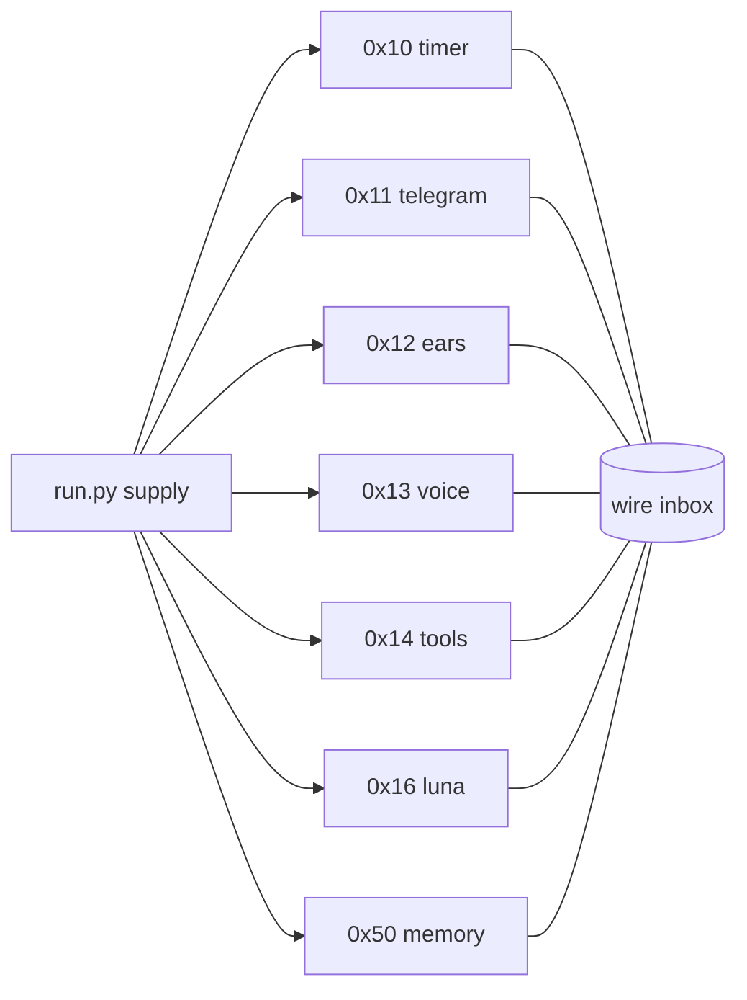

# Trident

One Windows process per device. They share a folder bus. `run.py` starts them and is not on the bus. Luna is the only model that decides.


```mermaid
flowchart LR
  run[run.py supply]
  t10[0x10 timer]
  t11[0x11 telegram]
  t12[0x12 ears]
  t13[0x13 voice]
  t14[0x14 tools]
  t16[0x16 luna]
  t50[0x50 memory]
  run --> t10
  run --> t11
  run --> t12
  run --> t13
  run --> t14
  run --> t16
  run --> t50
  t10 --- bus[(wire inbox)]
  t11 --- bus
  t12 --- bus
  t13 --- bus
  t14 --- bus
  t16 --- bus
  t50 --- bus
```

## Bus

A frame is one ASCII line, the notation of NXP UM10204 Rev. 7.0:

```text
S <aa> <W|R> <A|NA> (<hh> <A|NA>)* [Sr <aa> <W|R> <A|NA> (<hh> <A|NA>)*] P
```

`aa` is the 7-bit address in hex. `hh` is one data byte. `A` means that byte arrived. `NA` is NACK. At most one `Sr`, and it names the same address as `S`. A read with data ends with `NA` on the last data byte. An empty read result has no data byte.

Each address has `wire/<aa>/inbox/`. The controller writes the frame to a temp file, fsyncs it, and renames it to `q-<controller>-<seq>`. The target scans that folder (no directory watcher), takes the first `q-` name, and writes the answer to the controller inbox as `r-<seq>`. Rename and read retry five times on Windows sharing errors 5 and 32, starting at 50 ms and doubling. There is no global lock, so two devices can be addressed at once. Two frames for one device are taken in filename order.

ACK is only delivery. The result of a command is a later read.

NACK, as the code uses the five causes in UM10204 3.1.6:

| Cause | What the code does |
| --- | --- |
| 1 no receiver | No `alive` file. The controller raises at once. The error counter does not move. |
| 2 not ready | Address `NA` while `alive` exists and the device is not bus-off. Luna does this while a turn is open. The controller keeps the frame and retries after `frame_timeout`. Not a fault. |
| 3 command rejected | The target raises `Nack`. The reply is `NA` on the first data byte. The controller adds 8 and raises. |
| 4 no more room | Not a separate path. A bad register uses cause 3. |
| 5 end of read | The last read data byte is `NA`. Not a fault. |

Each device has a counter in `wire/<aa>/err`. A successful reply subtracts 1, floored at 0. A handler exception, a controller timeout, or a cause-3 NACK adds 8. At `bus_off` the device writes `busoff`, prints `<aa> bus-off`, and answers later frames with address `NA`.

`frame_timeout` is how long a controller waits for `r-<seq>`. If `wire/scl/<aa>` exists, that wait extends to the device's `busy` time. Only tools holds SCL, and only while a job runs. The file contains pid and time. `run.py` deletes SCL when that process is dead. If the process is alive and the hold is older than `busy`, `run.py` terminates it.

One journal line per handled frame, and one from the controller on timeout, in `RUN_<stamp>/bus.log`:

```text
<time> <src> <dst> <note> <ms> <frame>
```

## Address map

| Address | Process | Role |
| --- | --- | --- |
| 0x10 | timer.py | Boot dial and redial |
| 0x11 | telegram.py | Owner's Telegram user, chat and call |
| 0x12 | ears.py | Nemotron on a PCM file |
| 0x13 | voice.py | Chatterbox nano, turbo s3gen codec |
| 0x14 | tools.py | Screenshot, shell, vision |
| 0x16 | luna.py | One Cursor CLI turn |
| 0x50 | memory.py | SQLite records |

`run.py` starts them in that table order, passing the `RUN_<stamp>` path. It deletes `wire/` at start.

## Registers

Bytes after the address. A bare read is `S <aa> R`. A command result is the same write plus `Sr <aa> R`.

### 0x10 timer

| Bytes | Dir | Meaning |
| --- | --- | --- |
| `02` | W | He did not answer. ACK. If no wait is already set, redials are under the cap, and Luna is up, arm one wait of `retry_seconds`. A second `02` does not move that deadline. |
| `03` | W | Cancel the wait and zero the redial count. |
| other | W | Data NACK. |
| read | R | `00` idle, `01` a wait is armed. |

### 0x11 telegram

The session is the owner's Telegram Desktop `tdata`. The account must be one user who is not the owner and not a bot. Incoming calls from the owner are answered. Chat is his private messages only, and only ids newer than the last one seen at start.

| Bytes | Dir | Meaning |
| --- | --- | --- |
| `01` | W | Dial. ACK and start the call only when state is down. Otherwise data NACK. Ring wait is 90 s. |
| `02` | W | Hang up. |
| `10` then UTF-8 | W | Send that chat text, in slices of 4000. If the call engine is up, also master voice `01` plus the same text. |
| `20` then a path | W | Queue that wav. `pump` plays it only while the call engine is up, as 48 kHz PCM in 960-byte frames. |
| other | W | Data NACK. |
| read | R | `00` down, `01` dialing, `02` up. |

Microphone audio is 16 kHz PCM inside the process. VAD uses `rms_threshold`, `silence_ms`, `padding_ms`, and `utterance_seconds`. Each finished utterance is `RUN_<stamp>/pcm/<n>.pcm`, then ears register `01` plus that path. No answer (discarded call or the 90 s ring) hangs up and masters timer `02`.

### 0x12 ears

| Bytes | Dir | Meaning |
| --- | --- | --- |
| `01` then a PCM path | W | ACK, then off the bus run VAD on the file and Nemotron. Non-empty text is mastered to Luna as raw UTF-8, with no register byte. |
| other | W | Data NACK. |

Load of the DLL must finish within `busy.ears` or the process exits.

### 0x13 voice

| Bytes | Dir | Meaning |
| --- | --- | --- |
| `01` then UTF-8 | W | ACK, then synthesize off the bus. The wav is `RUN_<stamp>/wav/<n>.wav`. Then master telegram `20` plus that path. |
| other | W | Data NACK. |

The server must answer `/health` within `busy.voice`. Speech is `POST` to `<url>/v1/audio/speech`.

### 0x14 tools

Holds SCL until the job returns. A following `Sr` read is the result bytes.

| Bytes | Dir | Meaning |
| --- | --- | --- |
| `01` then a png path | W | Screenshot of the virtual screen into that path. Result is the path text. |
| `02` then a command | W | `cmd` shell. Result is stdout plus stderr, and `exit <code>` when the code is not 0. |
| `03` then an image path | W | Local vision model. The only prompt is "Describe this image." Result is that text. Not a mind. |
| other | W | Data NACK. |

The vision server must answer `/health` within `busy.tools`. The request is `POST` to `<url>/v1/chat/completions`.

### 0x16 luna

| Bytes | Dir | Meaning |
| --- | --- | --- |
| UTF-8, no register | W | The incoming message. ACK at once, then one CLI run off the bus. A write while that turn is open is address NACK, cause 2. |
| read, no write data | R | `00` idle, `01` the turn is open. This read works during the turn. |

Stdin is `prompt.txt`, then the address list, then the conversation kept in this process, then the message. The CLI is the newest `%LOCALAPPDATA%\cursor-agent\versions\*` folder that contains `node.exe` and `index.js`, run as `-p --model gpt-5.6-luna-none --output-format text --trust --workspace <RUN dir> --exclude-tools <tool list>`. No `--force`, no stream-json, no API key. The real CLI was not run; the tool list was copied from that install's protocol names.

Stdout: a legal frame is mastered, one at a time. Any other text is one telegram `10` write. Empty text sends nothing. A read's payload, and a write she addresses to `16`, are placed in her inbox after `busy` clears and count as self-turns. A self-turn increments a counter. Past `self_turn_cap` the frame is ACKed and no CLI starts. A write from any other address zeros the counter.

If the CLI runs longer than `busy.luna`, it is killed and telegram is sent the text `Luna timed out.` A non-zero CLI exit sends `Luna failed: <tail>`. Both add 8 to her counter. The turn record is `RUN_<stamp>/turn-<n>.txt`.

### 0x50 memory

SQLite file `life/memory.sqlite`, table `rec(id, body)`.

| Bytes | Dir | Meaning |
| --- | --- | --- |
| `01` then bytes | W | Append a row. `Sr` reads those bytes back. |
| `02` then decimal id | W | `Sr` reads that row. Missing id is data NACK. |
| `03` | W | `Sr` reads the latest row. |
| other | W | Data NACK. |
| read | R | Latest row, or no data bytes when the table is empty. |

## Sequences

Boot dial. Timer waits until telegram has `alive` and Luna is up (`alive`, no `busoff`, no `down`). Then once:

```text
S 11 W A 01 A P
```

No answer. Telegram:

```text
S 10 W A 02 A P
```

Timer ACKs and waits `retry_seconds` without SCL. It then masters `01` again. That can happen `redial_cap` times. A `02` during the wait does not stack. After the cap, `02` is ACKed and ignored. `03` clears the wait and the count. If Luna is down, timer does not dial and does not arm a wait.

Answered call. After the call reaches up, each utterance is:

```text
S 12 W A 01 A <pcm path> A P
S 16 W A <utf-8 text> A P
```

Luna's words, if any:

```text
S 11 W A 10 A <utf-8> A P
S 13 W A 01 A <utf-8> A P
S 11 W A 20 A <wav path> A P
```

Chat from him, call or not:

```text
S 16 W A <utf-8> A P
```

Luna's own next turn, after STOP of the turn that queued it, and only while under `self_turn_cap`:

```text
S 16 W A <bytes> A P
```

A tools result she asked for with `Sr` is queued the same way, as a write to `16`.

## Limits

From `config.toml`.

| Key | Value | Effect |
| --- | --- | --- |
| frame_timeout | 2 s | Wait for a reply when SCL is free |
| poll | 0.05 s | Inbox scan |
| bus_off | 32 | Counter value that takes a device off |
| backoff | 1 s | First restart delay, then double, cap 30 s |
| retry_seconds | 120 | Redial wait |
| redial_cap | 3 | Redials after the boot dial |
| self_turn_cap | 4 | Self-addressed Luna turns in a row |
| luna_start_cap | 3 | Fast Luna exits before "Luna cannot start" |
| stable_seconds | 30 | A run this long clears the crash count |
| busy.timer | 2 s | SCL budget |
| busy.telegram | 8 s | SCL budget |
| busy.ears | 30 s | Model load budget |
| busy.voice | 60 s | Server start budget |
| busy.tools | 90 s | Server start budget and SCL while a job runs |
| busy.luna | 150 s | CLI budget, off the bus |
| busy.memory | 2 s | SCL budget |
| ears rms_threshold | 0.012 | VAD |
| ears silence_ms | 700 | VAD endpoint |
| ears padding_ms | 120 | VAD pre-roll |
| ears utterance_seconds | 30 | Forced endpoint |

## Errors

A device that raises prints `Type: message` and exits 1. `run.py` restarts it after the backoff. A run longer than `stable_seconds` zeros that device's crash count and backoff. If Luna exits `luna_start_cap` times without lasting that long, `run.py` prints `Luna cannot start`, writes `wire/16/down`, terminates the others, and exits 1. It does not start her again.

A handler exception NACKs the address, adds 8, and leaves the process up. Bus-off is the line above. Cause 2 does not add.

## Self-tests

Each file tests itself. They do not start Telegram, the Cursor CLI, Chatterbox, Nemotron, the vision server, or a browser.

```text
py -3.11 i2c.py --test
py -3.11 memory.py --test
py -3.11 timer.py --test
py -3.11 luna.py --test
py -3.11 run.py --test
py -3.11 ears.py --test
py -3.11 voice.py --test
py -3.11 tools.py --test
py -3.11 telegram.py --test
```

`i2c.py` checks the frame grammar, a repeated-start read, SCL during a short hold, cause 2, timeout bus-off, and a sharing-violation rename. `memory.py` writes bytes `68 69` and reads them back. `timer.py` checks one boot dial, a `02` that does not stack, the redial cap, `03`, and no SCL during the wait. `luna.py` uses a stand-in process: no SCL while it runs, cause 2 on a second write, prose to telegram `10`, the self-turn cap, and the timeout sentence. `run.py` terminates a live SCL hold, clears a dead one's SCL, and checks `Luna cannot start`. The others check VAD, resample, a shell register, and the dial, chat, no-answer, and play frames.

## Install and run

64-bit Python 3.11 on Windows, a Cursor CLI login, and Telegram Desktop tdata.

```text
py -3.11 install.py
artifacts\python\Scripts\python.exe run.py
```

`install.py` makes `artifacts\python`, installs `requirements.txt`, and downloads the ear, voice, and vision files named in `config.toml`. A full install was run once in a throwaway folder and then deleted. It was not run again for this tree.

## Unproven live

Not run on this tree: Trident itself, a real Cursor CLI turn, a Telegram call or chat, Chatterbox, Nemotron, the vision model, and a browser. The `--exclude-tools` argument was not executed.
