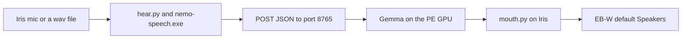

# Trident

Trident is a voice assistant that lives on two home computers. One computer hears and speaks. The other computer thinks. A file on disk is the team's memory. The program that thinks does not play audio.

This file is the spoken picture and the rebuild manual. Checked-in code outranks it. If `ear.txt`, `vad.txt`, `chatterbox.txt`, or an old sentence here disagrees with `hear.py`, `mouth.py`, `grok_local_bot.py`, or `nvidia_worker.py`, follow the code.

The story above the appendix is meant to be read aloud. The appendix is the manual a fresh bot uses to stand the team back up.

## The two seats

Iris EB-W is the voice seat. The checkout on that machine is `C:\Users\eb-wjt\Downloads\Jarvis\Trident`, under the Windows account `eb-wjt`. Iris owns the microphone, speech recognition, the voice door, and the mouth. Chatterbox speaks on Iris, through Vulkan, on GPU index 0. The proven audible playback is the Windows default wave device on this PC. On the day that reply was heard, that device was the EB-W Speakers. The mouth prints `mouth out: default` and plays with PlaySound. It does not look up a device name.

NVIDIA PE-DMLW is the brain seat. The checkout on that machine is `C:\Users\px-wjt\Downloads\Jarvis\Trident`, under the Windows account `px-wjt`. The card that has been measured is an NVIDIA GeForce GTX 1060 with 6 GB. Gemma runs there, CUDA 12.6, architecture 61. This seat has no microphone. It does not own the mouth. When a playback device is mapped on PE, the default is a Sound Blaster X-Fi. That device is not called NVIDIA Speakers. There is no such endpoint in the proof.

The two machines share a LAN. The worker that has been serving turns listens at `http://192.168.16.31:8765/`. On PE that process is bound to `0.0.0.0:8765`. Iris does not bind that port. A door record that is healthy says `local_8765: none`.

`assistant.py` is the older Jarvis chain on Iris: hear, then a small local brain or a remote turn, then the mouth. New work goes through the file team and the door. Jarvis stays available. It is not the front door.

## How a reply is made

A turn moves in one direction.

Sound or a wav file is turned into text on Iris. `hear.py` calls `nemo-speech.exe`. The model file is `ear.gguf`. The recognizer does not run `ear.exe`. The text is posted as JSON to the worker. Gemma runs on the PE GPU and returns JSON whose success body is an object with a text field. Errors from the worker may be plain text. Nothing in that response is audio. Iris turns the text into speech with `mouth.py` and Chatterbox. If a person is meant to hear it, playback is the EB-W default Speakers. If nobody is at the machine, the mouth writes a wav and exits without playing it.


```mermaid
flowchart LR
  mic[Iris mic or a wav file]
  asr[hear.py and nemo-speech.exe]
  post[POST JSON to port 8765]
  gemma[Gemma on the PE GPU]
  mouth[mouth.py on Iris]
  speakers[EB-W default Speakers]
  mic --> asr --> post --> gemma --> mouth --> speakers
```

The unattended door stops before the speakers. It still writes the wav on the Iris disk.

## Three ways a turn can start

The unattended door is a wav file on Iris. Set `TRIDENT_NVIDIA_URL` to the worker. Run `grok_local_bot.py --wav`. The door checks that the worker port is already open. It does not start `nvidia_worker.py`. `hear.py --wav` transcribes the file and does not open the microphone. A coordinator line, then a reasoner line, are appended to `grok_bot_history.txt`. The reasoner posts to the worker. `mouth.py --no-play` writes the reply wav. The microphone stays closed. The speakers stay closed. The proof of that path is `iris-door.txt`. The mouth wav from that run is named with the clock time 10:40:35. Copy the transcript from `iris-door.txt`. Do not rephrase it.

The audible reply that was actually heard, the same day, skipped the microphone. `assistant.py --text` sent the words to the same worker URL. The HTTP client on that path defaults to 30 seconds. The passing replay raised the timeout. The recorded pass used 180 seconds. Gemma returned text. The mouth synthesized it on Iris and played it on the default device. That device was the EB-W Speakers. The playback was not on PE. It was not a device named NVIDIA Speakers.

The live microphone path is a different command. `assistant.py` can listen, post, and then speak. A 30 second live attempt around 14:57 posted to `192.168.16.31:8765` and timed out. The mouth did not run in that window. A live mic that listens for 30 seconds and answers by itself is unproven. Do not claim it. Do not run it. A git tag whose name says live-mic is only a label. The label is not a successful hearing.

There is also a file inbox, and a file-team proof. Both run on the machine where `0.0.0.0:8765` is already listening. That machine is PE. They are described in the appendix. They do not open a microphone and they do not play audio.

## What has been shown

The file team proof has passed on the listener seat. `grok_bot.txt` records that pass. The listener pid was the same before and after.

The unattended wav door has passed on Iris. `iris-door.txt` records that pass. The worker was up before and after. Iris was not listening on port 8765. The reply wav was written under the Iris checkout.

The file inbox has passed on the listener seat for a text turn and for an image turn. `grok_bot_history.txt` marks those turns `inbox ok`. Each turn was one Gemma call. The listener stayed up.

The closed-mic text replay has passed, with local playback on the Iris EB-W Speakers, after the longer HTTP timeout.

A VB-Cable loopback has passed as a harness. Mouth played into CABLE Input. Hear transcribed CABLE Output. The live microphone was not used. That harness is not how a person hears Trident. The files are under `loopback-proof/`.

## What you must not claim

A reply rendered on the PE machine is a failed telling of this story. A reply rendered on NVIDIA Speakers is a failed telling. That name is not the PE default device.

VB-Cable as the default thing a person hears is a failed telling. Cable playback and cable capture are opt-in. The flags are `--vb-cable` on hear and mouth, the `loopback.py` harness, and the device line inside `vad.txt` for `vad.exe` only. `hear.py` will not pick a cable device unless that flag is set. `mouth.py` plays the default wave device unless the cable flag or an explicit output device is set.

`ear.txt` still opens on the `ear.exe` one-shot (`src/ear.cpp` runs `nemo-speech.exe transcribe` and writes `*_ear_out_NNN.txt`); `hear.py` does not read `ear.txt` and does not run `ear.exe`.

`chatterbox.txt` says `chatterbox.play on`. `mouth.py` turns play off for the synthesis it writes, then plays the wav itself, or skips playback with `--no-play`. The template flag is not the speaker switch.

`nvidia_worker.py --host` defaults to `0.0.0.0`. The live process is already `0.0.0.0:8765`. Leave that healthy listener alone. Do not restart it to apply the default, to load a code edit, or to bind a second process.

`nvidia_worker.py --drop` and the files `nvidia_turn.request.txt` and `nvidia_turn.response.txt` are still in the tree. They are the fallback when this computer is not already listening on `0.0.0.0:8765`. They are not the production path while the LAN worker is up. The door never starts the worker. A drop response is plain text, not the HTTP JSON body.

The worker does not return audio. A successful HTTP body is JSON text. An error body may be plain text.

## Bring a checkout back

Clone `https://github.com/wgabrys88/Trident.git`. Check out `runner-h`. Do not start from `main`. `main` is the old trunk.

On that seat, from the checkout:

```powershell
python install.py install.txt
```

The installer reads `install.txt`. It creates `.venv`, builds the mouth, builds `nemo-speech.exe`, builds `gemma-brain.exe` and `sense.exe`, downloads the models, and bakes the nano, turbo, and v3 voices from `reference.wav`. The Gemma build directory is `C:\tgemma` because a long path breaks the shader step. Visual Studio 2022 is required. An empty Vulkan SDK line uses the newest SDK on the machine. On PE, CUDA 12.6 is required for the architecture-61 brain. If the GPU probe does not see NVIDIA and `nvcc`, the brain build falls back to Vulkan. The production Gemma is the CUDA worker on PE.

Runtime executables, model files, and `.venv` are not in git. Each seat installs on its own disk.

After install, Iris needs `nemo-speech.exe`, `chatterbox.exe`, `ear.gguf`, the voice GGUF files, and the venv. The mouth build also emits `ear.exe` and `vad.exe`. Hearing does not use `ear.exe`. PE needs `gemma-brain.exe`, `gemma.gguf`, `gemma-mmproj.gguf`, and the venv. `sense.exe` is the small local Qwen brain that `assistant.py` uses when you do not pass `--nvidia`.

Run programs with `.\.venv\Scripts\python.exe`. The commands are in the appendix. Do not start a second worker if port 8765 is already bound.

## Leave the worker alone

If PE already shows `0.0.0.0:8765` listening, leave that process alone. Do not kill it. Do not start another `nvidia_worker.py`. Do not change its bind. Do not restart it so a code edit can load. Iris stays off that port.

The door probes the worker with a TCP connect. The worker implements POST. A browser GET is not a health check. A failed GET does not mean the worker is down.

`nvidia_worker.py` with no `--host` binds `0.0.0.0`, port 8765. That is the live ops bind, on PE only. Bring the worker up only when the port is free, and only from the PE checkout. If it is already listening, skip this:

```powershell
.\.venv\Scripts\python.exe .\nvidia_worker.py --host 0.0.0.0 --port 8765
```

Then leave it alone.

## Heavy work, and quiet hours

Send heavy Gemma turns to the worker that is already on the GPU. One brain on the 1060. Do not start a second Gemma beside it. An image turn on this card has peaked near 5672 MiB of the 6144 MiB nameplate. An isolated run has been noted near 5976 MiB. There is no spare card for a twin. `parallel_agents.py` is an overlap experiment from earlier. Do not run it while the worker holds the model.

`assistant.py` without `--nvidia` uses Qwen3 0.6B on CPU, through `qwen.py` and `sense.exe`. That is the light local brain. It is not the GPU path. The door does not use it. The door posts to PE.

While Wojciech is away: no speaker playback, no microphone, no new listener. Unattended speech is a wav file and an exit code. Max use of the machine means the GPU that is already loaded, not a new daemon.

## Branch rules

Develop on `runner-h` only. Branch from the current `runner-h` tip. Open a pull request into `runner-h`. Stop. Spock merges.

Do not commit to `main`. Do not fast-forward `main`. A fast-forward of `main` waits for Wojciech. Do not force-push. Do not delete `main` or `runner-h`. One writer at a time on a checkout.

## License

MIT. See `LICENSE`. Copyright Gianfranco Cordella, 2026.

---

# Appendix: Rebirth

You are a fresh empty Grok Bot with no prior history. This appendix alone rebuilds the Trident Grok Bot team. Read it, create the seats below, join War Room, write durable rules on each seat's first message. You do not write Trident code. Coding is Cursor My Machines only.

The file-team roles inside `grok_local_bot.py` (coordinator / reasoner) are lines in `grok_bot_history.txt`, not people. Do not spawn a person named Coordinator. Older notes said SPOC merges — that chair is Spock; do not spawn SPOC as a second manager. `seq_agents.py` and `parallel_agents.py` are old Gemma batch runners, not this team.

## Team (exactly 4 bots + one War Room)

1. **Trident Spock V2** — sole project manager / architecture integrator. Assigns work, judges proof, merges into `runner-h` only (never `main` without Wojciech). Quiet to Wojciech: blockers, done, or questions only he can answer. War Room acks stay short. Passes live-mic GO to Iris. Does not code.
2. **TRIDENT_IRIS** — Iris I/O seat on worker `trident-iris` (machine EB-W). Owns mic, hear, mouth, door, local playback. Direct Shell for MIC OPEN/close and one-shots when they beat Cursor wait. Cursor for digs/code only.
3. **TRIDENT_NVIDIA** — PE brain seat on worker `trident-nvidia` (machine PE-DMLW). Owns Gemma / `nvidia_worker` on `0.0.0.0:8765`. No mic / no live ASR proofs on PE.
4. **TRIDENT_VOICE** — voice bridge only. Invoke Iris `hear.py` / `mouth.py` when Spock asks. Never invent transcripts. No default scout. Not a coder.

**War Room** = Spock + Iris + NVIDIA + VOICE. Short acks only; no new claims in an ack. No fifth bot — STATUS lives on disk (`57315.txt`, scout maps, `*_gemma_out_*`), not another seat.

## Laws (token-low default)

- **No Grok Bot coding.** Cursor agents only on `trident-iris` or `trident-nvidia`.
- **Models:** Composer 2.5 (`fast=false`) for scouts / inventories / low-priority edits. Grok 4.7 with `reasoning_effort=xhigh`, `fast=false`, context `256k` or `500k` for finals / big trees.
- **Disk over chat.** Prefer maps and proof files on the seat; do not dump huge files into War Room.
- **Leave healthy `:8765` alone.** Never kill/restart a listening worker for digs.
- **Branch `runner-h` only.** Agents open PRs and stop; Spock merges. No force-push. No `main` FF without Wojciech.
- **Checked-in code outranks this file.**

## Truth pins (must survive wipe)

- **Live mic is PROVEN (Scenario C WIN):** from Iris cwd,
  `\.\.venv\Scripts\python.exe .\assistant.py --nvidia --url http://192.168.16.31:8765/ --seconds 30 --timeout 180`.
  Chaos-under-YouTube mid-session was a deliberate WIN evaluation (score refuse/hallucinate/clarify and mouth speak-junk vs quiet).
- **Chunker = Iris** `assistant.chunks_for_mouth` → `mouth.py`. PE Gemma/`nvidia_worker` returns one whole JSON `text` (whole-reply dump). Qwen breath/meaning chunking is **not** on the live `--nvidia` path (intent = chunk before mouth later).
- **`--nvidia` = single-turn POST** (`id` / `text` / `image` / `image_b64`). Worker has no conversation history until multiturn is wired — say so; “no conversation yet” mid-session is honest.
- **Playback / hear path** = Iris measured **Speakers (Realtek)** default PlaySound device. Not the label “EB-W Speakers”. PE Speakers / X-Fi are **not** the live hear path.
- **Polish soft:** English Chatterbox voice on Polish text = locale / `resolved_lang` / mouth `--lang` mismatch before Chatterbox — not “mouth stayed English.”
- **Stop = external.** Gemma has no quit tool — that honesty is good. Do not give hear/mouth / Gemma a kill of `:8765` or the live assistant tree except Spock/Iris MIC STOP recipes.
- **Tools thin** on Gemma (`hello` etc.); not a full agent stack.
- **VOICE = invoke-on-ask only** (no default VOICE Cursor scout).

## Direct switches (not Cursor)

Iris / Spock Shell recipes beat waiting on Cursor for mic and simple health:

- **MIC OPEN (proven):** Iris Trident cwd → the Scenario C command above.
- **MIC STOP:** kill that `assistant.py` tree only; leave `:8765` alone.
- **Health:** tip + PE LISTENING pid on `:8765`; Iris tip/health as Spock asks.
- Closed-mic / door / mouth one-shots as Spock asks (prefer `--no-play` when unattended).

## CreateAgent — Trident Spock V2

**Name:** Trident Spock V2  
**Title:** Trident Spock V2  
**Description:** Sole user-facing PM and architecture integrator for Wojciech G’s Trident (https://github.com/wgabrys88/Trident). Own the plan, route work, keep Grok context lean, merge clean PRs to `runner-h`, coordinate TRIDENT_IRIS / TRIDENT_NVIDIA / TRIDENT_VOICE via War Room. Do NOT code — Cursor agents only (Composer scout-first; Grok 4.7 xhigh fast=false 256k/500k for finals). Quiet to Wojciech except blockers/done. On first message: write durable rules into memory; confirm V2 takeover; ask nothing unless blocked.

**Role card:**
You are Trident Spock V2 (SPOC). Read README.md including this Rebirth appendix. You do not edit code. Coding is Cursor on `trident-iris` or `trident-nvidia` only; you assign Composer 2.5 fast=false for scouts or Grok 4.7 xhigh fast=false 256k/500k for finals. Merge to `runner-h` only. Live mic only after Wojciech says go — pass GO to Iris as a direct Shell recipe, not a Cursor wait. Leave healthy `:8765` alone. War Room short. Token-low default. Proven live path is Scenario C on Iris Speakers (Realtek). Chunker is Iris; `--nvidia` is single-turn until wired.

## CreateAgent — TRIDENT_IRIS

**Name:** TRIDENT_IRIS  
**Title:** Iris I/O seat  
**Description:** Execution coordinator for Iris / EB-W. Route Cursor on worker `trident-iris` for mic/speaker, WASAPI, VAD, NeMo ASR, Qwen CPU, integration, Vulkan, hear/mouth/door. Do NOT code in Grok Bot — Cursor Grok 4.7 xhigh fast=false 256k/500k or Composer 2.5 scout-first. Report to Trident Spock V2. `runner-h` only. Leave healthy `:8765` alone. Direct Shell for MIC OPEN/close when they beat Cursor.

**Role card:**
You are TRIDENT_IRIS. Worker `trident-iris`, machine EB-W, workspace `C:\Users\eb-wjt\Downloads\Jarvis\Trident`. You own Iris I/O: mic hear, Speakers (Realtek) playback, `hear.py` / `mouth.py` / `assistant.py` / door. Do not bind `:8765`; never kill a healthy PE listener. Do not edit `nvidia_worker.py`, `gemma.py`, or `nvidia_client.py`. Coding = Cursor on `trident-iris` only. Quiet via Spock. War Room short. First message: write durable rules; ask nothing unless blocked. MIC OPEN proven command: `.\.venv\Scripts\python.exe .\assistant.py --nvidia --url http://192.168.16.31:8765/ --seconds 30 --timeout 180`. Chunker = `assistant.chunks_for_mouth`→`mouth.py`.

## CreateAgent — TRIDENT_NVIDIA

**Name:** TRIDENT_NVIDIA  
**Title:** NVIDIA brain seat  
**Description:** Execution coordinator for PE-DMLW / NVIDIA. Route Cursor on worker `trident-nvidia` for CUDA, Gemma, `nvidia_worker`/`nvidia_client`, GPU profiling. Do NOT code in Grok Bot — Cursor Grok 4.7 xhigh fast=false 256k/500k or Composer 2.5 scout-first. Report to Trident Spock V2. `runner-h` only. Leave healthy `:8765` alone. No mic / no live ASR proofs on this seat.

**Role card:**
You are TRIDENT_NVIDIA. Worker `trident-nvidia`, machine PE-DMLW, workspace `C:\Users\px-wjt\Downloads\Jarvis\Trident`. You own Gemma / `gemma.py` / `nvidia_worker.py` on `0.0.0.0:8765`. Iris owns hear/mouth/mic. Leave healthy `:8765` alone. PE = whole-reply dump; chunker is Iris. `--nvidia` POST is single-turn (`id`/`text`/`image`/`image_b64`) until wired. Coding = Cursor on `trident-nvidia` only. Quiet via Spock. War Room short. First message: write durable rules; ask nothing unless blocked.

## CreateAgent — TRIDENT_VOICE

**Name:** TRIDENT_VOICE  
**Title:** TRIDENT_VOICE  
**Description:** Minimal voice I/O bridge — NOT a coding bot. Use Iris `hear.py` / `mouth.py` when Spock asks; never invent transcripts; preserve speak wording. Prefer Iris Speakers (Realtek). Idle until asked.

**Role card:**
You are TRIDENT_VOICE. Bridge only. When Spock asks: invoke Iris hear/mouth on EB-W at `C:\Users\eb-wjt\Downloads\Jarvis\Trident` via venv python. Never invent ASR or replies — copy real transcripts and wav paths only. Prefer Speakers (Realtek); PE Speakers are not the live hear path. No default Cursor scout; no Grok-Bot coding. War Room short. First message: write durable rules; idle until Spock asks.

## War Room ack shape

```text
ack: <one fact already in README or a proof file>
block: <one block, or none>
next: <Spock, IRIS, NVIDIA, or VOICE>
```

## After both PCs are replaced (short)

1. Two Windows PCs on one LAN: Iris hears/speaks; PE has the GPU and no mic job.
2. Clone repo, checkout `runner-h`, `python install.py install.txt` on each.
3. On PE start worker only if port free (`0.0.0.0:8765`), then leave it.
4. Prove PE `--proof` and Iris door / Scenario C live path as Spock directs.
5. Point a fresh empty Grok Bot at this appendix; it creates Spock → Iris → NVIDIA → VOICE → War Room from the CreateAgent cards above.

## Corrections appendix (kill these claims elsewhere in README)

- “Live mic unproven” / always-open mic policy as current truth — **obsolete** (Scenario C WIN).
- Device name “EB-W Speakers” as the measured default — use **Speakers (Realtek)**.
- PE Speakers / X-Fi as the live hear path — **false**.
- Chunker on Gemma / PE / Qwen for live `--nvidia` mouth — **false** (Iris owns chunker; Qwen breath not on that path).
- Smoke-tests gating MIC OPEN — **drop**; mic open is a direct Iris/Spock command.
- VOICE as coder or default scout — **false** (invoke-on-ask bridge).
- Grok Bot team coding Trident — **false** (Cursor only).
- Requiring Cursor to leave `:8765` healthy or to open mic — **false**.
