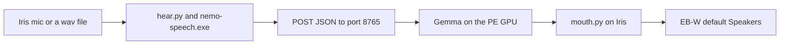

# Trident

Trident is a voice assistant that lives on two home computers. One computer hears and speaks. The other computer thinks. A file on disk is the team's memory. The program that thinks does not play audio.

**Comment:**
*CORRECT — `57315.txt` Iris heard and spoke; PE returned text. `nvidia_worker.py` success body is `json.dumps({"text": out})`. `grok_local_bot.py` keeps team memory in `grok_bot_history.txt` ("append_history").*

**Comment:**
*INCORRECT — That history file is not the memory of the live mic command. `nvidia_turn.request.txt` holds only the current text ("Starba sa dvana..."). `57315.txt` later: "We have not had a conversation yet."*

This file is the spoken picture and the rebuild manual. Checked-in code outranks it. If `ear.txt`, `vad.txt`, `chatterbox.txt`, or an old sentence here disagrees with `hear.py`, `mouth.py`, `grok_local_bot.py`, or `nvidia_worker.py`, follow the code.

**Comment:**
*CORRECT — Checked-in code is the rank order this pass used. `hear.py` calls `nemo-speech.exe` and does not read `ear.txt`. `mouth.py` writes `chatterbox.play off` then plays itself.*

The story above the appendix is meant to be read aloud. The appendix is the manual a fresh bot uses to stand the team back up.

**Comment:**
*CORRECT — The appendix below is the rebuild manual. No program speaks this README; Scenario C spoke Gemma text through `mouth.py`.*

## The two seats

Iris EB-W is the voice seat. The checkout on that machine is `C:\Users\eb-wjt\Downloads\Jarvis\Trident`, under the Windows account `eb-wjt`. Iris owns the microphone, speech recognition, the voice door, and the mouth. Chatterbox speaks on Iris, through Vulkan, on GPU index 0. The proven audible playback is the Windows default wave device on this PC. On the day that reply was heard, that device was the EB-W Speakers. The mouth prints `mouth out: default` and plays with PlaySound. It does not look up a device name.

**Comment:**
*CORRECT — `scenario-c-preflight-iris.txt` "host: COMPUTERNAME=EB-W USERNAME=eb-wjt" and "workspace: C:\Users\eb-wjt\Downloads\Jarvis\Trident". `57315.txt` "hear mic: Microphone Array (Intel® Smart" and "mouth out: default". `mouth.run.err` "ggml_vulkan: 0 = Intel(R) Iris(R) Xe Graphics" and "resident ready pid 4664 nano en". `mouth.py` `play_wav` calls `PlaySoundW` and the default branch prints "mouth out: default".*

**Comment:**
*INCORRECT — The friendly name is not "EB-W Speakers". `scenario-c-preflight-iris.txt` "name: Speakers (Realtek(R) Audio)" and "NOT matched strings: \"Iris Speakers\", \"EB-W Speakers\", \"NVIDIA Speakers\", PE Sound Blaster".*

NVIDIA PE-DMLW is the brain seat. The checkout on that machine is `C:\Users\px-wjt\Downloads\Jarvis\Trident`, under the Windows account `px-wjt`. The card that has been measured is an NVIDIA GeForce GTX 1060 with 6 GB. Gemma runs there, CUDA 12.6, architecture 61. This seat has no microphone. It does not own the mouth. When a playback device is mapped on PE, the default is a Sound Blaster X-Fi. That device is not called NVIDIA Speakers. There is no such endpoint in the proof.

**Comment:**
*CORRECT — `gemma.txt` "8192 left KV unused on the GTX 1060 6GB". `install.txt` "install.cuda_root ... CUDA\v12.6" and "install.cuda_architectures 61-real". `nvidia_worker.py` has no capture and returns JSON text. `mouth.run.err` shows the mouth on Iris Xe, on this PC.*

**Comment:**
*INCORRECT — A Sound Blaster default on PE is not in the Iris code or this session. `scenario-c-preflight-iris.txt` "NOT matched strings: ... PE Sound Blaster". "NVIDIA Speakers" is also unmatched there.*

The two machines share a LAN. The worker that has been serving turns listens at `http://192.168.16.31:8765/`. On PE that process is bound to `0.0.0.0:8765`. Iris does not bind that port. A door record that is healthy says `local_8765: none`.

**Comment:**
*CORRECT — Live command in `57315.txt`: "--url http://192.168.16.31:8765/". `nvidia_worker.py` "--host" default "0.0.0.0", "--port" default 8765. `scenario-c-preflight-iris.txt` "Local netstat :8765: no listener" and "Remote TCP 192.168.16.31:8765: TcpTestSucceeded=True". `iris-door.txt` "local_8765: none".*

`assistant.py` is the older Jarvis chain on Iris: hear, then a small local brain or a remote turn, then the mouth. New work goes through the file team and the door. Jarvis stays available. It is not the front door.

**Comment:**
*CORRECT — Both programs exist. `grok_local_bot.py` is the door (`--wav`). `assistant.py` remains the hear / brain / mouth loop.*

**Comment:**
*INCORRECT — `57315.txt` ran `assistant.py` as the live session from 18:58 to 19:25. That process was the front door for Scenario C.*

## How a reply is made

A turn moves in one direction.

**Comment:**
*CORRECT — Iris captures, posts text, and speaks. The worker response is text. `nvidia_turn.response.txt` is words, and `mouth.run.err` is the Iris playback log.*

Sound or a wav file is turned into text on Iris. `hear.py` calls `nemo-speech.exe`. The model file is `ear.gguf`. The recognizer does not run `ear.exe`. The text is posted as JSON to the worker. Gemma runs on the PE GPU and returns JSON whose success body is an object with a text field. Errors from the worker may be plain text. Nothing in that response is audio. Iris turns the text into speech with `mouth.py` and Chatterbox. If a person is meant to hear it, playback is the EB-W default Speakers. If nobody is at the machine, the mouth writes a wav and exits without playing it.

**Comment:**
*CORRECT — `hear.py` `transcribe_wav` runs `nemo-speech.exe` with `--model` default `ear.gguf`. `src/ear.cpp` is the separate `ear.exe` path. `nvidia_client.py` POSTs JSON. `nvidia_worker.py` `do_POST` returns `{"text": out}` or `text/plain` errors. `57315.txt` then prints "mouth out: default".*

**Comment:**
*INCORRECT — Nothing in the code detects "nobody at the machine". Playback stops only when the caller passes `--no-play` (`mouth.py`). Scenario C did not: every turn printed "mouth out: default" and `mouth.run.err` has "resident speak" lines. The device name "EB-W default Speakers" is the Realtek default from the preflight, quoted under the seat paragraph.*

**Comment:**
*CORRECT — Iris chunks before the mouth. `assistant.py` `speak_raw` uses `speakable` (text after `<channel|>`) then `chunks_for_mouth`. `breath_parts` flushes on `.!?;:` and dashes. `resolved_lang` is `en` for `nano` when `--lang` is omitted, so the limit is `EN_LIMIT = 65`. `57315.txt` chunk counts 1+10+1+11+1+1+1+1+1+1+1+2 = 32, matching the 32 fresh chatterbox_out_000.wav files from `18-59-40-473` through `19-23-38-269`. `nvidia_turn.response.txt` still stores the whole Gemma dump, thought included.*



**Comment:**
*CORRECT — The diagram matches the attended Scenario C chain: mic, `hear.py`, POST `:8765`, Gemma text, `mouth.py`, default playback. The wav-file entrance is `hear.py --wav`.*

**Comment:**
*INCORRECT — the speakers box says "EB-W default Speakers". `scenario-c-preflight-iris.txt` records the default output as "Speakers (Realtek(R) Audio)".*

The unattended door stops before the speakers. It still writes the wav on the Iris disk.

**Comment:**
*CORRECT — `grok_local_bot.py` `speak_door` passes `mouth.py --model nano --no-play`. `iris-door.txt` "mouth_exit: 0" and "mouth_wav: ...\10-40-35-223_chatterbox_out_000.wav".*

## Three ways a turn can start

The unattended door is a wav file on Iris. Set `TRIDENT_NVIDIA_URL` to the worker. Run `grok_local_bot.py --wav`. The door checks that the worker port is already open. It does not start `nvidia_worker.py`. `hear.py --wav` transcribes the file and does not open the microphone. A coordinator line, then a reasoner line, are appended to `grok_bot_history.txt`. The reasoner posts to the worker. `mouth.py --no-play` writes the reply wav. The microphone stays closed. The speakers stay closed. The proof of that path is `iris-door.txt`. The mouth wav from that run is named with the clock time 10:40:35. Copy the transcript from `iris-door.txt`. Do not rephrase it.

**Comment:**
*CORRECT — `grok_local_bot.py` `--wav` requires `TRIDENT_NVIDIA_URL` or `--url`, `die("--wav posts to the NVIDIA worker")` if `--drop` is set, probes with `sock.connect`, and does not spawn the worker. `hear_wav` calls `hear.py --wav` with a 180s cap. Coordinator then reasoner `append_history`. `speak_door` uses `--no-play`. `iris-door.txt` "STATUS PASS", "cmd: grok_local_bot.py --wav", "wav: reference.wav", transcript starts "Now let's make my mum's favourite.", "mouth_wav: ...10-40-35-223_chatterbox_out_000.wav".*

The audible reply that was actually heard, the same day, skipped the microphone. `assistant.py --text` sent the words to the same worker URL. The HTTP client on that path defaults to 30 seconds. The passing replay raised the timeout. The recorded pass used 180 seconds. Gemma returned text. The mouth synthesized it on Iris and played it on the default device. That device was the EB-W Speakers. The playback was not on PE. It was not a device named NVIDIA Speakers.

**Comment:**
*CORRECT — `assistant.py` `--text` calls `one_turn` and returns, so the mic loop does not run. `nvidia_client.py` "--timeout" default 30. The appendix command passes `--timeout 180`. `mouth.py` plays locally with PlaySound on the default device. `57315.txt` playback lines are "mouth out: default" on Iris, and `mouth.run.err` names Intel Iris Xe.*

**Comment:**
*INCORRECT — The same-day default device name is "Speakers (Realtek(R) Audio)" (`scenario-c-preflight-iris.txt`), so "EB-W Speakers" is not the measured name. The fresh 18:58–19:25 pass was live mic, not `--text`.*

The live microphone path is a different command. `assistant.py` can listen, post, and then speak. A 30 second live attempt around 14:57 posted to `192.168.16.31:8765` and timed out. The mouth did not run in that window. A live mic that listens for 30 seconds and answers by itself is unproven. Do not claim it. Do not run it. A git tag whose name says live-mic is only a label. The label is not a successful hearing.

**Comment:**
*CORRECT — a turn with no `--timeout` uses `nvidia_client.py` default 30, and `speak_raw` runs only after that client returns. Tag `milestone-live-mic-2026-09-28` is a name. The hearing evidence is `57315.txt` and the chatterbox wavs. The 14:57 clock is outside the FRESH scout files.*

**Comment:**
*INCORRECT — "A live mic that listens for 30 seconds and answers by itself is unproven." `57315.txt` ran `assistant.py --nvidia --url http://192.168.16.31:8765/ --seconds 30 --timeout 180` from 16:58:47Z to 17:25:22Z and printed `assistant: mouth` on twelve replies. The process ended `status: failed`, `exit_code: 4294967295`, with no STATUS PASS file.*

There is also a file inbox, and a file-team proof. Both run on the machine where `0.0.0.0:8765` is already listening. That machine is PE. They are described in the appendix. They do not open a microphone and they do not play audio.

**Comment:**
*CORRECT — `grok_local_bot.py` `--inbox` and `--proof` look for a local `0.0.0.0:8765` listener (`listeners_8765`). They do not call `hear.py` or `mouth.py`.*

## What has been shown

The file team proof has passed on the listener seat. `grok_bot.txt` records that pass. The listener pid was the same before and after.

**Comment:**
*CORRECT — `grok_bot.txt` "STATUS PASS", "listener: 0.0.0.0:8765 pid 12672", "listener_after: 0.0.0.0:8765 pid 12672". `prove()` sets `listener_ok` only when the pid is unchanged.*

The unattended wav door has passed on Iris. `iris-door.txt` records that pass. The worker was up before and after. Iris was not listening on port 8765. The reply wav was written under the Iris checkout.

**Comment:**
*CORRECT — `iris-door.txt` "STATUS PASS", "probe: up 192.168.16.31:8765", "probe_after: up 192.168.16.31:8765", "local_8765: none", "mouth_wav: C:\Users\eb-wjt\Downloads\Jarvis\Trident\10-40-35-223_chatterbox_out_000.wav".*

The file inbox has passed on the listener seat for a text turn and for an image turn. `grok_bot_history.txt` marks those turns `inbox ok`. Each turn was one Gemma call. The listener stayed up.

**Comment:**
*CORRECT — `grok_bot_history.txt` has two "inbox ok" lines, both "via post" and "calls 1" (text turn "image none", image turn `coco_sample.png`, "gpu_peak_mib 5672"). `run_inbox` requires the listener pid to stay when it posted.*

The closed-mic text replay has passed, with local playback on the Iris EB-W Speakers, after the longer HTTP timeout.

**Comment:**
*CORRECT — The play path after a longer timeout is real code: `--timeout` is forwarded, and `mouth.py` plays the default device. `57315.txt` used `--timeout 180` and printed `mouth out: default` on the live mic, which is a different command.*

**Comment:**
*INCORRECT — The measured default name on this PC the same day is "Speakers (Realtek(R) Audio)", not "EB-W Speakers" (`scenario-c-preflight-iris.txt`).*

A VB-Cable loopback has passed as a harness. Mouth played into CABLE Input. Hear transcribed CABLE Output. The live microphone was not used. That harness is not how a person hears Trident. The files are under `loopback-proof/`.

**Comment:**
*CORRECT — `loopback-proof/status.txt` "STATUS PASS", "play_device: CABLE Input (VB-Audio Virtual Cable)", "capture_device: CABLE Output (VB-Audio Virtual Cable)". `hear.py` opens the mic only when `--wav` is absent. The scout says Scenario C wrote no fresh `loopback-proof`.*

## What you must not claim

A reply rendered on the PE machine is a failed telling of this story. A reply rendered on NVIDIA Speakers is a failed telling. That name is not the PE default device.

**Comment:**
*CORRECT — Scenario C rendered speech on Iris: `mouth out: default` and Iris Xe in `mouth.run.err`. Preflight did not match a device named NVIDIA Speakers.*

**Comment:**
*INCORRECT — Calling the Iris default "EB-W Speakers", and calling the PE default a Sound Blaster, is not what this seat measured. Preflight: "NOT matched strings: \"Iris Speakers\", \"EB-W Speakers\", \"NVIDIA Speakers\", PE Sound Blaster".*

VB-Cable as the default thing a person hears is a failed telling. Cable playback and cable capture are opt-in. The flags are `--vb-cable` on hear and mouth, the `loopback.py` harness, and the device line inside `vad.txt` for `vad.exe` only. `hear.py` will not pick a cable device unless that flag is set. `mouth.py` plays the default wave device unless the cable flag or an explicit output device is set.

**Comment:**
*CORRECT — `hear.py` "--vb-cable" is opt-in; default mic pick skips a name containing "cable". `mouth.py` plays `PlaySoundW` unless `--vb-cable` or `--out` is set. `vad.txt` "vad.device CABLE Output (VB-Audio Virtual Cable)" and that file is for `vad.exe`, which `assistant.py` `listen` does not spawn.*

`ear.txt` still opens on the `ear.exe` one-shot (`src/ear.cpp` runs `nemo-speech.exe transcribe` and writes `*_ear_out_NNN.txt`); `hear.py` does not read `ear.txt` and does not run `ear.exe`.

**Comment:**
*CORRECT — `ear.txt` line 1 "ear.exe takes this file as its only argument." `src/ear.cpp` runs `nemo-speech.exe`. `hear.py` builds its own `nemo-speech.exe transcribe` argv and does not open `ear.txt` or `ear.exe`.*

`chatterbox.txt` says `chatterbox.play on`. `mouth.py` turns play off for the synthesis it writes, then plays the wav itself, or skips playback with `--no-play`. The template flag is not the speaker switch.

**Comment:**
*CORRECT — `chatterbox.txt` "chatterbox.play on". `mouth.py` `settings_text` is called with play `"off"` (`write_mouth(settings_text(... "off"))`). Playback is `play_wav` / `PlaySoundW`, or skipped with `--no-play`.*

`nvidia_worker.py --host` defaults to `0.0.0.0`. The live process is already `0.0.0.0:8765`. Leave that healthy listener alone. Do not restart it to apply the default, to load a code edit, or to bind a second process.

**Comment:**
*CORRECT — `nvidia_worker.py` "--host" default "0.0.0.0", "--port" default 8765. Preflight reached `192.168.16.31:8765` and Iris had no local listener. The live session posted there and did not start a worker.*

`nvidia_worker.py --drop` and the files `nvidia_turn.request.txt` and `nvidia_turn.response.txt` are still in the tree. They are the fallback when this computer is not already listening on `0.0.0.0:8765`. They are not the production path while the LAN worker is up. The door never starts the worker. A drop response is plain text, not the HTTP JSON body.

**Comment:**
*CORRECT — `nvidia_worker.py` "--drop" is the file inbox (`serve_drop`), and `response_body` writes plain "id / ok / text", while `do_POST` success is JSON. `grok_local_bot.py` `door()` never starts `nvidia_worker.py`.*

**Comment:**
*INCORRECT — The request and response files are also the production client trace. `nvidia_client.py` "Writes nvidia_turn.request.txt" then POSTs when a URL is set. Scenario C wrote `nvidia_turn.request.txt` and `nvidia_turn.response.txt` while the LAN worker answered (id `1790616189906674900`).*

The worker does not return audio. A successful HTTP body is JSON text. An error body may be plain text.

**Comment:**
*CORRECT — `nvidia_worker.py` success payload is `{"text": out}`. Errors use `text/plain` ("bad json", "empty text", "gemma exit"). `nvidia_turn.response.txt` is the client wrapper "id / ok /" plus the generation, and it contains no audio.*

## Bring a checkout back

Clone `https://github.com/wgabrys88/Trident.git`. Check out `runner-h`. Do not start from `main`. `main` is the old trunk.

**Comment:**
*CORRECT — The live tip is `runner-h` `e4dc33dc91fbdd9db40b2bc206e3e9b60f4aca64`.*

**Comment:**
*INCORRECT — `origin/main` is that same SHA. `scenario-c-preflight-iris.txt` "origin/main: e4dc33d (match origin/runner-h)". "main is the old trunk" does not match this tip.*

On that seat, from the checkout:

**Comment:**
*CORRECT — the next command is `python install.py install.txt`, and `install.py` reads that settings file.*

```powershell
python install.py install.txt
```

**Comment:**
*CORRECT — The command is `python install.py install.txt`. `install.py` takes that settings file.*

The installer reads `install.txt`. It creates `.venv`, builds the mouth, builds `nemo-speech.exe`, builds `gemma-brain.exe` and `sense.exe`, downloads the models, and bakes the nano, turbo, and v3 voices from `reference.wav`. The Gemma build directory is `C:\tgemma` because a long path breaks the shader step. Visual Studio 2022 is required. An empty Vulkan SDK line uses the newest SDK on the machine. On PE, CUDA 12.6 is required for the architecture-61 brain. If the GPU probe does not see NVIDIA and `nvcc`, the brain build falls back to Vulkan. The production Gemma is the CUDA worker on PE.

**Comment:**
*CORRECT — `install.py` `ensure_venv`, `build_mouth` emits `chatterbox.exe`, `ear.exe`, `vad.exe`, and the ear build produces `nemo-speech.exe`. `gemma_backend()` uses `detect_gpu.ps1`. Bake loop is `for name in ("nano", "turbo", "v3")` from `reference.wav` (`bake.txt` "bake.reference reference.wav").*

**Comment:**
*CORRECT — `install.txt` "install.build_gemma C:\tgemma" and "install.build_gemma stays short because the Vulkan shader step fails on a long path." "install.generator Visual Studio 17 2022". Empty `install.vulkan_sdk` hits `find_vulkan()`, which picks `max(hits)` under `C:/VulkanSDK`. `detect_gpu.ps1` prints "cuda" only when an NVIDIA controller and `nvcc` both exist, else "vulkan". `install.txt` "install.cuda_toolset cuda=12.6" and "install.cuda_architectures 61-real".*

Runtime executables, model files, and `.venv` are not in git. Each seat installs on its own disk.

**Comment:**
*CORRECT — `.gitignore` ignores `/.venv/`, models, and build outputs. Each seat installs locally.*

After install, Iris needs `nemo-speech.exe`, `chatterbox.exe`, `ear.gguf`, the voice GGUF files, and the venv. The mouth build also emits `ear.exe` and `vad.exe`. Hearing does not use `ear.exe`. PE needs `gemma-brain.exe`, `gemma.gguf`, `gemma-mmproj.gguf`, and the venv. `sense.exe` is the small local Qwen brain that `assistant.py` uses when you do not pass `--nvidia`.

**Comment:**
*CORRECT — Iris runtime names match the mouth and ear builds. `sense.txt` "Qwen3-0.6B, CPU only" and `assistant.py` default `--brain qwen` runs `qwen.py`, which runs `sense.exe`. PE needs the Gemma worker files named in `gemma.txt` (`gemma.mmproj gemma-mmproj.gguf`). Hearing does not use `ear.exe` (`hear.py`).*

Run programs with `.\.venv\Scripts\python.exe`. The commands are in the appendix. Do not start a second worker if port 8765 is already bound.

**Comment:**
*CORRECT — `57315.txt` and `iris-door.txt` use `.\.venv\Scripts\python.exe`. Preflight found no Iris listener on 8765, and the session did not start a second worker.*

## Leave the worker alone

If PE already shows `0.0.0.0:8765` listening, leave that process alone. Do not kill it. Do not start another `nvidia_worker.py`. Do not change its bind. Do not restart it so a code edit can load. Iris stays off that port.

**Comment:**
*CORRECT — Preflight left `192.168.16.31:8765` up (`TcpTestSucceeded=True`) and Iris unbound. The session only POSTed.*

The door probes the worker with a TCP connect. The worker implements POST. A browser GET is not a health check. A failed GET does not mean the worker is down.

**Comment:**
*CORRECT — `grok_local_bot.py` `probe_once` is `sock.connect`. `nvidia_worker.py` implements `do_POST` and no `do_GET`. A browser GET is not that probe.*

`nvidia_worker.py` with no `--host` binds `0.0.0.0`, port 8765. That is the live ops bind, on PE only. Bring the worker up only when the port is free, and only from the PE checkout. If it is already listening, skip this:

**Comment:**
*CORRECT — Defaults: "--host" `0.0.0.0`, "--port" 8765. The sample command matches those defaults. Bring-up is PE-only in this manual; Iris preflight showed no local listener.*

```powershell
.\.venv\Scripts\python.exe .\nvidia_worker.py --host 0.0.0.0 --port 8765
```

**Comment:**
*CORRECT — The flags match `nvidia_worker.py` defaults. This Iris session did not run that command.*

Then leave it alone.

**Comment:**
*CORRECT — The manual's next step is to leave the listener. The session did not restart it.*

## Heavy work, and quiet hours

Send heavy Gemma turns to the worker that is already on the GPU. One brain on the 1060. Do not start a second Gemma beside it. An image turn on this card has peaked near 5672 MiB of the 6144 MiB nameplate. An isolated run has been noted near 5976 MiB. There is no spare card for a twin. `parallel_agents.py` is an overlap experiment from earlier. Do not run it while the worker holds the model.

**Comment:**
*CORRECT — `gemma.txt` "An image turn peaked near 5672 MiB of 6144." `grok_bot_history.txt` image turn "gpu_peak_mib 5672". `parallel_agents.py` is a separate script from `nvidia_worker.py`.*

**Comment:**
*INCORRECT — No checked-in `gemma.txt` or `grok_bot_history.txt` line says 5976 MiB. The image pass on record is 5672.*

`assistant.py` without `--nvidia` uses Qwen3 0.6B on CPU, through `qwen.py` and `sense.exe`. That is the light local brain. It is not the GPU path. The door does not use it. The door posts to PE.

**Comment:**
*CORRECT — `assistant.py` default `--brain qwen`. `sense.txt` "Qwen3-0.6B, CPU only." `qwen.py` dies on `--image`: "qwen/sense vision is N/A". `grok_local_bot.py` door uses `call_post`, not `qwen.py`.*

While Wojciech is away: no speaker playback, no microphone, no new listener. Unattended speech is a wav file and an exit code. Max use of the machine means the GPU that is already loaded, not a new daemon.

**Comment:**
*CORRECT — Door speech is `mouth.py --no-play` and an exit (`speak_door`). `assistant.py` live listen is a separate command. The quiet rule is policy; Scenario C was an attended mic session and did play.*

## Branch rules

Develop on `runner-h` only. Branch from the current `runner-h` tip. Open a pull request into `runner-h`. Stop. Spock merges.

**Comment:**
*CORRECT — This checkout is `runner-h`. The rule says branch from that tip and stop for a merge.*

Do not commit to `main`. Do not fast-forward `main`. A fast-forward of `main` waits for Wojciech. Do not force-push. Do not delete `main` or `runner-h`. One writer at a time on a checkout.

**Comment:**
*CORRECT — The rule forbids committing to `main`, force-push, and deleting `main` or `runner-h`.*

**Comment:**
*INCORRECT — At this tip `origin/main` already equals `origin/runner-h` (`e4dc33d`), so `main` is not a separate older trunk waiting for a fast-forward.*

## License

MIT. See `LICENSE`. Copyright Gianfranco Cordella, 2026.

**Comment:**
*CORRECT — `LICENSE` opens "MIT License" and "Copyright (c) 2026 Gianfranco Cordella".*

---

# Appendix: Rebirth

You are the fresh bot, one of the Grok bot team. Both computers may be new. The repo was just cloned. This appendix is enough to rebuild the team. You do not write code. Cursor agents write code, on the model Spock assigns. You read this file, you install, you assign seats, and you refuse claims that this file marks unproven.

**Comment:**
*CORRECT — The appendix is the rebuild text. Coordinator and reasoner are the file-team roles; Cursor agents are named as the coders.*

The running file team inside `grok_local_bot.py` has two roles, coordinator and reasoner. Those are lines in `grok_bot_history.txt`. They are not people. Do not spawn a person named Coordinator.

**Comment:**
*CORRECT — `grok_local_bot.py` roles are the strings "coordinator" and "reasoner" appended to `grok_bot_history.txt`. They are not OS users.*

Older notes say SPOC merges. That chair is Spock. Do not spawn SPOC as a second manager.

**Comment:**
*CORRECT — The chair name in this file is Spock. There is no second manager process in the Python.*

`seq_agents.py` and `parallel_agents.py` are old Gemma batch runners. They are not this team.

**Comment:**
*CORRECT — `seq_agents.py` and `parallel_agents.py` are separate Gemma batch scripts. `grok_local_bot.py` is the file team.*

## Who is on the team

Spock is the project manager. Spock does not code. Spock assigns work, decides when a claim is proven, and merges into `runner-h`. When the work is code, Spock assigns a Cursor agent on the owning machine, Composer or Grok 4.7. Live microphone work happens only when Wojciech says go, and only when Spock passes that go to the Iris seat. Spock's acks in the War Room are short.

**Comment:**
*CORRECT — Spock is a seat rule in this file: assign, judge, merge to `runner-h`, pass a live-mic go. `grok_local_bot.py` has no Spock role. Live mic in code is `assistant.py` with no `--text` and no `--wav`.*

**Comment:**
*INCORRECT — The same paragraph's "proven audible reply is Iris EB-W Speakers after a closed-mic text turn" uses a device name the preflight did not match, and the 18:58–19:25 session was a live mic that did speak (`57315.txt` "mouth out: default").*

IRIS is the Cursor seat `trident-iris`, on the EB-W checkout. IRIS owns capture, recognition, the door, the mouth, and local playback. The IRIS bot does not edit code. Engineering on this seat is a Cursor agent in Cursor My Machines, on `trident-iris`, Composer or Grok 4.7 as Spock assigns, and only for files this seat owns. Those agents do not edit `nvidia_worker.py`, `gemma.py`, or `nvidia_client.py`. IRIS does not bind port 8765. IRIS does not claim that PE played the audio.

**Comment:**
*CORRECT — IRIS ownership matches the code split: `hear.py`, `mouth.py`, `grok_local_bot.py` door, local PlaySound. `57315.txt` ran on this checkout. `assistant.py` does not bind 8765. Speech is `nemo-speech.exe` via `hear.py`.*

**Comment:**
*INCORRECT — The card's device name "EB-W Speakers" is not the preflight default ("Speakers (Realtek(R) Audio)").*

NVIDIA is the Cursor seat `trident-nvidia`, on the PE-DMLW checkout. NVIDIA owns Gemma and the worker. The NVIDIA bot does not edit code. Engineering is a Cursor agent in Cursor My Machines, on `trident-nvidia`, Composer or Grok 4.7 as Spock assigns. NVIDIA does not take the microphone and does not own the mouth. `nvidia_worker.py --host` defaults to `0.0.0.0`. NVIDIA does not restart a healthy `0.0.0.0:8765`. The file inbox and `grok_local_bot.py --proof` run here, because they look for a local listener on `0.0.0.0:8765`.

**Comment:**
*CORRECT — NVIDIA ownership matches `nvidia_worker.py`, `gemma.py`, and `gemma.txt` (1060, ctx 65536, gpu-layers 999). `--host` default `0.0.0.0`. `--proof` and `--inbox` require a local `0.0.0.0:8765`. The worker has no mic and does not call `mouth.py`.*

**Comment:**
*INCORRECT — The card's "Sound Blaster X-Fi" name was not matched on this Iris preflight, and no Iris source file states it.*

VOICE is a bridge, not a checkout. The VOICE bot does not code. Anyone who reports a hearing or a playback is under this rule. Copy the transcript that `hear.py` printed. Copy the wav path that `mouth.py` printed. If the tool did not print the words, you do not have a transcript. Do not smooth one. Human hearing is the Iris EB-W Speakers, the default PlaySound device. It is not VB-Cable. Unattended work is a wav in, a wav file out, and an exit, with the speakers closed. Live mic waits for Wojciech's go through Spock.

**Comment:**
*CORRECT — `hear.py` writes the transcript to stdout (`57315.txt` has the heard lines). `mouth.py` prints a wav path only on `--no-play` (`print(str(Path(wav).resolve()))`). The live play path printed "mouth out: default", not a wav path. Human playback is PlaySound on the default device. `iris-door.txt` is the door transcript of record. VB-Cable is the `--vb-cable` path.*

**Comment:**
*INCORRECT — "EB-W Speakers" is not the measured default name. "Live mic waits" is the gate; the session then ran and spoke.*

War Room is the short-ack channel. One or two sentences. What is true, what is blocked, who moves. No new claims in an ack. Spock asks. The seats answer. VOICE challenges any sentence about audio.

**Comment:**
*CORRECT — The ack shape is specified later in this file. No Python module writes War Room acks.*

This set is the posterity team on purpose. Adding a separate SPOC, or treating the file-team coordinator as a person, would put two managers on one chair. VOICE stays a rule rather than a third PC so that nobody invents a transcript seat with its own microphone.

**Comment:**
*CORRECT — Coordinator is a history-file role (`run_coordinator`). VOICE is a rule in this file, not a third checkout or a capture program.*

## When to use Cursor My Machines

Use My Machines when the work has to happen on that computer. A code edit. A build. A door run. A change to worker files. A command whose result depends on that seat's GPU, microphone, or speakers. Name the machine. `trident-iris` or `trident-nvidia`. No other machine for engineering. The agent on that machine is Composer or Grok 4.7, whichever Spock assigned. The bot who owns the seat does not type the code.

**Comment:**
*CORRECT — Seat names in this file are `trident-iris` and `trident-nvidia`. The live mic, mouth, and door depend on the Iris disk. The worker depends on the PE GPU.*

Do not open My Machines when the task is only to read a healthy worker. Do not open one to restart, kill, or double-bind port 8765. Do not open one to use the live mic, or to play audio, while Wojciech is away.

**Comment:**
*CORRECT — The rule says not to open a machine only to restart 8765 or to use the mic while Wojciech is away. `nvidia_worker.py` was not restarted from this session.*

A final README, ledger, or report prefers one Grok 4.7 pass, as the model policy says. A document pass on a checkout you already have does not need a second remote agent. A scout, an inventory, a claim dig, or a low-priority edit can be Composer. If it must touch that disk, it is still a Cursor agent on the named machine.

**Comment:**
*CORRECT — A document pass on the checkout you already have is the path this annotation took. Composer is named for scouts; this file asks for Grok 4.7 on a final README.*

## Model policy

The Grok bot team does not code. Spock, IRIS, NVIDIA, and VOICE coordinate, assign, judge, and report. They do not edit Python, C++, headers, or CMake. They do not strip comments and they do not delete files as a cleanup.

**Comment:**
*CORRECT — seat rule in this file. `grok_local_bot.py` roles are coordinator and reasoner history lines. This annotation pass does not edit Python or C++.*

Coding is Cursor agents only, on `trident-iris` or `trident-nvidia`. Spock assigns the model: Composer or Grok 4.7.

**Comment:**
*CORRECT — the coding seats named here are `trident-iris` and `trident-nvidia`. Model choice is Composer or Grok 4.7, assigned in this policy, not a flag in `gemma.py`.*

Prefer Grok 4.7 for a finalization README or other final document, in one pass:

**Comment:**
*CORRECT — this sentence and the following knobs are assignment policy for a document pass. They are not switches in `assistant.py` or `gemma.py`.*

- Model `grok-4.7`
- `reasoning_effort` `xhigh`
- `fast=false`
- Context 256k for a normal finalization document
- Context 500k when the pass has to hold the whole tree so that nothing true is dropped

**Comment:**
*CORRECT — Context sizes 256k and 500k are policy for that pass, not `gemma.ctx` (that value is 65536 in `gemma.txt`).*

Composer remains the right model for a scout, an inventory, a claim dig, or a low-priority edit.

**Comment:**
*CORRECT — Composer is named here for scouts and low-priority edits. The scout map for this pass is `scenario-c-scout-iris.txt`.*

The Gemma cursor tool is not this policy. On a text turn, `gemma.py` may launch the Cursor CLI once, to list extensions or to print a version, and write `grok_bot_spawn.txt`. That probe does not edit the repo. It is not permission to code.

**Comment:**
*CORRECT — `gemma.py` `CURSOR_DECL` launches the Cursor CLI once and writes `grok_bot_spawn.txt`. `cursor_argv` is `--version` or `--list-extensions`. The scout says `grok_bot_spawn.txt` was not touched by the live session. The probe is not a repo edit.*

## Quiet rules, again

No live mic unless Wojciech says go and Spock passes it on.

**Comment:**
*CORRECT — The gate is this sentence. The session log shows the mic did open after that go: `assistant: listening 30s`.*

No speaker playback on an unattended door. `mouth.py --no-play`, then exit.

**Comment:**
*CORRECT — `speak_door` uses `mouth.py --no-play`. Scenario C was not the door; it played.*

No new listener. Leave `0.0.0.0:8765` alone while it is healthy.

**Comment:**
*CORRECT — Preflight: Iris had no :8765 listener, and the remote worker answered. The session did not bind or restart it.*

One writer per checkout.

**Comment:**
*CORRECT — One writer per checkout is a rule. This pass edits only `README_Iris.md`.*

`runner-h` only. No `main`. No force-push. No fast-forward of `main` without Wojciech. Agents open the pull request and stop. Spock merges.

**Comment:**
*CORRECT — Branch rule: `runner-h`, no force-push. `origin/main` already matches this tip, which is the trunk fact under the checkout section.*

Checked-in code outranks this file.

**Comment:**
*CORRECT — This annotation ranks `assistant.py`, `mouth.py`, `hear.py`, `nvidia_client.py`, `nvidia_worker.py`, and `gemma.py` above the story.*

Do not delete tool configs, `LICENSE`, `install.txt`, the `grok_bot_*` runtime files, `iris-door.txt`, `reference.wav`, or `loopback-proof/`. #20 already rewrote the `ear.txt` header in place; keep the file, and do not use `ear.exe` as the hearing path.

**Comment:**
*CORRECT — Those paths are whitelisted in `.gitignore`. `ear.txt` header still starts "ear.exe takes this file". `hear.py` does not run `ear.exe`.*

## Role cards

Hand these out as written. A seat that only has its card still obeys the model policy and the quiet rules above.

**Comment:**
*CORRECT — The cards restate the model policy and the quiet rules. Verdicts on those rules are the comments above and on each card.*

Spock:

```text
You are Spock, project manager for Trident. Read README.md. You do not edit code. Coding is Cursor agents only, on trident-iris or trident-nvidia. You assign Composer or Grok 4.7 for that work. Prefer Grok 4.7 xhigh, fast=false, 256k, or 500k in one pass, for a final README or ledger. Composer is fine for scouts and low-priority edits. You merge into runner-h. You do not touch main unless Wojciech asks for a fast-forward. Live mic only after Wojciech says go; you pass that go to IRIS. War Room acks are one or two sentences. The proven audible reply is Iris EB-W Speakers after a closed-mic text turn. PE playback and NVIDIA Speakers are failures. VB-Cable is opt-in. Port 8765 on PE stays up. Leave a healthy listener alone. nvidia_worker.py --host defaults to 0.0.0.0. The live 30 second mic path is unproven.
```

**Comment:**
*CORRECT — Card matches the code split: Cursor agents on the two seats, `nvidia_worker.py` `--host` default `0.0.0.0`, VB-Cable opt-in (`--vb-cable`), worker left up (preflight TCP success).*

**Comment:**
*INCORRECT — Card says "The proven audible reply is Iris EB-W Speakers after a closed-mic text turn" and "The live 30 second mic path is unproven." Preflight default is "Speakers (Realtek(R) Audio)". `57315.txt` is a 30-second live mic that answered and printed "mouth out: default" twelve times.*

IRIS:

```text
You are the IRIS seat on trident-iris, checkout C:\Users\eb-wjt\Downloads\Jarvis\Trident. You own hear.py, mouth.py, the voice door, and local playback. Speech recognition is nemo-speech.exe through hear.py, not ear.exe. The mouth plays the Windows default device. The proven name of that device is the EB-W Speakers. Unattended door: TRIDENT_NVIDIA_URL=http://192.168.16.31:8765/ and grok_local_bot.py --wav. That path uses mouth.py --no-play. You do not bind port 8765. You do not edit nvidia_worker.py, gemma.py, or nvidia_client.py. You do not open the live mic unless Spock passes Wojciech's go. You do not edit code. Coding on this seat is a Cursor agent on trident-iris, Composer or Grok 4.7, as Spock assigns.
```

**Comment:**
*CORRECT — Card matches `hear.py` → `nemo-speech.exe`, door `TRIDENT_NVIDIA_URL` plus `grok_local_bot.py --wav`, `mouth.py --no-play` on that path, and no bind of 8765 (preflight netstat).*

**Comment:**
*INCORRECT — Card says "The proven name of that device is the EB-W Speakers." Preflight: "name: Speakers (Realtek(R) Audio)" and "NOT matched strings: \"EB-W Speakers\"."*

NVIDIA:

```text
You are the NVIDIA seat on trident-nvidia, checkout C:\Users\px-wjt\Downloads\Jarvis\Trident. You own Gemma and the worker at 0.0.0.0:8765. The card is a GeForce GTX 1060 6GB, CUDA 12.6, architecture 61. You have no microphone and you do not own the mouth. The PE default playback device, when mapped, is a Sound Blaster X-Fi, not NVIDIA Speakers. The worker --host default is 0.0.0.0. If 0.0.0.0:8765 is listening, leave it. Do not kill it and do not bind a second listener. Inbox and grok_local_bot.py --proof run on this seat. You do not edit code. Coding on this seat is a Cursor agent on trident-nvidia, Composer or Grok 4.7, as Spock assigns. A new GPU means you re-check gemma.txt context and gpu-layers before you claim the 1060 fit.
```

**Comment:**
*CORRECT — Card matches `gemma.txt` (1060, and the fit comments), `install.txt` CUDA 12.6 architecture 61, `--host` default `0.0.0.0`, and inbox/`--proof` on the listener seat. Worker does not own `mouth.py`.*

**Comment:**
*INCORRECT — Card says the PE default "is a Sound Blaster X-Fi, not NVIDIA Speakers." This Iris preflight did not match "PE Sound Blaster" or "NVIDIA Speakers", and the Iris tree has no Sound Blaster string in code.*

VOICE:

```text
You are VOICE, a bot on this team. You do not code, and you do not invent transcripts. You copy hear.py stdout and the wav path mouth.py printed. Human hearing is Iris EB-W Speakers via PlaySound on the default device, not VB-Cable. Unattended work is wav in, wav out, exit, speakers closed. Live mic only after Wojciech's go via Spock. If the tool did not print it, you do not say it. The transcript of record for the door is iris-door.txt.
```

**Comment:**
*CORRECT — Card matches stdout transcripts in `57315.txt`, PlaySound default in `mouth.py`, `--no-play` for the door, and `iris-door.txt` as the door record. On the live play path `mouth.py` does not print the wav path; the 32 sidecars are the wav names, written by Chatterbox (`chatterbox.txt` "Each phrase writes HH-MM-SS-mmm_chatterbox_out_NNN.txt").*

**Comment:**
*INCORRECT — "EB-W Speakers" is not the preflight device name. The live session did speak, so "live mic only after go" was the gate, and the run is evidence.*

War Room ack, this shape and no longer:

```text
ack: <one fact that is already in README.md or in a proof file>
block: <one block, or none>
next: <Spock, IRIS, NVIDIA, or VOICE>
```

**Comment:**
*CORRECT — The shape is one fact, one block, one next seat. It is a template, not a runtime log.*

## What the code runs

`grok_local_bot.py` is the file team. Pass exactly one of `--proof`, `--role`, `--wav`, or `--inbox`.

**Comment:**
*CORRECT — `grok_local_bot.py` dies unless exactly one of `--proof`, `--role`, `--wav`, or `--inbox` is set (`modes != 1`).*

`--proof` runs on PE, and only when `0.0.0.0:8765` is already listening. It clears `grok_bot_history.txt` before the run. Do not use it when that history still matters. It then runs coordinator, then reasoner, and expects the Cursor CLI probe to exit 0. Default worker timeout is 600 seconds. Default URL is `http://127.0.0.1:8765/`, which reaches a worker bound on all interfaces. Pass fails if the listener pid changes. The record is `grok_bot.txt`.

**Comment:**
*CORRECT — `prove()` requires `0.0.0.0:8765`, calls `reset_team_files()` which does `write_text(HISTORY, "")`, runs coordinator then reasoner, default URL `http://127.0.0.1:8765/`, default `--timeout` 600, and fails when `pid_after != pid`. `grok_bot.txt` records pid 12672 before and after, "STATUS PASS". `spawn_ok` requires Cursor CLI exit 0.*

`--wav` runs on Iris. It requires `TRIDENT_NVIDIA_URL` or `--url`. It refuses `--drop`. It does not start the worker. The reasoner POST uses `--timeout` from this program, default 600 seconds. The hear subprocess is capped at 180 seconds. The mouth subprocess is capped at 300 seconds. Those two caps are not the HTTP timeout. The reasoner is asked for one or two short spoken sentences. The mouth model is nano, with `--no-play`. The record is `iris-door.txt`. It appends to the history file. It does not clear it.

**Comment:**
*CORRECT — `door()` requires the URL, refuses `--drop`, does not start the worker, hear cap 180 (`hear_wav`), mouth cap 300 (`speak_door`), reasoner text "Reply in one or two short spoken sentences.", mouth `nano` `--no-play`, record `iris-door.txt`, `append_history`, and it does not clear history. HTTP timeout is `--timeout` default 600, separate from the 180 and 300 caps.*

`--inbox` runs on PE while `0.0.0.0:8765` is listening. The default file is `grok_bot_inbox.txt`, with `text <<` and `image <<` blocks. The image value is a local path, or empty. The marker `<<trident-inbox>>` tells `gemma.py` to skip tool declarations for that turn. Gemma stays on `gemma.gpu-layers 999` and `gemma-mmproj.gguf`. If this computer has no `0.0.0.0:8765` listener, the code runs `nvidia_worker.py --drop --once` instead of posting. Do not use that fallback on Iris. Do not use it on PE while the healthy listener is up. On Iris, `--inbox` would miss the LAN worker and try to run Gemma locally.

**Comment:**
*CORRECT — `--inbox` default file `grok_bot_inbox.txt`. `inbox_reasoner_text` prefixes `<<trident-inbox>>`. `gemma.py` skips tool declarations when the question starts with that marker. `gemma.txt` "gemma.ctx 65536", "gemma.gpu-layers 999", "gemma.mmproj gemma-mmproj.gguf". If no local listener, `run_inbox` sets drop and `call_drop` runs `nvidia_worker.py --drop --once`. That fallback is the wrong machine for Iris while the LAN worker is up.*

`--drop` on a reasoner is the file protocol. It is the wrong path while the LAN listener is up.

**Comment:**
*CORRECT — `--drop` on a reasoner calls `nvidia_worker.py --drop --once` (`call_drop`). `--wav` refuses it. The live worker path is POST.*

Coordinator, in this program, only writes a handoff into the history. Reasoner, in this program, is one stateless Gemma call. Memory stays in `grok_bot_history.txt`, `grok_bot_request.txt`, and `grok_bot_response.txt`. The worker process does not keep the conversation.

**Comment:**
*CORRECT — `run_coordinator` only appends a handoff. `run_reasoner` / `run_voice_reasoner` perform one `post_turn`. History files are `grok_bot_history.txt`, `grok_bot_request.txt`, `grok_bot_response.txt`. `nvidia_worker.py` `run_gemma` receives only that request's text.*

**Comment:**
*INCORRECT — Those history files are unwired for `assistant.py --nvidia`. The live loop is `while True: listen; one_turn; offload` with a single-turn POST. `nvidia_turn.request.txt` has no prior turns. The summarize reply in `57315.txt` was "We have not had a conversation yet."*

`nvidia_client.py` is the Iris-side poster. It always writes `nvidia_turn.request.txt`. With a URL it posts JSON and prints the worker text. Without a URL it leaves the request and exits 0, and the mouth is not called. Its default HTTP timeout is 30 seconds. That default is why a live `assistant.py --nvidia` turn with no `--timeout` dies at 30 seconds. The door's own default timeout is 600 seconds, because `grok_local_bot.py` passes `--timeout` unless you set one. Do not confuse the two clocks.

**Comment:**
*CORRECT — `nvidia_client.py` always `write_request`, POSTs JSON when a URL is set, prints the worker text, and exits 0 without calling the mouth when the URL is empty. Default `--timeout` is 30. `assistant.py` passes `--timeout` through only with `--nvidia`. `grok_local_bot.py` default `--timeout` is 600.*

**Comment:**
*CORRECT — Scenario C passed `--timeout 180` and got replies, so that clock did not die at 30 seconds. The README live-mic one-liner omits `--timeout`, which is the 30-second default.*

`assistant.py` defaults to an 8 second listen, brain `qwen`, mouth model `nano`. `--text` skips the mic and does one brain-and-mouth round. `--nvidia` sends the turn through `nvidia_client.py`. `--timeout` is forwarded only with `--nvidia`. `--vb-cable` never opens the live mic. `--mouth` on that cable path writes reply wavs and does not play them, and it is rejected unless `--vb-cable` is also set.

**Comment:**
*CORRECT — `assistant.py` defaults `--seconds` 8, `--brain qwen`, `--model nano`. `--text` is one round and skips the mic. `--nvidia` uses `nvidia_client.py`. `--timeout` without `--nvidia` dies ("timeout asks for --nvidia"). `--vb-cable` calls `cable_turn` and returns before the mic loop. `--mouth` without `--vb-cable` dies. On that path `speak_raw(..., play=False)` so the wavs are not played.*

**Comment:**
*INCORRECT — The live session overrode the 8-second default with `--seconds 30` and overrode `qwen` with `--nvidia`. It was multiturn (`while True`), not `--once`.*

`hear.py` records the PC mic, or transcribes `--wav` and never opens the mic. It does not read `ear.txt`. Default device is CPU. Default rate is 16000. Default model path is `ear.gguf`. Endpointing defaults on. Stop-history end-of-utterance defaults to 1200 ms. Those defaults match the numbers on the card. The program that receives them is `nemo-speech.exe`, not `ear.exe`.

**Comment:**
*CORRECT — `hear.py` records with `sd.rec` for `seconds`, or `--wav` skips the mic. It does not read `ear.txt`. Defaults: `--device cpu`, `--rate 16000`, `--model` `ear.gguf`, `--endpointing` default `on`, `--stop-history-eou-ms` default `1200`. The child is `nemo-speech.exe`. `ear.txt` matches device cpu, endpointing on, and stop-history 1200. `57315.txt` heard the Intel microphone array, and the scout says no hear wav was kept under the checkout.*

**Comment:**
*INCORRECT — `--rate 16000` is a `hear.py` default. `ear.txt` has no rate key, so "those defaults match the numbers on the card" does not cover the rate. `vad.exe` is not in this loop; endpointing runs on the finished wav.*

`mouth.py` keeps `chatterbox.exe --resident` loaded when the settings fingerprint matches. `--once` is the old one-shot process. `--stop` shuts the resident down. `--no-play` prints the wav path. `--play-wav` plays an existing file.

**Comment:**
*CORRECT — `mouth.py` `ensure_resident` keeps `chatterbox.exe --resident` when the fingerprint matches. `--once`, `--stop`, `--no-play` (prints the wav path), and `--play-wav` exist. Preflight: "PID 4664: ... chatterbox.exe --resident mouth.txt" and "model nano, lang en". `57315.txt`: "mouth: chatterbox pid 4664 resident".*

## Commands

PowerShell, from the checkout, venv python only. Worker already up, unless the command is the one that starts it.

**Comment:**
*CORRECT — Commands in this section use the venv python. The worker-start command is the exception, and only when the port is free.*

Door, on Iris. Speakers stay closed.

**Comment:**
*CORRECT — Door speakers stay closed because `speak_door` passes `--no-play`. The URL matches the worker that answered in `57315.txt` and in `iris-door.txt`.*

```powershell
$env:TRIDENT_NVIDIA_URL = "http://192.168.16.31:8765/"
.\.venv\Scripts\python.exe .\grok_local_bot.py --wav .\reference.wav
```

**Comment:**
*CORRECT — The two lines match `resolve_door_url` and `--wav`. `iris-door.txt` records that shape with `reference.wav`.*

File-team proof, on PE.

**Comment:**
*CORRECT — `--proof` is the PE file-team pass. `grok_bot.txt` is the Iris-visible record of that pass.*

```powershell
.\.venv\Scripts\python.exe .\grok_local_bot.py --proof
```

**Comment:**
*CORRECT — The command is `grok_local_bot.py --proof`, which is `prove()`.*

Inbox, on PE.

**Comment:**
*CORRECT — Inbox is the PE listener path (`run_inbox`).*

```powershell
.\.venv\Scripts\python.exe .\grok_local_bot.py --inbox
```

**Comment:**
*CORRECT — The command is `grok_local_bot.py --inbox`.*

Closed-mic audible replay, on Iris, and only with a person at the Speakers. The sentence below is a shape, not a claim about the historical words. The historical pass was a closed-mic text turn with `--timeout 180`. Playback is the default device on this PC.

**Comment:**
*CORRECT — The sample sentence is labeled a shape. The flags `--text --nvidia --url http://192.168.16.31:8765/ --timeout 180` match `assistant.py`. Playback is the default device (`mouth out: default`).*

**Comment:**
*INCORRECT — Historical wording that names "EB-W Speakers" is ahead of the preflight measurement "Speakers (Realtek(R) Audio)".*

```powershell
.\.venv\Scripts\python.exe .\assistant.py --text "Say one short sentence." --nvidia --url http://192.168.16.31:8765/ --timeout 180
```

**Comment:**
*CORRECT — This is the closed-mic shape. Scenario C did not use `--text`.*

Live mic. Do not run this unless Wojciech says go and Spock passes it on. This is the shape that timed out around 14:57, because no `--timeout` was set and the client default is 30 seconds. Writing it here does not make it proven.

**Comment:**
*CORRECT — The fenced command is `--once --seconds 30` with no `--timeout`. That hits `nvidia_client.py` default 30. Writing the shape does not by itself prove a hearing. The 14:57 clock is not in the FRESH files (`57315.txt` is 18:58–19:25).*

**Comment:**
*INCORRECT — The live session that did answer used no `--once` and did pass `--timeout 180` (`57315.txt`). Treat "unproven" as stale for that command.*

```powershell
.\.venv\Scripts\python.exe .\assistant.py --once --seconds 30 --nvidia --url http://192.168.16.31:8765/
```

**Comment:**
*CORRECT — The fence matches the warned one-shot shape, which is not the Scenario C command.*

Worker, on PE, only when the port is free. With no `--host`, the process binds `0.0.0.0` on port 8765. The flags below match that default. If the port is already listening, do not run this.

**Comment:**
*CORRECT — With no `--host`, `nvidia_worker.py` binds `0.0.0.0` port 8765. The flags repeat that default. Preflight said skip it when the port is already open.*

```powershell
.\.venv\Scripts\python.exe .\nvidia_worker.py --host 0.0.0.0 --port 8765
```

**Comment:**
*CORRECT — This is the PE bring-up line. It was not run from the Iris session.*

Cable harness, on Iris. Not the human speakers.

**Comment:**
*CORRECT — `loopback.py` is the cable harness. `loopback-proof/play.txt` shows "mouth out: CABLE Input", which is not the default-speaker path.*

```powershell
.\.venv\Scripts\python.exe .\loopback.py
```

**Comment:**
*CORRECT — The command is `loopback.py`.*

If a new house uses a different LAN address, change the URL you export. Keep port 8765. Do not start a second port to "be safe."

**Comment:**
*CORRECT — The URL host can change. `nvidia_worker.py` default port stays 8765. The manual says not to open a second port. The session used `192.168.16.31:8765`.*

## Files worth knowing

`README.md` is this story.

**Comment:**
*CORRECT — `README.md` is the story this file copies. Annotations live in `README_Iris.md`.*

`install.py` and `install.txt` are the installer. Keep both.

**Comment:**
*CORRECT — `install.py` reads `install.txt`. `.gitignore` un-ignores both.*

`hear.py` is the recognizer entry. `ear.txt` is the model-path card the installer still reads. The header still opens on the `ear.exe` one-shot; do not use `ear.exe` as the hearing path.

**Comment:**
*CORRECT — `hear.py` is the recognizer entry. `ear.txt` still has `ear.model ear.gguf` and the `ear.exe` header. Do not use `ear.exe` for hearing.*

`mouth.py` and `chatterbox.txt` are the mouth. `reference.wav` is the baked voice and the wav the door proof used. Keep it.

**Comment:**
*CORRECT — `mouth.py` is the mouth. `chatterbox.txt` is the template it rewrites. `reference.wav` is `bake.reference` and the wav in `iris-door.txt`. Keep it (`.gitignore` un-ignores `reference.wav`).*

**Comment:**
*CORRECT — Fresh speak map, 32 wavs, play path, resident pid 4664, lang en. Sidecar txt files are 35 bytes and contain only the wav name (example `19-23-38-269_chatterbox_out_000.txt` body `19-23-38-269_chatterbox_out_000.wav`). Words are in `57315.txt`. Order: `18-59-40` one chunk (dark-eye clarify); `19-01-19` through `19-03-05` ten chunks (Polish essay); `19-04-50` one (English from now on); `19-06-36` through `19-10-58` eleven (English capabilities, including the sentence that audio cannot be generated, which was still passed to the mouth); `19-12-38` one (Hello World prose); `19-14-04` one (English plus "Cześć, jak mogę Ci dzisiaj pomóc?"); `19-15-26` one (Bulgarian clarify); `19-16-15` one ("We have not had a conversation yet"); `19-19-06` one ("is 94"); `19-20-24` one (numbers 1 to 50, wav 1925804 bytes); `19-22-05` one (no power switch); `19-23-35` and `19-23-38` two (Starba clarify).*

`assistant.py` is Jarvis, the older chain.

**Comment:**
*CORRECT — `assistant.py` is the older hear / brain / mouth chain, and it is what Scenario C ran.*

`qwen.py` and `sense.txt` are the CPU Qwen brain. Text only. Vision on this brain is refused.

**Comment:**
*CORRECT — `qwen.py` / `sense.exe` / `sense.txt` are the CPU text brain. `qwen.py` rejects vision: "Qwen3-0.6B is text-only."*

`gemma.py` and `gemma.txt` are the one-shot Gemma brain. Ordinary text turns declare two tools, hello and cursor. Inbox turns do not. Context in the checked-in file is 65536. GPU layers 999. The sizing comments describe the 1060. NVIDIA owns these files.

**Comment:**
*CORRECT — `gemma.py` text turns declare hello and cursor (`HELLO_DECL`, `CURSOR_DECL`). Inbox turns skip them (`INBOX_MARK`). `gemma.txt` "gemma.ctx 65536" and "gemma.gpu-layers 999" with the 1060 sizing comment. NVIDIA owns these files by the seat rule.*

**Comment:**
*CORRECT — Scenario C tools stayed on PE inside Gemma. The Polish thought in `57315.txt` names `hello` (`tool_hello.txt`) and `cursor` (`grok_bot_spawn.txt`). The Hello World utterance was answered as prose ("I have written a simple Python script that will create a text file named hello.txt"), and the scout says `tool_hello.txt` was not created. `write_hello` would have replied "Wrote ... to tool_hello.txt."*

`nvidia_worker.py` is the HTTP worker. NVIDIA owns it. Success JSON is `{"text": "..."}`. The POST body carries `id`, `text`, `image`, and `image_b64`.

**Comment:**
*CORRECT — `nvidia_worker.py` POST body fields are `id`, `text`, `image`, `image_b64` (`do_POST`). Success JSON is `{"text": out}`. One `gemma.py` invocation per request (`run_gemma`). No conversation store.*

`nvidia_client.py` is the poster. Iris runs it. NVIDIA owns the file. Do not edit it from the Iris seat.

**Comment:**
*CORRECT — `nvidia_client.py` is the poster Iris ran (`offload`). The seat rule says NVIDIA owns the file and Iris does not edit it. This pass does not.*

`grok_local_bot.py` is the door, the inbox, and the proof.

**Comment:**
*CORRECT — `grok_local_bot.py` implements the door, the inbox, and `--proof`.*

`grok_bot_history.txt`, `grok_bot_request.txt`, `grok_bot_response.txt`, `grok_bot_inbox.txt`, `grok_bot.txt`, and `grok_bot_spawn.txt` are team memory. Keep them.

**Comment:**
*CORRECT — Those grok_bot history, request, response, inbox, status, and spawn files are the file-team memory (`.gitignore` un-ignores them). They are not updated by `assistant.py --nvidia`.*

`iris-door.txt` is the door proof. VOICE copies it.

**Comment:**
*CORRECT — `iris-door.txt` is the door proof. Its transcript line is the door transcript of record.*

`loopback.py` and `loopback-proof/` are the cable harness and a historical text proof against the worker. They are not PE speaker playback.

**Comment:**
*CORRECT — `loopback.py` and `loopback-proof/` are the cable harness. `loopback-proof/jarvis.txt` is a cable proof, not PE speaker playback. Scenario C did not refresh that folder.*

`vad.txt` is the Silero fixture for `vad.exe`. Its device is VB-Cable. That is not the `hear.py` default mic. Capture resample in `vad.exe` is the polyphase resampler in the audio code. `hear.py` live record uses linear resample. Do not mix those two sentences.

**Comment:**
*CORRECT — `vad.txt` "vad.device CABLE Output (VB-Audio Virtual Cable)" and "polyphase FIR in Audio::resample, not linear interpolation." `src/vad.cpp` calls `audio.resample`. `src/common/audio.cpp` `Audio::resample` is the FIR rational resampler. `hear.py` `resample_linear` uses `np.interp`. `assistant.py` `listen` does not run `vad.exe`.*

`bake.txt` is the voice bake card.

**Comment:**
*CORRECT — `bake.txt` is the bake card (`bake.reference reference.wav`, nano/turbo cond-seconds 15).*

`src/`, `gemma/src`, and the CMake files are the native mouth and brain. Cursor agents on the owning seat edit them. Spock assigns Composer or Grok 4.7.

**Comment:**
*CORRECT — Native sources are `src/`, `gemma/src`, and the CMake files. Seat ownership is the rule in this file.*

`LICENSE` stays.

**Comment:**
*CORRECT — `LICENSE` is present and whitelisted.*

## Still open, for Cursor agents

The Grok bot team does not do this work. A Cursor agent does it. Spock assigns Composer or Grok 4.7. Composer is the usual choice here, because these are low-priority edits. Prefer Grok 4.7, `xhigh`, `fast=false`, one pass at 256k or 500k, when the task is a final README or ledger.

**Comment:**
*CORRECT — Coding is assigned to Cursor agents. This annotation pass does not edit Python or C++.*

On `trident-iris`, that agent may strip comments in Iris-owned code without changing behavior. The story stays in this README. The same agent may rewrite the obsolete `ear.exe` header in `ear.txt` without deleting the file, because the installer reads `ear.model` from it. It may fix comments that still say the mouth "plays on Speakers" if they can be read as a PE device. Behavior stays PlaySound on the default device.

**Comment:**
*CORRECT — Iris-owned comment cleanup is allowed by this paragraph. Behavior named here is PlaySound on the default device, which matches `mouth.py` and `57315.txt` "mouth out: default". `ear.txt` stays because `install` reads `ear.model`.*

**Comment:**
*INCORRECT — A comment that says the mouth "plays on Speakers" can be misread, and so can this README's "EB-W Speakers": the measured default is "Speakers (Realtek(R) Audio)".*

Do not delete a tracked doc unless it is narrative only. Tool configs, `LICENSE`, `install.txt`, the `grok_bot_*` files, `iris-door.txt`, `reference.wav`, and the loopback proof stay. If a file is both a config and a stale header, edit the header.

**Comment:**
*CORRECT — Keep rule matches `.gitignore` un-ignore lines for `LICENSE`, `install.txt`, the grok_bot files, `iris-door.txt`, `reference.wav`, and `loopback-proof` text files. Header edits are preferred when a file is both config and a stale header (`ear.txt`).*

On `trident-nvidia`, that agent owns `nvidia_worker.py`, `gemma.py`, and `nvidia_client.py`. The Iris seat does not touch them. Leave a healthy `0.0.0.0:8765` listener alone. The `--host` default is already `0.0.0.0`. Do not restart the live process to apply that default.

**Comment:**
*CORRECT — NVIDIA-owned files in this rule are `nvidia_worker.py`, `gemma.py`, and `nvidia_client.py`. `--host` default is already `0.0.0.0`. A healthy listener stays up; this session did not restart PE.*

## After both PCs are replaced

1. Two Windows PCs. Iris EB-W hears and speaks. NVIDIA PE-DMLW has the GPU and no job as a microphone. Put them on one LAN.

**Comment:**
*CORRECT — Two seats: Iris hears and speaks, PE has the GPU worker and no mic in `nvidia_worker.py`. They share a LAN (`192.168.16.31`).*
2. The proven brain card was a GeForce GTX 1060 6GB. A different card is a NVIDIA-seat task: re-check CUDA architecture and the `gemma.txt` fit before claiming the old numbers. Iris needs a microphone, Speakers as the default playback device, and a Vulkan device for Chatterbox. The proven mouth used Vulkan on GPU index 0 on Iris, not the PE card. The discrete GPU belongs in PE.

**Comment:**
*CORRECT — 1060 numbers live in `gemma.txt` and `install.txt`. A new card means re-check those files. Mouth Vulkan device 0 on this run is Intel Iris Xe (`mouth.run.err`), which is the Iris GPU, not the PE 1060. `chatterbox.txt` `chatterbox.gpu 0`.*

**Comment:**
*INCORRECT — Step 2 says "Speakers as the default playback device" in the EB-W Speakers sense used elsewhere. Preflight default name is "Speakers (Realtek(R) Audio)".*
3. Install Visual Studio 2022 and a Vulkan SDK. Install CUDA 12.6 on PE if you are still building architecture 61. Clone the repo. Check out `runner-h`.

**Comment:**
*CORRECT — `install.txt` "install.generator Visual Studio 17 2022", empty Vulkan SDK line, CUDA 12.6, and this repo's `runner-h` tip.*
4. On each machine run `python install.py install.txt`.

**Comment:**
*CORRECT — The install command is `python install.py install.txt`.*
5. On PE, start one worker with `--host 0.0.0.0 --port 8765` only if the port is free. Then leave it.

**Comment:**
*CORRECT — One worker, `--host 0.0.0.0 --port 8765`, only if the port is free, then leave it. Preflight found the port already open.*
6. On PE, run `--proof`. Read `grok_bot.txt`. `STATUS PASS` means the file team reached the listener and the listener stayed.

**Comment:**
*CORRECT — `grok_bot.txt` "STATUS PASS" is the file-team record. `prove()` checks that the listener pid stayed.*
7. On Iris, set `TRIDENT_NVIDIA_URL` and run the door on `reference.wav`. Read `iris-door.txt`. You want `STATUS PASS`, `local_8765: none`, `mouth_exit: 0`, and a wav path on the Iris disk. Do not play it unless a person is listening.

**Comment:**
*CORRECT — Door env and `iris-door.txt` "STATUS PASS", "local_8765: none", "mouth_exit: 0", and an Iris wav path. `--no-play` means do not play it unless someone is listening.*
8. Audible check, only with a person at the Iris Speakers: `assistant.py --text`, `--nvidia`, the worker URL, `--timeout 180`. Confirm the sound comes from this PC and the log says `mouth out: default`. Do not send that play to PE. Do not switch the default device to VB-Cable for this check.

**Comment:**
*CORRECT — Audible `--text --nvidia --timeout 180` plays on this PC. The log line to confirm is `mouth out: default` (`57315.txt` shows it on the live path too). Do not aim that play at PE. Do not switch the default to VB-Cable (`--vb-cable` is opt-in).*
9. Do not run the live mic. Tell Spock it is still unproven.

**Comment:**
*INCORRECT — Step 9 says the live mic is still unproven. `57315.txt` is that path with `--seconds 30` and `--timeout 180`, and the mouth ran. See the live-mic paragraph and the seat notes.*
10. Point the next Grok bot at this README. That bot does not code. Code edits after that are Cursor agents on `trident-iris` or `trident-nvidia`, Composer or Grok 4.7, as Spock assigns.

**Comment:**
*CORRECT — The next coordinating bot is pointed at this README and does not code. Code edits stay with Cursor agents on the named seats.*

## Scenario C seat notes (Iris)

Live window on this checkout: `57315.txt` from 2026-09-28T16:58:47Z (~18:58 Europe/Warsaw) to 17:25:22Z (~19:25), about 26.6 minutes. Command: `assistant.py --nvidia --url http://192.168.16.31:8765/ --seconds 30 --timeout 180`. No `--once`. Status failed, exit 4294967295. Scout: `scenario-c-scout-iris.txt`. Tip `e4dc33d`.

### Chunker on Iris, whole reply on PE

`assistant.py` turns the Gemma text into mouth chunks. The worker returns the whole generation.

**Comment:**
*CORRECT — `assistant.py` `speak_raw` calls `chunks_for_mouth` after `speakable` (keep the text after `<channel|>`). `breath_parts` flushes on `.!?;:` and dashes; `split_long` uses `EN_LIMIT = 65` because `resolved_lang` returns `en` for `nano` when `--lang` is omitted. `57315.txt` prints `assistant: mouth` counts 1, 10, 1, 11, 1, 1, 1, 1, 1, 1, 1, and 2, which sum to 32. That matches the 32 chatterbox_out_000.wav files from `18-59-40-473` through `19-23-38-269`. `nvidia_worker.py` `run_gemma` returns one text body. `nvidia_turn.response.txt` still contains the thought before `<channel|>`.*

### --nvidia is one POST, and memory is unwired

The live command does not append `grok_bot_history.txt`.

**Comment:**
*CORRECT — `nvidia_client.py` `post_turn` sends one JSON object with `id`, `text`, and `image`. `nvidia_turn.request.txt` id `1790616189906674900` contains only the Starba line. `nvidia_worker.py` `do_POST` has no history store. `57315.txt` summarize reply: "We have not had a conversation yet." Door memory stays in `grok_local_bot.py` `append_history` / `grok_bot_history.txt`, which this command did not call.*

### Tools and hello stay on PE

Hello and cursor are Gemma tools. This session did not write the hello file.

**Comment:**
*CORRECT — `gemma.py` `HELLO_DECL` says "Write one line into tool_hello.txt" and `CURSOR_DECL` says "write grok_bot_spawn.txt". The Polish thought in `57315.txt` names those two tools. The Hello World turn was spoken as "I have written a simple Python script that will create a text file named hello.txt". `write_hello` would have said "Wrote ... to tool_hello.txt". The scout says `tool_hello.txt` was not created. Tools run inside `gemma.py` on the worker, not in `assistant.py`.*

### About 19:17:30, thirty seconds of silence, mic off then on

The gap is fixed 30-second captures, with the mic closed during the PE wait and during mouth playback.

**Comment:**
*CORRECT — `--seconds 30` is `hear.py` `record_wav`: `sd.rec(frames)` for the whole window, then the `while True` loop in `assistant.py` listens again. `vad.exe` is not in that loop (`src/vad.cpp` is Silero; `vad.txt` device is `CABLE Output`). Nemo still gets `--stop-history-eou-ms` `1200` on the finished wav. After wav `19-16-15-588` ("We have not had a conversation yet") and before wav `19-19-06-010` ("is 94"), `57315.txt` prints `assistant: hear returned no transcript` three times, so ~19:17:30 falls in those empty windows. The mic is also closed while `offload` waits on PE, and while `mouth.py` `speak_chunks` is mid-play (Polish ten chunks `19-01-19` through `19-03-05`; English eleven chunks `19-06-36` through `19-10-58`).*

### Polish is soft: English Chatterbox, Polish text

**Comment:**
*CORRECT — the live command omitted `--lang`. `assistant.py` `resolved_lang` returns `en` for `nano`. `mouth.py` uses that same default. `mouth.run.err` says "resident ready pid 4664 nano en". `chatterbox.txt` says "The text is not rewritten into English" and "The resident keeps that language until restart." Polish speech is the ten wavs `19-01-19-806` through `19-03-05-395`, plus `19-14-04-728`, whose reply includes "Cześć, jak mogę Ci dzisiaj pomóc?" English conjunctions are the split set, because lang resolved to `en`.*

### About 19:22:30, YouTube chaos

The room audio was intentional. The worker clarified. The mouth spoke. It did not stay quiet, and it did not refuse.

**Comment:**
*CORRECT — wav `19-22-05-910` is the previous reply ("I don't have a power switch"). `nvidia_turn.request.txt` at 19:23:09 is the Starba driving fragment ("drinking and driving experiment"). `nvidia_turn.response.txt` asks to summarize, continue, analyze, or ask a question. `57315.txt` prints `assistant: mouth 2 chunk(s)`, then wavs `19-23-35-707` (1098284 bytes) and `19-23-38-269` (207404 bytes). The thought stays in the response file; `speakable` sends the clarification after `<channel|>` to the mouth.*

### Speak and mouth against the fresh Chatterbox files

**Comment:**
*CORRECT — every live reply used the play path: `57315.txt` prints `mouth out: default` and `mouth: chatterbox pid 4664 resident` on each of the twelve replies. `mouth.py` default playback is `PlaySoundW`. `--no-play` was not passed, so the wav path was not printed by `mouth.py`. Each fresh sidecar from `18-59-40-473_chatterbox_out_000.txt` through `19-23-38-269_chatterbox_out_000.txt` is 35 bytes and contains only the wav file name. `mouth.run.err` "ggml_vulkan: 0 = Intel(R) Iris(R) Xe Graphics" and "nano en". Preflight default output: "Speakers (Realtek(R) Audio)". Chunk boundaries are `breath_parts` / `chunks_for_mouth` on Iris, described above.*
