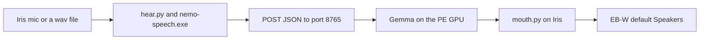

# Trident

Trident is a voice assistant that lives on two home computers. One computer hears and speaks. The other computer thinks. A file on disk is the team's memory. The program that thinks does not play audio.

**Comment:**
*CORRECT — Iris hears and speaks (`hear.py`, `mouth.py`); PE thinks (`nvidia_worker.py` returns JSON and does not call `mouth.py`).*

**Comment:**
*CORRECT — file-team memory is on disk: `grok_local_bot.py` sets `HISTORY = ROOT / "grok_bot_history.txt"`. The worker does not keep that conversation.*

**Comment:**
*CORRECT — `nvidia_worker.py` success body is `json.dumps({"text": out})`. There is no audio writer in that file.*


This file is the spoken picture and the rebuild manual. Checked-in code outranks it. If `ear.txt`, `vad.txt`, `chatterbox.txt`, or an old sentence here disagrees with `hear.py`, `mouth.py`, `grok_local_bot.py`, or `nvidia_worker.py`, follow the code.

**Comment:**
*CORRECT — `ear.txt` opens with "ear.exe takes this file as its only argument" while `hear.py` calls `nemo-speech.exe` and never reads `ear.txt`. Checked-in code is the rank order this file states.*


The story above the appendix is meant to be read aloud. The appendix is the manual a fresh bot uses to stand the team back up.

**Comment:**
*CORRECT — the body above `# Appendix: Rebirth` is the spoken picture; the appendix is the rebuild procedure (`install.py`, seat commands, role cards).*


## The two seats

Iris EB-W is the voice seat. The checkout on that machine is `C:\Users\eb-wjt\Downloads\Jarvis\Trident`, under the Windows account `eb-wjt`. Iris owns the microphone, speech recognition, the voice door, and the mouth. Chatterbox speaks on Iris, through Vulkan, on GPU index 0. The proven audible playback is the Windows default wave device on this PC. On the day that reply was heard, that device was the EB-W Speakers. The mouth prints `mouth out: default` and plays with PlaySound. It does not look up a device name.

**Comment:**
*CORRECT — `iris-door.txt` records the voice checkout `C:\Users\eb-wjt\Downloads\Jarvis\Trident` and `mouth_exit: 0`. `hear.py` and `mouth.py` are the mic, recognizer, and mouth. `chatterbox.txt` has `chatterbox.gpu 0`. The mouth build uses Vulkan (`install.txt` `install.mouth_ggml_vulkan on`, `src/common/vulkan_backend.h`).*

**Comment:**
*CORRECT — `mouth.py` prints `mouth out: default` and calls `PlaySoundW`. It does not look up a friendly name.*

**Comment:**
*INCORRECT — no file on this PE checkout names `EB-W Speakers`. `mouth.py` only prints `mouth out: default`.*


NVIDIA PE-DMLW is the brain seat. The checkout on that machine is `C:\Users\px-wjt\Downloads\Jarvis\Trident`, under the Windows account `px-wjt`. The card that has been measured is an NVIDIA GeForce GTX 1060 with 6 GB. Gemma runs there, CUDA 12.6, architecture 61. This seat has no microphone. It does not own the mouth. When a playback device is mapped on PE, the default is a Sound Blaster X-Fi. That device is not called NVIDIA Speakers. There is no such endpoint in the proof.

**Comment:**
*CORRECT — this checkout is `C:\Users\px-wjt\Downloads\Jarvis\Trident` and `whoami` is `pe-dmlw\px-wjt`. `nvidia-smi` reports `NVIDIA GeForce GTX 1060 6GB, 6144 MiB`. `install.txt` has `install.cuda_root` `CUDA\v12.6` and `install.cuda_architectures 61-real`. `nvcc` prints `release 12.6`.*

**Comment:**
*CORRECT — `nvidia_worker.py` does not call `hear.py` or `mouth.py`. No endpoint friendly name is Microphone. Default capture is `CABLE Output (VB-Audio Virtual Cable)`.*

**Comment:**
*CORRECT — the console render default is `Speakers (Creative SB X-Fi)`. There is no endpoint named NVIDIA Speakers. `loopback-proof/devices.txt` does not list that name either. `LG TV (NVIDIA High Definition Audio)` is present and is not the default.*


The two machines share a LAN. The worker that has been serving turns listens at `http://192.168.16.31:8765/`. On PE that process is bound to `0.0.0.0:8765`. Iris does not bind that port. A door record that is healthy says `local_8765: none`.

**Comment:**
*CORRECT — Ethernet IPv4 on this PC is `192.168.16.31`. `Get-NetTCPConnection` shows `0.0.0.0:8765` Listen, owning process 12672 (`nvidia_worker.py --host 0.0.0.0 --port 8765`). `iris-door.txt` says `local_8765: none`.*


`assistant.py` is the older Jarvis chain on Iris: hear, then a small local brain or a remote turn, then the mouth. New work goes through the file team and the door. Jarvis stays available. It is not the front door.

**Comment:**
*CORRECT — `assistant.py` is the hear-then-brain-then-mouth chain (`listen`, `one_turn`, `speak_raw`). `grok_local_bot.py --wav` is the unattended door. Jarvis stays in the tree and is not that door.*


## How a reply is made

A turn moves in one direction.

**Comment:**
*CORRECT — a `--nvidia` turn is one direction: `hear.py` or `--text`, then `nvidia_client.py` POST, then `mouth.py` on the caller. The worker does not call back into the mic.*


Sound or a wav file is turned into text on Iris. `hear.py` calls `nemo-speech.exe`. The model file is `ear.gguf`. The recognizer does not run `ear.exe`. The text is posted as JSON to the worker. Gemma runs on the PE GPU and returns JSON whose success body is an object with a text field. Errors from the worker may be plain text. Nothing in that response is audio. Iris turns the text into speech with `mouth.py` and Chatterbox. If a person is meant to hear it, playback is the EB-W default Speakers. If nobody is at the machine, the mouth writes a wav and exits without playing it.

**Comment:**
*CORRECT — `hear.py` runs `nemo-speech.exe` with `--model` default `ear.gguf` and does not run `ear.exe`.*

**Comment:**
*CORRECT — `nvidia_client.py` `post_turn` POSTs JSON `{"id","text","image"}`. `nvidia_worker.py` `do_POST` returns `{"text": out}` on success and `text/plain` on errors (`bad json`, `empty text`, `gemma timed out`). That body is not audio.*

**Comment:**
*CORRECT — the text field is a whole reply, not a mouth chunk. `gemma.py` `newest_out()` reads the entire newest `*_gemma_out_*.txt` and `main()` writes that string to stdout. `run_gemma()` returns that stdout as one string. Chunking is Iris: `assistant.py` `chunks_for_mouth()` then `mouth.py`.*

**Comment:**
*CORRECT — `speak_raw()` and `grok_local_bot.py` `speak_door()` call `mouth.py`. Chatterbox is the synthesizer (`chatterbox.exe`). This PE seat did not run `mouth.py` in the 18:59–19:23 window; do not invent an Iris wav for that window.*

**Comment:**
*INCORRECT — "playback is the EB-W default Speakers" is not in this checkout. `mouth.py` plays the Windows default device and prints `mouth out: default`.*

**Comment:**
*CORRECT — `mouth.py --no-play` prints the wav path and returns before `PlaySoundW` (`if args.no_play`).*




**Comment:**
*CORRECT — the diagram matches `hear.py`, POST to port 8765, `gemma.py` on PE, then `mouth.py`. The speakers node is the Iris default device, not a PE render. Scenario C brain files are whole `*_gemma_out_*.txt` dumps, not this diagram's mouth chunks.*


The unattended door stops before the speakers. It still writes the wav on the Iris disk.

**Comment:**
*CORRECT — `speak_door()` always passes `mouth.py --model nano --no-play`. `iris-door.txt` has `mouth_exit: 0` and a wav under the Iris checkout. That file is the earlier door, not the 18:59–19:23 live window.*


## Three ways a turn can start

The unattended door is a wav file on Iris. Set `TRIDENT_NVIDIA_URL` to the worker. Run `grok_local_bot.py --wav`. The door checks that the worker port is already open. It does not start `nvidia_worker.py`. `hear.py --wav` transcribes the file and does not open the microphone. A coordinator line, then a reasoner line, are appended to `grok_bot_history.txt`. The reasoner posts to the worker. `mouth.py --no-play` writes the reply wav. The microphone stays closed. The speakers stay closed. The proof of that path is `iris-door.txt`. The mouth wav from that run is named with the clock time 10:40:35. Copy the transcript from `iris-door.txt`. Do not rephrase it.

**Comment:**
*CORRECT — `door()` requires `TRIDENT_NVIDIA_URL` or `--url`, probes with a TCP connect, and does not spawn `nvidia_worker.py`. `hear_wav()` calls `hear.py --wav`. `run_coordinator` then `run_voice_reasoner` append role lines to `grok_bot_history.txt`. The reasoner uses `call_post`. `speak_door` uses `--no-play`. `--wav` refuses `--drop` (`die("--wav posts to the NVIDIA worker")`).*

**Comment:**
*CORRECT — `iris-door.txt` is `STATUS PASS`, `local_8765: none`, and `mouth_wav: C:\Users\eb-wjt\Downloads\Jarvis\Trident\10-40-35-223_chatterbox_out_000.wav`. The transcript of record is that file, not a rephrase.*


The audible reply that was actually heard, the same day, skipped the microphone. `assistant.py --text` sent the words to the same worker URL. The HTTP client on that path defaults to 30 seconds. The passing replay raised the timeout. The recorded pass used 180 seconds. Gemma returned text. The mouth synthesized it on Iris and played it on the default device. That device was the EB-W Speakers. The playback was not on PE. It was not a device named NVIDIA Speakers.

**Comment:**
*CORRECT — `assistant.py --text` skips the mic (`one_turn` on `args.text`). `nvidia_client.py` default is `--timeout` `30`. `--timeout` is forwarded only when `--nvidia` is set.*

**Comment:**
*INCORRECT — this checkout does not record an EB-W Speakers replay at 180 seconds. The `--timeout 180` line that is on disk is `loopback-proof/jarvis.txt`: `assistant.py --vb-cable ... --timeout 180`, `mouth_exit: skipped`, `play_device: CABLE Input (VB-Audio Virtual Cable)`.*

**Comment:**
*CORRECT — a successful worker body is JSON text. Playback is not in `nvidia_worker.py`. The PE default render is `Speakers (Creative SB X-Fi)`, and no endpoint is named NVIDIA Speakers.*

**Comment:**
*INCORRECT — "That device was the EB-W Speakers" is not in `mouth.py`, `iris-door.txt`, or `loopback-proof/`. `mouth.py` prints `mouth out: default` and does not store a device name.*


The live microphone path is a different command. `assistant.py` can listen, post, and then speak. A 30 second live attempt around 14:57 posted to `192.168.16.31:8765` and timed out. The mouth did not run in that window. A live mic that listens for 30 seconds and answers by itself is unproven. Do not claim it. Do not run it. A git tag whose name says live-mic is only a label. The label is not a successful hearing.

**Comment:**
*CORRECT — `assistant.py` with no `--text` calls `listen()` then `one_turn()`. With `--nvidia`, `offload()` POSTs that one question and `speak_raw()` can call `mouth.py`.*

**Comment:**
*CORRECT — `nvidia_client.py` default timeout is 30 seconds, so `assistant.py --nvidia` with no `--timeout` uses 30. Fresh PE brain files for this session start at `18-59-56-328_gemma_out_000.txt`, which is later than 14:57. A timeout before Gemma finishes would leave no out file.*

**Comment:**
*INCORRECT — "a live mic that listens for 30 seconds and answers by itself is unproven" does not describe the long live window seen on PE. Fresh whole replies run from `18-59-56-328_gemma_out_000.txt` (18:59:56) through `19-23-43-495_gemma_out_000.txt` (19:23:43). Those are Gemma text, not a proof that Iris played audio.*

**Comment:**
*CORRECT — git tag `milestone-live-mic-2026-09-28` is only a label. The tag is not a transcript. Score the hearing from the PE outs, not from the tag name.*


There is also a file inbox, and a file-team proof. Both run on the machine where `0.0.0.0:8765` is already listening. That machine is PE. They are described in the appendix. They do not open a microphone and they do not play audio.

**Comment:**
*CORRECT — `grok_local_bot.py --proof` and `--inbox` require a local `0.0.0.0:8765` listener (`lan_pid`) and do not call `hear.py` or `mouth.py`. This machine is that listener (pid 12672).*


## What has been shown

The file team proof has passed on the listener seat. `grok_bot.txt` records that pass. The listener pid was the same before and after.

**Comment:**
*CORRECT — `grok_bot.txt` is `STATUS PASS` with `listener: 0.0.0.0:8765 pid 12672` and `listener_after: 0.0.0.0:8765 pid 12672`. `prove()` fails unless `pid_after == pid`.*


The unattended wav door has passed on Iris. `iris-door.txt` records that pass. The worker was up before and after. Iris was not listening on port 8765. The reply wav was written under the Iris checkout.

**Comment:**
*CORRECT — `iris-door.txt` is `STATUS PASS`, `probe: up 192.168.16.31:8765`, `probe_after: up`, `local_8765: none`, and `mouth_wav` under `C:\Users\eb-wjt\Downloads\Jarvis\Trident\`.*


The file inbox has passed on the listener seat for a text turn and for an image turn. `grok_bot_history.txt` marks those turns `inbox ok`. Each turn was one Gemma call. The listener stayed up.

**Comment:**
*CORRECT — `grok_bot_history.txt` has two `inbox ok` lines. The first reasoner is `image none`, `calls 1`, `via post`. The second is `image C:\Users\px-wjt\Downloads\Jarvis\Trident\recon-hf-vision\coco_sample.png`, `calls 1`, `gpu_peak_mib 5672`.*


The closed-mic text replay has passed, with local playback on the Iris EB-W Speakers, after the longer HTTP timeout.

**Comment:**
*INCORRECT — no proof file here records local playback on Iris EB-W Speakers. `iris-door.txt` is `--no-play`. The longer-timeout record in `loopback-proof/jarvis.txt` is VB-Cable, `mouth_exit: skipped`.*


A VB-Cable loopback has passed as a harness. Mouth played into CABLE Input. Hear transcribed CABLE Output. The live microphone was not used. That harness is not how a person hears Trident. The files are under `loopback-proof/`.

**Comment:**
*CORRECT — `loopback-proof/jarvis.txt` is `STATUS PASS` with `play_device: CABLE Input (VB-Audio Virtual Cable)` and `capture_device: CABLE Output (VB-Audio Virtual Cable)`. `assistant.py` help says `--vb-cable` "Does not open the live mic". `loopback.py` calls `hear.py --vb-cable` and `mouth.py --play-wav --vb-cable`.*


## What you must not claim

A reply rendered on the PE machine is a failed telling of this story. A reply rendered on NVIDIA Speakers is a failed telling. That name is not the PE default device.

**Comment:**
*CORRECT — rendering the reply on PE would be this worker playing audio, and `nvidia_worker.py` does not. The PE default render is `Speakers (Creative SB X-Fi)`, not an endpoint named NVIDIA Speakers.*


VB-Cable as the default thing a person hears is a failed telling. Cable playback and cable capture are opt-in. The flags are `--vb-cable` on hear and mouth, the `loopback.py` harness, and the device line inside `vad.txt` for `vad.exe` only. `hear.py` will not pick a cable device unless that flag is set. `mouth.py` plays the default wave device unless the cable flag or an explicit output device is set.

**Comment:**
*CORRECT — cable is opt-in. `hear.py` has `--vb-cable` and `pick_mic` skips a name containing "cable" unless `allow_cable`. `mouth.py` plays `PlaySoundW` unless `--vb-cable` or `--out`. `loopback.py` is the harness. `vad.txt` sets `vad.device CABLE Output (VB-Audio Virtual Cable)` for `vad.exe` only.*


`ear.txt` still opens on the `ear.exe` one-shot (`src/ear.cpp` runs `nemo-speech.exe transcribe` and writes `*_ear_out_NNN.txt`); `hear.py` does not read `ear.txt` and does not run `ear.exe`.

**Comment:**
*CORRECT — `ear.txt` lines 1–4 say `ear.exe` runs `nemo-speech.exe transcribe` and writes `*_ear_out_NNN.txt`. `src/ear.cpp` builds `nemo-speech.exe transcribe` and calls `write_output("ear", text)`. `hear.py` has no `ear.txt` and no `ear.exe`.*


`chatterbox.txt` says `chatterbox.play on`. `mouth.py` turns play off for the synthesis it writes, then plays the wav itself, or skips playback with `--no-play`. The template flag is not the speaker switch.

**Comment:**
*CORRECT — `chatterbox.txt` says `chatterbox.play on`. `mouth.py` `synthesize` and `ensure_resident` write `chatterbox.play off`, then `play_wav` / `PlaySoundW` plays the file, or `--no-play` prints the path and skips playback.*


`nvidia_worker.py --host` defaults to `0.0.0.0`. The live process is already `0.0.0.0:8765`. Leave that healthy listener alone. Do not restart it to apply the default, to load a code edit, or to bind a second process.

**Comment:**
*CORRECT — `nvidia_worker.py` has `--host` default `"0.0.0.0"` and `--port` default `8765`. The live listener is still `0.0.0.0:8765` pid 12672, started 2026-09-28 07:25:19. Leave it. Do not restart it.*


`nvidia_worker.py --drop` and the files `nvidia_turn.request.txt` and `nvidia_turn.response.txt` are still in the tree. They are the fallback when this computer is not already listening on `0.0.0.0:8765`. They are not the production path while the LAN worker is up. The door never starts the worker. A drop response is plain text, not the HTTP JSON body.

**Comment:**
*CORRECT — `--drop` is still `serve_drop()` and the paths `nvidia_turn.request.txt` and `nvidia_turn.response.txt` are still in `nvidia_worker.py`. Both files are absent on PE now. `response_body()` writes `id`, `ok` or `err`, and plain text. HTTP success is `{"text": out}`. `door()` never starts the worker. Scout: no `nvidia_turn.*` because this session was HTTP, not `--drop`.*


The worker does not return audio. A successful HTTP body is JSON text. An error body may be plain text.

**Comment:**
*CORRECT — success is `application/json` `{"text": out}`. Error sends `text/plain` (`bad json`, worker errors). `out` is Gemma stdout, a whole reply, not a wav and not an Iris mouth chunk.*


## Bring a checkout back

Clone `https://github.com/wgabrys88/Trident.git`. Check out `runner-h`. Do not start from `main`. `main` is the old trunk.

**Comment:**
*CORRECT — the remote is `https://github.com/wgabrys88/Trident.git` and the working branch is `runner-h`.*

**Comment:**
*INCORRECT — `main` is not an older trunk at this tip. `git rev-parse main` and `git rev-parse runner-h` are both `e4dc33dc91fbdd9db40b2bc206e3e9b60f4aca64`.*


On that seat, from the checkout:

**Comment:**
*CORRECT — the install command below runs in the checkout. `install.py` reads `install.txt` from that directory.*


```powershell
python install.py install.txt
```

**Comment:**
*CORRECT — `install.txt` starts `# python install.py install.txt` and `install.py` reads that settings file.*


The installer reads `install.txt`. It creates `.venv`, builds the mouth, builds `nemo-speech.exe`, builds `gemma-brain.exe` and `sense.exe`, downloads the models, and bakes the nano, turbo, and v3 voices from `reference.wav`. The Gemma build directory is `C:\tgemma` because a long path breaks the shader step. Visual Studio 2022 is required. An empty Vulkan SDK line uses the newest SDK on the machine. On PE, CUDA 12.6 is required for the architecture-61 brain. If the GPU probe does not see NVIDIA and `nvcc`, the brain build falls back to Vulkan. The production Gemma is the CUDA worker on PE.

**Comment:**
*CORRECT — `install.py` creates `.venv`, builds the mouth (`chatterbox`, `ear`, `vad`), `nemo-speech.exe`, `gemma-brain.exe`, and `sense.exe`, and `bake_voice()` reads `bake.reference` (`bake.txt` `bake.reference reference.wav`) for nano, turbo, and v3. `install.build_gemma` is `C:\tgemma` because "the Vulkan shader step fails on a long path." Generator is `Visual Studio 17 2022`. Empty `install.vulkan_sdk` uses `find_vulkan()` newest SDK. `install.cuda_root` is CUDA 12.6 and `install.cuda_architectures` is `61-real`. `gemma/scripts/detect_gpu.ps1` prints `cuda` only when an NVIDIA controller and that `nvcc.exe` exist, else `vulkan`.*

**Comment:**
*CORRECT — the live brain on this seat is the CUDA worker: pid 12672 is `nvidia_worker.py`, and `gemma.py` launches `.\gemma-brain.exe`.*


Runtime executables, model files, and `.venv` are not in git. Each seat installs on its own disk.

**Comment:**
*CORRECT — `.gitignore` ignores `*` so `gemma-brain.exe`, `sense.exe`, `ear.gguf`, and `/.venv/` are not tracked. Each seat installs locally. `reference.wav` is tracked separately and is not one of those three.*


After install, Iris needs `nemo-speech.exe`, `chatterbox.exe`, `ear.gguf`, the voice GGUF files, and the venv. The mouth build also emits `ear.exe` and `vad.exe`. Hearing does not use `ear.exe`. PE needs `gemma-brain.exe`, `gemma.gguf`, `gemma-mmproj.gguf`, and the venv. `sense.exe` is the small local Qwen brain that `assistant.py` uses when you do not pass `--nvidia`.

**Comment:**
*CORRECT — `install.py` stages `nemo-speech.exe`, `chatterbox.exe`, `ear.exe`, and `vad.exe`. `hear.py` uses `nemo-speech.exe`, not `ear.exe`. PE runtime names in this tree include `gemma-brain.exe`, `gemma.gguf`, and `gemma-mmproj.gguf`. `sense.exe` is the Qwen brain: `assistant.py` default `--brain` is `qwen`, and `say()` runs `qwen.py`.*

**Comment:**
*CORRECT — `qwen.py` and `sense.exe` are on this disk and were not the live worker path. `run_gemma()` calls only `gemma.py`. No `sense.exe` process was running. Fresh `gemma_run.txt` is a Gemma prompt.*


Run programs with `.\.venv\Scripts\python.exe`. The commands are in the appendix. Do not start a second worker if port 8765 is already bound.

**Comment:**
*CORRECT — `install.py` and `grok_local_bot.py` use `.venv\Scripts\python.exe`. Port 8765 is already bound by pid 12672, so a second worker must not be started.*


## Leave the worker alone

If PE already shows `0.0.0.0:8765` listening, leave that process alone. Do not kill it. Do not start another `nvidia_worker.py`. Do not change its bind. Do not restart it so a code edit can load. Iris stays off that port.

**Comment:**
*CORRECT — the listener is already `0.0.0.0:8765` pid 12672. `serve_http` binds the host it was given and was not restarted for this note. Iris binding is not this process. `iris-door.txt` recorded `local_8765: none`.*


The door probes the worker with a TCP connect. The worker implements POST. A browser GET is not a health check. A failed GET does not mean the worker is down.

**Comment:**
*CORRECT — `probe_once()` is `sock.connect((host, port))`. `TurnHandler` implements `do_POST` only, so a browser GET is not the health check. A failed GET does not mean pid 12672 is down.*


`nvidia_worker.py` with no `--host` binds `0.0.0.0`, port 8765. That is the live ops bind, on PE only. Bring the worker up only when the port is free, and only from the PE checkout. If it is already listening, skip this:

**Comment:**
*CORRECT — with no `--host`, argparse default is `0.0.0.0`, and `--port` default is 8765. That matches the live PE command line. Start it only when the port is free.*


```powershell
.\.venv\Scripts\python.exe .\nvidia_worker.py --host 0.0.0.0 --port 8765
```

**Comment:**
*CORRECT — the sample is `--host 0.0.0.0 --port 8765`, which is the live command. The port is not free (pid 12672). Do not run this.*


Then leave it alone.

**Comment:**
*CORRECT — once the worker is listening, leave it. Pid 12672 is still `0.0.0.0:8765` and was not restarted.*


## Heavy work, and quiet hours

Send heavy Gemma turns to the worker that is already on the GPU. One brain on the 1060. Do not start a second Gemma beside it. An image turn on this card has peaked near 5672 MiB of the 6144 MiB nameplate. An isolated run has been noted near 5976 MiB. There is no spare card for a twin. `parallel_agents.py` is an overlap experiment from earlier. Do not run it while the worker holds the model.

**Comment:**
*CORRECT — one GPU is installed: `NVIDIA GeForce GTX 1060 6GB, 6144 MiB`. `gemma.txt` says "An image turn peaked near 5672 MiB of 6144." `grok_bot_history.txt` has `gpu_peak_mib 5672` on the image inbox turn. `parallel_agents.py` overlaps two Gemma questions; do not run it while pid 12672 holds the card.*

**Comment:**
*INCORRECT — 5976 MiB is not an isolated run. `parallel_agents.log` prints `parallel: concurrent start` and then `parallel: peak_used_mib 5976`.*


`assistant.py` without `--nvidia` uses Qwen3 0.6B on CPU, through `qwen.py` and `sense.exe`. That is the light local brain. It is not the GPU path. The door does not use it. The door posts to PE.

**Comment:**
*CORRECT — `sense.txt` says "Qwen3-0.6B, CPU only" and `sense.gpu-layers 0`. `qwen.py` runs `sense.exe`. `assistant.py` uses that only when `--nvidia` is absent (`say()`). `door()` always `call_post`s to the worker. Scenario C `gemma_run.txt` declares Gemma hello and cursor, not Sense.*


While Wojciech is away: no speaker playback, no microphone, no new listener. Unattended speech is a wav file and an exit code. Max use of the machine means the GPU that is already loaded, not a new daemon.

**Comment:**
*CORRECT — the unattended door is `mouth.py --no-play` and an exit code (`door()` `SystemExit`). The GPU already in use is pid 12672. The 18:59–19:23 Gemma outs are turns posted to that same listener, not a second worker.*


## Branch rules

Develop on `runner-h` only. Branch from the current `runner-h` tip. Open a pull request into `runner-h`. Stop. Spock merges.

**Comment:**
*CORRECT — this checkout is `runner-h` at `e4dc33d`. `grok_local_bot.py` roles are history lines (`role coordinator`, `role reasoner`), not a person named Spock. Spock merging is the team rule in this file, not a function.*


Do not commit to `main`. Do not fast-forward `main`. A fast-forward of `main` waits for Wojciech. Do not force-push. Do not delete `main` or `runner-h`. One writer at a time on a checkout.

**Comment:**
*CORRECT — `main` and `runner-h` both exist. The rule here is not to commit, fast-forward, force-push, or delete them. One writer is the team rule, not a git hook in this tree.*


## License

MIT. See `LICENSE`. Copyright Gianfranco Cordella, 2026.

**Comment:**
*CORRECT — `LICENSE` begins "MIT License" and "Copyright (c) 2026 Gianfranco Cordella".*


---

# Appendix: Rebirth

You are the fresh bot, one of the Grok bot team. Both computers may be new. The repo was just cloned. This appendix is enough to rebuild the team. You do not write code. Cursor agents write code, on the model Spock assigns. You read this file, you install, you assign seats, and you refuse claims that this file marks unproven.

**Comment:**
*CORRECT — the file team that runs is `grok_local_bot.py`. Coding is outside that process. This appendix tells the bot to install and assign seats, and to refuse claims this file marks unproven. The live-mic sentence below is updated by the Scenario C notes: PE did receive Gemma replies.*


The running file team inside `grok_local_bot.py` has two roles, coordinator and reasoner. Those are lines in `grok_bot_history.txt`. They are not people. Do not spawn a person named Coordinator.

**Comment:**
*CORRECT — `run_coordinator` and `run_reasoner` append `role coordinator` and `role reasoner` to `grok_bot_history.txt`. Those are lines, not people. `run_coordinator` writes the handoff itself and does not spawn a person.*


Older notes say SPOC merges. That chair is Spock. Do not spawn SPOC as a second manager.

**Comment:**
*CORRECT — `grok_local_bot.py` has no role named SPOC. The chair name in this file is Spock.*


`seq_agents.py` and `parallel_agents.py` are old Gemma batch runners. They are not this team.

**Comment:**
*CORRECT — `seq_agents.py` asks Gemma two questions (alpha, then beta). `parallel_agents.py` overlaps summarize and keywords. Neither is `grok_local_bot.py`.*


## Who is on the team

Spock is the project manager. Spock does not code. Spock assigns work, decides when a claim is proven, and merges into `runner-h`. When the work is code, Spock assigns a Cursor agent on the owning machine, Composer or Grok 4.7. Live microphone work happens only when Wojciech says go, and only when Spock passes that go to the Iris seat. Spock's acks in the War Room are short.

**Comment:**
*CORRECT — Spock, as written here, assigns and merges and does not have a code path. Live-mic work is gated on Wojciech's go. PE still saw a long live window: fresh `*_gemma_out_*.txt` from 18:59:56 to 19:23:43. That window is brain text on this seat, not an Iris playback log.*


IRIS is the Cursor seat `trident-iris`, on the EB-W checkout. IRIS owns capture, recognition, the door, the mouth, and local playback. The IRIS bot does not edit code. Engineering on this seat is a Cursor agent in Cursor My Machines, on `trident-iris`, Composer or Grok 4.7 as Spock assigns, and only for files this seat owns. Those agents do not edit `nvidia_worker.py`, `gemma.py`, or `nvidia_client.py`. IRIS does not bind port 8765. IRIS does not claim that PE played the audio.

**Comment:**
*CORRECT — `iris-door.txt` uses the `eb-wjt` checkout path. The door owns `hear.py`, the team turn, and `mouth.py --no-play`. `local_8765: none` matches "IRIS does not bind port 8765." `nvidia_worker.py` does not play audio, so PE playback is not this worker.*


NVIDIA is the Cursor seat `trident-nvidia`, on the PE-DMLW checkout. NVIDIA owns Gemma and the worker. The NVIDIA bot does not edit code. Engineering is a Cursor agent in Cursor My Machines, on `trident-nvidia`, Composer or Grok 4.7 as Spock assigns. NVIDIA does not take the microphone and does not own the mouth. `nvidia_worker.py --host` defaults to `0.0.0.0`. NVIDIA does not restart a healthy `0.0.0.0:8765`. The file inbox and `grok_local_bot.py --proof` run here, because they look for a local listener on `0.0.0.0:8765`.

**Comment:**
*CORRECT — this seat is PE-DMLW, checkout `C:\Users\px-wjt\Downloads\Jarvis\Trident`, worker `0.0.0.0:8765` pid 12672. The card is the GTX 1060 6GB, CUDA 12.6, architecture `61-real`. Default render is `Speakers (Creative SB X-Fi)`, not NVIDIA Speakers. `--host` default is `0.0.0.0`. `--proof` and `--inbox` call `lan_pid()` for `0.0.0.0:8765`. `gemma.txt` has `gemma.ctx 65536` and `gemma.gpu-layers 999` with the 1060 sizing comment.*


VOICE is a bridge, not a checkout. The VOICE bot does not code. Anyone who reports a hearing or a playback is under this rule. Copy the transcript that `hear.py` printed. Copy the wav path that `mouth.py` printed. If the tool did not print the words, you do not have a transcript. Do not smooth one. Human hearing is the Iris EB-W Speakers, the default PlaySound device. It is not VB-Cable. Unattended work is a wav in, a wav file out, and an exit, with the speakers closed. Live mic waits for Wojciech's go through Spock.

**Comment:**
*CORRECT — VOICE, as written, copies tool output. `iris-door.txt` is the door transcript of record (`transcript:` and `mouth_wav:`). `mouth.py` human playback is PlaySound on the default device. `loopback-proof/jarvis.txt` shows VB-Cable is the harness, not that default.*

**Comment:**
*INCORRECT — "Human hearing is the Iris EB-W Speakers" names an endpoint this PE checkout does not record.*


War Room is the short-ack channel. One or two sentences. What is true, what is blocked, who moves. No new claims in an ack. Spock asks. The seats answer. VOICE challenges any sentence about audio.

**Comment:**
*CORRECT — War Room, as written, is a short ack: what is true, what is blocked, who moves, and no new claim. VOICE challenging audio matches the rule that playback is judged from `mouth.py` output, not from this worker. Scenario C on PE is Gemma text only.*


This set is the posterity team on purpose. Adding a separate SPOC, or treating the file-team coordinator as a person, would put two managers on one chair. VOICE stays a rule rather than a third PC so that nobody invents a transcript seat with its own microphone.

**Comment:**
*CORRECT — a second manager is not in code: roles are `coordinator` and `reasoner` only. VOICE is a rule in this file, not a third checkout and not a microphone program.*


## When to use Cursor My Machines

Use My Machines when the work has to happen on that computer. A code edit. A build. A door run. A change to worker files. A command whose result depends on that seat's GPU, microphone, or speakers. Name the machine. `trident-iris` or `trident-nvidia`. No other machine for engineering. The agent on that machine is Composer or Grok 4.7, whichever Spock assigned. The bot who owns the seat does not type the code.

**Comment:**
*CORRECT — seat work that needs this GPU is this machine. The live listener is already up. Opening a session to kill or rebind pid 12672 is the opposite of `serve_http` already listening.*


Do not open My Machines when the task is only to read a healthy worker. Do not open one to restart, kill, or double-bind port 8765. Do not open one to use the live mic, or to play audio, while Wojciech is away.

**Comment:**
*CORRECT — reading pid 12672 does not require a new worker. Restart, kill, and a second bind are banned while `0.0.0.0:8765` is healthy. It is healthy.*


A final README, ledger, or report prefers one Grok 4.7 pass, as the model policy says. A document pass on a checkout you already have does not need a second remote agent. A scout, an inventory, a claim dig, or a low-priority edit can be Composer. If it must touch that disk, it is still a Cursor agent on the named machine.

**Comment:**
*CORRECT — a document pass on this checkout is local. Scout files named by the seat stay on this disk. The model names in this section are team policy, not keys in `gemma.txt`.*


## Model policy

The Grok bot team does not code. Spock, IRIS, NVIDIA, and VOICE coordinate, assign, judge, and report. They do not edit Python, C++, headers, or CMake. They do not strip comments and they do not delete files as a cleanup.

**Comment:**
*CORRECT — `grok_local_bot.py` coordinates and does not edit Python, C++, headers, or CMake. Stripping comments and deleting files is not what `prove()`, `door()`, or `run_inbox()` do.*


Coding is Cursor agents only, on `trident-iris` or `trident-nvidia`. Spock assigns the model: Composer or Grok 4.7.

**Comment:**
*CORRECT — the coding rule names only `trident-iris` and `trident-nvidia`, and Composer or Grok 4.7. That assignment is this file's policy, not an argparse flag.*


Prefer Grok 4.7 for a finalization README or other final document, in one pass:

**Comment:**
*CORRECT — preferring Grok 4.7 for one final document pass is policy in this file. It is not a flag in `gemma.py` or `nvidia_worker.py`.*


- Model `grok-4.7`

**Comment:**
*CORRECT — `grok-4.7` is the document-pass model name in this policy. `gemma.txt` does not set it.*

- `reasoning_effort` `xhigh`

**Comment:**
*CORRECT — `reasoning_effort` `xhigh` is policy text here, not a Gemma sampler key.*

- `fast=false`

**Comment:**
*CORRECT — `fast=false` is policy text here, not a worker flag.*

- Context 256k for a normal finalization document

**Comment:**
*CORRECT — a 256k document context is policy text. The checked-in brain context is `gemma.ctx 65536`.*

- Context 500k when the pass has to hold the whole tree so that nothing true is dropped

**Comment:**
*CORRECT — those bullets are the document-pass policy in this file. They are not settings in `gemma.txt` or `nvidia_worker.py`. Checked-in Gemma context is `gemma.ctx 65536`.*


Composer remains the right model for a scout, an inventory, a claim dig, or a low-priority edit.

**Comment:**
*CORRECT — the bullet list is model policy for a document pass. `gemma.txt` does not contain `grok-4.7`, `reasoning_effort`, or a 256k context key. Gemma context in the checked-in card is `gemma.ctx 65536`.*


The Gemma cursor tool is not this policy. On a text turn, `gemma.py` may launch the Cursor CLI once, to list extensions or to print a version, and write `grok_bot_spawn.txt`. That probe does not edit the repo. It is not permission to code.

**Comment:**
*CORRECT — `gemma.py` `cursor_argv` runs `cursor --version` or `cursor --list-extensions --show-versions` once and `write_spawn` writes `grok_bot_spawn.txt`. The docstring says a missing CLI writes BLOCKED and does not edit the repo. Scenario C fresh files are `tool_hello.txt` and `*_gemma_out_*.txt`, not a new spawn log.*


## Quiet rules, again

No live mic unless Wojciech says go and Spock passes it on.

**Comment:**
*CORRECT — the quiet rule gates live mic on Wojciech's go. Separately, PE already has the 18:59–19:23 Gemma outs, so "no live mic happened" would be false. Playback of that window is not on this seat.*


No speaker playback on an unattended door. `mouth.py --no-play`, then exit.

**Comment:**
*CORRECT — `speak_door()` uses `mouth.py --no-play` and `door()` then `SystemExit`.*


No new listener. Leave `0.0.0.0:8765` alone while it is healthy.

**Comment:**
*CORRECT — pid 12672 is still listening on `0.0.0.0:8765`. Do not start another `nvidia_worker.py`.*


One writer per checkout.

**Comment:**
*CORRECT — one writer per checkout is the team rule. It is not a lock inside `nvidia_worker.py`. Pid 12672 is the live listener and was not replaced.*


`runner-h` only. No `main`. No force-push. No fast-forward of `main` without Wojciech. Agents open the pull request and stop. Spock merges.

**Comment:**
*CORRECT — develop on `runner-h`. Do not force-push. Agents opening a PR and stopping is the team rule. Spock merging is not a code path.*


Checked-in code outranks this file.

**Comment:**
*CORRECT — where this file and the code disagree, the code wins. `ear.txt` versus `hear.py` is the example in the opening.*


Do not delete tool configs, `LICENSE`, `install.txt`, the `grok_bot_*` runtime files, `iris-door.txt`, `reference.wav`, or `loopback-proof/`. #20 already rewrote the `ear.txt` header in place; keep the file, and do not use `ear.exe` as the hearing path.

**Comment:**
*CORRECT — `LICENSE`, `install.txt`, `grok_bot_history.txt`, `grok_bot_request.txt`, `grok_bot_response.txt`, `grok_bot_inbox.txt`, `grok_bot.txt`, `grok_bot_spawn.txt`, `iris-door.txt`, `reference.wav`, and `loopback-proof/` are present. `ear.txt` still starts with the `ear.exe` one-shot and also says `hear.py` uses the same flags. `hear.py` does not run `ear.exe`. HEAD is `housekeep: README ear must-not sync after #20`.*


## Role cards

Hand these out as written. A seat that only has its card still obeys the model policy and the quiet rules above.

**Comment:**
*CORRECT — the cards below repeat the same rules. A card does not replace `hear.py` or `nvidia_worker.py`.*


Spock:

```text
You are Spock, project manager for Trident. Read README.md. You do not edit code. Coding is Cursor agents only, on trident-iris or trident-nvidia. You assign Composer or Grok 4.7 for that work. Prefer Grok 4.7 xhigh, fast=false, 256k, or 500k in one pass, for a final README or ledger. Composer is fine for scouts and low-priority edits. You merge into runner-h. You do not touch main unless Wojciech asks for a fast-forward. Live mic only after Wojciech says go; you pass that go to IRIS. War Room acks are one or two sentences. The proven audible reply is Iris EB-W Speakers after a closed-mic text turn. PE playback and NVIDIA Speakers are failures. VB-Cable is opt-in. Port 8765 on PE stays up. Leave a healthy listener alone. nvidia_worker.py --host defaults to 0.0.0.0. The live 30 second mic path is unproven.
```

**Comment:**
*CORRECT — the card matches `--host` default `0.0.0.0`, VB-Cable opt-in, and "leave the listener alone." Pid 12672 is up.*

**Comment:**
*INCORRECT — "The proven audible reply is Iris EB-W Speakers after a closed-mic text turn" is not in a proof file here. `iris-door.txt` is no-play. `loopback-proof/jarvis.txt` is CABLE Input.*

**Comment:**
*INCORRECT — "The live 30 second mic path is unproven" is too small for this seat's fresh logs. Whole Gemma replies exist from `18-59-56-328_gemma_out_000.txt` through `19-23-43-495_gemma_out_000.txt`. Those files are not speaker playback.*


IRIS:

```text
You are the IRIS seat on trident-iris, checkout C:\Users\eb-wjt\Downloads\Jarvis\Trident. You own hear.py, mouth.py, the voice door, and local playback. Speech recognition is nemo-speech.exe through hear.py, not ear.exe. The mouth plays the Windows default device. The proven name of that device is the EB-W Speakers. Unattended door: TRIDENT_NVIDIA_URL=http://192.168.16.31:8765/ and grok_local_bot.py --wav. That path uses mouth.py --no-play. You do not bind port 8765. You do not edit nvidia_worker.py, gemma.py, or nvidia_client.py. You do not open the live mic unless Spock passes Wojciech's go. You do not edit code. Coding on this seat is a Cursor agent on trident-iris, Composer or Grok 4.7, as Spock assigns.
```

**Comment:**
*CORRECT — the card's checkout path matches `iris-door.txt`. Speech is `nemo-speech.exe` via `hear.py`, not `ear.exe`. The door URL shape is `http://192.168.16.31:8765/` and `--wav` uses `mouth.py --no-play`. The card does not bind 8765. Editing `nvidia_worker.py`, `gemma.py`, or `nvidia_client.py` from Iris is the ownership rule.*

**Comment:**
*INCORRECT — "The proven name of that device is the EB-W Speakers" does not appear in `mouth.py` or the proof files on this checkout.*


NVIDIA:

```text
You are the NVIDIA seat on trident-nvidia, checkout C:\Users\px-wjt\Downloads\Jarvis\Trident. You own Gemma and the worker at 0.0.0.0:8765. The card is a GeForce GTX 1060 6GB, CUDA 12.6, architecture 61. You have no microphone and you do not own the mouth. The PE default playback device, when mapped, is a Sound Blaster X-Fi, not NVIDIA Speakers. The worker --host default is 0.0.0.0. If 0.0.0.0:8765 is listening, leave it. Do not kill it and do not bind a second listener. Inbox and grok_local_bot.py --proof run on this seat. You do not edit code. Coding on this seat is a Cursor agent on trident-nvidia, Composer or Grok 4.7, as Spock assigns. A new GPU means you re-check gemma.txt context and gpu-layers before you claim the 1060 fit.
```

**Comment:**
*CORRECT — the card matches this seat: GTX 1060 6GB, CUDA 12.6, architecture 61, no microphone endpoint, mouth not owned here, default render `Speakers (Creative SB X-Fi)`, `--host` default `0.0.0.0`, listener pid 12672 left up, inbox and `--proof` on the local listener. A new GPU would need `gemma.txt` `gemma.ctx` and `gemma.gpu-layers` re-checked before reusing the 1060 numbers.*


VOICE:

```text
You are VOICE, a bot on this team. You do not code, and you do not invent transcripts. You copy hear.py stdout and the wav path mouth.py printed. Human hearing is Iris EB-W Speakers via PlaySound on the default device, not VB-Cable. Unattended work is wav in, wav out, exit, speakers closed. Live mic only after Wojciech's go via Spock. If the tool did not print it, you do not say it. The transcript of record for the door is iris-door.txt.
```

**Comment:**
*CORRECT — the card says to copy `hear.py` stdout and the wav path `mouth.py` printed. `iris-door.txt` is the door transcript. Unattended door is wav in, wav out, exit, speakers closed (`--no-play`). VB-Cable is not `PlaySoundW` on the default device.*

**Comment:**
*INCORRECT — "Human hearing is Iris EB-W Speakers" names an endpoint this PE checkout does not record.*


War Room ack, this shape and no longer:

**Comment:**
*CORRECT — the next fence is the ack shape, and the card says not to make it longer. It is a template, not a runtime log.*


```text
ack: <one fact that is already in README.md or in a proof file>
block: <one block, or none>
next: <Spock, IRIS, NVIDIA, or VOICE>
```

**Comment:**
*CORRECT — the ack template is a shape. It does not add a runtime claim beyond "one fact that is already in README.md or in a proof file."*


## What the code runs

`grok_local_bot.py` is the file team. Pass exactly one of `--proof`, `--role`, `--wav`, or `--inbox`.

**Comment:**
*CORRECT — `main()` dies unless exactly one of `--proof`, `--role`, `--wav`, or `--inbox` is set (`die("pass one of --proof, --role, --wav, or --inbox")`).*


`--proof` runs on PE, and only when `0.0.0.0:8765` is already listening. It clears `grok_bot_history.txt` before the run. Do not use it when that history still matters. It then runs coordinator, then reasoner, and expects the Cursor CLI probe to exit 0. Default worker timeout is 600 seconds. Default URL is `http://127.0.0.1:8765/`, which reaches a worker bound on all interfaces. Pass fails if the listener pid changes. The record is `grok_bot.txt`.

**Comment:**
*CORRECT — `prove()` requires `0.0.0.0:8765`, calls `reset_team_files()` which writes `grok_bot_history.txt` empty, then coordinator and reasoner. Pass needs Cursor spawn kind `ran` and exit 0 (`spawn_ok`). `--timeout` default is 600. Default URL is `http://127.0.0.1:8765/`. `listener_ok` requires the same pid. The record is `grok_bot.txt`, and that file shows pid 12672 before and after.*


`--wav` runs on Iris. It requires `TRIDENT_NVIDIA_URL` or `--url`. It refuses `--drop`. It does not start the worker. The reasoner POST uses `--timeout` from this program, default 600 seconds. The hear subprocess is capped at 180 seconds. The mouth subprocess is capped at 300 seconds. Those two caps are not the HTTP timeout. The reasoner is asked for one or two short spoken sentences. The mouth model is nano, with `--no-play`. The record is `iris-door.txt`. It appends to the history file. It does not clear it.

**Comment:**
*CORRECT — `--wav` uses `resolve_door_url()` (`TRIDENT_NVIDIA_URL` or `--url`), dies on `--drop`, and does not start the worker. Reasoner timeout is `--timeout` default 600. `hear_wav` uses 180 seconds. `speak_door` uses 300 seconds and `mouth.py --model nano --no-play`. `voice_reasoner_text` says "Reply in one or two short spoken sentences." `write_door` records `iris-door.txt`. History is appended, not cleared.*


`--inbox` runs on PE while `0.0.0.0:8765` is listening. The default file is `grok_bot_inbox.txt`, with `text <<` and `image <<` blocks. The image value is a local path, or empty. The marker `<<trident-inbox>>` tells `gemma.py` to skip tool declarations for that turn. Gemma stays on `gemma.gpu-layers 999` and `gemma-mmproj.gguf`. If this computer has no `0.0.0.0:8765` listener, the code runs `nvidia_worker.py --drop --once` instead of posting. Do not use that fallback on Iris. Do not use it on PE while the healthy listener is up. On Iris, `--inbox` would miss the LAN worker and try to run Gemma locally.

**Comment:**
*CORRECT — `--inbox` runs when `0.0.0.0:8765` is up, default file `grok_bot_inbox.txt`, blocks `text <<` and `image <<`. `inbox_reasoner_text` prefixes `<<trident-inbox>>`. `gemma.py` `prepare_question` strips that marker and `gemma_prompt` skips tool declarations when `reason` is true. `gemma.txt` has `gemma.gpu-layers 999` and `gemma.mmproj gemma-mmproj.gguf`. If `lan_pid` is empty, `run_inbox` sets drop and `call_drop` runs `nvidia_worker.py --drop --once`. On a machine with no local listener that fallback runs Gemma there. Do not do that on PE while pid 12672 is up.*

**Comment:**
*CORRECT — Scenario C was not an inbox turn. Fresh `gemma_run.txt` still contains `declaration:hello` and `declaration:cursor`, and `nvidia_turn.request.txt` is absent.*


`--drop` on a reasoner is the file protocol. It is the wrong path while the LAN listener is up.

**Comment:**
*CORRECT — `--drop` is the file protocol (`call_drop`). The live path is HTTP POST to pid 12672. Drop files are not on this disk.*


Coordinator, in this program, only writes a handoff into the history. Reasoner, in this program, is one stateless Gemma call. Memory stays in `grok_bot_history.txt`, `grok_bot_request.txt`, and `grok_bot_response.txt`. The worker process does not keep the conversation.

**Comment:**
*CORRECT — `run_coordinator` only writes the handoff into `grok_bot_history.txt`, `grok_bot_request.txt`, and `grok_bot_response.txt`. The reasoner sends one text blob. `do_POST` has no history field. Fresh `gemma_run.txt` user turn is a single paragraph, and `19-16-31-164_gemma_out_000.txt` says "We have not had a conversation yet."*


`nvidia_client.py` is the Iris-side poster. It always writes `nvidia_turn.request.txt`. With a URL it posts JSON and prints the worker text. Without a URL it leaves the request and exits 0, and the mouth is not called. Its default HTTP timeout is 30 seconds. That default is why a live `assistant.py --nvidia` turn with no `--timeout` dies at 30 seconds. The door's own default timeout is 600 seconds, because `grok_local_bot.py` passes `--timeout` unless you set one. Do not confuse the two clocks.

**Comment:**
*CORRECT — `nvidia_client.py` docstring: writes `nvidia_turn.request.txt`, POSTs when a URL is set, and with no URL exits after the request. Default `--timeout` is 30. `assistant.py` adds `--timeout` only if `args.timeout is not None`, so a bare `--nvidia` turn keeps 30. `grok_local_bot.py` default `--timeout` is 600 and it passes that into `post_turn`. Those are different clocks.*

**Comment:**
*CORRECT — the poster did not run on PE for Scenario C. `nvidia_turn.request.txt` and `nvidia_turn.response.txt` are missing. The worker took HTTP JSON.*


`assistant.py` defaults to an 8 second listen, brain `qwen`, mouth model `nano`. `--text` skips the mic and does one brain-and-mouth round. `--nvidia` sends the turn through `nvidia_client.py`. `--timeout` is forwarded only with `--nvidia`. `--vb-cable` never opens the live mic. `--mouth` on that cable path writes reply wavs and does not play them, and it is rejected unless `--vb-cable` is also set.

**Comment:**
*CORRECT — `assistant.py` defaults are `--seconds` 8, `--brain qwen`, `--model nano`. `--text` skips the mic. `--nvidia` calls `nvidia_client.py`. `--timeout` requires `--nvidia`. `--vb-cable` is `cable_turn` and the help says it does not open the live mic. `--mouth` without `--vb-cable` dies (`--mouth asks for --vb-cable`) and the cable mouth path uses `speak_raw(..., play=False)`.*

**Comment:**
*CORRECT — `--nvidia` is one question. `offload()` does not read `grok_bot_history.txt`.*


`hear.py` records the PC mic, or transcribes `--wav` and never opens the mic. It does not read `ear.txt`. Default device is CPU. Default rate is 16000. Default model path is `ear.gguf`. Endpointing defaults on. Stop-history end-of-utterance defaults to 1200 ms. Those defaults match the numbers on the card. The program that receives them is `nemo-speech.exe`, not `ear.exe`.

**Comment:**
*CORRECT — `hear.py` records when `seconds` is set and `transcribe_wav` for `--wav` never calls `record_wav`. It does not read `ear.txt`. Defaults are `--device cpu`, `--rate 16000`, `--model ear.gguf`, `--endpointing on`, `--stop-history-eou-ms 1200`. `transcribe_wav` passes those to `nemo-speech.exe`, not `ear.exe`.*


`mouth.py` keeps `chatterbox.exe --resident` loaded when the settings fingerprint matches. `--once` is the old one-shot process. `--stop` shuts the resident down. `--no-play` prints the wav path. `--play-wav` plays an existing file.

**Comment:**
*CORRECT — `ensure_resident` reuses `chatterbox.exe --resident` when the fingerprint matches. `--once` is `synthesize`. `--stop` calls `stop_resident`. `--no-play` prints the wav path. `--play-wav` plays an existing file. The chunks it speaks are the argv it was given; splitting is `assistant.chunks_for_mouth`, which is Iris, not this worker.*


## Commands

PowerShell, from the checkout, venv python only. Worker already up, unless the command is the one that starts it.

**Comment:**
*CORRECT — commands use `.\.venv\Scripts\python.exe`. The worker is already up (pid 12672) except for the sample that starts it, and that sample must not be run while the port is bound.*


Door, on Iris. Speakers stay closed.

**Comment:**
*CORRECT — the door sample is for Iris. Speakers stay closed because `speak_door()` passes `mouth.py --no-play`.*


```powershell
$env:TRIDENT_NVIDIA_URL = "http://192.168.16.31:8765/"
.\.venv\Scripts\python.exe .\grok_local_bot.py --wav .\reference.wav
```

**Comment:**
*CORRECT — the sample sets `TRIDENT_NVIDIA_URL` to `http://192.168.16.31:8765/` and runs `grok_local_bot.py --wav`. Speakers stay closed because `speak_door` passes `--no-play`, not because the shell line itself passes that flag.*


File-team proof, on PE.

**Comment:**
*CORRECT — `--proof` runs on PE, and only while `0.0.0.0:8765` is already listening. Pid 12672 is that listener.*


```powershell
.\.venv\Scripts\python.exe .\grok_local_bot.py --proof
```

**Comment:**
*CORRECT — `grok_local_bot.py --proof` is the PE file-team command, and it refuses to pass unless `0.0.0.0:8765` is already listening.*


Inbox, on PE.

**Comment:**
*CORRECT — `--inbox` runs on PE against the local listener. With pid 12672 up it must POST, not `--drop`.*


```powershell
.\.venv\Scripts\python.exe .\grok_local_bot.py --inbox
```

**Comment:**
*CORRECT — `grok_local_bot.py --inbox` is the PE inbox command. With pid 12672 up it POSTs to `http://127.0.0.1:8765/` unless `--url` is set. It must not take the drop fallback.*


Closed-mic audible replay, on Iris, and only with a person at the Speakers. The sentence below is a shape, not a claim about the historical words. The historical pass was a closed-mic text turn with `--timeout 180`. Playback is the default device on this PC.

**Comment:**
*CORRECT — the quoted sentence is a shape. `assistant.py --text` does not treat those words as a stored transcript.*

**Comment:**
*INCORRECT — "The historical pass was a closed-mic text turn with `--timeout 180`" is not the file on this disk. The stored `--timeout 180` command is the VB-Cable harness in `loopback-proof/jarvis.txt`, with `mouth_exit: skipped`.*

**Comment:**
*CORRECT — playback of a real `--text` turn without `--no-play` is the default device via `mouth.py` `PlaySoundW` and `mouth out: default`, on the PC that runs the mouth. That PC is Iris.*


```powershell
.\.venv\Scripts\python.exe .\assistant.py --text "Say one short sentence." --nvidia --url http://192.168.16.31:8765/ --timeout 180
```

**Comment:**
*CORRECT — the flags match `assistant.py`: `--text`, `--nvidia`, `--url`, and `--timeout`. The URL host `192.168.16.31` is this PC's Ethernet address. The mouth still runs on Iris, not in `nvidia_worker.py`.*


Live mic. Do not run this unless Wojciech says go and Spock passes it on. This is the shape that timed out around 14:57, because no `--timeout` was set and the client default is 30 seconds. Writing it here does not make it proven.

**Comment:**
*CORRECT — the warning matches the quiet rule. The command is the shape `assistant.py --once --seconds 30 --nvidia` with no `--timeout`, and `nvidia_client.py` then uses 30 seconds.*

**Comment:**
*INCORRECT — writing the 30-second shape here does not erase the later PE replies. Fresh outs from 18:59:56 to 19:23:43 show Gemma answered. They do not show Iris playback.*


```powershell
.\.venv\Scripts\python.exe .\assistant.py --once --seconds 30 --nvidia --url http://192.168.16.31:8765/
```

**Comment:**
*CORRECT — the sample is a real `assistant.py` invocation. No `--timeout` means the 30-second client default.*


Worker, on PE, only when the port is free. With no `--host`, the process binds `0.0.0.0` on port 8765. The flags below match that default. If the port is already listening, do not run this.

**Comment:**
*CORRECT — with no `--host`, the worker binds `0.0.0.0` and port 8765. The flags in the sample match that default. The port is already listening, so the sample must not be run.*


```powershell
.\.venv\Scripts\python.exe .\nvidia_worker.py --host 0.0.0.0 --port 8765
```

**Comment:**
*CORRECT — this is the same command pid 12672 is already running. Do not start it again.*


Cable harness, on Iris. Not the human speakers.

**Comment:**
*CORRECT — `loopback.py` is the cable harness, not the human default speakers. `loopback-proof/jarvis.txt` play device is `CABLE Input (VB-Audio Virtual Cable)`.*


```powershell
.\.venv\Scripts\python.exe .\loopback.py
```

**Comment:**
*CORRECT — `loopback.py` is the cable harness (`hear.py --vb-cable`, `mouth.py --vb-cable`). It is not the human default speakers.*


If a new house uses a different LAN address, change the URL you export. Keep port 8765. Do not start a second port to "be safe."

**Comment:**
*CORRECT — the URL host can change; the worker port in code is 8765. This PC's Ethernet address is already `192.168.16.31`. A second port is not a health strategy. Pid 12672 holds 8765.*


## Files worth knowing

`README.md` is this story.

**Comment:**
*CORRECT — `README.md` is the story this annotated copy was taken from. This file is `README_NVIDIA.md` and does not replace `README.md`.*


`install.py` and `install.txt` are the installer. Keep both.

**Comment:**
*CORRECT — `install.py` and `install.txt` are both tracked. `install.py` loads `install.txt`.*


`hear.py` is the recognizer entry. `ear.txt` is the model-path card the installer still reads. The header still opens on the `ear.exe` one-shot; do not use `ear.exe` as the hearing path.

**Comment:**
*CORRECT — `hear.py` is the recognizer entry. `install.py` `fetch_model(..., "ear.txt", "ear.model")` still reads the card. The header still opens on `ear.exe`. `hear.py` does not run `ear.exe`.*


`mouth.py` and `chatterbox.txt` are the mouth. `reference.wav` is the baked voice and the wav the door proof used. Keep it.

**Comment:**
*CORRECT — `mouth.py` reads `chatterbox.txt`. `bake.txt` sets `bake.reference reference.wav`. `iris-door.txt` says `wav: reference.wav`. `reference.wav` is tracked.*


`assistant.py` is Jarvis, the older chain.

**Comment:**
*CORRECT — `assistant.py` is the Jarvis chain beside `grok_local_bot.py`.*


`qwen.py` and `sense.txt` are the CPU Qwen brain. Text only. Vision on this brain is refused.

**Comment:**
*CORRECT — `qwen.py` and `sense.txt` are the CPU brain. `sense.txt` says text prompts. `qwen.py` dies on `--image` with "qwen/sense vision is N/A".*

**Comment:**
*CORRECT — those files exist here and are not what pid 12672 runs. Scenario C used `gemma.py`.*


`gemma.py` and `gemma.txt` are the one-shot Gemma brain. Ordinary text turns declare two tools, hello and cursor. Inbox turns do not. Context in the checked-in file is 65536. GPU layers 999. The sizing comments describe the 1060. NVIDIA owns these files.

**Comment:**
*CORRECT — `gemma.py` is one-shot (`run_brain` then stdout). Text turns declare hello and cursor (`HELLO_DECL`, `CURSOR_DECL`). Inbox turns skip them (`prepare_question`). `gemma.txt` has `gemma.ctx 65536` and `gemma.gpu-layers 999`, and the comments name the GTX 1060. NVIDIA owns these files by the seat rule.*

**Comment:**
*CORRECT — during Scenario C the hello tool did run. `tool_hello.txt` is `106 - 12 = 94`. `19-19-18-509_gemma_out_000.txt` is `call:hello` with that line. `19-19-22-557_gemma_out_000.txt` says "The result of one hundred six minus twelve is 94." `gemma.py` `write_hello` is what writes `tool_hello.txt`.*


`nvidia_worker.py` is the HTTP worker. NVIDIA owns it. Success JSON is `{"text": "..."}`. The POST body carries `id`, `text`, `image`, and `image_b64`.

**Comment:**
*CORRECT — `nvidia_worker.py` is the HTTP worker. Success JSON is `{"text": out}`. `do_POST` reads `text`, `image`, `image_b64`, and `id`. There is no history key. `out` is the whole Gemma stdout.*


`nvidia_client.py` is the poster. Iris runs it. NVIDIA owns the file. Do not edit it from the Iris seat.

**Comment:**
*CORRECT — `nvidia_client.py` is the poster ("Iris-side stub"). The seat rule says Iris runs it and NVIDIA owns the file. Scenario C left no `nvidia_turn.request.txt` on PE.*


`grok_local_bot.py` is the door, the inbox, and the proof.

**Comment:**
*CORRECT — `grok_local_bot.py` implements `--wav`, `--inbox`, and `--proof`.*


`grok_bot_history.txt`, `grok_bot_request.txt`, `grok_bot_response.txt`, `grok_bot_inbox.txt`, `grok_bot.txt`, and `grok_bot_spawn.txt` are team memory. Keep them.

**Comment:**
*CORRECT — those `grok_bot_*` files are the file-team memory (`HISTORY`, `REQUEST`, `RESPONSE`, `INBOX`, `STATUS`, `grok_bot_spawn.txt`). They are present. They were not the Scenario C transcript: the fresh brain record is `*_gemma_out_*.txt`, `gemma_run.txt`, and `tool_hello.txt`.*


`iris-door.txt` is the door proof. VOICE copies it.

**Comment:**
*CORRECT — `iris-door.txt` is the door proof. The VOICE card says to copy it.*


`loopback.py` and `loopback-proof/` are the cable harness and a historical text proof against the worker. They are not PE speaker playback.

**Comment:**
*CORRECT — `loopback.py` and `loopback-proof/` are the cable harness. `loopback-proof/nvidia.txt` is a worker text proof (`url http://192.168.16.31:8765/`). `jarvis.txt` play device is CABLE Input, not PE speakers.*


`vad.txt` is the Silero fixture for `vad.exe`. Its device is VB-Cable. That is not the `hear.py` default mic. Capture resample in `vad.exe` is the polyphase resampler in the audio code. `hear.py` live record uses linear resample. Do not mix those two sentences.

**Comment:**
*CORRECT — `vad.txt` says "Silero on CPU through ONNX Runtime" and `vad.device CABLE Output (VB-Audio Virtual Cable)`. That is not the `hear.py` default mic. `vad.cpp` calls `audio.resample`. `src/common/audio.cpp` `Audio::resample` builds a lowpass FIR. `hear.py` `resample_linear` uses `np.interp`. Those are different resamplers.*


`bake.txt` is the voice bake card.

**Comment:**
*CORRECT — `bake.txt` is the voice bake card (`bake.reference`, `bake.t3`, `bake.s3`). `install.py` `write_bake_file` fills it for `chatterbox-bake.exe`.*


`src/`, `gemma/src`, and the CMake files are the native mouth and brain. Cursor agents on the owning seat edit them. Spock assigns Composer or Grok 4.7.

**Comment:**
*CORRECT — `src/` and `gemma/src` plus the CMake files are the native mouth and brain. Who edits them is the seat rule in this file.*


`LICENSE` stays.

**Comment:**
*CORRECT — `LICENSE` is tracked and the quiet rules say it stays.*


## Still open, for Cursor agents

The Grok bot team does not do this work. A Cursor agent does it. Spock assigns Composer or Grok 4.7. Composer is the usual choice here, because these are low-priority edits. Prefer Grok 4.7, `xhigh`, `fast=false`, one pass at 256k or 500k, when the task is a final README or ledger.

**Comment:**
*CORRECT — the open items are assigned to Cursor agents, with Composer as the usual low-priority choice and Grok 4.7 for a final README. That is policy in this file, not a runtime flag.*


On `trident-iris`, that agent may strip comments in Iris-owned code without changing behavior. The story stays in this README. The same agent may rewrite the obsolete `ear.exe` header in `ear.txt` without deleting the file, because the installer reads `ear.model` from it. It may fix comments that still say the mouth "plays on Speakers" if they can be read as a PE device. Behavior stays PlaySound on the default device.

**Comment:**
*CORRECT — Iris-owned behavior for hearing stays `hear.py` / `nemo-speech.exe`. `mouth.py` behavior stays PlaySound on the default device (`mouth out: default`), whatever a comment used to call the speakers. `install.py` still reads `ear.model` from `ear.txt`, so the file stays.*


Do not delete a tracked doc unless it is narrative only. Tool configs, `LICENSE`, `install.txt`, the `grok_bot_*` files, `iris-door.txt`, `reference.wav`, and the loopback proof stay. If a file is both a config and a stale header, edit the header.

**Comment:**
*CORRECT — tracked configs stay: `LICENSE`, `install.txt`, the `grok_bot_*` files, `iris-door.txt`, `reference.wav`, and `loopback-proof/`. A stale header is edited in place. `ear.txt` is that case.*


On `trident-nvidia`, that agent owns `nvidia_worker.py`, `gemma.py`, and `nvidia_client.py`. The Iris seat does not touch them. Leave a healthy `0.0.0.0:8765` listener alone. The `--host` default is already `0.0.0.0`. Do not restart the live process to apply that default.

**Comment:**
*CORRECT — the NVIDIA file list is `nvidia_worker.py`, `gemma.py`, and `nvidia_client.py`. `--host` default is already `0.0.0.0`. Pid 12672 is healthy and was not restarted to apply that default.*


## After both PCs are replaced

1. Two Windows PCs. Iris EB-W hears and speaks. NVIDIA PE-DMLW has the GPU and no job as a microphone. Put them on one LAN.

**Comment:**
*CORRECT — this PC is NVIDIA PE-DMLW (`whoami` `pe-dmlw\px-wjt`) with the GPU, on LAN `192.168.16.31`. It is not the microphone job. Iris is the other seat in `iris-door.txt`.*

2. The proven brain card was a GeForce GTX 1060 6GB. A different card is a NVIDIA-seat task: re-check CUDA architecture and the `gemma.txt` fit before claiming the old numbers. Iris needs a microphone, Speakers as the default playback device, and a Vulkan device for Chatterbox. The proven mouth used Vulkan on GPU index 0 on Iris, not the PE card. The discrete GPU belongs in PE.

**Comment:**
*CORRECT — the measured card is GeForce GTX 1060 6GB. A different card would need `gemma.txt` re-checked. `chatterbox.txt` has `chatterbox.gpu 0` and the mouth links Vulkan. That GPU index is the mouth setting, not this 1060. The discrete GPU in this machine is the 1060.*

3. Install Visual Studio 2022 and a Vulkan SDK. Install CUDA 12.6 on PE if you are still building architecture 61. Clone the repo. Check out `runner-h`.

**Comment:**
*CORRECT — `install.txt` asks for Visual Studio 17 2022, a Vulkan SDK, and CUDA 12.6 with architecture `61-real`. The branch to check out is `runner-h`.*

4. On each machine run `python install.py install.txt`.

**Comment:**
*CORRECT — `install.txt` line 1 is `python install.py install.txt`.*

5. On PE, start one worker with `--host 0.0.0.0 --port 8765` only if the port is free. Then leave it.

**Comment:**
*CORRECT — start `nvidia_worker.py --host 0.0.0.0 --port 8765` only if the port is free. It is not free. Pid 12672 is the listener. Leave it.*

6. On PE, run `--proof`. Read `grok_bot.txt`. `STATUS PASS` means the file team reached the listener and the listener stayed.

**Comment:**
*CORRECT — `--proof` writes `grok_bot.txt`. The file on disk is `STATUS PASS` with the same listener pid before and after. `prove()` requires that pid match and a reached worker.*

7. On Iris, set `TRIDENT_NVIDIA_URL` and run the door on `reference.wav`. Read `iris-door.txt`. You want `STATUS PASS`, `local_8765: none`, `mouth_exit: 0`, and a wav path on the Iris disk. Do not play it unless a person is listening.

**Comment:**
*CORRECT — the existing `iris-door.txt` already shows `STATUS PASS`, `local_8765: none`, `mouth_exit: 0`, and an Iris-disk wav. That is the door proof, not a Scenario C live-mic recording. Do not play it from PE.*

8. Audible check, only with a person at the Iris Speakers: `assistant.py --text`, `--nvidia`, the worker URL, `--timeout 180`. Confirm the sound comes from this PC and the log says `mouth out: default`. Do not send that play to PE. Do not switch the default device to VB-Cable for this check.

**Comment:**
*CORRECT — the audible check is `assistant.py --text` with `--nvidia`, the worker URL, and `--timeout 180`, and `mouth.py` prints `mouth out: default` on the machine that speaks. Do not point that play at PE. Do not switch the default to VB-Cable for that check. `hear.py` and `mouth.py` take cable only with `--vb-cable`.*

9. Do not run the live mic. Tell Spock it is still unproven.

**Comment:**
*INCORRECT — "Do not run the live mic. Tell Spock it is still unproven" is stale as a status of the brain. Fresh PE files `18-59-56-328_gemma_out_000.txt` through `19-23-43-495_gemma_out_000.txt` are Gemma replies from that live window. Speaker playback is still not in these PE files.*

10. Point the next Grok bot at this README. That bot does not code. Code edits after that are Cursor agents on `trident-iris` or `trident-nvidia`, Composer or Grok 4.7, as Spock assigns.

**Comment:**
*CORRECT — the next coordinating bot is pointed at the README and does not edit code. Code edits stay Cursor agents on `trident-iris` or `trident-nvidia`.*


## Scenario C seat notes (NVIDIA)

PE-DMLW, 2026-09-28, Europe/Warsaw, about 18:59–19:23. These notes are what this seat saw. They do not add an Iris wav path.

**Comment:**
*CORRECT — Gemma and `nvidia_worker.py` are a whole-reply dump. `gemma.py` `newest_out()` reads the entire newest `*_gemma_out_*.txt` and `main()` writes that text to stdout. `nvidia_worker.py` `run_gemma()` returns that stdout and `do_POST` sends `{"text": out}`. `19-01-35-282_gemma_out_000.txt` is one file from the thought channel through the Polish answer. Mouth chunking is Iris: `assistant.py` `chunks_for_mouth()` then `mouth.py`. `grok_local_bot.py` `speak_door()` uses that same chunker. This worker does not.*

**Comment:**
*CORRECT — worker JSON has no conversation history. `do_POST` uses `id`, `text`, `image`, and `image_b64` only. `--nvidia` is a single turn from Iris: `assistant.py` `offload()` passes the current question to `nvidia_client.py` and does not attach `grok_bot_history.txt`. Fresh `gemma_run.txt` has one user turn. `19-16-31-164_gemma_out_000.txt` says "We have not had a conversation yet."*

**Comment:**
*CORRECT — Qwen may exist on disk and is not the live worker path. `qwen.py` and `sense.exe` are here. `sense.txt` says "Qwen3-0.6B, CPU only." `nvidia_worker.py` `run_gemma()` calls `gemma.py` only. No `sense.exe` process was running. Fresh `gemma_run.txt` declares hello and cursor.*

**Comment:**
*CORRECT — tools/hello in this session is `gemma.py` plus `tool_hello.txt`. The file body is `106 - 12 = 94`. `19-19-18-509_gemma_out_000.txt` is `call:hello` with that line. `19-19-22-557_gemma_out_000.txt` says "The result of one hundred six minus twelve is 94." `write_hello()` is what writes `tool_hello.txt`.*

**Comment:**
*CORRECT — chaos after about 19:22:30 is Gemma text under junk ASR, scored from the PE outs. `19-22-15-562_gemma_out_000.txt` is still a straight reply about switching off. `gemma_run.txt` then has the user turn "Starba sa dvana elenai stīnis." `19-23-43-495_gemma_out_000.txt` answers that as a scene about "a man named Starba".*

**Comment:**
*CORRECT — speak and Chatterbox are an Iris job. This seat has no Scenario C `mouth out:` line and no live-mic wav. Do not invent one. The listener stayed `0.0.0.0:8765` pid 12672 (`nvidia_worker.py --host 0.0.0.0 --port 8765`, started 2026-09-28 07:25:19). `nvidia_turn.request.txt` and `nvidia_turn.response.txt` are not on this disk.*
