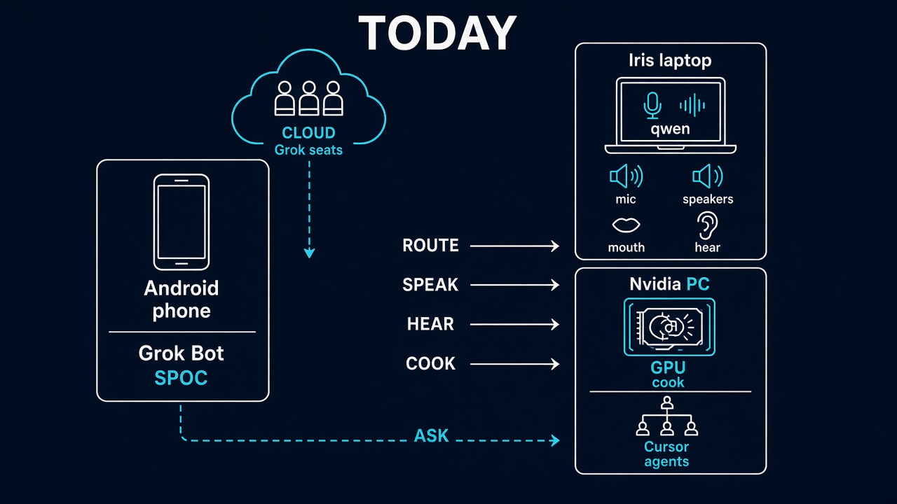
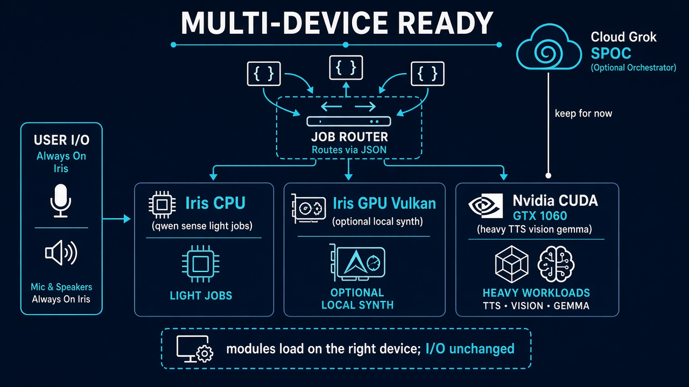
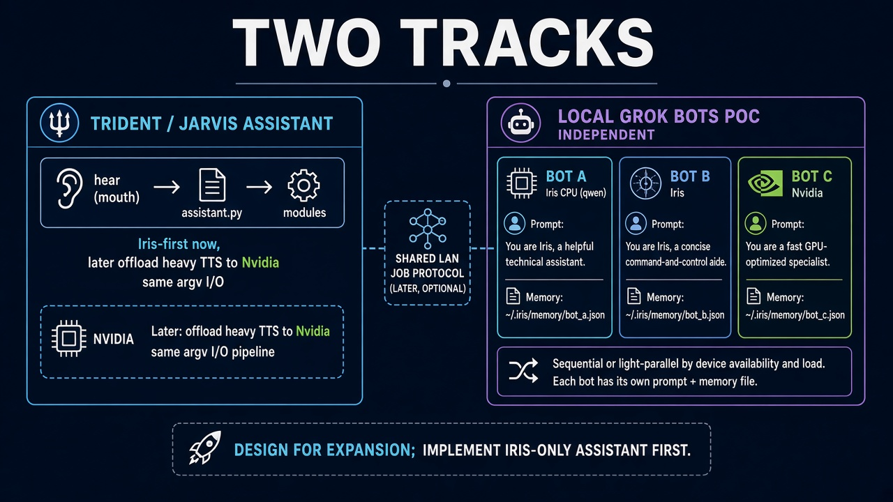
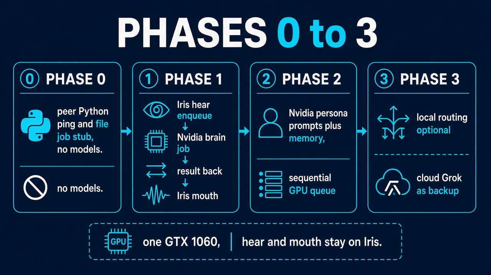
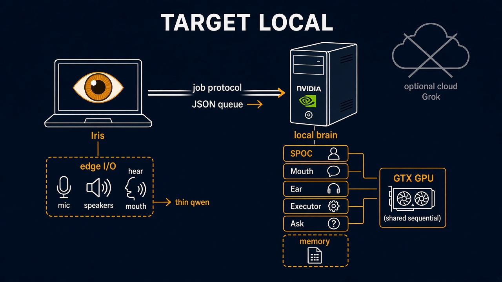

# Design pictures

Five drawings. Each section below is the caption for one PNG. The picture is a first-class reference for the shape it names. The markdown in this repository is the law. A drawing does not ship a program. Where a drawing and a living doc disagree, the living doc wins.

Law beside these pictures:

- Today's routes: `BOTS.md` and `artifacts/reference/seats/`.
- Assistant track, in force: `artifacts/reference/tracks/IRIS_ASSISTANT.md`.
- LAN router and peer shuttle, not built: `artifacts/reference/tracks/DEVICE_ROUTER.md`.
- Program contract: `GOAL.md`.

## Today: SPOC, Iris, Nvidia

File: `arch_today_spoc_iris_nvidia.png`

This is the operating picture for the seat track that is live now. Wojciech talks to Trident_Android_SPOC V4. SPOC routes COOK, FIX, and DOCS to Trident Executor V4 on Iris (`trident-iris`, `C:\Users\eb-wjt\Downloads\Jarvis\Trident`). SPOC routes SPEAK to Trident Mouth V6 and HEAR to Trident Ear V2 on that same PC. SPOC routes ASK to Trident Ask V2. An Iris ask runs `qwen.py` in the worker shell. An Nvidia ask is one Cloud Agent on `trident-nvidia` and only when the go names Nvidia.

The local assistant on Iris is not this drawing’s inference path. `assistant.py` does not go through SPOC to hear, think, or speak. Grok is off that path. See `IRIS_ASSISTANT.md`.

## Multi-device ready shape

File: `arch_multi_device_ready.png`

This is the ready shape for a job router across three pools: `iris_cpu`, `iris_vulkan`, and `nvidia_cuda` (Iris CPU, Iris Vulkan iGPU, Nvidia CUDA on a GTX 1060 6GB). Iris keeps the microphone and the speakers. Transparent TTS offload is drawn as a wav returning to Iris Speakers. Locked addresses are Iris 192.168.16.45, Nvidia 192.168.16.31, and gateway 192.168.16.4.

That router is not built. It does not replace cloud SPOC routing. Do not implement it from this picture. See `DEVICE_ROUTER.md`.

## Two tracks: assistant and bots

File: `arch_two_tracks_assistant_and_bots.png`

Two tracks stay apart.

The assistant track is on this PC. Near term, `assistant.py` runs only on Iris: hear, then the brain, then the mouth. The default brain is `qwen`. The path makes no network call. Grok is off that path.

The bot track is the Grok roster. SPOC V4 routes SPEAK to Mouth V6, HEAR to Ear V2, COOK to Executor V4, and ASK to Ask V2. Local_IT_Guy is the design seat. Those seats do not replace the assistant loop, and the assistant loop does not call them.

A `local_bots` proof of concept would be a separate package. It may share transport only with the assistant track. It is not built, it is not `assistant.py`, and it is not SPOC. See `IRIS_ASSISTANT.md`, `BOTS.md`, and `DEVICE_ROUTER.md`.

## Phases 0 to 3

File: `arch_phases_0_to_3.png`

This drawing is a phase ladder from 0 through 3 for a peer shuttle. Law specifies Phase 0-1 only: text and small files, identical peers, LAN-only. That shuttle is held until Wojciech gives GO. It is not built. Later phases on the drawing are not a specification and are not a go. See `DEVICE_ROUTER.md`.

## Target: local historical

File: `arch_target_local_historical.png`

This is the historical target for the local residents. One role, one executable, one settings file. Files are the only meeting place. The microphone stays open. The residents stay loaded. The mouth speaks on the real speakers.

`GOAL.md` owns that finish line. On this tip each resident still does one unit of work and exits. `assistant.py` chains one-shots and exits. The drawing is the target. It is not a claim that the stay-loaded finish line is already closed, and it is not a second supervisor.
